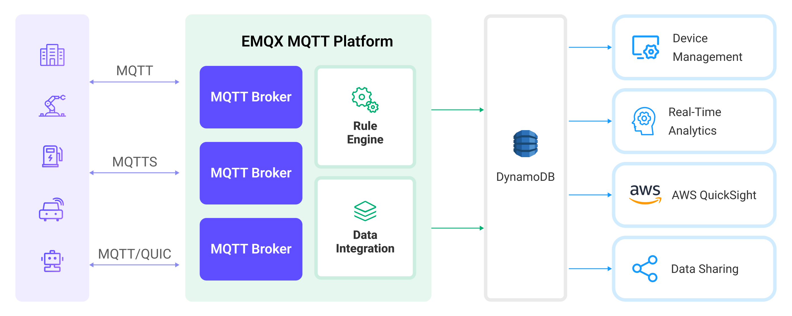

# 将 MQTT 数据写入到 DynamoDB


:::tip
EMQX 企业版功能。EMQX 企业版可以为您带来更全面的关键业务场景覆盖、更丰富的数据集成支持，更高的生产级可靠性保证以及 24/7 的全球技术支持，欢迎[免费试用](https://www.emqx.com/zh/try?product=enterprise)。
:::


[DynamoDB](https://www.amazonaws.cn/en/dynamodb/) 是 AWS 上的一种完全托管的、高性能的、无服务器的键值存储数据库服务。它被设计用于那些需要快速、可扩展和可靠数据存储的应用程序。EMQX 支持与 DynamoDB 集成，使您能够将 MQTT 消息和客户端事件保存到 DynamoDB，从而便于物联网设备的注册和管理，以及设备数据的长期存储和实时分析。通过 DynamoDB Sink 可以将 MQTT 消息和客户端事件存储到 DynamoDB 中，也可以通过事件触发对 DynamoDB 中数据的更新或删除操作，从而实现对诸如设备在线状态、上下线历史等的记录。

本页详细介绍了 EMQX 与 DynamoDB 的数据集成并提供了实用的规则和 Sink 创建指导。

## 工作原理

DynamoDB 数据集成是 EMQX 中的开箱即用功能，它结合了 EMQX 的设备连接和消息传输能力以及 DynamoDB 强大的数据存储能力。通过内置的[规则引擎](./rules.md)组件，集成简化了从 EMQX 到 DynamoDB 的数据摄取过程，无需复杂的编码。

下图展示了 EMQX 和 DynamoDB 之间的数据集成的典型架构：



将 MQTT 数据摄取到 DynamoDB 的工作流程如下：

1. **消息发布和接收**：无论是连接车辆、工业物联网系统还是能源管理平台的物联网设备，都通过 MQTT 协议成功连接到 EMQX，并向特定主题发布 MQTT 消息。当 EMQX 接收到这些消息时，它将在其规则引擎中启动匹配过程。
2. **消息数据处理**：当消息到达时，它会通过规则引擎进行处理，然后由 EMQX 中定义的规则处理。规则根据预定义的标准确定哪些消息需要路由到 DynamoDB。如果任何规则指定了消息载荷转换，那么这些转换将被应用，例如转换数据格式、过滤出特定信息，或用额外的上下文丰富载荷。
3. **数据写入到 DynamoDB**：一旦规则引擎确定一条消息需要存储到 DynamoDB，它将触发一个将消息转发到 DynamoDB 的动作。处理过的数据将被无缝写入 DynamoDB 数据库的集合中。
4. **数据存储和利用**：数据存储在 DynamoDB 后，企业可以利用其查询能力应用于各种用例。例如，在连接车辆领域，存储的数据可以用于通知车队管理系统关于车辆健康状况、根据实时指标优化路线规划或跟踪资产。类似地，在工业物联网设置中，数据可能用于监控机械状态、预测维护或优化生产计划。

## 特性与优势

与 DynamoDB 的数据集成提供了一系列特性和优势，确保了数据传输、存储和利用的高效性：

- **实时数据流**：EMQX 专为处理实时数据流而构建，确保了从源系统到 DynamoDB 的数据传输的高效性和可靠性。它使组织能够实时捕获和分析数据，非常适合需要立即洞察和行动的用例。
- **数据转换的灵活性**：EMQX 提供了强大的基于 SQL 的规则引擎，允许组织在将数据存储到 DynamoDB 之前进行预处理。它支持各种数据转换机制，如过滤、路由、聚合和丰富，使组织能够根据他们的需求塑造数据。
- **灵活的数据模型**：DynamoDB 使用键值对和文档数据模型，适用于存储和管理结构化的设备事件与消息数据，能够轻松存储不同的 MQTT 消息结构。
- **强大的扩展能力**：EMQX 提供了集群扩展能力，能够根据设备连接与消息量实现无缝的水平扩展；DynamoDB 无需管理服务器或基础设施，自动处理底层的资源管理和扩展。两者结合能够实现高性能、高可靠的数据存储与扩展。

## 准备工作

本节介绍了在 EMQX 中创建 DynamoDB Sink 之前需要做的准备工作，包括安装 InfluxDB、创建数据表定义文件以及数据表。

### 前置准备

- 了解 Sink [规则](./rules.md)。
- 了解[数据集成](./data-bridges.md)。

### 安装 DynamoDB 本地服务器

1. 准备一份 docker-compose 文件 `dynamo.yaml` 来部署 DynamoDB 本地服务器。

```json
version: '3.8'
services:
  dynamo:
    command: "-jar DynamoDBLocal.jar -sharedDb"
    image: "amazon/dynamodb-local:latest"
    container_name: dynamo
    ports:
      - "8000:8000"
    environment:
      AWS_ACCESS_KEY_ID: root 
      AWS_SECRET_ACCESS_KEY: public
      AWS_DEFAULT_REGION: us-west-2
```

2. 通过这份文件启动 DynamoDB 服务器。

```bash
docker-compose -f dynamo.yaml up
```

3. 准备一份数据表定义文件，将其存放到 home 目录，并取名为 `mqtt_msg.json`。

```json
{
    "TableName": "mqtt_msg",
    "KeySchema": [
        { "AttributeName": "id", "KeyType": "HASH" }
    ],
    "AttributeDefinitions": [
        { "AttributeName": "id", "AttributeType": "S" }
    ],
    "ProvisionedThroughput": {
        "ReadCapacityUnits": 5,
        "WriteCapacityUnits": 5
    }
}

```

4. 通过这份文件创建一个新的表。

```bash
docker run --rm -v ${HOME}:/dynamo_data -e AWS_ACCESS_KEY_ID=root -e AWS_SECRET_ACCESS_KEY=public -e AWS_DEFAULT_REGION=us-west-2 amazon/aws-cli dynamodb create-table --cli-input-json file:///dynamo_data/mqtt_msg.json --endpoint-url http://host.docker.internal:8000
```

5. 通过下面的指令检查创建是否成功。

```bash
docker run --rm -e AWS_ACCESS_KEY_ID=root -e AWS_SECRET_ACCESS_KEY=public -e AWS_DEFAULT_REGION=us-west-2 amazon/aws-cli dynamodb list-tables --endpoint-url http://host.docker.internal:8000
```

如果创建成功了，我们将会看到下面的输出。

```json
{
    "TableNames": [
        "mqtt_msg"
    ]
}
```

## 创建连接器

本节演示了如何在 Dashboard 中创建一个 DynamoDB 连接器。以下示例假定您在本地机器上同时运行 EMQX 和 DynamoDB。如果您在远程运行 DynamoDB 和 EMQX，请相应地调整设置。

1. 转到 Dashboard **集成** -> **连接器**页面。

2. 点击页面右上角的**创建**。

3. 在连接器类型中选择 **DynamoDB**，点击**下一步**。

4. 输入连接器名称，要求是大小写英文字母和数字组合。

5. 输入 DynamoDB 连接信息:

   - **DynamoDB 地址**：填写 `http://127.0.0.1:8000`
   - **表名**：填写 `mqtt_msg`
   - **连接访问 ID**： 填写 `root`，
   - **连接访问密钥**：填写 `public`。

6. **模版**设置为默认值，即为空；模版为空时将会将整个消息转发给 DynamoDB，实际值为 JSON 模版数据。

7. 高级配置（可选），根据情况配置同步/异步模式，队列与批量等参数，详细请参考[ Sink 简介](./data-bridges.md)。

8. 在完成创建之前，您可以点击**测试连接**来测试桥接可以连接到 DynamoDB 服务器。

9. 点击**创建**按钮完成 Sink 创建。

   在弹出的**创建成功**对话框中您可以点击**创建规则**，继续创建规则以指定需要写入 DynamoDB 的数据。您也可以按照[创建 DynamoDB Sink 规则](#创建-dynamodb- Sink 规则)章节的步骤来创建规则。

## 创建 DynamoDB Sink 规则

至此您已经完成 Sink 创建，接下来将继续创建一条规则来指定需要写入的数据。您需要为消息转发和设备上下线记录创建两条不同的规则。

1. 转到 Dashboard **集成** -> **规则**页面。

2. 点击页面右上角的**创建**。

3. 输入规则 ID `my_rule`，在 **SQL 编辑器**中根据业务实现需要输入规则：

   - 如需实现对指定主题消息的转发，例如将 `t/#` 主题的 MQTT 消息转发至 DynamoDB，输入以下 SQL 语法：

     注意：如果您希望制定自己的 SQL 语法，需要确保规则选出的字段（SELECT 部分）包含所有 SQL 模板中用到的变量。

     ```sql
     SELECT 
       *
     FROM
       "t/#"
     ```

   - 如需实现设备上下线记录，输入以下 SQL 语法：

     ```sql
     SELECT
       str(event) + timestamp as id, *
     FROM 
       "$events/client_connected", "$events/client_disconnected"
     ```

     ::: tip

     为了演示方便，上下线消息也设置为复用 `mqtt_msg` 表。

     :::

3. 点击**添加动作**，从**动作类型**下拉列表中选择 DynamoDB，从**动作**下拉框中选择刚刚创建的连接器，点击**添加**按钮将其添加到规则中。。

5. 点击最下方**创建**按钮完成规则创建。

至此您已经完成整个创建过程，可以前往 **集成** -> **Flow 设计器** 页面查看拓扑图，此时应当看到 `t/#` 主题的消息经过名为 `my_rule` 的规则处理，处理结果交由 DynamoDB 存储。

## 测试规则

使用 MQTTX 向 `t/1` 主题发布消息，此操作同时会触发上下线事件：

```bash
mqttx pub -i emqx_c -t t/1 -m '{ "msg": "hello DynamoDB" }'
```

分别查看两个 Sink 运行统计，命中、发送成功次数均 +1。

查看数据是否已经写入表中，`mqtt_msg` 表：

```bash
docker run --rm -e AWS_ACCESS_KEY_ID=root -e AWS_SECRET_ACCESS_KEY=public -e AWS_DEFAULT_REGION=us-west-2 amazon/aws-cli dynamodb scan --table-name=mqtt_msg --endpoint-url http://host.docker.internal:8000
```

输出如下：

```json
{
    "Items": [
        {
            "metadata": {
                "S": "{\"rule_id\":\"90d98f59\"}"
            },
            "peerhost": {
                "S": "127.0.0.1"
            },
            "clientid": {
                "S": "emqx_c"
            },
            "flags": {
                "S": "{\"retain\":false,\"dup\":false}"
            },
            "node": {
                "S": "emqx@127.0.0.1"
            },
            "qos": {
                "N": "0"
            },
            "payload": {
                "S": "{ \"msg\": \"hello DynamoDB\" }"
            },
            "pub_props": {
                "S": "{\"User-Property\":{}}"
            },
            "publish_received_at": {
                "N": "1678263363503"
            },
            "topic": {
                "S": "t/1"
            },
            "id": {
                "S": "0005F65F239F03FEF44300000BB40002"
            },
            "event": {
                "S": "message.publish"
            },
            "username": {
                "S": "undefined"
            },
            "timestamp": {
                "N": "1678263363503"
            }
        },
        {
            "conn_props": {
                "S": "{\"User-Property\":{},\"Request-Problem-Information\":1}"
            },
            "peername": {
                "S": "127.0.0.1:59582"
            },
            "metadata": {
                "S": "{\"rule_id\":\"703890a5\"}"
            },
            "clientid": {
                "S": "emqx_c"
            },
            "is_bridge": {
                "S": "false"
            },
            "keepalive": {
                "N": "30"
            },
            "proto_ver": {
                "N": "5"
            },
            "proto_name": {
                "S": "MQTT"
            },
            "connected_at": {
                "N": "1678263363499"
            },
            "receive_maximum": {
                "N": "32"
            },
            "sockname": {
                "S": "127.0.0.1:1883"
            },
            "mountpoint": {
                "S": "undefined"
            },
            "node": {
                "S": "emqx@127.0.0.1"
            },
            "id": {
                "S": "client.connected1678263363499"
            },
            "expiry_interval": {
                "N": "0"
            },
            "event": {
                "S": "client.connected"
            },
            "username": {
                "S": "undefined"
            },
            "timestamp": {
                "N": "1678263363499"
            },
            "clean_start": {
                "S": "true"
            }
        },
        {
            "reason": {
                "S": "normal"
            },
            "peername": {
                "S": "127.0.0.1:59582"
            },
            "metadata": {
                "S": "{\"rule_id\":\"703890a5\"}"
            },
            "clientid": {
                "S": "emqx_c"
            },
            "proto_ver": {
                "N": "5"
            },
            "proto_name": {
                "S": "MQTT"
            },
            "sockname": {
                "S": "127.0.0.1:1883"
            },
            "disconn_props": {
                "S": "{\"User-Property\":{}}"
            },
            "node": {
                "S": "emqx@127.0.0.1"
            },
            "id": {
                "S": "client.disconnected1678263363503"
            },
            "event": {
                "S": "client.disconnected"
            },
            "disconnected_at": {
                "N": "1678263363503"
            },
            "username": {
                "S": "undefined"
            },
            "timestamp": {
                "N": "1678263363503"
            }
        }
    ],
    "Count": 3,
    "ScannedCount": 3,
    "ConsumedCapacity": null
}
```
