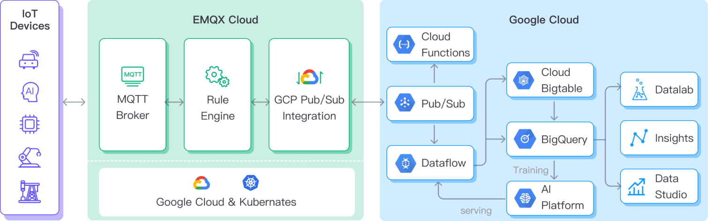
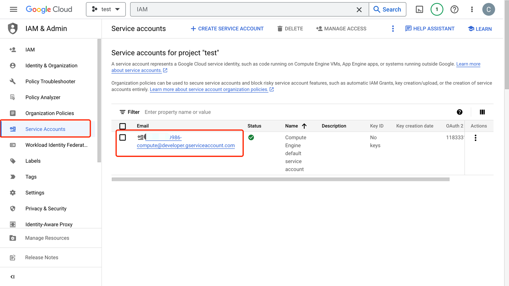
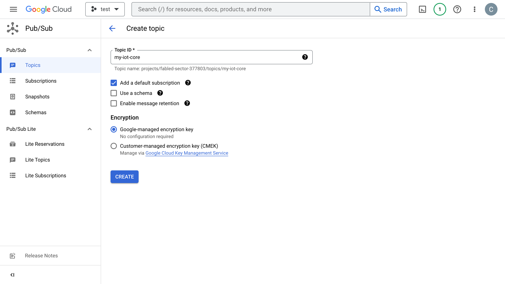
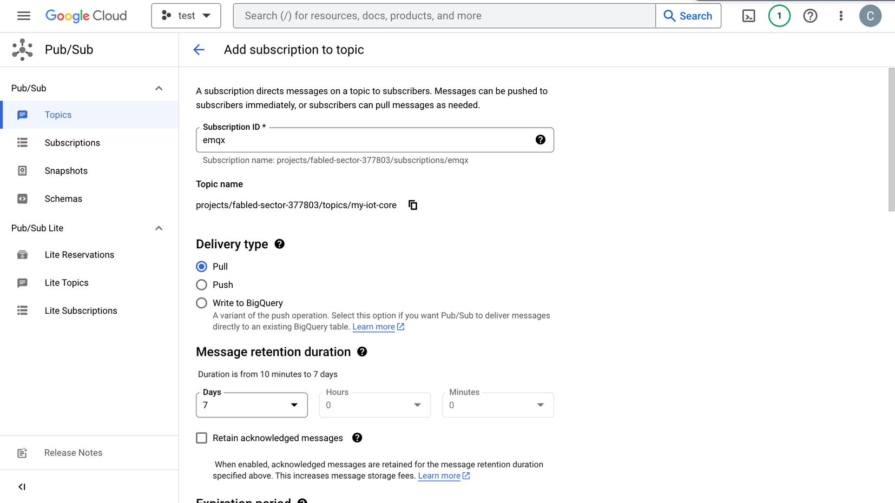

# 将 MQTT 数据传输到 GCP PubSub

[Google Cloud PubSub](https://cloud.google.com/pubsub?hl=en-us) 是一种异步消息传递服务，旨在实现极高的可靠性和可扩缩性。EMQX 支持与 Google Cloud Pub/Sub 的无缝集成，用于实时提取、处理和分析 MQTT 数据。此外，它还支持将数据推送并订阅各种Google Cloud 服务，如 Cloud Functions、App Engine、Cloud Run、Kubernetes Engine 和 Compute Engine。

借助 EMQX GCP PubSub 集成，您可以将 MQTT 消息和客户端事件发送到 GCP PubSub 中，这能够帮助您更快的基于 GCP 构建物联网应用，助力你从 GCP IoT Core 迁移到 EMQX 中。


:::tip
EMQX 企业版功能。EMQX 企业版可以为您带来更全面的关键业务场景覆盖、更丰富的数据集成支持，更高的生产级可靠性保证以及 24/7 的全球技术支持，欢迎[免费试用](https://www.emqx.com/zh/try?product=enterprise)。
:::


[Google Cloud Pub/Sub](https://cloud.google.com/pubsub?hl=en-us) 是一种异步消息传递服务，旨在实现极高的可靠性和可扩缩性。EMQX 支持与 Google Cloud Pub/Sub 的无缝集成，能够实时提取、处理和分析 MQTT 数据，并将数据推送到各类 Google Cloud 服务，如 Cloud Functions、App Engine、Cloud Run、Kubernetes Engine 和 Compute Engine 中，或将 Google Cloud 中的数据通过 MQTT 下发，帮助用户更快的基于 GCP 构建物联网应用。

本页详细介绍了 EMQX 与 GCP Pub/Sub 的数据集成并提供了实用的规则和 Sink 创建指导。

## 工作原理

GCP Pub/Sub Sink 是 EMQX 的开箱即用功能，旨在帮助用户轻松地将 MQTT 数据流与 Google Cloud 集成，并利用其丰富的服务和功能实现物联网应用开发。



EMQX 通过规则引擎与 Sink 将 MQTT 数据转发至 GCP Pub/Sub，以 GCP Pub/Sub 生产者角色为例，其完整流程如下：

1. **物联网设备发布消息**：设备通过特定的主题发布遥测和状态数据，消息将触发规则引擎。
2. **规则引擎处理消息**：通过内置的规则引擎，可以根据主题匹配处理特定来源的 MQTT 消息。规则引擎会匹配对应的规则，并对消息进行处理，例如转换数据格式、过滤掉特定信息或使用上下文信息丰富消息。
3. **桥接到 GCP Pub/Sub**：规则触发将消息转发到 GCP Pub/Sub 的动作，允许轻松配置数据到 GCP Pub/Sub 属性，排序键，以及 MQTT 主题到 GCP Pub/Sub 主题的映射关系，可以为数据集成提供更丰富的上下文信息和顺序保证，实现灵活的物联网数据处理。

MQTT 消息数据写入到 GCP PusSub 后，您可以进行灵活的应用开发，例如：

- 实时数据处理和分析：利用 Google Cloud 的强大数据处理和分析工具，如 Dataflow、BigQuery 和 Pub/Sub 自身的流处理功能，对消息数据进行实时处理和分析，从而获得有价值的洞察和决策支持。

- 事件驱动的功能：触发 Google Cloud 的事件处理如 Cloud Functions 和 Cloud Run，以实现动态、灵活的功能触发和处理。

- 数据存储和共享：将消息数据传输到 Google Cloud 的存储服务中，如 Cloud Storage 和 Firestore，以便安全地存储和管理大量的数据，并与其他 Google Cloud 服务共享和分析这些数据，以满足不同的业务需求。

## 特性与优势

将 EMQX 与 GCP Pub/Sub 结合使用具有以下特性与优势：

- **强大的消息传递服务**：EMQX 与 GCP Pub/Sub 都具备高可用、可扩展的特性，能够可靠地接收、传递和处理大规模的消息流，支持物联网数据顺序传递、消息质量保证以及持久化等特性，确保消息的可靠传递和处理。

- **灵活的规则引擎**：通过内置的规则引擎，可以根据主题匹配处理特定来源的消息和事件。并对消息和事件进行处理，例如转换数据格式、过滤掉特定信息或使用上下文信息丰富消息，结合 GCP Pub/Sub 可以进行进一步处理和分析。

- **丰富的上下文信息**：通过 GCP Pub/Sub 桥接，你可以在消息中添加更丰富的上下文信息，实现客户端属性与 Pub/Sub 属性、排序键等的映射，可以帮助在后续的应用开发和数据处理中进行更精确的分析和处理。

综上所述，将 EMQX 和 GCP Pub/Sub 结合使用可以实现高可靠性、可扩展性的消息传递，并通过丰富工具和服务进行数据分析与集成，这使得你能够构建强大的物联网应用，并基于事件驱动的功能实现灵活的业务逻辑。

## 准备工作

本节介绍如何配置 GCP Pub/Sub，并创建主题与获取连接凭证。

### 前置准备

- 了解[规则](./rules.md)。
- 了解[数据集成](./data-bridges.md)。

### 创建服务账户凭证

服务账户凭证是用于身份验证和授权的 JSON 文件，EMQX 需要通过它访问 Pub/Sub 资源。

1. 进入 GCP 控制台，在搜索框中输入 **IAM** 并进入 **IAM & Admin** 页面。
2. 在 IAM & Admin 页面中点击 **Service Accounts** -> **Email** 中对应的邮箱，选择 **KEYS** 标签页，点击 **ADD KEY** 添加以生成用于身份认证 JSON 格式的 key，请妥善保管该文件。



### 在 GCP Pub/Sub 中创建主题

1. 打开 [Pub/Sub 控制台](https://console.cloud.google.com/cloudpubsub)，点击 **CREATE TOPIC**，输入自定义的 **Topic ID**，点击 **CREATE** 即可完成创建。



2. 点击列表页对应的 **Topic ID** 即可进入 Topic 详情页面，您需要创建一个 **subscription** 来保存消息，有关 subscription 详细介绍请参考 [CCP Pub/Sub subscription](https://cloud.google.com/pubsub/docs/subscriber)，此处选择 Pull 类型，保留 7 天历史消息。



3. 点击 **Subscription ID** → **MESSAGES** → **PULL** 可以在线查看发送到主题中的消息。

## 创建连接器

本节介绍如何在 Dashboard 中配置连接器以连接到 GCP Pub/Sub。在配置 GCP Pub/Sub 之前，必须先在 GCP 上创建好对应的服务账户凭证以及 Pub/Sub 主题。

1. 转到 Dashboard **集成** -> **连接器**页面。

2. 点击页面右上角的**创建**。

3. 在**连接器类型**中选择 GCP Pub/Sub，点击**下一步**。

4. 输入连接器名称，要求是大小写英文字母和数字的组合。

5. 在**桥接角色**字段中，根据业务需求从下拉列表中选择`生产者`或`消费者`，并完成相应的配置。

   :::: tabs type:card

   ::: tab 配置为生产者角色

   - **GCP PubSub 主题**：输入[在 GCP 中创建和管理主题](#在-gcp-pubsub-中创建主题)中创建的主题 ID `my-iot-core` 。
   - **GCP 服务账户凭证**：上传您在 [在 GCP 中创建服务帐号密钥](#创建服务账户凭证) 中导出的 JSON 格式的服务帐号凭据。
   - **HTTP 请求消息体模版**：留空或定义一个模板。
     - 如果留空，它将使用 JSON 格式对 MQTT 消息中的所有可见输入进行编码，例如 clientid、topic、payload 等。
     - 如果使用定义的模板，占位符的形式为 `${variable_name}`，将用 MQTT 上下文中的相应值填充。例如，如果 MQTT 消息主题是 `my/topic`，则 `${topic}` 将被替换为 `my/topic`。
   - **属性模板**和**排序键模板**（可选）：类似地，您可以定义用于格式化传出消息的属性和/或排序键的模板。
     - 对于**属性**，键和值都可以使用 `${variable_name} `形式的占位符。这样的值将从 MQTT 上下文中提取出来。如果键模板解析为空字符串，则该键将从传出到 GCP Pub/Sub 的消息中省略。
     - 对于**顺序键**，可以使用 `${variable_name}` 形式的占位符。如果解析后的值为空字符串，则不会为 GCP Pub/Sub 传出消息设置 `orderingKey` 字段。
   - 高级配置（可选），根据情况配置同步/异步模式，队列等参数。

   :::

   ::: tab 配置为消费者角色

   - **GCP 服务账户凭证**：上传您在 [在 GCP 中创建服务帐号密钥](#创建服务账户凭证) 中导出的 JSON 格式的服务帐号凭据。

   - **主题映射** 字段必须包含至少一个 GCP Pub/Sub 到 MQTT 主题映射。**HTTP 请求消息体模版**子字段指定应使用的 MQTT payload，并提供以下 GCP Pub/Sub 消息字段供模板化：

     | 字段名称          | 描述                               |
     | ----------------- | ---------------------------------- |
     | `attributes`      | （可选）一个包含字符串键值对的对象 |
     | `message_id`      | GCP Pub/Sub 为此消息分配的消息 ID  |
     | `ordering_key`    | （可选）消息排序键                 |
     | `publishing_time` | GCP Pub/Sub 定义的消息时间戳       |
     | `topic`           | 原始 GCP Pub/Sub 主题              |
     | `value`           | （可选）消息负载                   |

     **HTTP 请求消息体模版**的默认值为 `${.}`，它将所有可用数据编码为 JSON 对象。例如，选择 `${.}` 作为模板将会为包含所有可选字段的 GCP Pub/Sub 消息生成以下内容：

     ```json
     {
       "attributes": {"attribute_key": "attribute_value"},
       "message_id": "1679665968238",
       "ordering_key": "my-ordering-key",
       "topic": "my-pubsub-topic",
       "publishing_time": "2023-08-18T14:15:18.470Z",
       "value": "my payload"
     }
     ```

     可以使用点表示法访问 GCP Pub/Sub 消息的子字段。例如，`${.value}` 将解析为 GCP Pub/Sub 消息的值，`${.attributes.h1}` 将解析为 `h1` 消息属性键的值（如果存在）。不存在的值将被替换为空字符串。

     **注意**：每个 GCP Pub/Sub 到 MQTT 主题映射必须包含唯一的 GCP Pub/Sub 主题名称。即 GCP Pub/Sub 主题不能在多个映射中存在。

   - 其他选项保持默认设置。

   :::

   ::::

6. 设置完成后，您可点击**测试连接**按钮进行验证。

7.  点击**创建**按钮完成 Connector 和 Sink 创建。

至此您已经完成 Connector 和 Sink 创建流程，接下来将继续创建一条规则来指定需要写入的数据。

## 创建数据转发规则

1. 转到 Dashboard **集成** -> **规则页面**。
2. 点击页面右上角的**创建**。
3. 输入规则 ID，例如： `my_rule`。
3. 在 SQL 编辑器中输入规则，请确保规则选择出来的字段（SELECT 部分）包含 HTTP 请求消息体模版中用到的变量。例如将 `/devices/+/events` 主题的 MQTT 消息集成到 GCP Pub/Sub，此处规则 SQL 如下：


  ```sql
  SELECT
    *
  FROM
    "/devices/+/events"
  ```

5. 添加动作，从**动作类型**下拉列表中选择 GCP Pub/Sub，从**动作**下拉框中选择刚刚创建的连接器，点击**添加**按钮将其添加到规则中。

6. 点击最下方创建按钮完成规则创建。

至此您已经完成整个创建过程，可以前往 **集成** -> **Flow 设计器** 页面查看拓扑图，此时应当看到 `/devices/+/events` 主题的消息经过名为 `my_rule` 的规则处理，处理结果写入到 GCP Pub/Sub 中。

## 测试规则

1. 使用 MQTTX 向 `/devices/+/events` 主题发布消息：

```bash
mqttx pub -i emqx_c -t /devices/+/events -m '{ "msg": "hello GCP PubSub" }'
```

2. 查看 Sink 运行统计，命中、发送成功次数均 +1。

3. 前往 GCP Pub/Sub 控制台查看数据是否已经发送成功。
