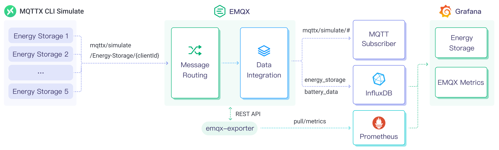

# 将 MQTT 数据写入到 InfluxDB


:::tip
EMQX 企业版功能。EMQX 企业版可以为您带来更全面的关键业务场景覆盖、更丰富的数据集成支持，更高的生产级可靠性保证以及 24/7 的全球技术支持，欢迎[免费试用](https://www.emqx.com/zh/try?product=enterprise)。
:::


InfluxDB 是一个用于存储和分析时间序列数据的数据库，其强大的数据吞吐能力以及稳定的性能表现使其非常适合物联网领域。EMQX 目前支持通过 Sink 的方式连接不同版本的 InfluxDB Cloud、InfluxDB OSS 以及 InfluxDB Enterprise。

本页详细介绍了 EMQX 与 InfluxDB 的数据集成并提供了实用的规则和 Sink 创建指导。

## 工作原理

InfluxDB 数据集成是 EMQX 中开箱即用的功能，它结合了 EMQX 的设备接入、消息传输能力与 InfluxDB 的数据存储和分析能力，通过简单的配置即可实现 MQTT 数据的无缝集成。EMQX 通过规则引擎与 Sink 将设备数据转发至 InfluxDB 进行存储和分析，在对数据进行分析之后，InfluxDB 会生成报表、图表等数据分析结果，通过 InfluxDB 的可视化工具展示给用户。

下图展示了储能场景中 EMQX 和 InfluxDB 数据集成的典型架构。



EMQX 和 InfluxDB 提供了一个可扩展的物联网平台，用于高效地实时收集和分析能耗数据。在此架构中，EMQX 作为物联网平台，负责设备接入、消息传输、数据路由等功能，InfluxDB 作为数据存储和分析平台，负责数据存储、数据分析等功能。具体的工作流程如下：

1. **消息发布与接收**：储能设备通过 MQTT 协议连接成功后定期发布能耗数据，这些数据包括电量、输入输出功率信息。EMQX 接收到消息后将在规则引擎中进行比对。
2. **规则引擎处理消息**：通过内置的规则引擎，可以根据主题匹配处理特定来源的消息。当消息到达时，它会通过规则引擎，规则引擎会匹配对应的规则，并对消息数据进行处理，例如转换数据格式、过滤掉特定信息或使用上下文信息丰富消息。
3. **写入到 InfluxDB**：规则引擎中定义的规则触发将消息写入到 InfluxDB 的操作。InfluxDB Sink 提供了 SQL 模板，能够灵活地定义写入的数据格式，将消息中的特定字段写入到 InfluxDB 的对应的表和列中。

储能数据写入到 InfluxDB 后，您可以灵活的使用[行协议](https://docs.influxdata.com/influxdb/v2.3/reference/syntax/line-protocol/)对数据进行分析，例如：

- 连接到可视化工具，例如 Grafana，根据数据生成图表，展示储能数据。
- 连接业务系统，进行储能设备状态监控与告警。

## 特性与优势

InfluxDB 数据集成具有以下特性与优势：

- **高效的数据处理能力**：EMQX 能够处理海量物联网设备连接与消息吞吐，InfluxDB 在数据写入、存储和查询方面具有出色的性能表现，能够满足物联网场景下的数据处理需求，不会导致系统不堪重负。
- **消息转换**：消息可以写入 InfluxDB 之前，通过 EMQX 规则中进行丰富的处理和转换。
- **可扩展性**：EMQX 与 InfluxDB 都具备集群扩展能力，能够随着业务的发展，利用灵活地进行集群水平扩展，满足业务的发展需求。
- **丰富的查询能力**：InfluxDB 提供包括优化的函数、运算符和索引技术，可实现对时间戳数据的高效查询和分析，准确地从 IoT 时间序列数据中提取有价值的见解。
- **高效存储**：InfluxDB 使用高压缩比的编码方式，可以大幅降低存储成本。也可以自定义不同数据的存储时间,避免不必要的数据占用存储空间。

## 准备工作

本节介绍了在 EMQX 中创建 InfluxDB Sink 之前需要做的准备工作，包括安装和设置 InfluxDB。

### 前置准备

- 了解 [InfluxDB 行协议](https://docs.influxdata.com/influxdb/v2.5/reference/syntax/line-protocol/)，InfluxDB Sink 使用行协议进行数据写入。
- 了解 [规则](./rules.md)。
- 了解[数据集成](./data-bridges.md)。

### 安装和设置 InfluxDB

1. 通过 Docker 安装并启动 InfluxDB，详细步骤请参考 [Install InfluxDB](https://docs.influxdata.com/influxdb/v2.5/install/)。

```bash
# 启动一个 InfluxDB 容器
docker run --name influxdb -p 8086:8086 influxdb:2.5.1
```

2. 访问 [http://localhost:8086](http://localhost:8086) 打开 InfluxDB UI，设置用户名、密码、组织名称、Bucket 名称。

3. 前往 InfluxDB UI **Load Data** -> **API Token**，按照 [Create All-Access tokens](https://docs.influxdata.com/influxdb/v2.5/install/#create-all-access-tokens) 指引创建 Token。

## 创建连接器

本节演示了如何创建一个用于将 Sink 连接到 InfluxDB 服务器的连接器。

以下步骤假定 EMQX 与 InfluxDB 均在本地运行，如您在远程运行 EMQX 及 InfluxDB，请根据实际情况调整相应配置。

1. 进入 EMQX Dashboard，点击**集成** -> **连接器**。
2. 点击页面右上角的**创建**。
3. 在 **创建连接器**页面，点击选择 **InfluxDB**，然后点击**下一步**。
4. 在**配置信息**步骤页中配置以下信息：

   - 输入连接器名称，要求是大小写英文字母和数字的组合，例如：`my_influxdb`。
   - 根据情况选择 InfluxDB 版本，默认为 V2。
   - 输入 InfluxDB 服务器连接信息：
     - 服务器地址填写 `127.0.0.1:8086`。如果是 InfluxDB Cloud 需要指定端口为 443，即填入 `{url}:443` 并点击**启用 TLS** 以启用 TSL 连接。
     - 按照[安装 InfluxDB](#安装-influxdb) 中的设定完成 **Token**、**组织**及 **Bucket** 设置。注：如选择 InfluxDB v1 版本，请完成**数据库**、**用户名**及**密码**的设定。
   - 设置是否启用TLS。有关 TLS 连接选项的详细信息，请参阅 [启用 TLS 加密访问外部资源](../network/overview.md#启用-tls-加密访问外部资源)。
5. 在点击**创建**之前，您可以点击**测试连接**，以测试连接器是否能够连接到 InfluxDB 服务器。
6. 点击最下方的**创建**按钮完成连接器的创建。在弹出对话框中，您可以点击 **返回连接器列表** 或点击 **创建规则** 继续创建规则和 Sink，以指定要转发到 Influx 的数据。具体步骤请参见[创建规则和 InfluxDB Sink](#创建规则和-influxdb-sink)。

## 创建规则和 InfluxDB Sink

本节演示了如何在 EMQX 中创建一条规则，用于处理来自源 MQTT 主题 `t/#` 的消息，并通过配置的 Sink 将处理后的结果发送到 InfluxDB。

1. 点击 Dashboard 左侧导航菜单中的**数据集成** -> **规则**。

2. 在规则页面点击右上角的**创建**按钮。

3. 输入规则 ID `my_rule`。

4. 在 SQL 编辑器中输入规则，例如将 `t/#` 主题的 MQTT 消息存储至 InfluxDB，可以输入以下 SQL 语句：

   ::: tip 注意

   如果您希望指定自己的 SQL 规则，必须确保规则选择出来的字段（SELECT 部分）包含之后在 Sink 中指定的 InfluxDB 数据写入格式中包含的所有变量。

   :::

   ```sql
   SELECT
     *
   FROM
     "t/#"
   ```

   ::: tip

   如果您初次使用 SQL，可以点击 **SQL 示例** 和**启用调试**来学习和测试规则 SQL 的结果。

   :::

5. 点击右侧的**添加动作**按钮，为规则在被触发的情况下指定一个动作。该动作会将经规则处理的数据转发到 InfluxDB。

6. 在**动作**下拉框中选择 `InfluxDB`，将 **动作** 下拉框保留为默认的 `创建动作` 。您也可以选择一个之前已经创建好的 InfluxDB Sink。本次演示将创建一个新的 Sink。

7. 为 Sink 输入一个名称。名称应结合使用大写/小写字母和数字。

8. 从**连接器**下拉框中选择刚刚创建的 `my_influxdb`。您也可以通过点击下拉框旁边的按钮创建一个新的连接器。有关配置参数，请参见[创建连接器](#创建连接器)。

9. 设定**时间精度**，默认为毫秒。

10. 定义解析数据， 指定**数据格式**与内容，使其能被解析并写入到 InfluxDB 中，可选项为 `JSON` 或 `Line Protocol`。

    - 对于 JSON 格式，需设置数据的 **Measurement**，**Fields**，**Timestamp** 与 **Tags**，键值均支持常量或占位符变量，可按照[行协议](https://docs.influxdata.com/influxdb/v2.3/reference/syntax/line-protocol/)进行设置。其中 **Fields** 字段支持通过 CSV 文件批量设置，详细请参考[批量设置](#批量设置)。
    - 对于 Line Protocol 格式，请通过一段语句指定数据点的 Measurement、Fields、Timestamp 与 Tags，键值均支持常量或占位符变量，可按照[行协议](https://docs.influxdata.com/influxdb/v2.3/reference/syntax/line-protocol/)进行设置。

    ::: tip

    如希望输入带符号的整型值，请在占位符后添加 `i` 作为类型标识，例如 `${payload.int}i`。参见 [InfluxDB 1.8 写入整型值](https://docs.influxdata.com/influxdb/v1.8/write_protocols/line_protocol_reference/#write-the-field-value-1-as-an-integer-to-influxdb)。

    对于 InfluxDB 2.x 中支持的无符号整型值，请在占位符后添加 `u` 作为类型标识，例如 `${payload.uint}u`。参见 [InfluxDB 2.6 无符号整型](https://docs.influxdata.com/influxdb/v2.6/reference/syntax/line-protocol/#uinteger)。
    :::

11. 展开**高级设置**，根据需要配置高级设置选项（可选），详细请参考[高级设置](#高级设置)。

12. 在点击**创建**之前，您可以点击**测试连接**，以测试 Sink 是否能够连接到 InfluxDB 服务器。

13. 点击**创建**完成 Sink 的创建。回到**创建规则**页面，您将看到新的 Sink 出现在**动作输出**标签下。

14. 在**创建规则**页面，验证配置的信息。点击**创建**按钮生成规则。

现在您已成功创建规则，您可以在**规则**页面上看到新的规则。点击**动作(Sink)**标签，您可以看到新的 InfluxDB Sink。

您还可以点击**集成** -> **Flow 设计器**查看拓扑。可以看到 `t/#` 主题的消息经过名为 `my_rule` 的规则处理，处理结果交由 InfluxDB 进行存储。

### 批量设置

在 InfluxDB 中，一个数据条目通常包含数百个字段（Fields），这使得数据格式的设置变得具有挑战性。为了解决这个问题，EMQX 提供了批量设置字段的功能。

当通过 JSON 设置数据格式时，您可以使用批量设置功能，从 CSV 文件中导入字段的键值对。

1. 点击 **Fields** 表格中的**批量设置**按钮，打开**导入批量设置**弹窗。

2. 根据指引，先下载批量设置模板文件，然后在模板文件中填入 Fields 键值对，默认的模板文件内容如下：

   | Field  | Value              | Remarks (Optional)                                    |
   | ------ | ------------------ | ----------------------------------------------------- |
   | temp   | ${payload.temp}    |                                                       |
   | hum    | ${payload.hum}     |                                                       |
   | precip | ${payload.precip}i | 在字段值后追加 i，InfluxDB 则将该数值存储为整数类型。 |

     - **Field**: 字段键，支持常量或 ${var} 格式的占位符。
     - **Value**: 字段值，支持常量或占位符，可以按照行协议追加类型标识。
     - **Remarks**: 仅用于 CSV 文件内字段的备注，无法导入到 EMQX 中。

     注意，仅支持 1M 以内的 CSV 格式文件，文件中数据不能超过 2000 行。

3. 将填好的模板文件保存并上传到**导入批量设置**弹窗中，点击**导入**完成批量设置。
4. 导入完成后，您可以在 **Fields** 设置表格中进一步调整字段的键值对。

## 测试规则和 Sink

使用 MQTTX 向 `t/1` 主题发布消息，此操作同时会触发上下线事件：

```bash
mqttx pub -i emqx_c -t t/1 -m '{ "msg": "hello InfluxDB" }'
```

分别查看两个 Sink 运行统计，命中、发送成功次数均 +1。

前往 InfluxDB UI Data Explorer 查看数据是否已经写入 InfluxDB 中。

## 高级设置

本节将深入介绍可用于 InfluxDB 连接器和 Sink 的高级配置选项。在 Dashboard 中配置连接器和 Sink 时，您可以根据您的特定需求展开**高级设置**，调整以下参数。

| 字段名称         | 描述                                                         | 默认值 |
| ---------------- | ------------------------------------------------------------ | ------ |
| 启动超时时间     | 确定连接器在回应资源创建请求之前等待自动启动的资源达到健康状态的最长时间间隔（以秒为单位）。此设置有助于确保连接器在验证连接的资源（例如 InfluxDB 中的数据库实例）完全运行并准备好处理数据事务之前不会执行操作。 | `5`    |
| 缓存池大小       | 指定缓冲区工作进程数量。这些工作进程将被分配用于管理 EMQX 与 InfluxDB 的出口 （egress）类型 Sink 中的数据流，它们负责在将数据发送到目标服务之前临时存储和处理数据。此设置对于优化性能并确保出口（egress）场景中的数据传输顺利进行尤为重要。对于仅处理入口 （ingress）数据流的桥接，此选项可设置为 `0`，因为不适用。 | `16`   |
| 请求超期         | “请求 TTL”（生存时间）配置设置指定了请求在进入缓冲区后被视为有效的最长持续时间（以秒为单位）。此计时器从请求进入缓冲区时开始计时。如果请求在缓冲区内停留的时间超过了此 TTL 设置或者如果请求已发送但未能在 InfluxDB 中及时收到响应或确认，则将视为请求已过期。 | `45`   |
| 健康检查间隔     | 指定 Sink 将对与 InfluxDB 的连接执行自动健康检查的时间间隔（以秒为单位）。 | `15`   |
| 缓存队列最大长度 | 指定可以由 InfluxDB Sink 中的每个缓冲区工作进程缓冲的最大字节数。缓冲区工作进程在将数据发送到 InfluxDB 之前会临时存储数据，充当处理数据流的中介以更高效地处理数据流。根据系统性能和数据传输要求调整该值。 | `256`  |
| 最大批量请求大小 | 指定可以在单个传输操作中从 EMQX 发送到 InfluxDB 的数据批处理的最大大小。通过调整此大小，您可以微调 EMQX 与 InfluxDB 之间数据传输的效率和性能。<br />如果将“最大批处理大小”设置为“1”，则数据记录将单独发送，而不会分组成批处理。 | `1`    |
| 请求模式         | 允许您选择`同步`或`异步`请求模式，以根据不同要求优化消息传输。在异步模式下，写入到 InfluxDB 不会阻塞 MQTT 消息发布过程。但是，这可能导致客户端在它们到达 InfluxDB 之前就收到了消息。 | `异步` |
| 请求飞行队列窗口 | “飞行队列请求”是指已启动但尚未收到响应或确认的查询。此设置控制 Sink 与 InfluxDB 通信时可以同时存在的最大飞行队列请求数。<br/>当 **请求模式** 设置为 `异步` 时，“请求飞行队列窗口”参数变得特别重要。如果对于来自同一 MQTT 客户端的消息严格按顺序处理很重要，则应将此值设置为 `1`。 | `100`  |

## 更多内容

您可以通过以下链接查看更多关于 InfluxDB 集成的内容：

**博客**：

[EMQX+InfluxDB+Grafana 构建物联网可视化平台](https://www.emqx.com/zh/blog/build-emqx-influxdb-grafana-iot-data-visualization-solution-in-one-hour)

[EMQX 规则引擎系列（三）存储消息到 InfluxDB 时序数据库](https://www.emqx.com/zh/blog/emqx-rule-engine-series-store-messages-to-influxdb-time-series-database)
