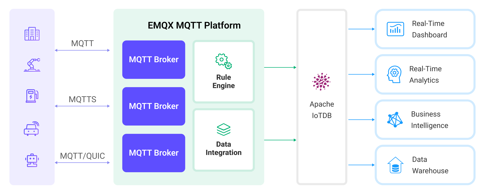

# 将 MQTT 数据写入到 Apache IoTDB


:::tip 

Apache IoTDB 数据集成是 EMQX 企业版功能。EMQX 企业版可以为您带来更全面的关键业务场景覆盖、更丰富的数据集成支持，更高的生产级可靠性保证以及 24/7 的全球技术支持，欢迎[免费试用](https://www.emqx.com/zh/try?product=enterprise)。

::: 



[Apache IoTDB](https://iotdb.apache.org/)）是一个高性能、可扩展的时序数据库，专为处理由各种物联网设备和系统生成的大量时序数据而设计。EMQX 支持与Apache IoTDB 的数据集成，使您能够通过轻量级的 MQTT 协议，使用 [REST API V2](https://iotdb.apache.org/UserGuide/Master/API/RestServiceV2.html) 无缝地将数据转发到 Apache IoTDB。这种数据集成确保了数据的单向流动。来自 EMQX 的 MQTT 消息被写入 IoTDB 数据库，利用 EMQX 卓越的实时数据摄取能力和 IoTDB 专有的时序数据存储和查询性能。这种强大的组合为希望有效管理其物联网数据的企业提供了坚实的基础。

本页面提供了关于 EMQX 和 Apache IoTDB 之间数据集成的全面介绍，并附有创建和验证数据集成的实用指南。

## 工作原理

Apache IoTDB 的数据集成是 EMQX 中的一个开箱即用的功能，在基于 MQTT 的原始时序数据与 IoTDB 强大数据存储能力之间架起桥梁。通过内置的[规则引擎](./rules.md)组件，该集成简化了从 EMQX 到 IoTDB 的数据摄取过程，以便存储和查询，无需复杂的编码。

下图展示了 EMQX 与 IoTDB 之间数据集成的典型架构。<!-- 这张图片需要修改为特定于IoTDB的-->



数据集成的工作流程如下：

1. **消息发布和接收**：无论是连接车辆、工业物联网系统还是能源管理平台的一部分，设备都通过 MQTT 协议成功连接到 EMQX，并根据其运行状态、读数或触发的事件通过 MQTT 发送消息。当 EMQX 接收到这些消息时，它会启动其规则引擎中的匹配过程。
2. **消息数据处理**：当消息到达时，它通过规则引擎进行处理，然后由 EMQX 中定义的规则进行处理。这些规则根据预定义的标准确定哪些消息需要路由到 IoTDB。如果任何规则指定了有效负载转换，则应用这些转换，例如转换数据格式、过滤特定信息或用额外的上下文丰富有效负载。
3. **数据缓冲**：EMQX 提供了一个内存中的消息缓冲区，以防止 IoTDB 不可用时数据丢失。数据暂时保存在缓冲区中，并可能转储到磁盘以防止内存过载。请注意，如果数据集成或 EMQX 节点重启，数据将不会被保留。
4. **数据摄入IoTDB**：一旦规则引擎确定了 IoTDB 存储的消息，它就会触发将消息转发到 IoTDB 的动作。处理后的数据将以时序方式无缝写入 IoTDB。
5. **数据存储和利用**：现在数据存储在 IoTDB 中，企业可以利用其查询能力应用于各种用例。例如，在连接车辆领域，这些存储的数据可以帮助车队管理系统了解车辆健康状况，根据实时指标优化路线规划，或跟踪资产。同样，在工业物联网环境中，数据可能用于监控机械健康、预测维护或优化生产计划。

## 特性与优势

与 IoTDB 的数据集成提供了一系列特性和优势，旨在确保有效的数据处理和存储：

- **高效的数据采集**

  通过将 EMQX 与 IoTDB 集成，可以通过轻量级 MQTT 消息协议从资源有限的物联网设备高效收集物联网时序数据，并摄入数据库，确保可靠和高效的数据采集。

- **灵活的数据转换**

  EMQX 提供了基于 SQL的强大规则引擎，允许组织在存储到 IoTDB 之前对数据进行预处理。它支持各种数据转换机制，如过滤、路由、聚合和丰富，使组织能够根据他们的需要塑造数据。

- **可扩展性和高吞吐量**

  EMQX 为水平可扩展性而设计，轻松管理不断增长的物联网设备生成的激增消息流量。该解决方案轻松适应扩展的数据量，并支持高并发访问。因此，物联网时序工作负载可以轻松管理物联网部署规模扩大到前所未有水平时数据摄入、存储和处理的增长需求。

- **优化的时序数据存储**

  IoTDB 为时间戳数据提供了优化的存储。它利用时间分区、压缩和数据保留策略，有效地存储和管理大量时序数据。这确保了最小的存储占用空间，同时保持高性能，这对于生成大量时序数据的物联网工作负载至关重要。

- **快速和复杂的查询**

  IoTDB 具有丰富的查询语义，支持跨设备和传感器的时序数据时间对齐，时序字段的计算（频域转换）以及时间维度上丰富的聚合函数支持。它还与 Apache Hadoop、Spark 和 Flink 深度集成，提供更强大的分析能力。EMQX 与 IoTDB无缝集成，为存储和分析MQTT 数据提供了统一的解决方案。

## 准备工作

本节描述了在 EMQX Dashboard 中创建 Apache IoTDB 数据集成之前您必须完成的准备工作。

### 前置准备

- 了解EMQX数据集成[规则](./rules.md)
- 了解[数据集成](./data-bridges.md)

### 启动 Apache IoTDB 服务器

本节将介绍如何通过 [Docker](https://www.docker.com/) 启动 Apache IoTDB 服务器。 确保在您的 IoTDB 配置中具备该字段： `enable_rest_service=true`。

在 REST 接口开启的情况下运行下面的命令启动 Apache IoTDB 服务器：

```bash
docker run -d --name iotdb-service \
              --hostname iotdb-service \
              -p 6667:6667 \
              -p 18080:18080 \
              -e enable_rest_service=true \
              -e cn_internal_address=iotdb-service \
              -e cn_target_config_node_list=iotdb-service:10710 \
              -e cn_internal_port=10710 \
              -e cn_consensus_port=10720 \
              -e dn_rpc_address=iotdb-service \
              -e dn_internal_address=iotdb-service \
              -e dn_target_config_node_list=iotdb-service:10710 \
              -e dn_mpp_data_exchange_port=10740 \
              -e dn_schema_region_consensus_port=10750 \
              -e dn_data_region_consensus_port=10760 \
              -e dn_rpc_port=6667 \
              apache/iotdb:1.1.0-standalone
```

有关如何通过 Docker 运行 IoTDB 的更多信息，请参阅： [IoTDB in Docker on Docker Hub](https://hub.docker.com/r/apache/iotdb)。

## 创建连接器

要创建 Apache IoTDB 数据集成，您需要创建一个连接器以将 Apache IoTDB Sink 连接到 Apache IoTDB 服务器。以下步骤假定 EMQX 和 ApacheIoTDB 均在本地运行。如果您在远程运行 Apache IoTDB 和 EMQX，请根据实际情况调整相应配置。

1. 转到 EMQX Dashboard 并点击 **集成** -> **连接器**。
2. 在页面右上角点击 **创建**。
3. 在 **创建连接器** 页面上，选择 **Apache IoTDB** 作为连接器类型，然后点击 **下一步**。
4. 输入连接器的名称和描述。名称应为大写和小写字母以及数字的组合，例如，`my_iotdb`。
5. 在 **IoTDB REST 服务基础 URL** 中输入 `http://localhost:18080`。
6. 输入连接器访问 Apache IoTDB 服务器的用户名和密码。
7. 其他选项保留默认。关于 **高级设置** 的配置（可选）：参见[高级配置](#高级配置)。
8. 在点击 **创建** 之前，您可以点击 **测试连接** 以测试连接器是否能够连接到 Apache IoTDB。
9. 点击 **创建** 完成连接器的创建。在弹出对话框中，您可以点击 **返回连接器列表** 或点击 **创建规则** 继续创建规则和 Sink，以指定要写入Apache IoTDB 的数据。详细步骤可参照[创建 Apache IoTDB Sink 规则](#创建-apache-iotdb-sink-规则) 章节的步骤来创建规则。

## 创建 Apache IoTDB Sink 规则

本节演示了如何在 EMQX 中创建一个规则，以处理来自源 MQTT 主题 `root/#` 的消息，并通过配置好的 Apache IoTDB Sink 发送处理后的结果，将时序数据存储到 Apache IoTDB。

1. 转到 EMQX Dashboard，并点击 **集成 -> 规则**。

2. 点击页面右上角的 **创建**。

3. 输入规则 ID，例如，`my_rule`。

4. 在 SQL 编辑器中输入以下语句，它将转发与主题模式 `root/#` 匹配的 MQTT 消息：

   ```sql
   SELECT
     *
   FROM
     "root/#"
   ```

   ::: 提示

   如果您是初学者，可以点击 **SQL 示例** 和 **启用测试** 学习和测试SQL规则。

   :::

5. 点击 **添加动作** 按钮定义规则触发的动作。从 **动作类型** 下拉列表中选择 `Apache IoTDB`。通过这个动作，EMQX 将会将规则处理后的数据发送到 Apache IoTDB。

6. 将 **动作** 下拉框保留为 `创建动作` 的值。或者，您也可以选择之前创建的 Apache IoTDB Sink。在本演示中，您将创建一个新的 Sink 并将其添加到规则中。

7. 输入 Sink 的名称和描述。

8. 从 **连接器** 下拉框中选择您刚刚创建的连接器 `my_iotdb`。您也可以通过点击下拉框旁边的按钮创建一个新的连接器。有关配置参数，请参见[创建连接器](#创建连接器)。

9. 为 Sink 配置以下信息：

   - **设备 ID** （可选）：输入特定的设备 ID，用作将时序数据转发和插入到 IoTDB 实例的设备名称。

     ::: tip

     如果留空，设备 ID 仍然可以在发布的消息中指定或在规则中配置。例如，如果您发布一个包含 `device_id` 字段的 JSON 编码消息，该字段的值将确定输出设备 ID。要使用规则引擎提取这些信息，您可以使用类似以下的 SQL：

     ```sql
     SELECT
      payload,
      `my_device` as payload.device_id
     ```

     但是，此字段中配置的固定设备ID优先于前面提到的任何方法。

     :::

   - **对齐时间序列**：默认禁用。启用后，一组对齐的时序数据的时间戳列将在 IoTDB 中仅存储一次，而不是在该组内的每个单独时序数据中重复存储。有关更多信息，请参见[对齐时序数据](https://iotdb.apache.org/UserGuide/V1.1.x/Data-Concept/Data-Model-and-Terminology.html#aligned-timeseries)。

10. 为 Sink 配置 **写入数据** 以指定从 MQTT 消息生成 IoTDB 数据的方式。由于历史原因，您可以选择以下方法之一：

    - **Payload 描述**

      使用这种方法，您应该将 **写入数据** 字段留空，并在规则的 `SELECT` 部分包含所需的上下文信息。例如，客户端发送的消息的负载为 JSON 格式，如下所示：

      ```json
      {
        "measurement": "temp",
        "data_type": "FLOAT",
        "value": "32.67",
        "device_id": "root.sg27" // 可选
      }
      ```

      您可以使用以下规则来展示字段 `measurement`、`data_type` 和 `value`。

      ```sql
      SELECT
        payload.measurement, payload.data_type, payload.value, clientid as payload.device_id
      FROM
        "root/#"
      ```

      如果 Payload 结构不同，您可以使用规则重写其结构，如下所示：

      ```sql
      SELECT
        payload.measurement, payload.dtype as payload.data_type, payload.val as payload.value
      FROM
        "root/#"
      ```

    - **模板描述**

      使用这种方法，您可以在 **写入数据** 部分定义一个模板，包括所需的每行的上下文信息。当提供此模板时，系统将通过应用它到MQTT 消息来生成 IoTDB 数据。写入数据的模版支持通过 CSV 文件批量设置，详细说明请参考[批量设置](#批量设置)。

      例如，使用以下模板：

      | 时间戳 | 字段        | 数据类型 | 值       |
      | ------ | ----------- | -------- | -------- |
      |        | index       | INT32    | ${index} |
      |        | temperature | FLOAT    | ${temp}  |

      ::: tip

      每列支持占位符语法以用变量填充。如果省略时间戳，它将自动填充为当前系统时间（毫秒）。

      :::

      然后，您的 MQTT 消息将如下所示：

      ```json
      {
      "index": "42",
      "temp": "32.67"
      }
      ```

11. 展开**高级设置**，根据需要配置高级设置选项（可选），详细请参考[高级设置](#高级设置)。

12. 在点击**创建**之前，您可以点击**测试连接**，以测试 Sink 是否能够连接到 Apache IoTDB 服务器。

13. 点击 **创建** 完成 Sink 的创建。回到 **创建规则** 页面，您将看到新的 Sink 出现在 **动作输出** 标签下。

14. 回到 **创建规则** 页面，验证配置的信息。点击 **创建** 按钮生成规则。

现在您已成功创建规则，您可以在 **规则** 页面上看到新的规则。点击 **动作(Sink)** 标签，您可以看到新的 Apache IoTDB Sink。

您可以点击 **集成** -> **Flow 设计器** 查看拓扑。可以看到 `root/#` 下的消息在通过规则 `my_rule` 解析后被转发到 Apache IoTDB。

### 批量设置

在 Apache IoTDB 中，可能需要同时写入数百条数据，在 Dashboard 上进行配置是具有挑战性的工作。为了解决这个问题，EMQX 提供了批量设置数据写入的功能。

当配置 **写入数据** 时，您可以使用批量设置功能，从 CSV 文件中导入要进行插入操作的字段。

1. 点击 **写入数据** 表格的 **批量设置** 按钮，打开 **导入批量设置** 弹窗。

2. 根据指引，先下载批量设置模板文件，然后在模板文件中填入数据写入配置，默认的模板文件内容如下：

   | Timestamp | Measurement | Data Type | Value             | Remarks (Optional)                                           |
   | --------- | ----------- | --------- | ----------------- | ------------------------------------------------------------ |
   | now       | temp        | FLOAT     | ${payload.temp}   | 字段、值、数据类型是必填选项，数据类型可选的值为 BOOLEAN、 INT32、 INT64、 FLOAT、 DOUBLE、 TEXT |
   | now       | hum         | FLOAT     | ${payload.hum}    |                                                              |
   | now       | status      | BOOLEAN   | ${payload.status} |                                                              |
   | now       | clientid    | TEXT      | ${clientid}       |                                                              |

   - **Timestamp**: 支持使用 ${var} 格式的占位符，要求是时间戳格式。也可以使用以下特殊字符插入系统时间：
     - now: 当前毫秒级时间戳
     - now_ms: 当前毫秒级时间戳
     - now_us: 当前微秒级时间戳
     - now_ns: 当前纳秒级时间戳
   - **Measurement**: 字段名，支持常量或 ${var} 格式的占位符。
   - **Data Type**: 数据类型，可选值包括 BOOLEAN、 INT32、 INT64、 FLOAT、 DOUBLE、 TEXT。
   - **Value**: 写入的数据值，支持常量或 ${var} 格式的占位符，需要与数据类型匹配。
   - **Remarks**: 仅用于 CSV 文件内字段的备注，无法导入到 EMQX 中。


   注意，仅支持 1M 以内的 CSV 格式文件，文件中数据不能超过 2000 行。

3. 将填好的模板文件保存并上传到 **导入批量设置** 弹窗中，点击**导入**完成批量设置。
4. 导入完成后，您可以在 **写入数据** 表格中对数据进行进一步的调整。

## 测试规则

您可通过 EMQX Dashboard 内置的 WebSocket 客户端进行规则和 Sink 的验证。

1. 在 Dashboard 页面，点击左侧导航目录中的 **问题分析** -> **WebSocket 客户端**。

2. 填写当前 EMQX 的连接信息。 

   - 如果 EMQX 在本地运行，可直接使用默认配置。
   - 如果您修改过 EMQX 的默认配置，如修改过访问规则的配置，则需要输入用户名和密码。

3. 点击**连接**，建立该 WebSocket 客户端与 EMQX 的连接。

4. 前往发布区域，在消息 payload 中设置设备 ID并发布消息：

   - **主题**：`root/test`

   - **Payload**: 

     ```json
     {
       "measurement": "temp",
       "data_type": "FLOAT",
       "value": "37.6",
       "device_id": "root.sg27"
     }
     ```
   
   - **QoS**: `2`

5. 点击**发布**完成消息的发送。

6. 您也可以在主题中设置设备 ID， 并再次发布消息：

   - **主题**：`root/sg27`
   
     :::tip
   
      如果主题不以 `root` 开头，系统将自动为其添加前缀。例如，如果您将消息发布到 `test/sg27`，生成的设备名称将为 `root.test.sg27`。请确保您的规则和主题已正确配置，以便将来自该主题的消息转发到 Sink。
   
        :::
   
   - **Payload**:
   
     ```json
     {
       "measurement": "temp",
       "data_type": "FLOAT",
       "value": "36.6"
     }
     ```
   
   - **QoS**: `2`

7. 点击**发布**完成消息的发送。

   如果 Sink 和规则创建成功，消息应该已被转发至 Apache IoTDB 服务器里指定的时序数据表中。 

8. 您可以使用 IoTDB 的命令行查看。如果服务器在 docker 中运行，可以使用下面的命令连接服务器：

   ```shell
    $ docker exec -ti iotdb-service /iotdb/sbin/start-cli.sh -h iotdb-service
   ```

9. 在控制台中继续输入：

   ```sql
   IoTDB> select * from root.sg27
   ```

   您将能看到以下返回结果：
   
   ```
   +------------------------+--------------+
   |                    Time|root.sg27.temp|
   +------------------------+--------------+
   |2023-05-05T14:26:44.743Z|          37.6|
   |2023-05-05T14:27:44.743Z|          36.6|
   +------------------------+--------------+
   ```

## 高级设置

本节描述了一些高级配置选项，可以优化您的连接器和 Sink 性能，并根据您的特定场景定制操作。创建连接器和 Sink 时，您可以展开 **高级设置** 并根据您的业务需求配置以下设置。

| 字段                  | 描述                                                         | 推荐值   |
| --------------------- | ------------------------------------------------------------ | -------- |
| HTTP 流水线           | 指定可以连续不间断地向服务器发送的 HTTP 请求数量，无需等待个别响应。此选项采用正整数值，表示将被管道化的最大 HTTP 请求数量。<br />当设置为 `1` 时，表示传统的请求-响应模型，其中每个 HTTP 请求将被发送，然后客户端将等待服务器响应，再发送下一个请求。较高的值可以通过允许批量发送多个请求，减少往返时间，从而更有效地利用网络资源。 | `100`    |
| 连接池类型            | 定义用于管理和分配 EMQX 与 Apache IoTDB 之间连接器中连接的算法策略。<br />当设置为 `random` 时，将从可用连接池中随机选择与 Apache IoTDB 服务器的连接。此选项提供了简单平衡的分配。<br />当设置为 `hash` 时，使用哈希算法将请求一致地映射到连接池中的连接。此类型通常用于需要更确定性请求分配的场景，例如基于客户端标识符或主题名称的负载平衡。<br />**注意**：选择适当的池类型取决于您的具体用例和您希望实现的分布特性。 | `random` |
| 连接池大小            | 指定在与 Apache IoTDB 服务接口时可以在连接池中维护的并发连接数量。此选项有助于通过限制或增加EMQX 与 Apache IoTDB 之间的活动连接数量来管理应用程序的可扩展性和性能。<br />**注意**：设置适当的连接池大小取决于系统资源、网络延迟和您的应用程序的特定工作负载等多种因素。太大的池大小可能导致资源耗尽，而太小的大小可能限制吞吐量。 | `8`      |
| 连接超时              | 指定 EMQX 在尝试与 Apache IoTDB HTTP 服务器建立连接时的最大等待时间，以秒为单位。<br />**注意**：仔细选择超时设置对于平衡系统性能和资源利用至关重要。建议在不同的网络条件下测试系统，以找到适合您特定用例的最佳超时值。 | `15`     |
| HTTP 请求最大重试次数 | 指定如果 HTTP 请求在 EMQX 与 Apache IoTDB 通信过程中未能成功完成时的最大重试次数。 | `2`      |
| 启动超时时间          | 确定连接器在响应资源创建请求之前等待自动启动的资源达到健康状态的最大时间间隔，以秒为单位。此设置有助于确保集成在验证连接资源（如 Apache IoTDB 中的数据库实例）已完全运行并准备处理数据交易之前不会继续操作。 | `5`      |
| 缓存池大小            | 指定将分配用于管理 EMQX 与 Apache IoTDB 之间出站类型桥接的数据流的缓冲工作进程数量。这些工作进程负责在将数据发送到目标服务之前临时存储和处理数据。此设置特别适用于优化性能和确保出站（出口）场景中的平稳数据传输。对于仅处理入站（入口）数据流的桥接，此选项可以设置为“0”，因为它不适用。 | `18`     |
| 请求超期              | “请求 TTL”（生存时间）配置设置指定了一旦请求进入缓冲区后，请求被认为有效的最大持续时间，以秒为单位。此计时器从请求被缓冲的那一刻开始计时。如果请求在缓冲区中停留的时间超过此 TTL 设置，或者如果发送了请求但没有及时从 Apache IoTDB 收到响应或确认，则认为请求已过期。 | `45`     |
| 健康检查间隔          | 指定连接器执行对 Apache IoTDB 连接的自动健康检查的时间间隔，以秒为单位。 | `15`     |
| 缓存队列最大长度      | 指定 Apache IoTDB 数据集成中每个缓冲工作进程可以缓冲的最大字节数。缓冲工作进程临时存储数据，然后发送到 IoTDB，充当中介以更有效地处理数据流。根据您的系统性能和数据传输需求调整此值。 | `265`    |
| 请求模式              | 允许您选择 `asynchronous` 或 `synchronous` 查询模式，以根据不同需求优化消息传输。在异步模式下，写入 IoTDB 不会阻塞 MQTT 消息发布过程。然而，这可能导致客户端在消息到达 IoTDB 之前就收到消息。 | `Async`  |
| 请求飞行队列窗口      | “在途查询”指的是已经启动但尚未收到响应或确认的查询。此设置控制在连接器与 Apache IoTDB 通信时，可以同时存在的最大在途查询数量。<br />当 `query_mode` 设置为 `async`（异步）时，“在途窗口”参数具有特殊重要性。如果对来自同一 MQTT 客户端的消息以严格顺序处理至关重要，则应将此值设置为1。 | `100`    |

## 更多信息

EMQX 提供了许多关于与 Apache IoTDB 数据集成的学习资源。查看以下链接以了解更多信息：

**博客：**

[如何将 MQTT 与时序数据库高效应用于物联网场景](https://www.emqx.com/zh/blog/time-series-database-for-iot-the-missing-piece) 
