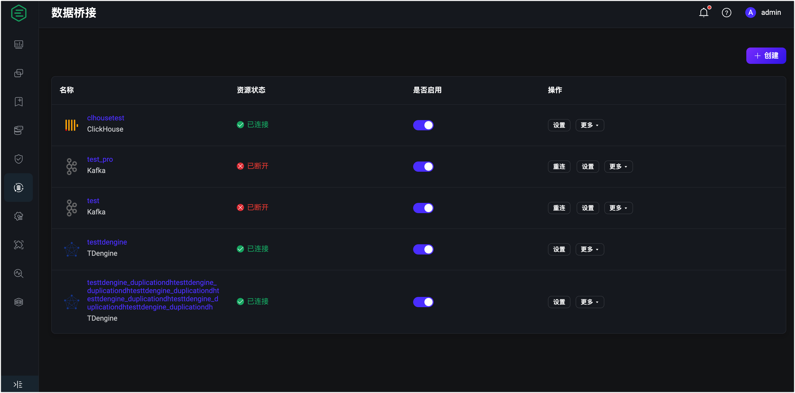
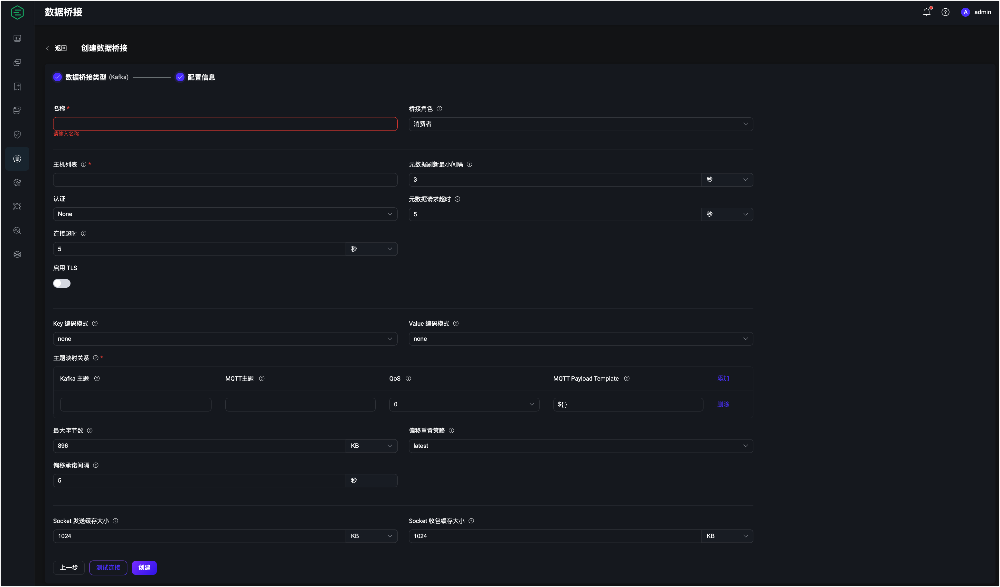

# Apache Kafka 消费者

Apache Kafka 数据桥接实现了 EMQX 客户端消息和事件与 Apache Kafka (包括 Confluent) 的桥接，能够提供 EMQX 与企业应用之间高性能、高可靠的数据集成，有效降低应用复杂度并提升扩展性。

同时，EMQX Apache Kafka 集成提供了极高的数据吞吐能力，支持 Apache Kafka 的 SASL/SCRAM、SASL/GSSAPI 等多种安全认证方式以及 TLS 连接，是物联网数据集成首选方案之一。


:::tip
EMQX 企业版功能。EMQX 企业版可以为您带来更全面的关键业务场景覆盖、更丰富的数据集成支持，更高的生产级可靠性保证以及 24/7 的全球技术支持，欢迎[免费试用](https://www.emqx.com/zh/try?product=enterprise)。
:::


## 通过 Dashboard 配置 Kafka 消费者桥接

以下步骤将指导你如何以消费者角色创建 Kafka 桥接。

:::tip 前置准备

- 了解 [规则](./rules.md)。
- 了解 [数据桥接](./data-bridges.md)。
- 需要预先在 Kafka 创建好对应的 Topic。

:::

1. 转到 Dashboard **数据集成** -> **数据桥接**页面。

2. 点击页面右上角的**创建**。

   

3. 在**数据桥接类型**中选择 **Kafka**，点击**下一步**。

   

4. 在**桥接角色** 中选择**消费者**。配置**消费者**桥接信息：

   - 填写必填信息（标星号选项）。

   - 输入数据桥接名称，要求是大小写英文字母或数字组合。

   - 输入 Kafka 连接信息，**主机列表**填写 **127.0.0.1:9092**，其他参数根据实际情况填写。

   - **主题映射关系**：必须包含至少一个 Kafka 主题和 MQTT 主题之间的映射。**MQTT 载荷模版**子字段指定应使用的 MQTT 载荷，并提供以下 Kafka 消息字段以进行模板化：

     | 字段名称  | 描述                                               |
     | --------- | -------------------------------------------------- |
     | `headers` | 包含字符串键-值对的对象                            |
     | `key`     | Kafka 消息键（由选择的键编码）                     |
     | `offset`  | Kafka 主题分区中消息的偏移量                       |
     | `topic`   | Kafka 源主题                                       |
     | `ts`      | 消息时间戳                                         |
     | `ts_type` | 消息时间戳类型,  `create`, `append` or `undefined` |
     | `value`   | Kafka 消息值 (由选择的值编码)                      |

   - **MQTT 载荷模板**的默认值为`${.}`，其中包括编码为 JSON 对象的所有可用数据。例如，选择`${.}`作为模板将会产生以下 Kafka 消息内容：

     ```json
     {
      "value": "value",
      "ts_type": "create",
      "ts": 1679665968238,
      "topic": "my-kafka-topic",
      "offset": 2,
      "key": "key",
      "headers": {"header_key": "header_value"}
     }
     ```

     可以使用点符号进入 Kafka 消息的子字段。例如：`${.value}` 将解析为 Kafka 消息的值，`${.headers.h1}` 将解析为 Kafka `h1` 标题的值（如果存在）。缺失的值将被替换为空字符串。

     :::tip

     每一对 Kafka 和 MQTT 主题之间的映射关系只能有一个唯一的 Kafka 主题名称，即 Kafka 主题名称不能出现在一对以上的映射关系中。

     :::

     

   5. 点击**创建**，将被提示是否使用该数据桥接创建规则。这将允许进一步转换和过滤需要匹配规则的 Kafka 消息，然后转发到其他规则操作，如不同的桥接。有关创建规则的更多信息，请参阅[规则引擎](./rules.md)。

      :::tip 提示

      创建关联的规则并不是必需的。在**主题映射**中定义的 MQTT 主题将会在没有进一步配置的情况下发布消息。

      :::
   
   ## 通过配置文件配置 Kafka 消费者桥接
   
   想要通过配置文件配置 Kafka 消费者桥接，在 `emqx.conf` 文件的最后加入下列配置。
   
   ```json
   bridges.kafka_consumer.my_consumer {
     enable = true
     bootstrap_hosts = "kafka-1.emqx.net:9092"
     connect_timeout = 5s
     min_metadata_refresh_interval = 3s
     metadata_request_timeout = 5s
     authentication = {
       mechanism = plain
       username = emqxuser
       password = password
     }
     kafka {
       max_batch_bytes = 896KB
       max_rejoin_attempts = 5
       offset_commit_interval_seconds = 3
       offset_reset_policy = reset_to_latest
     }
     topic_mapping = [
       {
         kafka_topic = "kafka-topic-1"
         mqtt_topic = "mqtt/topic/1"
         qos = 1
         payload_template = "${.}"
       },
       {
         kafka_topic = "kafka-topic-2"
         mqtt_topic = "mqtt/topic/2"
         qos = 2
         payload_template = "v = ${.value}"
       }
     ]
     key_encoding_mode = none
     value_encoding_mode = none
     ssl {
       enable = false
       verify = verify_none
       server_name_indication = "auto"
     }
   }
   ```
   
   
