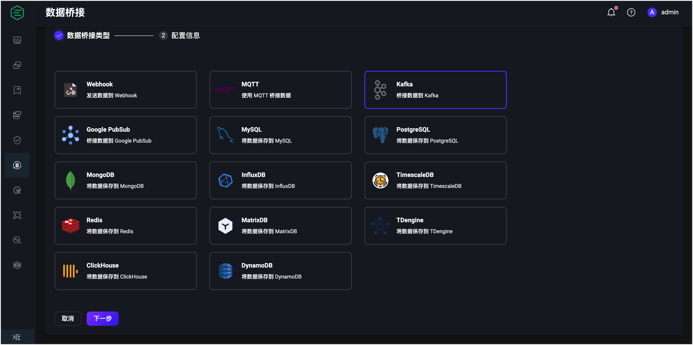

# Apache Kafka

<!-- 提供一段简介，描述支数据桥接的基本工作方式、关键特性和价值，如果有局限性也应当在此处说明（如必须说明的版本限制、当前未解决的问题）。 -->
Apache Kafka 数据桥接实现了 EMQX 客户端消息和事件与 Apache Kafka (包括 Confluent) 的桥接，能够提供 EMQX 与企业应用之间高性能、高可靠的数据集成，有效降低应用复杂度并提升扩展性。Apache Kafka 数据桥接涉及两种桥接角色：生产者（将数据发送到 Kafka ）和消费者（将数据从 Kafka 消费下发）。EMQX 支持创建任何一种角色的桥接或同时创建两种角色的桥接。

同时，EMQX 与 Apache Kafka 的集成提供了极高的数据吞吐能力，支持 Apache Kafka 的 SASL/SCRAM、SASL/GSSAPI 等多种安全认证方式以及 TLS 连接，是物联网数据集成首选方案之一。


:::tip
EMQX 企业版功能。EMQX 企业版可以为您带来更全面的关键业务场景覆盖、更丰富的数据集成支持，更高的生产级可靠性保证以及 24/7 的全球技术支持，欢迎[免费试用](https://www.emqx.com/zh/try?product=enterprise)。
:::


:::tip 前置准备

<!-- 根据情况编写，包含必须的前置知识点、软件版本要求、需要预先创建/初始化的操作。 -->
- 了解 [规则](./rules.md)。
- 了解 [数据桥接](./data-bridges.md)。

<!-- 列举功能或性能方面的亮点，如支持批处理、支持异步模式、双向数据桥接，链接到对应的功能介绍章节。 -->

:::

## 功能清单

- [连接池](./data-bridges.md#连接池)
- [异步请求模式](./data-bridges.md#异步请求模式)
- [批量模式](./data-bridges.md#批量模式)
- [缓存队列](./data-bridges.md#缓存队列)

<!-- TODO 配置参数 需补充链接到配置手册对应配置章节。 -->

## 快速开始
<!-- 从安装测试所需步骤，如果有不同的用法增加章节介绍。 -->

本节将带您创建一个 Kafka 服务器以及 Kafka 主题，然后在 EMQX 创建 Kafka 生产者和消费者的数据桥接，之后再通过为 Kafka 生产者创建一条规则来将数据转发至 Kafka，以验证该数据桥接是否正常工作。

::: tip

本教程假定 EMQX 与 Kafka 均在本地运行，如您在远程运行 EMQX 及 Kafka，请根据实际情况调整相应配置。

:::

### 安装 Kafka

以 macOS 为例，安装并启动 Apache Kafka：

```bash
wget https://archive.apache.org/dist/kafka/3.3.1/kafka_2.13-3.3.1.tgz

tar -xzf  kafka_2.13-3.3.1.tgz

cd kafka_2.13-3.3.1

# 以 KRaft 启动 Kafka（可选）
KAFKA_CLUSTER_ID="$(bin/kafka-storage.sh random-uuid)"

bin/kafka-storage.sh format -t $KAFKA_CLUSTER_ID -c config/kraft/server.properties

bin/kafka-server-start.sh config/kraft/server.properties
```

更多详细内容请参考 [Kafka Quick Start](https://kafka.apache.org/documentation/#quickstart)。

### 创建 Kafka 主题

在 EMQX 创建数据桥接前，必须首先在 Kafka 中创建好所需主题。使用下面的命令在 Kafka 中创建名为 `testtopic-in` 与 `testtopic-out` 的两个主题：

```bash
bin/kafka-topics.sh --create --topic testtopic-in --bootstrap-server localhost:9092

bin/kafka-topics.sh --create --topic testtopic-out --bootstrap-server localhost:9092
```

### 创建 Kafka 数据桥接

本节将通过 Dashboard 演示如何创建到 Kafka 生产者和消费者的数据桥接。

1. 转到 Dashboard **数据集成** -> **数据桥接**页面。

2. 点击页面右上角的**创建**。

3. 在**数据桥接类型**中选择 **Kafka**，点击**下一步**。

   

4. 在**桥接角色** 中选择**生产者**或**消费者**。
   
   :::: tabs type:card
   
   ::: tab 配置生产者桥接
   
   - 填写必填信息（标星号字段）。
   
   - 输入数据桥接名称，要求是大小写英文字母和数字的组合。
   
   - 输入 Kafka 连接信息，**主机列表**填写 `127.0.0.1:9092`，其他参数根据实际情况填写。
   
   - **源 MQTT 主题**：选择要为其建立桥接的 MQTT 主题，此处填写 `t/#` 表示将匹配此主题的 MQTT 消息转发至 Kafka。您也可以选择将此项留空，通过[新建规则]指定发往 Kafka 的数据。
   
   - **Kafka 主题名称**：填写 Kafka 中预先创建好的主题 `testtopic-in`，此处暂不支持使用变量。
   
     模版用于将规则或指定 MQTT 主题的消息转发到我们之前创建的 Kafka 主题。此处您可以使用默认配置，或通过变量构造消息模板。
   
   - **消息键**：Kafka 消息键，此处填写字符串或者包含占位符（ ${var}）的字符串。
   
   - **消息值**：Kafka 消息值，此处填写字符串或者包含占位符（ ${var}）的字符串。
   
   - 高级配置（可选）：根据情况配置**最大批量字节数**、**压缩**、**分区选择策略**等参数。
   
   :::
   
   ::: tab 配置消费者桥接
   
   - 填写必填信息（标星号字段）。
   
   - 输入数据桥接名称，要求是大小写英文字母和数字组合。
   
   - 输入 Kafka 连接信息，**主机列表**填写 `127.0.0.1:9092`，其他参数根据实际情况填写。
   
   - **主题映射关系**：必须包含至少一个 Kafka 主题和 MQTT 主题之间的映射。**MQTT Payload Template** 子字段指定应使用的 MQTT 载荷，并提供以下 Kafka 消息字段以进行模板化：
   
     | 字段名称  | 描述                                               |
     | --------- | -------------------------------------------------- |
     | `headers` | 包含字符串键-值对的对象                            |
     | `key`     | Kafka 消息键（由选择的键编码）                     |
     | `offset`  | Kafka 主题分区中消息的偏移量                       |
     | `topic`   | Kafka 源主题                                       |
     | `ts`      | 消息时间戳                                         |
     | `ts_type` | 消息时间戳类型,  `create`, `append` or `undefined` |
     | `value`   | Kafka 消息值 (由选择的值编码)                      |
     
     **MQTT Payload Template** 的默认值为`${.}`，其中包括编码为 JSON 对象的所有可用数据。例如，选择`${.}`作为模板将会产生以下 Kafka 消息内容：
     
     ```json
     {
           "value": "value",
           "ts_type": "create",
           "ts": 1679665968238,
           "topic": "my-kafka-topic",
           "offset": 2,
           "key": "key",
           "headers": {"header_key": "header_value"}
          }
     ```
     
     可以使用点符号选择 Kafka 消息的子字段。例如：`${.value}` 将解析为 Kafka 消息的值，`${.headers.h1}` 将解析为 Kafka `h1` 标题的值（如果存在）。缺失的值将被替换为空字符串。
     
      **注意**：每一对 Kafka 和 MQTT 的主题映射关系只能有一个唯一的 Kafka 主题名称，即 Kafka 主题名称不能出现在一对以上的映射关系中。
     
   
   :::
   
   ::::
   
5. 点击**创建**前，您可点击**测试连接**按钮确保能连接到 Kafuka 服务器。

6. 点击**创建**，将提示是否使用该数据桥接创建规则。

   - 对于 Kafka 生产者桥接，点击**创建规则**或者到 Dashboard **数据集成** -> **规则页面** [创建数据转发规则](#创建 Kafka 生产者数据转发规则)。
   - 对于 Kafka 消费者桥接，创建关联的规则不是必需的。没有规则的情况下消息也可以发布到 **主题映射** 中设置的 MQTT 主题。
   

::: tip 提示

创建关联的规则可以通过规则进一步处理 Kafka 消息，然后再发送到 MQTT 客户端。有关创建规则的更多信息，请参阅[规则引擎](./rules.md)。

:::

### 创建 Kafka 生产者数据转发规则

至此您已经完成数据桥接创建流程，接下来将继续创建一条规则来指定需要写入的数据：

1. 转到 Dashboard **数据集成** -> **规则页面**。

2. 点击页面右上角的创建。

3. 输入规则 ID，例如  `my_rule`，

4. 在 SQL 编辑器中输入规则，例如我们希望将 `t/#` 主题的 MQTT 消息存储至 Kafka，可通过如下规则实现：

   注意：如果要自定义 SQL 语句，请确保 `SELECT` 字段包含数据桥接中所需的所有字段。


```sql
SELECT
  *
FROM
  "t/#"
```

5. 点击**添加动作**按钮，在下拉框中选择**使用数据桥接转发**选项，选择先前创建好的 Kafka 数据桥接。

6. 点击**添加**按钮确认添加动作。

7. 点击最下方**创建**按钮完成规则创建。

至此您已经完成整个创建过程，可以前往 **数据集成** -> **Flows** 页面查看拓扑图，此时应当看到 `t/#` 主题的消息经过名为 `my_rule` 的规则处理，处理结果交由 Kafka 进行存储。

### 测试数据桥接和规则

使用 MQTTX 向 `t/1` 主题发布消息：

```bash
mqttx pub -i emqx_c -t t/1 -m '{ "msg": "Hello Kafka" }'
```

查看数据桥接运行统计，命中、发送成功次数应当 +1。

通过 Kafka 命令查看 `testtopic-in` 主题是否写入消息：

```bash
bin/kafka-console-consumer.sh --bootstrap-server 127.0.0.1:9092  --topic testtopic-in --from-beginning
```
