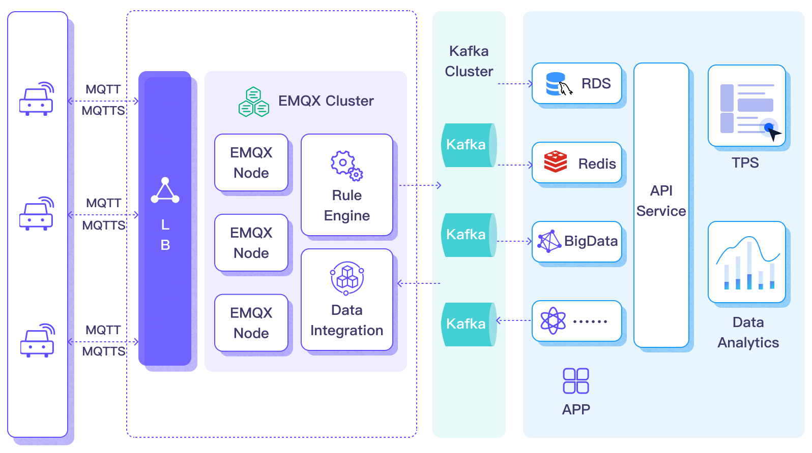

# 将 MQTT 数据传输到 Apache Kafka

::: tip 

Kafka 数据集成是 EMQX 企业版的功能。

:::

[Apache Kafka](https://kafka.apache.org/) 是一个广泛使用的开源分布式事件流处理平台，能够处理应用程序和系统之间数据流的实时传输。然而，Kafka 并不是为边缘物联网通信构建的，Kafka 客户端需要稳定的网络连接和更多的硬件资源。在物联网领域，设备和应用程序生成的数据使用轻量级 MQTT 协议传输。EMQX 与 Kafka/[Confluent](https://www.confluent.io/) 的集成使用户能够无缝地将 MQTT 数据流入或流出 Kafka。MQTT 数据流被引入 Kafka 主题，确保实时处理、存储和分析。反过来，Kafka 主题的数据可以被 MQTT 设备消费，实现及时处理。


本页提供了关于 EMQX 和 Kafka 之间数据集成的全面介绍，以及如何创建和验证数据集成的实际指导。

## 工作原理

Apache Kafka 数据集成是 EMQX 的开箱即用功能，能够在基于 MQTT 的物联网数据和 Kafka 强大的数据处理能力之间架起桥梁。通过内置的[规则引擎](./rules.md)组件，集成简化了两个平台之间的数据流和处理过程，无需复杂编码。

下图展示了 EMQX 与 Kafka 的数据集成在汽车物联网中的典型架构。



将数据流入或流出 Apache Kafka 需要分别创建 Kafka Sink（向 Kafka 发送消息）和 Kafka Source（从 Kafka 接收消息）。以 Sink 为例，其工作流程如下：

1. **消息发布和接收**：连接车辆的物联网设备通过 MQTT 协议成功连接到 EMQX，并通过 MQTT 定期发布包含状态数据的消息。当 EMQX 收到这些消息时，它启动其规则引擎内的匹配过程。
2. **消息数据处理**：通过内置规则引擎与消息服务器的协同工作，这些 MQTT 消息可以根据主题匹配规则进行处理。当消息到达并通过规则引擎时，规则引擎将评估针对该消息事先定义好的处理规则。如果任何规则指定消息载荷转换，则应用这些转换，例如转换数据格式、过滤特定信息或使用额外上下文丰富载荷。
3. **发送到 Kafka**：规则引擎中定义的规则触发将消息转发到 Kafka 的动作。使用 Kafka Sink，MQTT 主题被映射到预定义的 Kafka 主题，所有处理过的消息和数据被写入 Kafka 主题。

车辆数据被输入到 Kafka 后，您可以灵活地访问和利用这些数据：

- 您的服务可以直接与 Kafka 客户端集成，从特定主题消费实时数据流，实现定制化的业务处理。
- 利用 Kafka Streams 进行流处理，并通过在内存中聚合和相关联车辆状态进行实时监控。
- 通过使用 Kafka Connect 组件，您可以选择各种连接器将数据输出到外部系统，如 MySQL、ElasticSearch，以进行存储。

## 特性与优势

与 Apache Kafka 的数据集成为您的业务带来以下特性和优势：

- **可靠和双向物联网数据消息传递**：在不稳定移动网络上运行的资源有限的物联网设备与 Kafka 之间的数据通信可以在 MQTT 协议下进行处理，该协议能出色地运用于不确定网络中的数据通信。EMQX 不仅能批量转发 MQTT 消息到 Kafka，还能从后端系统订阅 Kafka 消息，并将其传递到连接的物联网客户端。
- **载荷转换**：在传输过程中，消息载荷可以通过定义的 SQL 规则进行处理。例如，包含一些实时指标（如总消息计数、成功/失败传递计数和消息速率）的载荷可以在消息被输入到 Kafka 之前进行数据提取、过滤、丰富和转换。
- **有效的主题映射**：通过配置的 kafka Sink，可以将众多物联网业务主题映射到 Kakfa 主题。EMQX 支持将 MQTT 用户属性映射到 Kafka 标头，并采用各种灵活的主题映射方法，包括一对一、一对多、多对多，以及支持 MQTT 主题过滤器（通配符）。
- **灵活的分区选择策略**：支持根据 MQTT 主题或客户端将消息转发到同一 Kafka 分区。
- **高吞吐量情况下的处理能力**：EMQX Kafka 生产者支持同步和异步写入模式，允许您根据不同场景在实时优先和性能优先的数据写入策略之间灵活平衡。
- **运行时指标**：支持查看每个 Sink 与 Source 的运行时指标，如总消息数、成功/失败计数、当前速率等。
- **动态配置**：您可以在 Dashboard 中或配置文件中动态配置 Sink 与 Source。

这些特性增强了集成能力和灵活性，有助于您建立有效和稳健的物联网平台架构。您日益增长的物联网数据可以在稳定的网络连接下传输，并且可以进一步有效地存储和管理。

## 准备工作

本节描述了在 EMQX Dashboard 上创建 Kafka Sink 与 Source 之前需要完成的准备工作。

### 前置准备

- 了解[规则引擎](./rules.md)
- 了解[数据集成](./data-bridges.md)

### 设置 Kafka 服务器

本节以 macOS 为例来说明过程。您可以使用以下命令安装并运行 Kafka：

```bash
wget https://archive.apache.org/dist/kafka/3.3.1/kafka_2.13-3.3.1.tgz

tar -xzf  kafka_2.13-3.3.1.tgz

cd kafka_2.13-3.3.1

# 使用 KRaft 启动 Kafka
KAFKA_CLUSTER_ID="$(bin/kafka-storage.sh random-uuid)"

bin/kafka-storage.sh format -t $KAFKA_CLUSTER_ID -c config/kraft/server.properties

bin/kafka-server-start.sh config/kraft/server.properties
```

具体操作步骤，您可以参考 [Kafka 文档中的快速开始部分](https://kafka.apache.org/documentation/#quickstart)。

### 创建 Kafka 主题

在 EMQX 中创建数据集成之前应创建相关的 Kafka 主题。使用以下命令在 Kafka 中创建两个主题：`testtopic-in`（用于 Sink）和 `testtopic-out`（用于 Source）。

```bash
bin/kafka-topics.sh --create --topic testtopic-in --bootstrap-server localhost:9092

bin/kafka-topics.sh --create --topic testtopic-out --bootstrap-server localhost:9092
```

## 创建 Kafka 生产者连接器

在添加 Kafka Sink 前，您需要创建 Kafka 生产者连接器，以便 EMQX 与 Kafka 建立连接。

1. 进入 EMQX Dashboard，并点击 **集成** -> **连接器**。
2. 点击页面右上角的**创建**，在连接器选择页面，选择 **Kafka 生产者**，点击下一步。
3. 输入名称与描述，例如 `my-kafka`，名称用于 Kafka Sink 关联选择连接器，要求在集群中唯一。
4. 配置连接到 Kafka 所需的参数：
   - 对于 **主机列表**，输入 `127.0.0.1:9092`。注意：此演示假设您在本地机器上运行 EMQX 和 Kafka。如果您在远程运行 Kafka 和 EMQX，请相应调整设置。
   - 将其他选项保留为默认值，或根据您的业务需求进行配置。
   - 如果您想建立加密连接，请点击 **启用 TLS** 开关。有关 TLS 连接的更多信息，请参见 [启用 TLS 加密访问外部资源](../network/overview.md/#启用-tls-加密访问外部资源)。
5. 点击**创建**按钮完成连接器的创建。

创建成功后，连接器将自动连接到 Kafka。接下来，我们将基于此连接器创建一条规则，将数据转发到连接器所配置的 Kafka 集群中。

## 创建 Kafka Sink 规则

本节演示了如何在 EMQX 中创建规则，以处理来自源 MQTT 主题 `t/#` 的消息，并通过配置的 Kafka Sink 发送处理结果以生产数据到 Kafka 的 `testtopic-in` 主题，以及如何进行规则的测试。

1. 进入 EMQX Dashboard，并点击 **集成** -> **规则**。

2. 点击页面右上角的**创建**。

3. 输入一个规则 ID，例如 `my_rule`。

4. 如果您想将主题 `t/#` 的 MQTT 消息转发到 Kafka，可以在 **SQL 编辑器** 中输入以下语句。

   注意：如果您想指定自己的 SQL 语法，请确保在 `SELECT` 部分包含了 Kafka Sink 所需的所有字段。

   ```sql
   SELECT
     *
   FROM
     "t/#"
   ```

   ::: tip

   如果您是初学者，可以点击 **SQL 示例** 和 **启用测试** 学习和测试 SQL 规则。

   :::

   ::: tip

   EMQX v5.7.2 引入了在规则 SQL 中设置读取环境变量的功能，详见[使用环境变量](#使用环境变量)。

   :::

5. 点击 + **添加动作** 来创建规则将触发的动作。从**动作类型**下拉列表中选择 **Kafka 生产者**，保持**动作**下拉框为默认的`创建动作`选项，您也可以从**动作**下拉框中选择一个之前已经创建好的 Kafka 生产者动作。此处我们创建一个全新的规则并添加到规则中。

6. 在下方的表单中输入 Sink 的名称与描述。

7. 在**连接器**下拉框中选择刚刚创建的 `my-kafka` 连接器。您也可以点击下拉框旁边的创建按钮，在弹出框中快捷创建新的连接器，所需的配置参数按照参照[创建 Kafka 生产者连接器](#创建-kafka-生产者连接器)。

8. 配置 Sink 的数据发送方式，包括：

   - **Kafka 主题名称**：输入 `testtopic-in`。从 EMQX v5.7.2 开始，该字段还支持设置 Kafka 动态主题，详见[使用变量模版](#使用变量模版)。

   - **Kafka Headers**：输入与 Kafka 消息相关的元数据或上下文信息（可选）。占位符的值必须是一个对象。您可以从 **Kafka Headers 值编码类型** 下拉列表中选择 Header 的值编码类型。您还可以通过点击 **添加** 来添加更多键值对。

   - **消息的键**：Kafka 消息键。在此输入一个字符串，可以是纯字符串或包含占位符 (${var}) 的字符串。

   - **消息的值**：Kafka 消息值。在此输入一个字符串，可以是纯字符串或包含占位符 (${var}) 的字符串。

   - **分区选择策略**：选择生产者向 Kafka 分区分发消息的方式。

   - **压缩**：指定是否使用压缩算法压缩/解压 Kafka 消息中的记录。

9. 高级设置（可选）：请参阅 [高级配置](#高级配置)。

10. 点击 **创建** 按钮完成 Sink 的创建，创建成功后页面将回到**创建规则**，新的 Sink 将添加到规则动作中。

11. 点击 **创建** 按钮完成整个规则创建。

现在您已成功创建了规则，你可以点击**集成** -> **规则**页面看到新建的规则，同时在**动作(Sink)** 标签页看到新建的 Kafka 生产者 Sink。

您也可以点击 **集成** -> **Flow 设计器** 查看拓扑，通过拓扑可以直观的看到，主题 `t/#` 下的消息在经过规则 `my_rule` 解析后被发送并保存到 Kafka。


### 配置 Kafka 动态主题

从 EMQX v5.7.2 开始，您可以在 Kafka 成产者 Sink 配置中使用环境变量或变量模版动态配置 Kafka 主题。本节介绍了动态主题配置的这两种用例。

#### 使用环境变量

EMQX v5.7.2 引入了一项新功能，可以在 SQL 处理阶段将从设置的[环境变量](../configuration/configuration.md#环境变量)中读取的值赋值给消息中的一个字段。这项功能通过使用规则引擎内置 SQL 函数中的 [`getenv` 函数](../data-integration/rule-sql-builtin-functions.md#系统函数)来获取 EMQX 运⾏的环境变量并将环境变量的值设置到 SQL 处理结果中。作为该功能的一项应用，您可以在添加 Kafka Sink 规则动作中配置 Kafka 主题时，将规则输出结果中的字段引用到主题的设置中。以下是这项应用的一个演示：

::: tip 注意

为了防⽌系统其他的环境变量泄露，环境变量的名称必须有⼀个固定前缀 `EMQXVAR_ `。例如， `getenv` 读取的函数变量名为 `KAFKA_TOPIC` ，那么设置的环境变量名称必须是 `EMQXVAR_KAFKA_TOPIC` 。 

:::

1. 启动 Kafka 并预先创建 Kafka 主题 `testtopic-in`，可以参考[准备工作](#准备工作)中的相关步骤。

2. 启动 EMQX 并配置环境变量。假设 EMQX 使⽤ zip 的⽅式安装，可以在启动时直接为其指定环境变量，例如，将 Kafka 主题 `testtopic-in` 设置为环境变量 `EMQXVAR_KAFKA_TOPIC` 的值。

   ```bash
   EMQXVAR_KAFKA_TOPIC=testtopic-in bin/emqx start
   ```

3. 配置连接器，可以参考[创建 Kafka 生产者连接器](#创建-kafka-生产者连接器)。

4. 配置 Kafka Sink 规则。在 **SQL 编辑器** 中输入以下语句：

   ```sql
   SELECT
     getenv(`EMQXVAR_KAFKA_TOPIC`) as kafka_topic,
     payload
   FROM
     "t/#"
   ```

   

5. 启用调试功能测试 SQL，环境变量的值 `testtopic-in` 应被成功读取。

   

6. 点击右侧**动作输出**下的**添加动作**，为规则添加一个 Kafka 生产者动作。

   - **连接器**：选择之前创建的连接器 `test-kafka`。
   - **Kafka 主题名称**：使用变量模版的格式配置为 SQL 规则的输出变量 `${kafka_topic}`。

   

7. 其余配置可以参考[创建 Kafka Sink 规则](#创建-kafka-sink-规则)中的相关步骤，最后点击**创建**完成 Sink 规则创建。

8. 参考[测试 Kafka Sink 规则](#测试-kafka-sink-规则)中的步骤向 Kafka 发送一条消息：

   ```bash
   mqttx pub -h 127.0.0.1 -p 1883 -i pub -t t/Connection -q 1 -m 'payload string'
   ```

   可以看到 Kafka `testtopic-in` 主题有消息产⽣:

   ```bash
   bin/kafka-console-consumer.sh --bootstrap-server 127.0.0.1:9092 \
     --topic testtopic-in
   
   {"payload":"payload string","kafka_topic":"testtopic-in"}
   {"payload":"payload string","kafka_topic":"testtopic-in"}
   ```

#### 使用变量模版

除了为 **Kafka 主题名称**字段设置静态主题，您还可以通过变量模版生成动态主题。该功能根据消息内容动态地构建主题，有助于实现灵活的消息处理和分发。例如，您可以在字段中指定类似 `device-${payload.device}` 这种格式的 Kafka 主题，便于将来自某个设备的消息发送到包含该设备 ID 后缀的主题，如 `device-1`。

对于这个具体的例子，确保要发送到 Kafka 的消息 payload 对象中包含一个 `device` 键，以正确渲染主题。以下是一个 payload 示例：

```json
{
    "topic": "t/devices/data",
    "payload": {
        "device": "1",
        "temperature": 25.6,
        "humidity": 60.2,
    }
```

如果未包含此键，将导致主题渲染失败，进而导致消息被丢弃且无法恢复。

您还需要在 Kafka 中预先创建所有被解析出的主题，例如 `device-1`，`device-2` 等。如果模板解析为一个在 Kafka 中不存在的主题名称，或者 Kafka 不允许自动创建主题，消息同样会因无法恢复的错误而被丢弃。

## 测试 Kafka Sink 规则

为了测试 Kafka 生产者 Sink 和规则是否按照您的预期工作，您可以使用 [MQTTX](https://mqttx.app/zh) 来模拟客户端向 EMQX 发布 MQTT 消息。

1. 使用 MQTTX 向主题 `t/1` 发送消息：

   ```bash
   mqttx pub -i emqx_c -t t/1 -m '{ "msg": "Hello Kafka" }'
   ```

2. 在**动作**页面上点击动作名称查看统计信息。检查 Sink 的运行状态，应该有一个新的传入消息和一个新的传出消息。

3. 使用以下 Kafka 命令检查消息是否被写入 `testtopic-in` 主题：

   ```bash
   bin/kafka-console-consumer.sh --bootstrap-server 127.0.0.1:9092  --topic testtopic-in
   ```

## 创建 Kafka 消费者连接器

在添加 Kafka Soure 前，您需要创建 Kafka 消费者连接器，以便 EMQX 与 Kafka 建立连接。

1. 进入 EMQX Dashboard，并点击 **集成** -> **连接器**。
2. 点击页面右上角的 **创建**。
3. 在**创建连接器**页面中，选择 **Kafka 消费者**，然后点击 **下一步**。
4. 输入一个名称，名称应为大小写字母和数字的组合，例如 `my_kafka_source`。
5. 输入连接信息。

   - 对于 **主机列表**，输入 `127.0.0.1:9092`。注意：此演示假设您在本地机器上运行 EMQX 和 Kafka。如果您在远程运行 Kafka 和 EMQX，请相应调整设置。
   - 将其他选项保留为默认值，或根据您的业务需求进行配置。
   - 如果您想建立加密连接，请点击 **启用 TLS** 开关。有关 TLS 连接的更多信息，请参见 [启用 TLS 加密访问外部资源](../network/overview.md/#启用-tls-加密访问外部资源)。
6. 高级设置（可选）：参见 **[高级配置](#高级配置)**。
7. 在点击 **创建** 之前，您可以点击 **测试连接** 来测试连接器是否能连接到 Kafka 服务器。
11. 点击 **创建**。您将被提供创建关联规则的选项。请参见 [创建 Kafka Source 规则](#创建-kafka-source-规则)。

## 创建 Kafka Source 规则

本节演示了如何在 EMQX 中创建规则，以进一步处理由配置的 Kafka Source 转发的消息，并将消息重新发布到 MQTT 主题。

### 创建规则 SQL

1. 进入 EMQX Dashboard，并点击 **集成** -> **规则**。

2. 点击页面右上角的 **创建**。

3. 输入一个规则 ID，例如 `my_rule`。

4. 如果您想将从 Kafka Source `$bridges/kafka_consumer:<sourceName>` 转换的消息转发到 EMQX，请在 **SQL 编辑器**中输入以下语句。

   注意：如果您想指定自己的 SQL 语法，请确保 `SELECT` 部分包含了稍后步骤中设置的消息重发布动作所需的所有字段。

   ```sql
   SELECT
     *
   FROM
     "$bridges/kafka_consumer:<sourceName>"
   ```

   注意：如果您是初学者，可以点击 **SQL 示例** 和 **启用测试** 来学习和测试 SQL 规则。

### 添加 Kafka Source 作为数据输入

1. 在**创建规则**页面的右侧，选择**数据输入**选项卡，然后点击**添加输入**。
2. 从 **输入类型** 下拉列表中选择 **Kafka 消费者**。保持 **Source** 下拉框的默认`创建 Source` 选项，或者从 **Source** 下拉框中选择一个之前创建的 Kafka 消费者 Source。本示例将创建一个新的消费者 Source 并将其添加到规则中。
3. 在下面的相应文本框中输入 Source 的名称和描述。
4. 在**连接器**下拉框中，选择刚刚创建的 `kafka-consumer` 连接器。您也可以点击下拉框旁边的按钮，在弹出窗口中快速创建一个新连接器，所需的配置参数请参考[创建 Kafka 消费者连接器](#创建-kafka-消费者连接器)。
5. 配置以下字段：
   - **Kafka 主题名称**：指定消费者 Source 将订阅的 Kafka 主题，以接收消息。
   - **消费组 ID**：指定此 Source 的消费组标识符。如果未提供，系统将基于 Source 名称自动生成一个组 ID。
   - **Key 编码模式** 和 **编码模式**：选择 Kafka 消息键和消息值的编码模式。
2. **偏移重置策略**：选择当没有消费者偏移量或偏移量变得无效时，Kafka 消费者开始从 Kafka 主题分区读取的偏移量重置策略。

   - 如果您希望消费者从最新偏移量开始读取消息，跳过消费者启动前产生的消息，请选择 `latest`。
   - 如果您希望消费者从分区的开始读取消息，包括消费者启动前产生的消息，即读取主题中的所有历史数据，请选择 `earliest`。
7. 高级设置（可选）：参见 **[高级配置](#高级配置)**。
8. 在点击 **创建** 之前，您可以点击**测试连接**来测试 Source 是否能连接到 Kafka 服务器。
10. 点击**创建**完成 Source 创建。回到创建规则页面，您将看到新建的 Kafka 消费者 Source 出现在**数据输入**选项卡中。

### 添加一个消息重发布动作

1. 选择**动作输出**选项卡并点击 + **添加动作**按钮来定义规则触发的操作。
1. 从**动作类型**下拉列表中选择**消息重发布**。
2. 在 **主题** 和 **Payload** 字段中，您可以输入您想重新发布的消息的主题和 payload。例如，对于此演示，输入 `t/1` 和 `${.}`。
3. 点击**添加**将此动作包含在规则中。
4. 回到**创建规则**页面，点击页面最下方的**保存**以完成规则创建。


## 测试 Kafka Source 规则

为了测试 Kafka Source 和规则是否如预期工作，您可以使用 [MQTTX](https://mqttx.app/zh) 模拟一个客户端订阅 EMQX 中的主题，并使用 Kafka 生产者向 Kafka 主题生产数据。然后，检查 Kafka 的数据是否被 EMQX 重新发布到客户端订阅的主题。

1. 使用 MQTTX 订阅主题 `t/1`：

   ```bash
   mqttx sub -t t/1 -v
   ```

2. 打开一个新的命令行窗口，并使用以下命令启动 Kafka 生产者：

   ```bash
   bin/kafka-console-producer --bootstrap-server 127.0.0.1:9092 --topic testtopic-out
   ```

   您将被提示输入一条消息。

3. 输入 `{"msg": "Hello EMQX"}` 来向 `testtopic-out` 主题生产一条消息，并按回车键。

4. 检查 MQTTX 中的订阅。以下来自 Kafka 的消息应该在主题 `t/1` 下收到：

   ```json
   {
     "value": "{\"msg\": \"Hello EMQX\"}",
     "ts_type": "create",
     "ts": 1679665968238,
     "topic": "testtopic-out",
     "offset": 2,
     "key": "key",
     "headers": {
       "header_key": "header_value"
     }
   }
   ```

## 高级配置

本节描述了一些高级配置选项，这些选项可以优化您的数据集成性能，并根据您的特定场景定制操作。创建连接器、Sink 和 Source 时，您可以展开 **高级设置** 并根据您的业务需求配置以下设置。

<!-- 5.5 TODO 拆分为不同的表格 -->

| 字段                         | 描述                                                         | 推荐值    |
| ---------------------------- | ------------------------------------------------------------ | --------- |
| 元数据刷新最小间隔           | 客户端在刷新 Kafka 代理和主题元数据之前必须等待的最短时间间隔。将此值设置得太小可能会不必要地增加 Kafka 服务器的负载。 | `3`秒     |
| 元数据请求超时               | 连接器从 Kafka 请求元数据时的最大等待时长。                  | `5`秒     |
| 连接超时                     | 等待 TCP 连接建立的最大时间，包括启用时的认证时间。          | `5`秒     |
| 拉取字节数（消费者）         | 每次从 Kafka 拉取请求中拉取的字节大小。请注意，如果配置的值小于 Kafka 中的消息大小，可能会对拉取性能产生负面影响。 | `896`KB   |
| 最大批量字节数（生产者）     | 在 Kafka 批次中收集消息的最大字节大小。通常，Kafka 代理的默认批量大小限制为 1 MB。然而，EMQX 的默认值故意设置得略低于 1 MB，以考虑 Kafka 消息编码开销，特别是当单个消息非常小的时候。如果单个消息超过此限制，它仍然会作为单独的批次发送。 | `896`KB   |
| 偏移提交间隔（消费者）       | 每个消费者组发送两次偏移提交请求之间的时间间隔。             | `5`秒     |
| Kafka 确认数量（生产者）     | Kafka 分区 leader 在向 EMQX Kafka 生产者发送确认之前，需要从其 follower 等待的确认：<br />`all_isr`：需要来自所有同步副本的确认。<br />`leader_only`：仅需要来自分区 leader 的确认。<br />`none`：不需要来自 Kafka 的确认。 | `all_isr` |
| 分区数量刷新间隔（生产者）   | Kafka 生产者检测到分区数量增加的时间间隔。一旦 Kafka 的分区数量增加，EMQX 将根据指定的 `partition_strategy` 将这些新发现的分区纳入其消息分发过程。 | `60`秒    |
| 飞行窗口（生产者）           | Kafka 生产者（每个分区）在从 Kafka 收到确认之前允许发送的最大批次数。更大的值通常意味着更好的吞吐量。然而，当这个值大于 1 时，可能存在消息重排序的风险。<br />此选项控制在途中未确认消息的数量，有效平衡负载，以防系统过载。 | `10`      |
| 请求模式（生产者）           | 允许您选择异步或同步请求模式，以根据不同需求优化消息传输。在异步模式下，写入 Kafka 不会阻塞 MQTT 消息发布过程。然而，这可能导致客户端在消息到达 Kafka 之前就接收到消息。 | `异步`    |
| 同步查询超时时间（生产者）   | 在同步查询模式下，建立等待确认的最大等待时间。这确保及时完成消息传输，避免长时间等待。<br />仅当 Sink 的请求模式配置为 `同步` 时适用。 | `5`秒     |
| 缓存模式（生产者）           | 定义在发送之前是否将消息存储在缓冲区中。内存缓冲可以提高传输速度。<br />`memory`：消息在内存中缓冲。如果 EMQX 节点重启，它们将会丢失。<br />`disk`：消息在磁盘上缓冲，确保它们可以在 EMQX 节点重启后存活。<br />`hybrid`：消息最初在内存中缓冲。当它们达到一定限制时（具体请参见 `segment_bytes` 配置），它们将逐渐转移到磁盘上。与内存模式类似，如果 EMQX 节点重启，消息将会丢失。 | `memory`  |
| Kafka 分区缓存上限（生产者） | 每个 Kafka 分区允许的最大缓存大小（以字节为单位）。达到此限制时，将丢弃较旧的消息以为新消息腾出缓存空间。<br />此选项有助于平衡内存使用和性能。 | `2`GB     |
| 缓存文件大小（生产者）       | 当缓存模式配置为 `disk` 或 `hybrid` 时适用。它控制用于存储消息的分段文件的大小，影响磁盘存储的优化程度。 | `100`MB   |
| 内存过载保护（生产者）       | 当缓存模式配置为 `memory` 时适用。当 EMQX 遇到高内存压力时，将自动丢弃较旧的缓存消息。它有助于防止因过度内存使用而导致的系统不稳定，确保系统可靠性。<br />**注意**：高内存使用的阈值定义在配置参数 `sysmon.os.sysmem_high_watermark` 中。此配置仅在 Linux 系统上有效。 | `禁用`    |
| Socket 发送/收包缓存大小     | 管理 TCP socket 发送/收包缓存大小以优化网络传输性能。        | `1024`KB  |
| TCP Keepalive                | 此配置为 Kafka 连接器启用 TCP 保活机制，以维护持续连接的有效性，防止由长时间不活动导致的连接中断。该值应以逗号分隔的三个数字格式提供，格式为 `Idle, Interval, Probes`：<br />Idle：服务器发起保活探测前连接必须保持空闲的秒数。Linux 上的默认值是 7200 秒。<br />Interval：每个 TCP 保活探测之间的秒数。Linux 上的默认值是 75 秒。<br />Probes：在将连接视为关闭之前，发送的最大 TCP 保活探测次数（如果对端没有响应）。Linux 上的默认值是 9 次探测。<br />例如，如果您将值设置为 `240,30,5`，则意味着在 240 秒的空闲时间后将发送 TCP 保活探测，随后每 30 秒发送一次探测。如果连续 5 次探测尝试没有响应，连接将被标记为关闭。 | `none`    |
| 最大延迟时间                 | 每个分区生产者为了收集批量消息进行缓冲的最长等待时间。默认值为 0，表示不等待。 对于非内存缓冲模式，建议配置至少 5ms 以减少 IOPS（每秒输入输出操作次数）。 | `0` 毫秒  |
| 最大延迟字节数               | 每个分区生产者在发送数据前，为了收集批量消息进行缓冲，最多可以等待的消息字节数。 | `10`MB    |
| 健康检查间隔                 | 检查连接器运行状态的时间间隔。                               | `15`秒    |

## 更多信息

EMQX 提供了大量关于与 Apache Kafka 的数据集成的学习资源。请查看以下链接以了解更多信息：

**博客：**

- [使用 MQTT 和 Kafka 三分钟构建车联网流数据管道](https://www.emqx.com/zh/blog/building-connected-vehicle-streaming-data-pipelines-with-mqtt-and-kafka)
- [MQTT 与 Kafka ｜物联网消息与流数据集成实践](https://www.emqx.com/zh/blog/mqtt-and-kafka)
- [MQTT Performance Benchmark Testing: EMQX-Kafka Integration](https://www.emqx.com/en/blog/mqtt-performance-benchmark-testing-emqx-kafka-integration)

**基准测试报告：**

- [EMQX Enterprise Performance Benchmark Testing: Kafka Integration](https://www.emqx.com/zh/resources/emqx-enterprise-performance-benchmark-testing-kafka-integration)

**视频：**

- [Bridge device data to Kafka using the EMQX Cloud Rule Engine](https://www.emqx.com/en/resources/bridge-device-data-to-kafka-using-the-emqx-cloud-rule-engine)（此视频关于 EMQX Cloud 规则引擎；将来会替换为更合适的视频）
