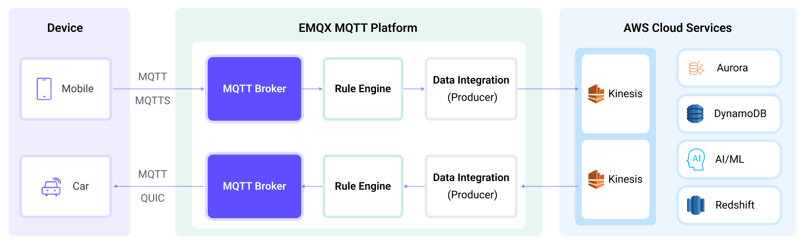

# 将 MQTT 数据传输到 Amazon Kinesis


::: tip
EMQX 企业版功能。EMQX 企业版可以为您带来更全面的关键业务场景覆盖、更丰富的数据集成支持，更高的生产级可靠性保证以及 24/7 的全球技术支持，欢迎[免费试用](https://www.emqx.com/zh/try?product=enterprise)。
:::


[AWS Kinesis](https://aws.amazon.com/cn/kinesis/) 是 AWS 上完全托管的实时流数据处理服务，可以轻松地进行流数据的收集、处理和分析。它可以经济高效地处理任意规模的实时流数据，并具有高度的灵活性，能够低时延的处理来自数十万个来源的任意数量的流数据。EMQX 支持与 [Amazon Kinesis Data Streams](https://aws.amazon.com/kinesis/data-streams/) 无缝集成，从而能够实现海量 IoT 设备连接，进行实时消息进行采集、传输，并通过 Sink 连接到 Amazon Kinesis Data Streams，进行实时数据分析与复杂的流处理。

本页详细介绍了 EMQX 与 Amazon Kinesis 的数据集成并提供了实用的规则和 Sink 创建指导。

## 工作原理

Amazon Kinesis 数据集成是 EMQX 的一个开箱即用功能，旨在帮助用户无缝集成 MQTT 数据流与 Amazon Kinesis，并利用其丰富的服务和能力进行物联网应用开发。



EMQX 通过规则引擎和 Sink 将 MQTT 数据转发到 Amazon Kinesis。完整的过程如下：

1. **物联网设备发布消息**：设备通过特定主题发布遥测和状态数据，触发规则引擎。
2. **规则引擎处理消息**：使用内置规则引擎，基于主题匹配处理来自特定来源的 MQTT 消息。规则引擎匹配相应的规则并处理消息，例如转换数据格式、过滤特定信息或用上下文信息丰富消息。
3. **桥接到 Amazon Kinesis**：规则触发将消息转发到 Amazon Kinesis 的动作，可以自定义配置分区键、要写入的数据流以及消息格式，实现灵活的数据集成。

在 MQTT 消息数据写入 Amazon Kinesis 之后，您可以进行灵活的应用开发，例如：

- 实时数据处理和分析：利用 Amazon Kinesis 强大的数据处理和分析工具及其自身的流处理能力，对消息数据进行实时处理和分析，获取有价值的洞察和决策支持。
- 事件驱动功能：触发 Amazon 事件处理，实现动态灵活的功能触发和处理。
- 数据存储和共享：将消息数据传输到 Amazon Kinesis 存储服务，安全存储和管理大量数据。这使您能够与其他 Amazon 服务共享和分析这些数据，以满足各种业务需求。

## 特性与优势

EMQX 与 AWS Kinesis Data Streams 的数据集成可以为您的业务带来以下功能和优势：

- **可靠的数据传输和顺序保证**：EMQX 和 AWS Kinesis Data Streams 都提供了可靠的数据传输机制，EMQX 通过 MQTT 协议确保消息的可靠传输，而 AWS Kinesis Data Streams 使用分区和顺序号来保证消息的顺序性。两者结合可以确保设备发送的消息准确无误地到达目的地，并按照正确的顺序进行处理。
- **实时数据处理**：设备的高频数据能够经过 EMQX 规则 SQL 进行初步的实时处理，可以毫不费力地过滤、提取、丰富和转换 MQTT 消息。将数据发送到 AWS Kinesis Data Streams 后，可以进一步结合 AWS Lambda、AWS 托管的 Apache Flink 实现运行实时分析。
- **弹性伸缩支持**：EMQX 能够轻松连接数百万台物联网设备，并提供了弹性伸缩能力，AWS Kinesis Data Streams 则采用按需模式的自动资源调配和扩展，两者构建的应用能够随连接和数据规模进行扩展，持续满足适配业务的增长需求。
- **持久化数据存储**：AWS Kinesis Data Streams 提供持久化的数据存储能力，能够可靠地保存每秒数百万流入的设备数据流，并在需要时随时回溯历史数据，并进行离线分析和处理。

利用 AWS Kinesis Data Streams 构建的流数据管道，可以大幅降低 EMQX 与 AWS 平台之间的接入难度，为用户提供更丰富、灵活的数据处理方案，助力 EMQX 用户在 AWS 上构建功能完备、性能卓越的数据驱动型应用。

## 准备工作

本节介绍了在 EMQX 中创建 Amazon Kinesis Sink 之前需要做的准备工作，包括如何创建 Kinesis 数据流并在本地模拟数据流服务。

### 前置准备

- 了解[规则](./rules.md)。
- 了解[数据集成](./data-bridges.md)。

### 在 Amazon Kinesis Data Streams 中创建数据流

按照以下步骤通过 AWS 管理控制台创建数据流（详细信息请参阅[本教程](https://docs.aws.amazon.com/zh_cn/streams/latest/dev/how-do-i-create-a-stream.html)）。

1. 登录 AWS 管理控制台并打开 [Kinesis 控制台](https://console.aws.amazon.com/kinesis)。
2. 在导航栏中，展开区域选择器并选择一个区域。
3. 选择**创建数据流**。
4. 在**创建 Kinesis 流**页面，为您的数据流输入名称，然后选择**按需**容量模式。

### 在本地模拟 Amazon Kinesis Data Streams

为了便于开发和测试，您可以通过 [LocalStack](https://localstack.cloud/) 在本地模拟 Amazon Kinesis Data Streams 服务。有了 LocalStack，您可以在本地机器上运行 AWS 应用，无需连接到远程云提供商。

1. 安装 LocalStack 并使用 Docker Image 运行：

   ```bash
   # To start the LocalStack docker image locally
   docker run --name localstack -p '4566:4566' -e 'KINESIS_LATENCY=0' -d localstack/localstack:2.1
   
   # Access the container
   docker exec -it localstack bash
   ```

2. 创建一个只有一个分片的流，名称设为 **my_stream**：

   ```bash
   awslocal kinesis create-stream --stream-name "my_stream" --shard-count 1
   ```

## 创建连接器

在添加 Amazon Kinesis Sink 前，您需要创建连接器用于将 Sink 连接到 Amazone Kinesis Data Streams 服务。

1. 进入 EMQX Dashboard，点击**集成** -> **连接器**。

2. 点击页面右上角的**创建**。

3. 在**创建连接器**页面，点击选择 **Amazon Kinesis**，然后点击**下一步**。

4. 为连接器输入一个名称，名称应为大小写字母和数字的组合，此处我们输入 `my-kinesis`。

5. 配置连接信息。

   - **AWS 访问密钥 ID**：输入[访问密钥 ID](https://docs.aws.amazon.com/powershell/latest/userguide/pstools-appendix-sign-up.html)。如果使用 LocalStack，可输入任何值。
   - **AWS 秘密访问密钥**：输入[密钥](https://docs.aws.amazon.com/powershell/latest/userguide/pstools-appendix-sign-up.html)。如果使用 LocalStack，可输入任何值。
   - **Amazon Kinesis 端点**：输入 Kinesis 服务的[终端节点](https://docs.aws.amazon.com/zh_cn/general/latest/gr/ak.html)。如果使用 [LocalStack](#在本地模拟-amazon-kinesis-data-streams)，输入`http://localhost:4566`。

6. 在点击 **创建** 之前，您可以点击 **测试连接** 以测试连接器是否能连接到 Amazon Kinesis Data Streams 服务。

7. 点击底部的 **创建** 按钮完成连接器的创建。在弹出对话框中，您可以点击 **返回连接器列表** 或点击 **创建规则** 继续创建带有 Amazone Kinesis Sink 的规则，以指定要转发到 Amazon Kinesis 的数据。详细步骤请参见 [创建 Amazon Kinesis Sink 规则](#创建-amazone-kinesis-sink-规则)。

## 创建 Amazon Kinesis Sink 规则

本节演示了如何在 Dashboard 中创建一条规则以指定需要写入 Amazon Kinesis 的数据并为规则添加触发的动作。

1. 在 EMQX Dashboard 左侧导航栏中点击**集成** -> **规则 **。

2. 点击页面右上角的**创建**。

3. 输入规则 ID `my_rule`，在 **SQL 编辑器**中输入规则。例如将 `t/#` 主题的 MQTT 消息存储至 Amazon Kinesis Data Streams，需输入以下 SQL 语法：

   注意：如果您希望制定自己的 SQL 语法，需要确保规则选出的字段（`SELECT` 部分）包含所有 SQL 模板中用到的变量。

   ```sql
   SELECT
     *
   FROM
     "t/#"
   ```

   ::: tip

   如果您初次使用 SQL，可以点击 **SQL 示例** 和**启用调试**来学习和测试规则 SQL 的结果。

   :::

4. 点击右侧的**添加动作**按钮，为规则在被触发的情况下指定一个动作。在**动作类型**下拉框中选择 `Amazon Kinesis`，保持**动作**下拉框为默认的`创建动作`选项，您也可以选择一个之前已经创建好的 Amazon Kinesis Sink。此处我们创建一个全新的 Sink 并添加到规则中。

5. 输入 Sink 名称，名称应为大/小写字母和数字的组合。

6. 在**连接器**下拉框中选择刚刚创建的 `my-kinesis` 连接器。您也可以点击下拉框旁边的创建按钮，在弹出框中快捷创建新的连接器，所需的配置参数按照参照[创建连接器](#创建连接器)。

7. 为 Sink 配置以下信息：

   - **AWS Kinesis 流**：输入您[在 Amazon Kinesis Data Streams 中创建数据流](#在-amazon-kinesis-data-streams-中创建数据流)中创建的数据流名称。
   - **分区键**：输入将与发送到此数据流的记录关联的分区键。允许使用 `${variable_name}` 形式的占位符（查看下一步以了解占位符示例）。

8. 在 **Payload Template** 字段中，将其留空或定义模板。

   - 如果留空，它将使用 JSON 格式编码 MQTT 消息中的所有可见输入，例如 clientid、topic、payload 等。
   - 如果使用定义的模板，`${variable_name}` 形式的占位符将使用 MQTT 上下文中的相应值进行填充。例如，如果 MQTT 消息主题是 `my/topic`，`${topic}` 将被替换为 `my/topic`。

9. 高级配置（可选），根据情况配置队列与批量等参数，详细请参考[ Sink 的特性](./data-bridges.md#sink-的特性)中的配置参数。

10. 在点击**创建**之前，您可以点击**测试连接**以测试 Sink 是否能连接到 Amazon Kinesis Data Stream 服务。

11. 点击**创建**按钮完成 Sink 创建，新建的 Sink 将被添加到**动作输出**列表中。

12. 回到创建规则页面，对配置的信息进行确认，点击**创建**。一条规则应该出现在规则列表中。

现在您已成功创建了通过 Amazon Kinesis Sink 将数据转发到 Amazon Kinesis Data Streams 的规则，同时在**规则**页面的**动作(Sink)** 标签页看到新建的 Amazon Kinesis Sink。

您还可以点击 **集成** -> **Flow 设计器**查看拓扑，通过拓扑可以直观的看到，主题 `t/#` 下的消息在经过名为 `my_rule` 的规则处理，处理结果交由 Amazon Kinesis Data Streams 存储。

## 测试桥接和规则

1. 使用 MQTTX 向 `t/my_topic` 主题发布一条消息：

   ```bash
   mqttx pub -i emqx_c -t t/my_topic -m '{ "msg": "hello Amazon Kinesis" }'
   ```

2. 查看 Amazon Kinesis 的 Sink 中的运行统计，命中、发送成功次数均 +1。

3. 转到 [Amazon Kinesis 数据查看器](https://docs.aws.amazon.com/zh_cn/streams/latest/dev/data-viewer.html)。您应该可以看到数据流指定分片内的数据记录。

### 使用 LocalStack 查看数据

如果您使用 LocalStack，通过以下步骤查看接收到的数据。

1. 在发送数据到 EMQX 之前，使用以下命令获取 *ShardIterator*：

   ```bash
   awslocal kinesis get-shard-iterator --stream-name my_stream --shard-id shardId-000000000000 --shard-iterator-type LATEST
   {
   "ShardIterator": "AAAAAAAAAAG3YjBK9sp0uSIFGTPIYBI17bJ1RsqX4uJmRllBAZmFRnjq1kPLrgcyn7RVigmH+WsGciWpImxjXYLJhmqI2QO/DrlLfp6d1IyJFixg1s+MhtKoM6IOH0Tb2CPW9NwPYoT809x03n1zL8HbkXg7hpZjWXPmsEvkXjn4UCBf5dBerq7NLKS3RtAmOiXVN6skPpk="
   }
   ```

2. 使用 MQTTX 向 `t/my_topic` 主题发布一条消息：

   ```
   mqttx pub -i emqx_c -t t/my_topic -m '{ "msg": "hello Amazon Kinesis" }'
   ```

3. 查看数据记录并解码接收到的数据：

   ```bash
   awslocal kinesis get-records --shard-iterator="AAAAAAAAAAG3YjBK9sp0uSIFGTPIYBI17bJ1RsqX4uJmRllBAZmFRnjq1kPLrgcyn7RVigmH+WsGciWpImxjXYLJhmqI2QO/DrlLfp6d1IyJFixg1s+MhtKoM6IOH0Tb2CPW9NwPYoT809x03n1zL8HbkXg7hpZjWXPmsEvkXjn4UCBf5dBerq7NLKS3RtAmOiXVN6skPpk="
   {
       "Records": [
           {
               "SequenceNumber": "49642650476690467334495639799144299020426020544120356866",
               "ApproximateArrivalTimestamp": 1689389148.261,
               "Data": "eyAibXNnIjogImhlbGxvIEFtYXpvbiBLaW5lc2lzIiB9",
               "PartitionKey": "key",
               "EncryptionType": "NONE"
           }
       ],
       "NextShardIterator": "AAAAAAAAAAFj5M3+6XUECflJAlkoSNHV/LBciTYY9If2z1iP+egC/PtdVI2t1HCf3L0S6efAxb01UtvI+3ZSh6BO02+L0BxP5ssB6ONBPfFgqvUIjbfu0GOmzUaPiHTqS8nNjoBtqk0fkYFDOiATdCCnMSqZDVqvARng5oiObgigmxq8InciH+xry2vce1dF9+RRFkKLBc0=",
       "MillisBehindLatest": 0
   }
   
   echo 'eyAibXNnIjogImhlbGxvIEFtYXpvbiBLaW5lc2lzIiB9' | base64 -d
   { "msg": "hello Amazon Kinesis" }
   ```