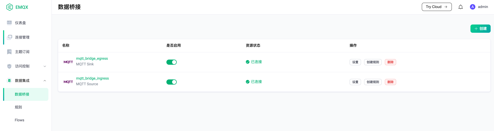
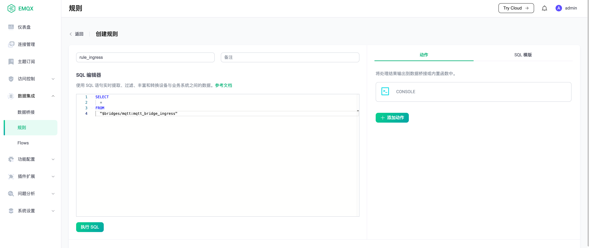
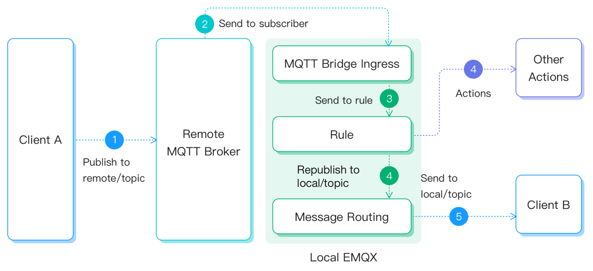
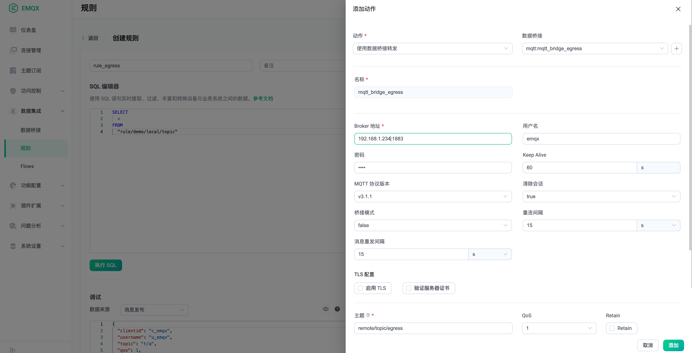
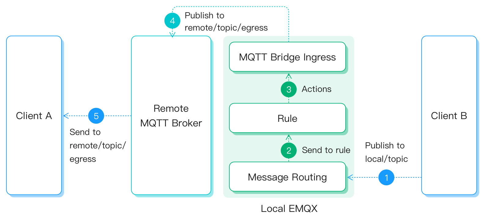

# MQTT Bridge

MQTT 桥接是 EMQX 与其他 MQTT 服务通讯的通道，既可以是 EMQX，也可以是支持 MQTT 协议的其他服务。MQTT 桥接既可以订阅外部服务的消息，也可以发布消息到外部服务。但仅支持单向的工作模式，只能成为生产者，或消费者。如果需要双向桥接，需要创建多个方向不同的 MQTT 桥接，来完成数据的双向流通。

## 使用配置文件创建 MQTT Bridge

### 进方向 MQTT Bridge 配置参数列表

从外部服务桥接消息到本地。

| 参数名 | 描述 | 类型 | 必填 | 取值范围 |
| -- | -- | -- | -- | -- |
| enable | 开启或关闭桥接 | Boolean |  是 | - |
| direction  | 桥接方向：</br>ingress 表示从外部服务订阅消息，发布到本地</br>egress 表示将消息从本地发布到外部服务 | String | 是 | ingress |
| remote_topic | 订阅外部服务的 Topic | String | 是 |  - |
| remote_qos | 订阅的外部服务 QoS | Integer |  是 | 0 \| 1 \| 2 |
| local_topic | 发布到本地的 Topic，支持 ${field} 格式的占位符 | String | 是 | - |
| local_qos | 发布到本地的 QoS，支持 ${field} 格式的占位符 | Integer |  是 | 0 \| 1 \| 2 |
| retain | 发布到本地的 Retain 标记，支持 ${field} 格式的占位符 | Boolean |  是 | - |
| payload | 发布到本地的 Payload，支持 ${field} 格式的占位符 | String |  是 | - |
| connector | MQTT 连接器 | connector() |  是 | Connecter 配置参数列表 |

### 出方向 MQTT Bridge 配置参数列表

将本地消息桥接至外部服务。

| 参数名 | 描述 | 类型 | 必填 | 取值范围 |
| -- | -- | -- | -- | -- |
| enable | 开启或关闭桥接 | Boolean |  是 | - |
| direction  | 桥接方向：</br>ingress 表示从外部服务订阅消息，发布到本地</br>egress 表示将消息从本地发布到外部服务 | String | 是 | egress |
| remote_topic | 发布到外部服务的 Topic，支持 ${field} 格式的占位符 | String | 是 |  - |
| remote_qos |  发布到外部服务 QoS，支持 ${field} 格式的占位符 | Integer |  是 | 0 \| 1 \| 2 |
| retain | 发布到外部服务的 Retain 标记，支持 ${field} 格式的占位符 | Boolean |  是 | - |
| payload | 发布到外部服务的 Payload，支持 ${field} 格式的占位符 | String |  是 | - |
| local_topic | 获取数据的本地 Topic | String | 是 | - |
| connector | MQTT 连接器 | connector() |  是 | 参考 Connecter 配置参数列表 |

### Connector 配置参数列表

桥接使用的连接器。

| 参数名 | 描述 | 类型 | 必填 | 取值范围 |
| -- | -- | -- | -- | -- |
| server | 外部服务地址，ip:port 或者 hostname:port | String | 是 | [0-255].[0-255].[0-255].[0-255]:[0-65535] |
| mode | cluster_shareload：集群里每个节点都建立一个 MQTT 连接与远程 Broker 相连</br>cluster_singleton：整个集群里只有一个节点建立 MQTT 连接与远程 Broker 相连 | Enum | 否 | cluster_shareload \| cluster_singleton |
| reconnect_interval | 自动重连间隔时间 | Integer | 否 | - |
| proto_ver | 协议版本 | String | 否 |  v3 \| v4 \| v5 |
| bridge_mode | 桥接模式，仅在外部服务为 EMQX 时生效，可以提高订阅的并发性能 | Boolean | 否 | - |
| username | 连接使用的用户名 | String | 否 | - |
| password | 连接使用的密码 | String | 否 | - |
| clean_start | 设置连接使用的 clean_session 属性 | Boolean | 否 | - |
| keepalive | 连接心跳周期 | Integer | 否 | - |
| retry_interval | QoS1/QoS2 消息发送失败后的重试间隔 | Integer | 否 | - |
| max_inflight | 最大消息窗口数量，在 MQTT V5 协议中为 `Receive Maximum` | Integer | 否 | - |
| ssl | 加密连接证书配置 | ssl() | 否 | - |

### SSL 配置

参考 [SSL](../configuration/configuration.md#tls-ssl-ciphers)

## 使用 Bridge

1. 准备两个 EMQX 节点，分别为 Local 节点和 Remote 节点，Local 节点使用本地 IP 127.0.0.1，Remote 节点使用 IP 192.168.1.234。
2. 编辑 Local 节点的配置，打开 `emqx.conf`，添加桥接配置。下面的配置示例中，创建了一个进方向的桥 `mqtt_bridge_ingress` 和一个出方向的桥 `mqtt_bridge_egress`
3. 启动两个 EMQX 节点，Local 节点使用 console 命令启动，因为规则集成演示中，需要使用控制台观察输出。

```js
bridges {
  mqtt {
    mqtt_bridge_ingress {
      connector {
        bridge_mode = false
        clean_start = true
        keepalive = "60s"
        max_inflight = 32
        mode = "cluster_shareload"
        password = "pwd1"
        proto_ver = "v4"
        reconnect_interval = "10s"
        retry_interval = "1s"
        server = "192.168.1.234:1883"
        ssl {enable = false}
        username = "user1"
      }
      direction = "ingress"
      enable = true
      local_topic = "local/topic/ingress"
      local_qos = 0
      remote_qos = 0
      remote_topic = "remote/topic/ingress"
      payload = "${payload}"
      retain = false
    }
    mqtt_bridge_egress {
      connector {
        bridge_mode = false
        clean_start = true
        keepalive = "60s"
        max_inflight = 32
        mode = "cluster_shareload"
        username = "emqx"
        password = "emqx"
        proto_ver = "v4"
        reconnect_interval = "15s"
        retry_interval = "15s"
        server = "192.168.1.234:1883"
        ssl { enable = false }
      }
      direction = "egress"
      enable = true
      local_topic = "local/topic/egress"
      remote_qos = 0
      remote_topic = "remote/topic/egress"
      payload = "${payload}"
      retain = false
    }
  }
}
```

打开 EMQX Dashboard ，点击右侧 `数据集成` - `数据桥接`， 可以看到创建出的两个桥接。


::: tip
注意 5.0.0 Dashboard 暂不支持脱离规则，单独使用 MQTT Bridge。仅可使用配置文件创建
:::

### 进方向的桥接消息流转

1. 进方向的桥接会在 Remote 节点上订阅 `remote/topic/ingress` 主题
2. 创建两个连接 Client A, Client B，分别连接 Remote 节点和 Local 节点
3. Client B 订阅 Topic `local/topic/ingress`
4. Client A 发布一条 Topic 为 `remote/topic/ingress` 的消息
5. 桥接客户端收到订阅消息，使用 Topic `local/topic/ingress`，将消息内容转发至 Local 节点
6. Client B 收到订阅消息


### 出方向的桥接消息流转

1. 客户端 A 订阅 Remote 节点上的 Topic `remote/topic/egress`
2. 客户端 B 在 Local 节点上发布一条 Topic 为 `local/topic/egress` 的消息
3. 桥接获取到消息数据，转发至 Remote 节点的 Topic `remote/topic/egress`
4. 客户端 A 收到桥接的消息


## 与规则配合使用

MQTT Bridge 既可以单独使用，也可以与规则配合使用，以获取更强大、更灵活的数据处理功能。

- 当桥接为进方向时，可以作为规则的数据源
- 当桥接为出方向时，可以作为规则的处理动作

### 进方向的 MQTT Bridge 与规则配合使用

1. 使用 console 命令启动 EMQX，为了更方便的观察规则的输出，我们会使用控制台输出作为规则消息的检查。

```bash
./bin/emqx console
```

2. 登录 EMQX Dashboard，点击右侧`数据集成` - `规则` - `创建`，编辑 SQL：

```SQL
SELECT
  *
FROM
  "$bridges/mqtt:mqtt_bridge_ingress"
```

点击左侧，`添加动作`，选择控制台输出。



3. Remote 节点上发布一条 Topic 为 `remote/topic/ingress` 的消息
4. 消息通过桥接，发送到 Local 节点的规则，并打印到控制台中

```erlang
[rule action] rule_egress
        Action Data: #{dup => false,
                       event => <<"$bridges/mqtt:mqtt_bridge_ingress">>,
                       id => <<"0005E40E4C3F8BE7F443000009580002">>,
                       message_received_at => 1658124943461,
                       metadata => #{rule_id => <<"rule_egress">>},
                       node => 'emqx@127.0.0.1',payload => <<"hello! rule">>,
                       pub_props => #{},qos => 0,retain => false,
                       server => <<"192.168.1.234:1883">>,
                       timestamp => 1658124943461,
                       topic => <<"remote/topic/ingress">>}
        Envs: #{dup => false,event => <<"$bridges/mqtt:mqtt_bridge_ingress">>,
                id => <<"0005E40E4C3F8BE7F443000009580002">>,
                message_received_at => 1658124943461,
                metadata => #{rule_id => <<"rule_egress">>},
                node => 'emqx@127.0.0.1',payload => <<"hello! rule">>,
                pub_props => #{},qos => 0,retain => false,
                server => <<"192.168.1.234:1883">>,
                timestamp => 1658124943461,
                topic => <<"remote/topic/ingress">>}
```



### 出方向的 MQTT Bridge 与规则配合使用

1. 创建规则。登录 EMQX Dashboard，点击右侧`数据集成` - `规则` - `创建`，编辑 SQL：

```SQL
SELECT
  *
FROM
  "rule/demo/local/topic"
```

点击左侧添加动作，选择`使用数据桥接转发`，下拉选择创建好的桥接 `mqtt:mqtt_bridge_egress`。
点击`添加`，`创建`。


2. Client B 在 Local 接点上发布一条 Topic 为 `rule/demo/local/topic` 的消息
3. 消息通过规则，发送到出方向的桥
4. 出方向的桥将消息转发到 Remote 节点
5. Client A 收到 Topic 为 `remote/topic/egress` 的消息


