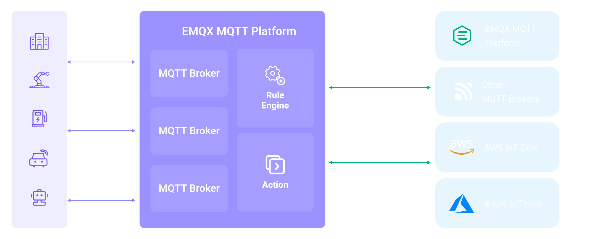

# 与其他 MQTT 服务桥接

MQTT 服务数据集成提供了一种连接到另一个 EMQX 集群或其它 MQTT 服务进行消息桥接的功能，能够用于实现跨网络、跨服务的数据交互和通信。本页提供了 EMQX 中 MQTT 消息桥接的工作原理介绍，以及如何创建和验证消息桥接的实际指导。

## 工作原理

在桥接时，EMQX 以客户端的身份与目标服务建立 MQTT 连接，通过发布订阅模式实现消息的双向传输：

- 消息流出（Sink）：将本地主题的消息发布到远程 MQTT 服务指定的主题。
- 消息流入（Source）：订阅远程 MQTT 服务的主题，并将其消息转发到 EMQX 本地。

EMQX 支持在同一个连接上配置多个桥接规则，每个规则都可以配置不同的主题映射和消息转换规则，实现类似消息路由的功能。在桥接过程中，您还可以通过规则引擎对消息进行处理，实现消息转发前的过滤、丰富和转换等操作。

下图展示了 EMQX 和 其他 MQTT 服务之间的数据集成的典型架构：



## 特性与优势

EMQX 的 MQTT 消息桥接具有以下特性和优势：

- **广泛的兼容性**：使用标准的 MQTT 协议，可以桥接到各类物联网平台，包括 AWS IoT Core、Azure IoT Hubs 等，同时也支持开源或其他行业 MQTT Broker 和物联网平台。这使得它可以与各种设备和平台进行无缝集成和通信。
- **双向数据流**：支持双向数据流，可以将 EMQX 本地的消息发布到远程 MQTT 服务，并且也可以从 MQTT 服务订阅消息并在本地发布。这种双向通信能力使得不同系统之间的数据传输更加灵活和可控。
- **灵活的主题映射**：基于 MQTT 发布订阅模式，实现了灵活的主题映射。桥接过程中支持为主题添加前缀，可以利用客户端的上下文信息（如客户端 ID、用户名等）动态构造主题。这种灵活性使得可以根据具体需求对消息进行定制化处理和路由。
- **高性能**：提供了性能优化选项，如连接池和共享订阅，以降低单个桥接客户端的负载压力，实现更低的桥接延迟和更高的桥接消息吞吐量。通过这些优化措施，可以提升整体系统的性能和可扩展性。
- **消息 payload 转换**：允许通过定义 SQL 规则对消息 payload 进行处理，在消息传输过程中，可以对 payload 进行数据提取、过滤、丰富和转换等操作。例如，可以从 payload 中提取实时指标，并在消息传递到其他 MQTT 服务之前进行数据转换和处理。
- **指标监控**：提供了详细的运行指标的监控，可以查看消息总数、成功/失败计数、当前速率等指标，帮助用户实时监控和评估 Sink/Source 的性能和健康状况。

## 准备 MQTT 服务连接信息

::: tip 前置准备

确保您已经了解以下内容：

- [规则引擎](./rules.md)
- [数据集成](./data-bridges.md)

:::

在创建 MQTT 消息桥接之前，您需要获取远程 MQTT 服务的连接信息，包括：

- **MQTT 服务地址**：目标 MQTT 服务的地址和端口，例如 `broker.emqx.io:1883`。
- **用户名**：进行连接所需的用户名，如果目标服务不需要认证，此项可留空。
- **密码**：进行连接所需的密码，如果目标服务不需要认证，此项也可留空。
- **协议类型**：需要明确目标服务是否启用了 TLS，以及是否使用的是 MQTT over TCP/TLS 协议。值得注意的是，EMQX MQTT 桥接暂时不支持 MQTT over WebSocket 和 MQTT over QUIC 类型的协议。
- **协议版本**：目标 MQTT 服务使用的协议版本，EMQX 支持 MQTT 3.1, 3.1.1 和 MQTT 5.0。

对于 EMQX 或者其他标准的 MQTT 服务器，桥接都能提供良好的兼容和支持。如果您需要连接的是其他类型的 MQTT 服务，你可以参考其相关文档来获取这些连接信息。一般来说，大多数的物联网平台都会提供标准的 MQTT 接入方式，你可以依据他们的指引将设备信息转化为以上所述的 MQTT 连接信息。

:::tip 提示
EMQX 运行在集群模式下或启用连接池时，多个节点使用相同的客户端 ID 连接到同一 MQTT 服务通常会导致设备互踢，因此 EMQX MQTT 桥接暂不支持设置固定的客户端 ID。
:::

## 创建连接器

本节将以 EMQX 的[在线 MQTT 服务器](https://www.emqx.com/zh/mqtt/public-mqtt5-broker)作为远程 MQTT 服务器，指导您如何配置与远程 MQTT 服务器的连接。

1. 转到 Dashboard **集成** -> **连接器**页面。

2. 点击页面右上角的**创建**。

3. 在**连接器类型**中选择 **MQTT 服务**，点击**下一步**。

4. 输入连接器 **名称**，要求是大小写英文字母或数字组合，例如 `my_mqtt_bridge`。

5. 填写连接相关配置：

   - **MQTT 服务地址**：仅支持 MQTT over TCP/TLS，此处设为 `broker.emqx.io:1883`。
   - **客户端 ID 前缀**：此处可以留空，实际使用中，指定客户端 ID 前缀可以便于客户端管理，EMQX 会根据客户端 ID 前缀和连接池大小自动生成客户端 ID。
   - **用户名**和**密码**：此处可以留空，该服务器不需要认证。

其他配置保持默认即可，点击**创建**按钮完成连接器创建。连接器能够同时用于 Sink 和 Source。接下来，您可以基于此连接器创建数据桥接规则。

### 连接池与客户端 ID 生成规则

EMQX 允许多个客户端同时连接到桥接的 MQTT 服务，在创建连接器时您可以设置一个 MQTT 客户端连接池，并配置连接池大小以表明连接池中的客户端连接数。连接池可以充分利用服务器资源，以实现更大的消息吞吐和更好的并发性能，这对于处理高负载、高并发的场景非常重要。

由于 MQTT 协议要求连接到一个 MQTT 服务器的客户端必须具有唯一的客户端 ID，且 EMQX 可能以集群方式部署，因此 MQTT 桥接的每个客户端都被分配了一个唯一的客户端 ID。EMQX 根据以下模式自动生成客户端 ID：

```bash
[客户端 ID 前缀]:{连接器名称}{8 位随机字符串}:{连接池中的连接序号}
```

例如当客户端 ID 前缀为 `myprefix`，连接器名称为 `foo`，实际的客户端 ID 可能是：

```bash
myprefix:foo2bd61c44:1
```

从 v5.4.1 版本开始，EMQX 将 MQTT 客户端 ID 的长度限制为 23 个字节，超过此长度将用哈希散列的内容替换客户端 ID。这对于前缀或连接器名称过长的情况，可能导致使用体验不佳。

为了改善这一情况，从 v5.7.1 版本开始，EMQX 应用了以下规则：

- **无前缀**：行为保持不变；EMQX 会将超过 23 字节的长客户端 ID 散列到 23 字节以内。
- **带前缀**：
  - **前缀不超过 19 个字节**：保留前缀，并将其余部分散列到 4 字节以内，总长度限制在 23 个字节。
  - **前缀为 20 个或更多字节**：EMQX 将完全使用配置的前缀，不再尝试缩短客户端 ID。

## 创建 MQTT 服务 Sink 规则

本节演示了如何创建一条规则来指定需要转发至远程 MQTT 服务的数据。

1. 转到 Dashboard **集成** -> **规则**页面。

2. 点击页面右上角的**创建**。

3. 输入规则 ID `my_rule`，在 SQL 编辑器中输入规则，此处选择将 `t/#` 主题的 MQTT 消息存储至远程 MQTT 服务器，规则 SQL 如下：

   ```sql
   SELECT
     *
   FROM
     "t/#"
   ```

4. 添加动作，从**动作类型**下拉列表中选择 `MQTT 服务`，保持动作下拉框为默认的`创建动作`选项，此处我们创建一个全新的 Sink 并添加到规则中。

5. 在下方的表单中输入 Sink 的名称与描述。

6. 在连接器下拉框中选择刚刚创建的 `my_mqtt_bridge` 连接器。您也可以点击下拉框旁边的创建按钮，在弹出框中快捷创建新的连接器，所需的配置参数按照参照[创建连接器](#创建连接器)。

7. 配置 Sink 信息，完成消息从 EMQX 到发布到外部 MQTT 服务的配置：

   - **主题**：发布到外部 MQTT 服务的主题，支持 `${var}` 格式的占位符。此处输入 `pub/${topic}`，表示在原主题的基础上添加 `pub/` 前缀进行转发。例如，当原始消息主题为 `t/1` 时，转发到外部 MQTT 服务的主题为 `pub/t/1`。
   - **QoS**：消息发布 QoS，下拉选择 `0` 、 `1` 、`2` 或 `${qos}`，也可以输入占位符从其他字段中设置 QoS，此处选择 `${qos}` 表示跟随原始消息的 QoS。
   - **Retain**：选择 `true` 、`false` 或 `${flags.retain}`，确认是否以保留消息方式发布消息，也可以输入占位符从其他字段中设置保留消息标志位。此处选择 `${flags.retain}` 表示跟随原始消息的保留消息标志位。
   - **消息模板**：用于生成转发消息 Payload 的模板，默认留空表示转发规则输出结果。此处可以输入 `${payload}` 表示仅转发 Payload。

8. 其他配置使用默认值，点击**创建**按钮完成 Sink 的创建，创建成功后将回到创建规则页面，新的 Sink 将添加到规则动作中。

9. 在规则创建页面，点击**创建**按钮完成整个规则创建。

现在您已成功创建了规则，你可以点击**集成** -> **规则**页面看到新建的规则，同时在**动作(Sink)** 标签页看到新建的 MQTT Sink。

您也可以点击 **集成** -> **Flow 设计器**查看拓扑，通过拓扑可以直观的看到，主题 `t/#` 下的消息在经过规则 my_rule 解析后被发布到远程 MQTT 服务中。

## 测试 MQTT 服务 Sink 规则

我们配置了将 EMQX `t/#` 的消息桥接到外部 MQTT 服务 `pub/${topic}` 主题中，因此当我们向 EMQX `t/1` 主题发布消息时，消息将被转发到外部 MQTT 服务的 `pub/t/1` 主题中。

使用 [MQTTX CLI](https://mqttx.app/zh/cli) 进行测试：

1. 订阅外部 MQTT 服务 `pub/#` 主题：

   ```bash
   mqttx sub -t pub/# -q 1 -h broker.emqx.io -v
   ```

2. 使用 MQTTX 向 `t/1` 主题发布消息：

   ```bash
   mqttx pub -t t/1 -m "hello world" -r
   ```

3. 您可以在 MQTTX 订阅到 `pub/t/1` 主题的消息，表示消息已经成功从 EMQX 转发到外部 MQTT 服务：

   ```bash
   [2024-1-31] [16:43:13] › topic: pub/t/1
   payload: hello world
   ```

4. 重复执行步骤 1 中的命令，此时您可以看到 MQTTX 订阅到来自 `pub/t/1` 主题的保留消息：

   ```bash
   [2024-1-31] [16:44:29] › topic: pub/t/1
   payload: hello world
   retain: true
   ```

## 创建 MQTT 服务 Source 规则

本节演示了如何创建一条规则将远程 MQTT 服务的数据转发至本地。您需要同时创建一个 MQTT Source 和一个消息重发布动作，实现消息从远程 MQTT 服务到 EMQX 的订阅，以及订阅数据的转发。

### 创建 MQTT 服务 Source 并添加到规则中

1. 转到 Dashboard **集成** -> **规则**页面。

2. 点击页面右上角的**创建**。

3. 输入规则 ID `my_rule_source`。

4. 配置规则的触发源（数据输入），点击页面右侧的**数据输入**页签，将默认的**消息**类型输入删除，点击**添加输入**按钮进行 MQTT Source 的创建。

5. 在**添加输入**弹出框中，**输入类型**下拉选择 `MQTT 服务`，保持 Source 下拉框为默认的`创建 Source`选项，此处我们创建一个全新的 Source 并添加到规则中。

6. 在下方的表单中输入 Source 的名称与描述。

7. 在连接器下拉框中选择刚刚创建的 `my_mqtt_bridge` 连接器。您也可以点击下拉框旁边的创建按钮，在弹出框中快捷创建新的连接器，所需的配置参数按照参照[创建连接器](#创建连接器)。

8. 配置 Source 信息，完成消息从外部 MQTT 服务订阅到 EMQX 的配置：

   - **主题**：消息订阅主题，支持使用 + 和 # 通配符。**当 EMQX 运行在集群模式下或连接器配置了连接池时，为了避免消息重复，必须使用共享订阅**。此处填写 `$queue/f/#`，表示订阅匹配 `f/#` 主题的所有消息。
   - **QoS**：订阅 QoS，下拉选择 `0` 或 `1`。

9. 其他配置使用默认值，点击**创建**按钮完成 Source 的创建，将 Source 添加到规则数据输入中。同时你可以看到规则 SQL 已经变为：

   ```sql
   SELECT
     *
   FROM
     "$bridges/mqtt:my_source"
   ```

   规则 SQL 可以从 MQTT Source 中获取以下字段，您可以调整 SQL 进行数据处理操作。此处使用默认 SQL 即可。

   | 字段名称                      | 描述                                                         |
   | ----------------------------- | ------------------------------------------------------------ |
   | topic                         | 来源消息主题                                                 |
   | server                        | Source 连接的服务器地址                                      |
   | retain                        | 是否保留消息，值为 false                                     |
   | qos                           | 消息服务质量                                                 |
   | pub_props                     | MQTT 5.0 消息属性对象，包含用户属性对、用户属性和其他属性    |
   | pub_props.User-Property-Pairs | 用户属性对数组，每个包含键值对，例如 `{"key":"foo", "value":"bar"}` |
   | pub_props.User-Property       | 用户属性对象，包含键值对，例如 `{"foo":"bar"}`               |
   | pub_props.\*                  | 其他包含的消息属性键值对，例如 `Content-Type: JSON`          |
   | payload                       | 消息内容                                                     |
   | message_received_at           | 消息接收时间戳，单位为毫秒                                   |
   | id                            | 消息 ID                                                      |
   | dup                           | 是否为重复消息                                               |


至此，您已经完成了 MQTT Source 的创建，但订阅到的数据并不会直接发布到 EMQX 本地。接下来将继续创建一个消息重发布动作，通过它将 Source 订阅到的消息转发到 EMQX 本地。

### 创建消息重发布动作

1. 配置规则动作，切换页面右侧页签到**动作输出**，点击**添加动作**按钮，从**动作类型**下拉列表中选择`消息重发布`动作。
2. 填写消息重发布配置：
   - **主题**：填写 `sub/${topic}`，表示在原主题的基础上添加 `sub/` 前缀进行转发。例如，当原始消息主题为 `f/1` 时，转发到 EMQX 的主题为 `sub/f/1`。
   - **QoS**：选择 `0`、 `1`、 `2`、或 `${qos}`，也可以输入占位符从其他字段中设置 QoS，此处选择 `${qos}` 表示跟随原始消息的 QoS。
   - **Retain**：选择 `true` 或 `false` 确认是否以保留消息方式发布消息，也可以输入占位符从其他字段中设置保留消息标志位，此处我们选择 `false`。
     - 由于数据来源是 MQTT Source，此处 `${flags.retain}` 选项并不适用。
     - 您也可以输入 `${retain}` 表示跟随原始消息的保留消息标志位，但它仅在消息是通过外部 MQTT 服务保留消息机制，而非原始消息发布到 EMQX 本地时才有效。
   - **消息模板**：用于生成转发消息 Payload 的模板，默认留空表示转发规则输出结果。此处可以输入 `${payload}` 表示仅转发 Payload。

3. 点击**创建**完成动作创建。创建成功后将回到创建规则页面，重发布动作将被添加到规则动作中。
4. 在规则创建页面，点击**创建**按钮完成整个规则创建。

现在您已成功创建了规则，你可以点击**集成** -> **规则**页面看到新建的规则，同时在 **Source** 标签页看到新建的 MQTT Source。

您也可以点击 **集成** -> **Flow 设计器**查看拓扑，通过拓扑可以直观的看到，来自 MQTT Source 的消息将通过消息重发布发布到 `sub/${topic}` 中。

## 测试 MQTT 服务 Source 规则

我们配置了将外部 MQTT 服务中 `f/#` 主题 的消息桥接到 EMQX `sub/${topic}` 主题中，因此当我们向外部 MQTT 服务 `f/1` 主题发布消息时，消息将被转发到 EMQX `sub/f/1` 主题中。

使用 [MQTTX CLI](https://mqttx.app/zh/cli) 进行测试：

1. 订阅 EMQX `sub/#` 主题：

   ```bash
   mqttx sub -t sub/# -q 1 -v
   ```

2. 使用 MQTTX 向外部 MQTT 服务的 `f/1` 主题发布消息：

   ```bash
   mqttx pub -t f/1 -m "I'm from broker.emqx.io" -r -h broker.emqx.io
   ```

3. 您可以在 MQTTX 订阅到 `sub/f/1` 主题的消息，表示消息已经成功从外部 MQTT 服务转发到 EMQX：

   ```bash
   [2024-1-31] [16:49:22] › topic: sub/f/1
   payload: I'm from broker.emqx.io
   ```

   
