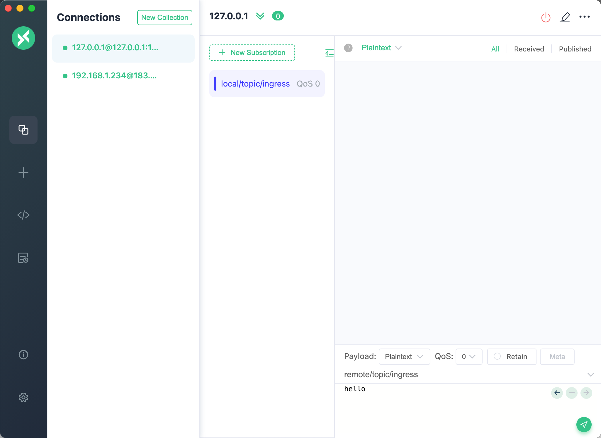
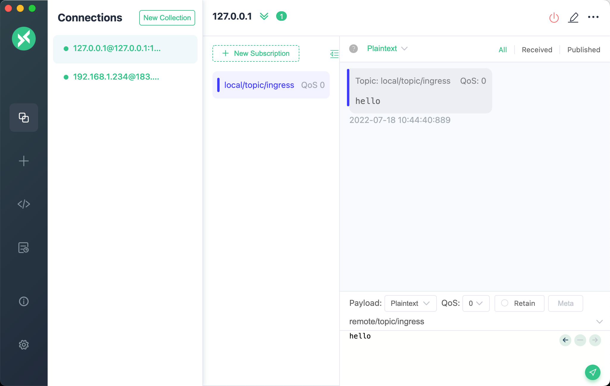
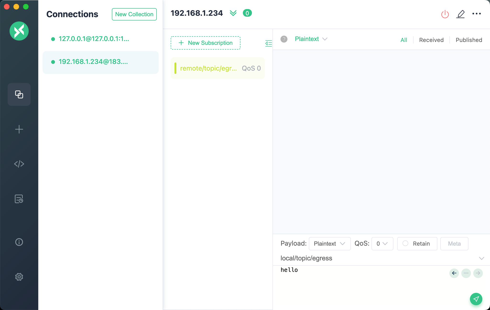
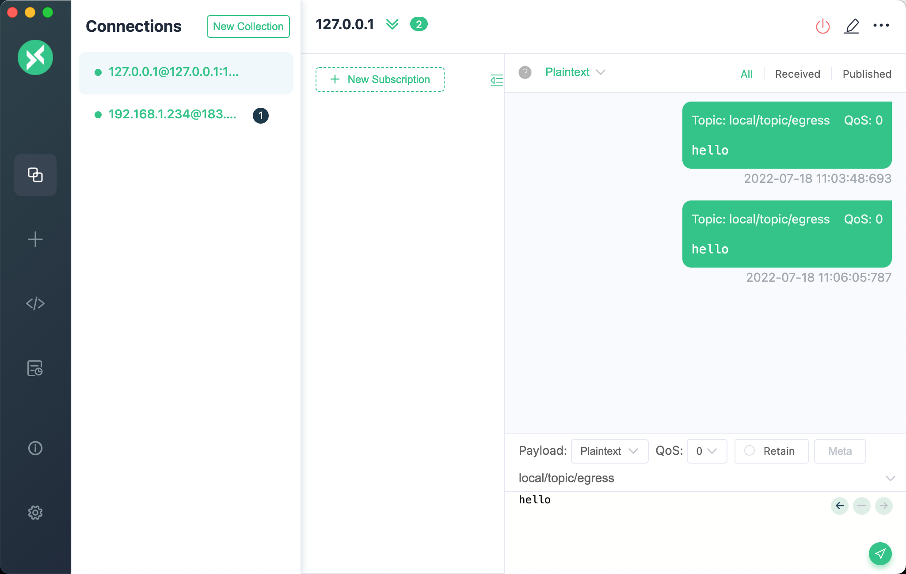
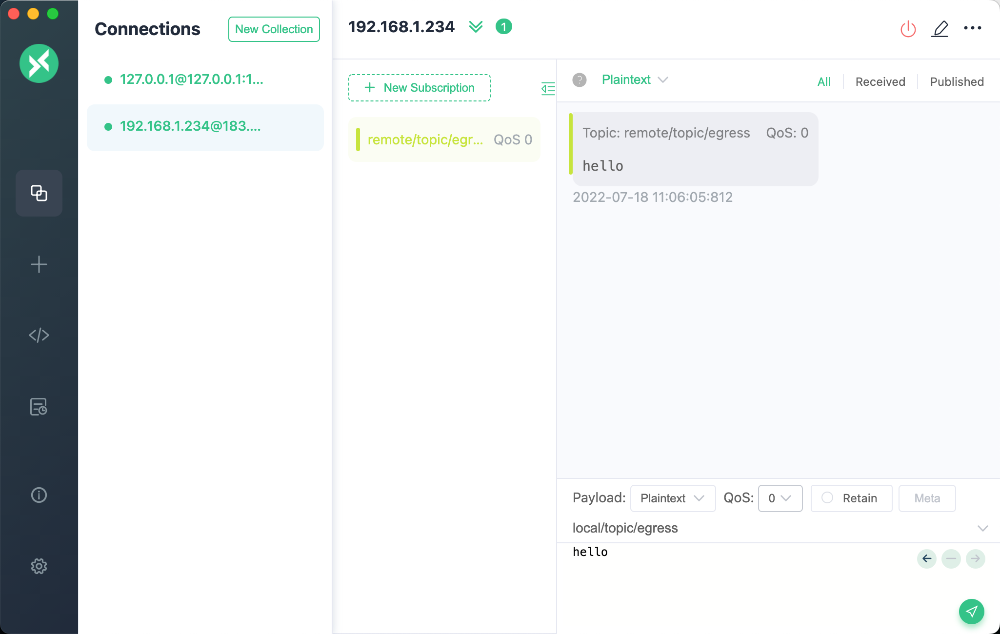
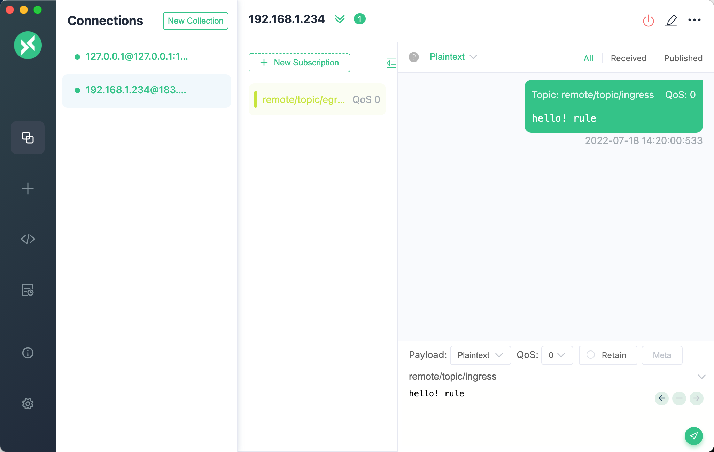
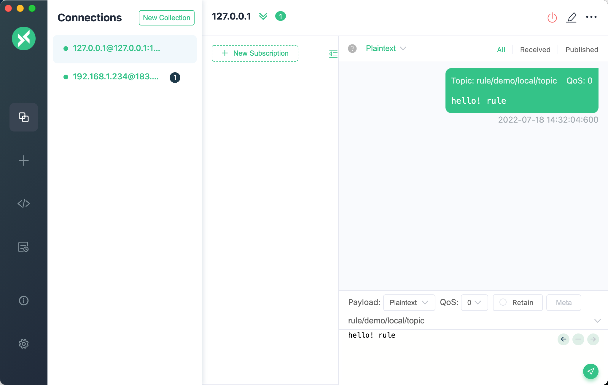

# MQTT Bridge

MQTT 桥接是 EMQX 与其他 MQTT 服务通讯的通道，既可以是 EMQX，也可以是支持 MQTT 协议的其他服务。MQTT 桥接既可以订阅外部服务的消息，也可以发布消息到外部服务。但仅支持单向的工作模式，只能成为生产者，或消费者。如果需要双向桥接，需要创建多个方向不同的 MQTT 桥接，来完成数据的双向流通。

## 使用配置文件创建 MQTT Bridge

### 进方向 MQTT Bridge 配置参数列表

从外部服务桥接消息到本地。

| 参数名 | 描述 | 类型 | 必填 | 取值范围 |
| -- | -- | -- | -- | -- |
| enable | 开启或关闭桥接 | Boolean |  是 | - |
| direction  | 桥接方向：</br>ingress 表示从外部服务订阅消息，发布到本地</br>egress 表示将消息从本地发布到外部服务 | String | 是 | ingress |
| remote_topic | 订阅外部服务的 Topic | String | 是 |  - |
| remote_qos | 订阅的外部服务 QoS | Integer |  是 | 0 \| 1 \| 2 |
| local_topic | 发布到本地的 Topic | String | 是 | - |
| local_qos | 发布到本地的 QoS | Integer |  是 | 0 \| 1 \| 2 |
| retain | 发布到本地的 Retain 标记 | Boolean |  是 | - |
| payload | 发布到本地的 Payload | String |  是 | - |
| connector | MQTT 连接器 | connector() |  是 | Connecter 配置参数列表 |

### 出方向 MQTT Bridge 配置参数列表

将本地消息桥接至外部服务。

| 参数名 | 描述 | 类型 | 必填 | 取值范围 |
| -- | -- | -- | -- | -- |
| enable | 开启或关闭桥接 | Boolean |  是 | - |
| direction  | 桥接方向：</br>ingress 表示从外部服务订阅消息，发布到本地</br>egress 表示将消息从本地发布到外部服务 | String | 是 | egress |
| remote_topic | 发布到外部服务的 Topic | String | 是 |  - |
| remote_qos |  发布到外部服务 QoS | Integer |  是 | 0 \| 1 \| 2 |
| retain | 发布到外部服务的 Retain 标记 | Boolean |  是 | - |
| payload | 发布到外部服务的 Payload | String |  是 | - |
| local_topic | 获取数据的本地 Topic | String | 是 | - |
| connector | MQTT 连接器 | connector() |  是 | 参考 Connecter 配置参数列表 |

### Connecter 配置参数列表

桥接使用的连接器。

| 参数名 | 描述 | 类型 | 必填 | 取值范围 |
| -- | -- | -- | -- | -- |
| server | 外部服务地址，ip:port | String | 是 | [0-255].[0-255].[0-255].[0-255]:[0-65535] |
| mode | 连接器模式 | String | 否 | cluster_shareload |
| reconnect_interval | 自动重连间隔时间 | Integer | 否 | - |
| proto_ver | 协议版本 | String | 否 |  v3 \| v4 \| v5 |
| bridge_mode | 桥接模式，仅在外部服务为 EMQX 时生效，可以提高订阅的并发性能 | Boolean | 否 | - |
| username | 连接使用的用户名 | String | 否 | - |
| password | 连接使用的密码 | String | 否 | - |
| clean_start | 设置连接使用的 clean_session 属性 | Boolean | 否 | - |
| keepalive | 连接心跳周期 | Integer | 否 | - |
| retry_interval | 重试间隔 | Integer | 否 | - |
| max_inflight | 最大消息窗口数量，在 MQTT V5 协议中为 `Receive Maximum` | Integer | 否 | - |
| replayq | 本地消息缓存 | replayq() | 否 | 参考 replayq 配置参数列表 |
| ssl | 加密连接证书配置 | ssl() | 否 | - |

### replayq 配置参数列表

| 参数名 | 描述 | 类型 | 必填 | 取值范围 |
| -- | -- | -- | -- | -- |
| dir | 本地缓存的文件目录，设置为 `false` 表示关闭 | String \| `false` | 否 | String \| false |
| seg_bytes | 本地缓存的文件大小限制，当超出限制后，会创建一个新的文件来保存新的缓存消息 | String | 否 | - |
| offload | 是否开启过载模式，开启后消息会先使用内存来保存，仅当缓存的数据超过 `seg_bytes` 设置的上线后，才会写入文件 | Boolean | 否 | - |

### SSL 配置

参考 [SSL](../security/ssl.md)

## 使用 Bridge

预先启动一个 EMQX 节点，作为消息桥接使用的外部服务，本文中使用的是在 IP 为 `192.168.1.234` 上部署的 EMQX 节点。下文中使用 `ingress` 与 `egress` 桥接演示，都是以此节点作为外部服务。本地服务的 IP 地址为 `127.0.0.1`。

编辑 `emqx.conf`，添加一个桥接配置，使用下面 `ingress` 与 `egress` 的配置示例，示例中创建了两个桥接，分别为 `mqtt_bridge_ingress` 与 `mqtt_bridge_egress`。启动本地 EMQX。

```js
bridges {
  mqtt {
    mqtt_bridge_ingress {
      connector {
        bridge_mode = false
        clean_start = true
        keepalive = "60s"
        max_inflight = 32
        mode = "cluster_shareload"
        password = "pwd1"
        proto_ver = "v4"
        reconnect_interval = "10s"
        replayq {offload = false, seg_bytes = "100MB"}
        retry_interval = "1s"
        server = "192.168.1.234:1883"
        ssl {
          ciphers = ["TLS_AES_256_GCM_SHA384", "TLS_AES_128_GCM_SHA256"]
          depth = 10
          enable = false
          reuse_sessions = true
          secure_renegotiate = true
          user_lookup_fun = "emqx_tls_psk:lookup"
          verify = "verify_none"
          versions = ["tlsv1.3", "tlsv1.2", "tlsv1.1", "tlsv1"]
        }
        username = "user1"
      }
      direction = "ingress"
      enable = true
      local_topic = "local/topic/ingress"
      local_qos = 0
      remote_qos = 0
      remote_topic = "remote/topic/ingress"
      payload = "${payload}"
      retain = false
    }
    mqtt_bridge_egress {
      connector {
        bridge_mode = false
        clean_start = true
        keepalive = "60s"
        max_inflight = 32
        mode = "cluster_shareload"
        password = "emqx"
        proto_ver = "v4"
        reconnect_interval = "15s"
        replayq {offload = false, seg_bytes = "100MB"}
        retry_interval = "15s"
        server = "192.168.1.234:1883"
        ssl {
          ciphers = ["TLS_AES_256_GCM_SHA384", "TLS_AES_128_GCM_SHA256"]
          depth = 10
          enable = false
          reuse_sessions = true
          secure_renegotiate = true
          user_lookup_fun = "emqx_tls_psk:lookup"
          verify = "verify_none"
          versions = ["tlsv1.3", "tlsv1.2", "tlsv1.1", "tlsv1"]
        }
        username = "emqx"
      }
      direction = "egress"
      enable = true
      local_topic = "local/topic/egress"
      remote_qos = 0
      remote_topic = "remote/topic/egress"
      payload = "${payload}"
      retain = false
    }
  }
}
```

打开 EMQX Dashboard ，点击右侧 `数据集成` - `数据桥接`， 可以看到创建出的两个桥接。


::: tip
注意 5.0.0 Dashboard 暂不支持脱离规则，单独使用 MQTT Bridge。仅可使用配置文件创建
:::

### `ingress` 桥接消息流转

```txt
 +-------------------------+
 | Remote                  |          +--------+
 | EMQX Broker             |<---------| Client |
 |                         |          +--------+
 +-------------------------+
             |
             |
             V
  +----------------------+
  |  MQTT Bridge Ingress |
  +----------------------+
             |
             V
  +------------------------+
  | Local                  |          +--------+
  | EMQX Broker            |--------->| Client |
  |                        |          +--------+
  +------------------------+

```

使用桌面 MQTT 客户端 MQTTX，创建两个连接，分别连接本地与外部服务。并在本地订阅 `local/topic/ingress`。



向外部服务发布一条消息，Topic 为 `remote/topic/ingress`。


查看本地连接，消息已经由 MQTT Bridge 桥接至本地。



### `egress` 桥接消息流转

```txt
 +-------------------------+
 | Remote                  |          +--------+
 | EMQX Broker             |--------->| Client |
 |                         |          +--------+
 +-------------------------+
             ^
             |
             |
  +----------------------+
  |  MQTT Bridge Ingress |
  +----------------------+
             ^
             |
  +------------------------+
  | Local                  |          +--------+
  | EMQX Broker            |<---------| Client |
  |                        |          +--------+
  +------------------------+

```

使用桌面 MQTT 客户端 MQTTX，创建两个连接，分别连接本地与外部服务。并在外部服务上订阅 `remote/topic/egress`。



向本地服务发布一条消息，使用的 Topic 为 `local/topic/egress`。



查看外部服务连接，消息已经由 MQTT Bridge 桥接至外部服务。



## 与规则配合使用

MQTT Bridge 既可以单独使用，也可以与规则配合使用，以获取更强大、更灵活的数据处理功能。

- 当桥接为进方向时，可以作为规则的数据源
- 当桥接为出方向时，可以作为规则的处理动作

```txt
 Egress & Rule                                  Ingress & Rule

 +-------------------------+    +--------+      +-------------------------+    +--------+
 | Remote                  |    |        |      | Remote                  |    |        |
 | EMQX Broker             |--->| Client |      | EMQX Broker             |<---| Client |
 |                         |    |        |      |                         |    |        |
 +-------------------------+    +--------+      +-------------------------+    +--------+
             ^                                                |
             |                                                |
             |                                                V
  +-----------------------+                      +-----------------------+
  |  MQTT Bridge Egress   |                      |  MQTT Bridge Ingress  |
  +-----------------------+                      +-----------------------+
             ^                                                |
             |                                                V
          Actions                                        Data source
             |                                                V
  +-----------------------+                      +-----------------------+
  |  Rule                 |                      |  Rule                 |----> Other Actions
  +-----------------------+                      +-----------------------+
             ^                                                |
             |                                                V
  +------------------------+    +--------+       +------------------------+    +--------+
  | Local                  |    |        |       | Local                  |    |        |
  | EMQX Broker            |<---| Client |       | EMQX Broker            |--->| Client |
  |                        |    |        |       |                        |    |        |
  +------------------------+    +--------+       +------------------------+    +--------+

```

### 进方向的 MQTT Bridge 与规则配合使用

使用 console 命令启动 EMQX，为了更方便的观察规则的输出，我们会使用控制台输出作为规则消息的检查。
启动 EMQX 的路径需要按照部署方式改变。

```bash
./bin/emqx console
```

登录 EMQX Dashboard，点击右侧`数据集成` - `规则` - `创建`，编辑 SQL：

```SQL
SELECT
  *
FROM
  "$bridges/mqtt:mqtt_bridge_ingress"
```

点击左侧，`添加动作`，选择控制台输出。


这时，我们在外部服务上发布一条 Topic 为 `remote/topic/ingress` 的消息。



观察 EMQX 控制台，可见规则已经消费到了桥接的数据。

```erlang
[rule action] rule_egress
        Action Data: #{dup => false,
                       event => <<"$bridges/mqtt:mqtt_bridge_ingress">>,
                       id => <<"0005E40E4C3F8BE7F443000009580002">>,
                       message_received_at => 1658124943461,
                       metadata => #{rule_id => <<"rule_egress">>},
                       node => 'emqx@127.0.0.1',payload => <<"hello! rule">>,
                       pub_props => #{},qos => 0,retain => false,
                       server => <<"192.168.1.234:1883">>,
                       timestamp => 1658124943461, 
                       topic => <<"remote/topic/ingress">>}
        Envs: #{dup => false,event => <<"$bridges/mqtt:mqtt_bridge_ingress">>,
                id => <<"0005E40E4C3F8BE7F443000009580002">>,
                message_received_at => 1658124943461,
                metadata => #{rule_id => <<"rule_egress">>},
                node => 'emqx@127.0.0.1',payload => <<"hello! rule">>,
                pub_props => #{},qos => 0,retain => false,
                server => <<"192.168.1.234:1883">>,
                timestamp => 1658124943461,
                topic => <<"remote/topic/ingress">>}
```

### 出方向的 MQTT Bridge 与规则配合使用

登录 EMQX Dashboard，点击右侧`数据集成` - `规则` - `创建`，编辑 SQL：

```SQL
SELECT
  *
FROM
  "rule/demo/local/topic"
```

点击左侧添加动作，选择`使用数据桥接转发`，下拉选择创建好的桥接 `mqtt:mqtt_bridge_egress`。
点击`添加`，`创建`。


使用桌面 MQTT 客户端 MQTTX 发布一条 Topic 为 `rule/demo/local/topic` 的消息。



桥接到外部服务的数据已经收到。


