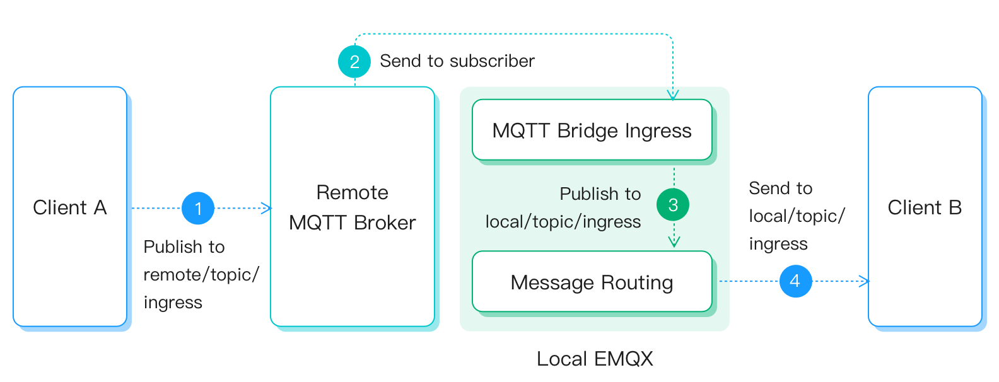
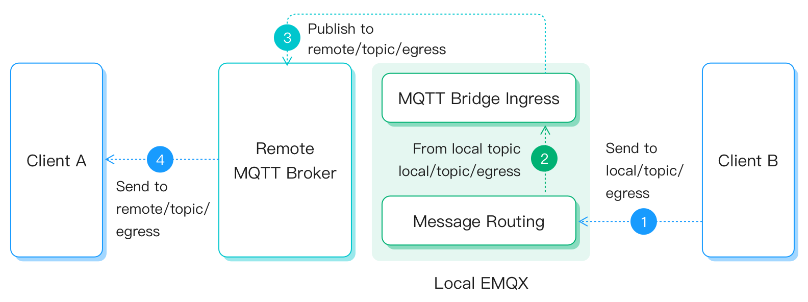

# MQTT

EMQX 支持通过 MQTT 连接多个 EMQX 集群或其他 MQTT 服务，其工作原理如下：

- 按照规则将当前集群的消息转发至桥接服务器；
- 从桥接服务器订阅主题，收到消息后在当前集群中转发该消息。

:::tip 前置准备

- 了解 [规则](./rules.md)。
- 了解 [数据桥接](./data-bridges.md)。

:::

## 功能清单

- [连接池](./data-bridges.md#连接池)
- [异步请求模式](./data-bridges.md#异步请求模式)
- [缓存队列](./data-bridges.md#缓存队列)

## 快速开始

下面将以 EMQX 的 [在线 MQTT 服务器](https://www.emqx.com/zh/mqtt/public-mqtt5-broker) 作为桥接服务器，指导您如何配置连接与桥接。

### 桥接规则

此处使用以下主题映射配置实现本地与远程 MQTT 服务之间的消息桥接：

| 消息主题                   | 方向                       | 目标主题                  |
| -------------------------- | -------------------------- | ------------------------- |
| **`remote/topic/ingress`** | **ingress** (远程 -> 本地) | **`local/topic/ingress`** |
| **`local/topic/egress`**   | **egress **(本地 -> 远程)  | **`remote/topic/egress`** |

**ingress 入口配置**



**egress 出口配置**



### 通过 Dashboard 配置

1. 转到 Dashboard **数据集成** -> **数据桥接**页面。

2. 点击页面右上角的**创建**。

3. 在**数据桥接类型**中选择 **MQTT**，点击**下一步**。

4. 输入数据桥接**名称**，要求是大小写英文字母或数字组合，例如  `my_mqtt_bridge`。

5. 输入 **MQTT 服务地址**： `broker.emqx.io:1883`，由于该服务器不需要认证，因此**用户名**、**密码**留空即可。

6. 对 **Keep Alive**、**MQTT 协议版本**、**清除会话**等字段，可保留默认设置，您也可根据实际场景设置。

7. **入口配置**（可选）：配置桥接规则，将远程 MQTT 服务上的消息转发到本地；我们希望订阅 `remote/topic/ingress ` 下的消息，并将收到的信息转发至 `local/topic/ingress` 主题，因此将进入如下配置：
   
   - **远程 MQTT 服务**：订阅主题以获取消息
      - **主题**：在集群工作模式下，我们将通过[共享订阅](../mqtt/mqtt-shared-subscription.md)来避免消息重复，因此填入 `$share/g/remote/topic/ingress`
      - QoS：选择 `0`。
   - **本地 MQTT 服务**：将订阅得到的消息发布到指定主题中，也可以留空，此时将通过规则处理后使用 [消息重发布](./rules.md#消息重发布) 动作转发。
      - **主题**：填入 `local/topic/ingress`。
      - **QoS**：选择 `0`，或 `${qos}` （跟随消息 QoS）。
      - **Retain**：通过勾选确认是否以保留消息方式发布消息。
      - **消息模版**：转发的消息 Payload 模板，支持使用 `${field}` 语法提取数据。
   
   :::tip
   入口配置与出口配置应至少配置其中一个。
   :::
   
8. **出口配置**（可选）：将本地指定 MQTT 主题下的消息发布到远程 MQTT 服务，可以理解为入口配置的反向数据流。我们希望将 `local/topic/egress` 主题下的消息转发到远程 MQTT 服务 `remote/topic/egress` 主题中，因此将进行如下配置：

   1. **本地 MQTT 服务**：指定待转发的消息主题。
      - **主题**：填入 `local/topic/egress` 
   2. **远程 MQTT 服务**：指定远端服务器的目标主题。
      - **主题**：填入 `remote/topic/egress`。
      - **QoS**：选择 `0`，或 `${qos}` （跟随消息 QoS）。
      - **Retain**：通过勾选确认是否以保留消息方式发布消息。
      - **消息模版**：转发的消息 Payload 模板，支持使用 `${field}` 语法提取数据。

9. 其他配置（可选），根据情况配置同步/异步模式，队列与批量等参数，详细请参考[配置参数](#配置参数)。

10. 点击**创建**按钮完成数据桥接创建。

以上操作对应配置文件如下：

```bash
bridges.mqtt.my_mqtt_bridge {
  enable = true
  server = "broker.emqx.io:1883"
  username = "emqx_u"
  password = "public"
  proto_ver = "v4"
  clean_start = true
  keepalive = "60s"

  reconnect_interval = "10s"
  egress {
    local {topic = "local/topic/egress"}
    remote {
      payload = "${payload}"
      qos = 1
      retain = true
      topic = "remote/topic/egress"
    }
  }
  ingress {
    local {
      topic = "$share/g/remote/topic/ingress"
      qos = 1
      payload = "${payload}"
    }
    remote {qos = 1, topic = "local/topic/ingress"}
  }
}
```

## 配合规则使用

此外，您也可配合规则使用 MQTT 数据桥接，实现更强大、更灵活的数据处理功能。

在 **ingress** 方向下，可以将远程 MQTT 服务订阅得到的消息作为规则的数据源：


在 **egress** 方向下，可以将规则处理结果作为消息，转发到远程 MQTT 服务的指定主题下：


