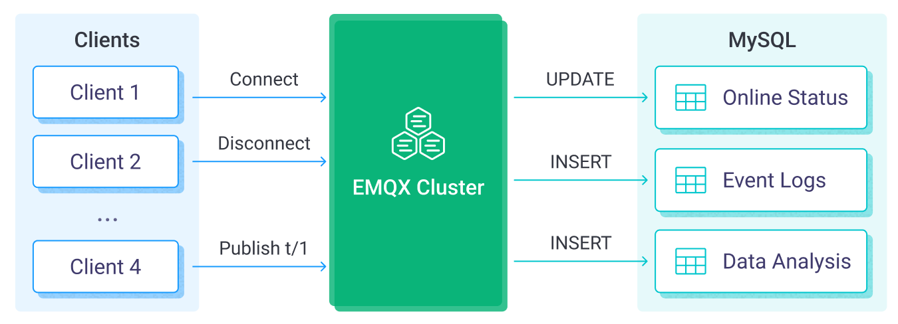
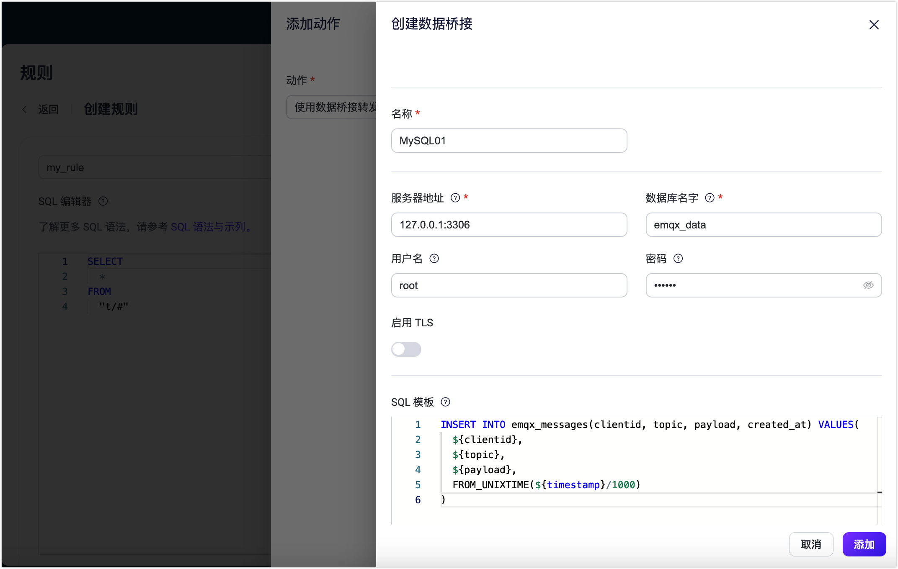

# MySQL


:::tip
EMQX 企业版功能。EMQX 企业版可以为您带来更全面的关键业务场景覆盖、更丰富的数据集成支持，更高的生产级可靠性保证以及 24/7 的全球技术支持，欢迎[免费试用](https://www.emqx.com/zh/try?product=enterprise)。
:::


[MySQL](https://www.mysql.com/) 是一个广泛使用的关系数据库，具备高度的可靠性和稳定性，能够快速安装和配置使用。MySQL 数据桥接能够将 MQTT 消息高效地存储至 MySQL 数据库中，同时也支持通过事件触发实时更新或删除 MySQL 中的数据。借助 MySQl 桥接，用户能够轻松实现消息存储、设备在线状态更新以及设备行为记录等功能，实现灵活的物联网数据存储与设备管理功能。

本页详细介绍了 EMQX 与 MySQL 的数据集成并提供了实用的规则和数据桥接创建指导。

## 工作原理

MySQL 数据桥接是 EMQX 中开箱即用的功能，通过简单的配置即可实现复杂的业务开发。在一个典型的物联网应用中，EMQX 作为物联网平台，负责接入设备，进行消息传输，MySQL 作为数据存储平台，负责设备状态与元数据的存储，以及消息数据存储和数据分析等。



EMQX 通过规则引擎与数据桥接将设备事件和数据转发至 MySQL，应用读取 MySQL 中数据即可感知设备状态，获取设备上下线记录，以及分析设备数据。其具体的工作流程如下：

- **设备连接到 EMQX**：物联网设备通过 MQTT 协议连接成功后将触发上线事件，事件包含设备 ID、来源 IP 地址以及其他属性等信息。
- **设备消息发布和接收**：设备通过特定的主题发布遥测和状态数据，EMQX 接收到消息后将在规则引擎中进行比对。
- **规则引擎处理消息**：通过内置的规则引擎，可以根据主题匹配处理特定来源的消息和事件。规则引擎会匹配对应的规则，并对消息和事件进行处理，例如转换数据格式、过滤掉特定信息或使用上下文信息丰富消息。
- **写入到 MySQL**：规则触发将消息写入到 MySQL 的操作。借助 SQL 模板，用户可以从规则处理结果中提取数据构造 SQL 发送给 MySQL 执行，实现将消息特定字段写入或更新到数据库对应表和列中。

事件和消息数据写入到 MySQL 后，您可以连接到 MySQL 读取数据，进行灵活的应用开发，例如：

- 连接到可视化工具，例如 Grafana，根据数据生成图表，展示数据变化。
- 连接到设备管理系统，查看设备列表与状态，并检测设备异常行为，及时排除潜在的问题。

## 特性与优势

在 EMQX 中使用 MySQL 数据桥接能够为您的业务带来以下特性与优势：

- **灵活的事件处理**：通过 EMQX 规则引擎，MySQL 可以处理设备全生命周期事件，极大的方便开发实现物联网应用所需的各类管理与监控业务。您可以通过通过分析事件数据，及时发现设备故障、异常行为或趋势变化，以便采取适当的措施。
- **消息转换**：消息可以写入 MySQL 之前，通过 EMQX 规则中进行丰富的处理和转换，方便后续的存储和使用。
- **灵活数据操作**：通过 MySQL 数据桥接提供的 SQL 模板，可以方便地将特定字段的数据写入或更新到 MySQL 数据库的对应表和列中，实现数据的灵活存储和管理。
- **整合业务流程**：通过 MySQL 数据桥接可以将设备数据与 MySQL 丰富的生态应用结合，方便的与例如 ERP 与 CRM 或其他自定义业务系统进行集成，以实现更高级的业务流程和自动化操作。
- **运行时指标**：支持查看每个数据桥接的运行时指标，例如消息总数、成功/失败计数、当前速率等。

通过灵活的事件处理、丰富的消息转换、灵活的数据操作以及实时监控与分析能力，您可以构建高效、可靠和可扩展的物联网应用，并在业务决策和优化方面受益。

## 桥接准备

本节介绍了在 EMQX 中创建 MySQL 数据桥接之前需要做的准备工作，包括安装 MySQL 和创建数据表。

### 前置准备

- 了解 [规则](./rules.md)。
- 了解 [数据桥接](./data-bridges.md)。

### 安装 MySQL

通过 Docker 安装并启动 MySQL：

```bash
# 启动一个 MySQL 容器并设置密码为 public
docker run --name mysql -p 3306:3306 -e MYSQL_ROOT_PASSWORD=public -d mysql

# 进入容器
docker exec -it mysql bash

# 在容器中连接到 MySQL 服务器，需要输入预设的密码
mysql -u root -p

# 创建并选择数据库
CREATE DATABASE emqx_data CHARACTER SET utf8mb4;
use emqx_data;
```

我们需要在 MySQL 中创建两张表：

数据表 `emqx_messages` 存储每条消息的发布者客户端 ID、主题、Payload 以及发布时间：

  ```sql
CREATE TABLE emqx_messages (
  id INT AUTO_INCREMENT PRIMARY KEY,
  clientid VARCHAR(255),
  topic VARCHAR(255),
  payload BLOB,
  created_at TIMESTAMP DEFAULT CURRENT_TIMESTAMP
);
  ```

数据表 `emqx_client_events` 存储上下线的客户端 ID、事件类型以及事件发生时间：

```sql
CREATE TABLE emqx_client_events (
  id INT AUTO_INCREMENT PRIMARY KEY,
  clientid VARCHAR(255),
  event VARCHAR(255),
  created_at TIMESTAMP DEFAULT CURRENT_TIMESTAMP
);
```

## 创建规则和 MySQL 数据桥接

您需要创建两个 MySQL 数据桥接分别完成消息存储与事件记录。以下章节分别演示了创建用于消息存储的数据桥接和创建用于事件记录的数据桥接。

### 消息存储

本节我们将创建第一个 MySQL 数据桥接来实现对客户端发布消息的存储。

1. 转到 Dashboard **数据集成** -> **规则**页面。

2. 点击页面右上角的**创建**。

3. 输入规则 ID `my_rule`，在 SQL 编辑器中输入规则，此处选择将 `t/#` 主题的 MQTT 消息存储至 MySQL，请确保规则选择出来的字段（SELECT 部分）包含所有 SQL 模板中用到的变量，此处规则 SQL 如下：

   ```sql
   SELECT 
     *
   FROM
     "t/#"
   ```

   ::: tip

   如果您初次使用 SQL，可以点击 **SQL 示例** 和**启用调试**来学习和测试规则 SQL 的结果。

   :::

4. 点击右侧的**添加动作**按钮，为规则在被触发的情况下指定一个动作。在**动作**下拉框中选择`使用数据桥接转发`，该动作会将经规则处理的数据转发到 MySQL。

5. 点击**数据桥接**下拉框右侧的**+**按钮创建数据桥接。在**数据桥接类型**下拉框中选择 `MySQL`。

6. 输入数据桥接名称，要求是大小写英文字母或数字组合。

7. 输入 MySQL 连接信息，**服务器地址**填写 `127.0.0.1:3306`，**数据库名字**填写 `emqx_data`，**用户名**为 `root`，**密码**为 `public`。

8. 配置 SQL 模板，使用如下 SQL 完成数据插入，此处为[预处理 SQL](./data-bridges.md#sql-预处理)，字段不应当包含引号，SQL 末尾不要带分号 `;`:

   ```sql
   INSERT INTO emqx_messages(clientid, topic, payload, created_at) VALUES(
     ${clientid},
     ${topic},
     ${payload},
     FROM_UNIXTIME(${timestamp}/1000)
   )
   ```

   

9. 展开**高级设置**，根据需要配置高级设置选项（可选），详细请参考[高级设置](#高级设置)。

10. 点击**添加**按钮完成数据桥接创建，此时会自动返回到**添加动作**页面，在**数据桥接**下拉框中选择您创建好的 MySQL 数据桥接，点击**添加**以完成动作添加。

11. 回到创建规则页面，对配置的信息进行确认，点击**创建**。一条规则应该出现在规则列表中，**状态**为**已连接**。

至此您已经完成整个创建过程，可以前往 **数据集成** -> **Flows** 页面查看拓扑图，此时应当看到 `t/#` 主题的消息经过名为 `my_rule` 的规则处理，处理结果交由 MySQL 进行存储。

### 设备上下线记录

除 SQL 模板与规则外，创建 MySQL 数据桥接实现对设备上下线的记录的操作步骤与[消息存储](#消息存储)章节完全相同。

您可以使用以下规则 SQL 创建规则：

```sql
SELECT
  *
FROM 
  "$events/client_connected", "$events/client_disconnected"
```

您可以使用以下 SQL 模版创建实现设备上下线记录的数据桥接，请注意字段不应当包含引号，SQL 末尾不要带分号 `;`:

```sql
INSERT INTO emqx_client_events(clientid, event, created_at) VALUES (
  ${clientid},
  ${event},
  FROM_UNIXTIME(${timestamp}/1000)
)
```

## 测试数据桥接与规则

使用 MQTTX 向 `t/1` 主题发布消息，此操作同时会触发上下线事件：

```bash
mqttx pub -i emqx_c -t t/1 -m '{ "msg": "hello MySQL" }'
```

分别查看两个数据桥接运行统计，命中、发送成功次数均 +1。

查看数据是否已经写入表中，`emqx_messages` 表：

```bash
mysql> select * from emqx_messages;
+----+----------+-------+--------------------------+---------------------+
| id | clientid | topic | payload                  | created_at          |
+----+----------+-------+--------------------------+---------------------+
|  1 | emqx_c   | t/1   | { "msg": "hello MySQL" } | 2022-12-09 08:44:07 |
+----+----------+-------+--------------------------+---------------------+
1 row in set (0.01 sec)
```

`emqx_client_events` 表：

```bash
mysql> select * from emqx_client_events;
+----+----------+---------------------+---------------------+
| id | clientid | event               | created_at          |
+----+----------+---------------------+---------------------+
|  1 | emqx_c   | client.connected    | 2022-12-09 08:44:07 |
|  2 | emqx_c   | client.disconnected | 2022-12-09 08:44:07 |
+----+----------+---------------------+---------------------+
2 rows in set (0.00 sec)
```

## 高级设置

本节将深入介绍可用于 MySQLDB 数据桥接的高级配置选项。在 Dashboard 中配置数据桥接时，您可以根据您的特定需求展开**高级设置**，调整以下参数。

| 字段名称             | 描述                                                         | 默认值   |
| -------------------- | ------------------------------------------------------------ | -------- |
| **连接池大小**       | 指定在与 MySQL 服务进行接口时，可以维护在连接池中的并发连接数。此选项有助于通过限制或增加 EMQX 与 MySQL 之间的活动连接数量来管理应用程序的可扩展性和性能。<br /> 注意：设置适当的连接池大小取决于诸多因素，如系统资源、网络延迟以及应用程序的具体工作负载等。过大的连接池大小可能导致资源耗尽，而过小的大小可能会限制吞吐量。 | `8`      |
| **启动超时时间**     | 确定 EMQX 数据桥接在回应资源创建请求之前等待自动启动的资源达到健康状态的最长时间间隔（以秒为单位）。此设置有助于确保数据桥接在验证连接的资源（例如 MySQL 中的数据库实例）完全运行并准备好处理数据事务之前不会执行操作。 | `5` 秒   |
| **缓存池大小**       | 指定缓冲区工作进程数量，这些工作进程将被分配用于管理 EMQX 与 MySQL 的出口 （egress）类型数据桥接中的数据流，它们负责在将数据发送到目标服务之前临时存储和处理数据。此设置对于优化性能并确保出口（egress）场景中的数据传输顺利进行尤为重要。对于仅处理入口 （ingress）数据流的桥接，此选项可设置为 `0`，因为不适用。 | `16`     |
| **请求超期**         | “请求 TTL”（生存时间）设置指定了请求在进入缓冲区后被视为有效的最长持续时间（以秒为单位）。此计时器从请求进入缓冲区时开始计时。如果请求在缓冲区内停留的时间超过了此 TTL 设置或者如果请求已发送但未能在 MySQL 中及时收到响应或确认，则将视为请求已过期。 | `45` 秒  |
| **健康检查间隔**     | 指定数据桥接对与 MySQL 的连接执行自动健康检查的时间间隔（以秒为单位）。 | `15` 秒  |
| **缓存队列最大长度** | 指定可以由 MySQL 数据桥接中的每个缓冲器工作进程缓冲的最大字节数。缓冲器工作进程在将数据发送到 MySQL 之前会临时存储数据，充当处理数据流的中介以更高效地处理数据流。根据系统性能和数据传输要求调整该值。 | `256` MB |
| **最大批量请求大小** | 指定可以在单个传输操作中从 EMQX 发送到 MySQL 的数据批处理的最大大小。通过调整此大小，您可以微调 EMQX 与 MySQL 之间数据传输的效率和性能。<br />如果将“最大批处理大小”设置为“1”，则数据记录将单独发送，而不会分组成批处理。 | `1`      |
| **请求模式**         | 允许您选择`同步`或`异步`请求模式，以根据不同要求优化消息传输。在异步模式下，写入到 MySQL 不会阻塞 MQTT 消息发布过程。但是，这可能导致客户在它们到达 MySQL 之前就收到了消息。 | `异步`   |
| **请求飞行队列窗口** | “飞行队列请求”是指已启动但尚未收到响应或确认的请求。此设置控制数据桥接与 MySQL 通信时可以同时存在的最大飞行队列请求数。<br/>当 **请求模式** 设置为 `异步` 时，“请求飞行队列窗口”参数变得特别重要。如果对于来自同一 MQTT 客户端的消息严格按顺序处理很重要，则应将此值设置为 `1`。 | `100`    |

## 更多内容

您可以通过以下链接查看更多关于 MySQL 集成的内容：

- [MQTT Performance Benchmark Testing: EMQX-MySQL Integration](https://www.emqx.com/en/blog/mqtt-performance-benchmark-testing-emqx-mysql-integration)

