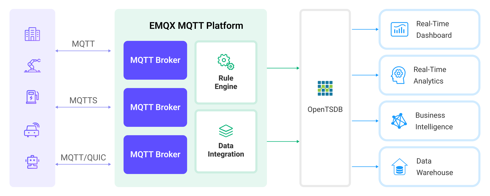

# 将 MQTT 数据写入到 OpenTSDB

::: tip

OpenTSDB 数据集成是 EMQX 企业版功能。

:::

[OpenTSDB](http://opentsdb.net/) 是一个可扩展的分布式时间序列数据库。EMQX 支持与 OpenTSDB 集成，因此可以将 MQTT 消息保存到 OpenTSDB 以便后续进行分析和检索。

本页详细介绍了 EMQX 与 OpenTSDB 的数据集成并提供了实用的规则和 Sink 创建指导。

## 工作原理

OpenTSDB 数据集成是 EMQX 的开箱即用功能，结合了 EMQX 的实时数据捕获和传输能力以及 OpenTSDB 的数据存储和分析功能。通过内置的[规则引擎](./rules.md)组件，集成简化了从 EMQX 到 OpenTSDB 的数据摄取过程，无需复杂编码。

下图展示了 EMQX 和 OpentsDB 之间的数据集成的典型架构：



EMQX 通过规则引擎和 Sink 将设备数据插入到 OpenTSDB。OpenTSDB 提供丰富的查询功能，支持生成报告、图表和其他数据分析结果。以工业能耗管理场景为例，工作流程如下：

1. **消息发布和接收**：工业设备通过 MQTT 协议成功连接到 EMQX，并定期使用 MQTT 协议发布能耗数据。这些数据包括生产线标识符和能耗值。当 EMQX 接收到这些消息时，它将在其规则引擎中启动匹配过程。
2. **规则引擎处理消息**：内置的规则引擎根据主题匹配处理来自特定来源的消息。当消息到达时，它通过规则引擎进行匹配，规则引擎将处理消息数据。这可能包括转换数据格式、过滤特定信息或用上下文信息丰富消息。
3. **数据写入到 OpenTSDB**：规则引擎中定义的规则触发操作将消息写入 OpenTSDB。

在数据写入 OpenTSDB 后，你可以灵活地使用数据，例如：

- 连接到如 Grafana 等可视化工具生成基于数据的图表，显示能源存储数据。
- 连接到业务系统以监控和警报能源存储设备的状态。

## 特性与优势

在 EMQX 中使用 OpenTSDB Sink 能够为您的业务带来以下特性与优势：

- **高效数据处理**：EMQX 能够处理大量物联网设备连接和消息吞吐量，而 OpenTSDB 在数据写入、存储和查询方面表现出色，提供出色的性能以满足物联网场景的数据处理需求，不会给系统带来过重负担。
- **消息转换**：消息可以在写入 OpenTSDB 之前通过 EMQX 规则进行广泛的处理和转换。
- **大规模数据存储**: 通过将 EMQX 与 OpenTSDB 集成，可以将海量设备数据直接存储到 OpenTSDB 中。OpenTSDB 是为存储和查询大规模时间序列数据而设计的数据库，能够高效地处理物联网设备产生的海量时间序列数据。
- **丰富的查询能力**: OpenTSDB 优化过存储结构和索引能够实现数十亿个数据点快速写入和查询，这对于需要对物联网设备数据进行实时监控、分析和可视化的应用场景非常有益。
- **可扩展性**：EMQX 和 OpenTSDB 均能够实现集群扩展，随着业务需求的增长允许灵活的水平扩展集群。

## 准备工作

本节介绍了在 EMQX 中创建 OpenTSDB 数据集成 之前需要做的准备工作，包括如何设置 OpenTSDB 服务器。

### 前置准备

- 了解 [规则](./rules.md)。
- 了解[数据集成](./data-bridges.md)。

### 安装 OpenTSDB

通过 Docker 安装并启动 OpenTSDB （目前仅支持 x86 平台）：

```bash
docker pull petergrace/opentsdb-docker

docker run -d --name opentsdb -p 4242:4242 petergrace/opentsdb-docker

```

## 创建连接器

在创建 OpenTSDB Sink 之前，您需要创建一个 OpenTSDB 连接器，以便 EMQX 与 OpenTSDB 服务建立连接。以下示例假定您在本地机器上同时运行 EMQX 和 OpenTSDB。如果您在远程运行 OpenTSDB 和 EMQX，请相应地调整设置。

1. 转到 Dashboard **集成** -> **连接器** 页面。点击页面右上角的**创建**。

2. 在连接器类型中选择 **OpenTSDB**，点击**下一步**。

3. 在 **配置** 步骤，配置以下信息：

   - 输入连接器名称，应为大写和小写字母及数字的组合，例如：`my_opentsdb`。
   - **服务器地址**填写 `http://127.0.0.1:4242`，如果您在远程运行 OpenTSDB 服务器，需填写实际地址。
   - 其他选项使用默认值即可。

4. 高级配置（可选），根据情况配置连接池等参数，详细请参考 [Sink 的特性](./data-bridges.md)。

5. 点击**创建**按钮完成连接器创建。

6. 在弹出的**创建成功**对话框中您可以点击**创建规则**，继续创建规则以指定需要写入 OpenTSDB 的数据。您也可以按照[创建 OpenTSDB Sink 规则](#创建-opentsdb-sink-规则)章节的步骤来创建规则。

## 创建 OpenTSDB Sink 规则

本节演示了如何在 Dashboard 中创建一条规则，用于处理来自源 MQTT 主题 `t/#` 的消息，并通过配置的 Sink 将处理后的结果写入到 OpenTSDB 中。

1. 转到 Dashboard **集成** -> **规则**页面。

2. 点击页面右上角的**创建**。

3. 输入规则 ID `my_rule`，在 **SQL 编辑器**中输入规则。例如将 `t/#` 主题的 MQTT 消息存储至 OpenTSDB，需输入以下 SQL 语法：

   注意：如果您希望制定自己的 SQL 语法，需要确保规则选出的字段（SELECT 部分）包含所有 SQL 模板中用到的变量。

   ```sql
   	SELECT
     		payload.metric as metric, payload.tags as tags, payload.value as value
   	FROM
     		"t/#"
   ```

   ::: tip

   如果您初次使用 SQL，可以点击 **SQL 示例** 和**启用调试**来学习和测试规则 SQL 的结果。

   :::

4. 点击右侧的**添加动作**按钮，为规则在被触发的情况下指定一个动作。通过这个动作，EMQX 会将经规则处理的数据发送到 OpenTSDB。

5. 在**动作类型**下拉框中选择 `OpenTSDB`，保持**动作**下拉框为默认的`创建动作`选项，您也可以选择一个之前已经创建好的 OpenTSDB Sink。此处我们创建一个全新的 Sink 并添加到规则中。

6. 输入 Sink 名称，要求是大小写英文字母和数字组合。

7. 从**连接器**下拉框中选择刚刚创建的 `my_opentsdb`。您也可以通过点击下拉框旁边的按钮创建一个新的连接器。有关配置参数，请参见[创建连接器](#创建连接器)。

8. 在**写入数据**字段中指定数据如何写入 OpenTSDB 以确保正确地将 MQTT 消息转换为 OpenTSDB 所需的格式。例如，客户端报告以下数据：

   - 主题：`t/opents`
   - Payload：

   ```json
   {
     "metric": "cpu",
     "tags": {
       "host": "serverA"
     },
     "value":12
   }
   ```

   根据提供的 Payload 数据格式，配置以下格式信息：

   - **时间戳**: OpenTSDB 需要一个时间戳来记录数据点的时间。如果 MQTT 消息中没有提供时间戳，您可以在 EMQX 中配置 Sink 时使用当前时间作为时间戳，或者你需要修改客户端上报的数据格式，包含一个时间戳字段。
   - **度量**: 在这个例子中，`"metric": "cpu"` 表示度量名称是 `cpu`。
   - **标签**: 标签用于描述度量的额外信息，这里的标签是 `"tags": {"host": "serverA"}`，表示这个度量数据来自于主机 `serverA`。
   - **值**: 这是实际的度量值，这个例子中是 `"value":12`，表示度量的值为 12。

9. 高级配置（可选），根据情况配置同步/异步模式，队列与批量等参数，详细请参考[ Sink 的特性](./data-bridges.md#sink-的特性)中的配置参数。

10. 在完成创建之前，您可以点击**测试连接**来测试 Sink 可以连接到 OpenTSDB 服务器。

11. 点击**创建**按钮完成 Sink 创建，新建的 Sink 将被添加到**动作输出**列表中。

12. 回到创建规则页面，对配置的信息进行确认，点击**创建**。一条规则应该出现在规则列表中。

现在您已成功创建了通过 OpenTSDB Sink 将数据转发到 OpenTSDB 的规则，同时在**规则**页面的**动作(Sink)** 标签页看到新建的 OpenTSDB Sink。

您还可以点击 **集成** -> **Flow 设计器**可以查看拓扑，通过拓扑可以直观的看到，主题 `t/#` 下的消息在经过规则 `my_rule` 解析后被发送到 OpenTSDB 中。

## 测试规则

使用 MQTTX 向 `t/opents` 主题发布一条消息:
```bash
mqttx pub -i emqx_c -t t/opents -m '{"metric":"cpu","tags":{"host":"serverA"},"value":12}'
```

查看 OpenTSDB 的 Sink 中的运行统计，命中、发送成功次数均 +1。

查看数据是否已经写入 OpenTSDB 中:

```bash
curl -X POST -H "Accept: Application/json" -H "Content-Type: application/json" http://localhost:4242/api/query -d '{
    "start": "1h-ago",
    "queries": [
        {
            "aggregator": "last",
            "metric": "cpu",
            "tags": {
                "host": "*"
            }
        }
    ],
    "showTSUIDs": "true",
    "showQuery": "true",
    "delete": "false"
}'
```

查询结果经格式化输出后如下：
```json
[
  {
    "metric": "cpu",
    "tags": {
      "host": "serverA"
    },
    "aggregateTags": [],
    "query": {
      "aggregator": "last",
      "metric": "cpu",
      "tsuids": null,
      "downsample": null,
      "rate": false,
      "filters": [
        {
          "tagk": "host",
          "filter": "*",
          "group_by": true,
          "type": "wildcard"
        }
      ],
      "percentiles": null,
      "index": 0,
      "rateOptions": null,
      "filterTagKs": [
        "AAAB"
      ],
      "explicitTags": false,
      "useFuzzyFilter": true,
      "preAggregate": false,
      "rollupUsage": null,
      "rollupTable": "raw",
      "showHistogramBuckets": false,
      "useMultiGets": true,
      "tags": {
        "host": "wildcard(*)"
      },
      "histogramQuery": false
    },
    "tsuids": [
      "000001000001000001"
    ],
    "dps": {
      "1683532519": 12
    }
  }
]% 
```