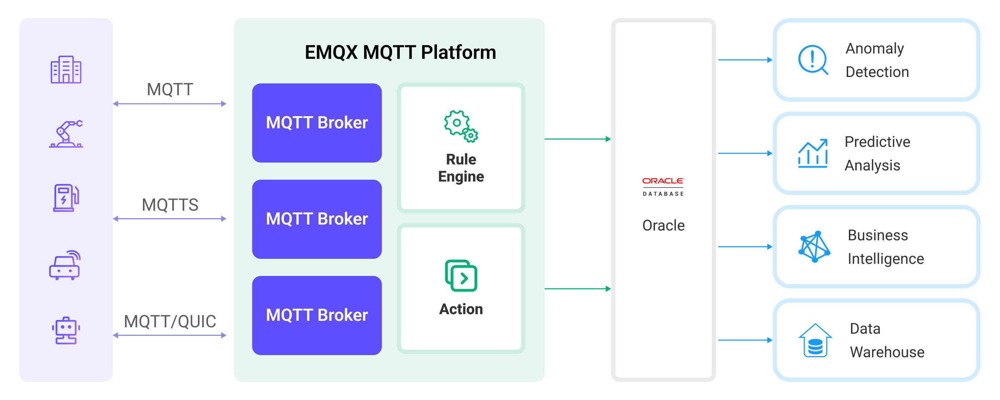

# 将 MQTT 数据写入到 Oracle Database


::: tip
EMQX 企业版功能。EMQX 企业版可以为您带来更全面的关键业务场景覆盖、更丰富的数据集成支持，更高的生产级可靠性保证以及 24/7 的全球技术支持，欢迎[免费试用](https://www.emqx.com/zh/try?product=enterprise)。
:::


[Oracle Database](https://www.oracle.com/database/) 是领先的关系型商业数据库解决方案之一，被广泛应用于各种规模和类型的企业和组织中。EMQX 支持与 Oracle Database 集成，因此您可以将 MQTT 消息和客户端事件保存到 Oracle Database 中， 构建复杂的数据管道和分析流程实现数据管理和分析，或进行设备连接管理并与其他 ERP, CRM 企业系统的集成。

本页详细介绍了 EMQX 与 Oracle Database 的数据集成并提供了实用的规则和数据桥接创建指导。

## 工作原理

Oracle Database 数据集成是 EMQX 中的开箱即用功能，结合了 EMQX 的设备接入、消息传输能力与 Oracle Database 强大的数据存储能力。通过内置的[规则引擎](./rules.md)组件，集成简化了从 EMQX 到 Oracle Database 的数据摄取过程，无需复杂的编码。

下图展示了 EMQX 和 Oracle Database 之间的数据集成的典型架构:



将 MQTT 数据摄取到 Oracle Database 的工作流程如下：

1. **消息发布和接收**：工业物联网设备通过 MQTT 协议成功连接到 EMQX，并根据其运行状态、读数或触发的事件，从机器、传感器和生产线发布实时 MQTT 数据到 EMQX。当 EMQX 接收到这些消息时，它将在其规则引擎中启动匹配过程。
2. **消息数据处理**：当消息到达时，它会通过规则引擎进行处理，然后由 EMQX 中定义的规则处理。规则根据预定义的标准确定哪些消息需要路由到 Oracle Database。如果任何规则指定了载荷转换，那么这些转换将被应用，例如转换数据格式、过滤出特定信息，或用额外的上下文丰富载荷。
3. **数据写入到 Oracle Database**：规则触发将消息写入 Oracle Database 的动作。借助 SQL 模板，用户可以从规则处理结果中提取数据来构造 SQL 并发送到 Oracle Database 执行，从而将消息的特定字段写入或更新到数据库的相应表和列中。
4. **数据存储和利用**：数据现存储在 Oracle Database 中，企业可以利用其查询能力应用于各种用例。例如，借助 Oracle 提供的高级分析和预测功能，用户能够从物联网数据中提取有价值的信息和见解。

## 特性与优势

与 Oracle Database 的数据集成提供了一系列特性和优势，确保了数据传输、存储和利用的高效性：

- **实时数据流**：EMQX 专为处理实时数据流而构建，确保了从源系统到 Oracle Database 的数据传输的高效性和可靠性。它使组织能够实时捕获和分析数据，非常适合需要立即洞察和行动的用例。
- **高性能和可扩展性**：EMQX 的集群和分布式架构能够处理日益增长的海量设备连接和消息传递。Oracle 提供了多种扩展和规模化的解决方案，包括数据分区、数据复制和冗余、集群和高可用性，为用户提供了灵活、可靠和高性能的数据库解决方案。
- **数据转换的灵活性**：EMQX 提供了强大的基于 SQL 的规则引擎，允许组织在将数据存储到 Oracle Database 之前进行预处理。它支持各种数据转换机制，如过滤、路由、聚合和丰富，使组织能够根据他们的需求塑造数据。
- **易于部署和管理**：EMQX 提供了用户友好的界面，用于配置数据源、预处理数据规则和 Oracle Database 存储设置。这简化了数据集成过程的设置和持续管理。
- **高级分析**：Oracle Database 强大的基于 SQL 的查询语言和对复杂分析功能的支持使用户能够从物联网数据中获得有价值的洞见，实现预测分析、异常检测等功能。

## 桥接准备

本节介绍了在 EMQX 中创建 MySQL 数据桥接之前需要做的准备工作，包括安装 Oracle Database 服务器并创建数据表。

### 前置准备

- 了解[规则](./rules.md)。
- 了解[数据集成](./data-bridges.md)。

### 安装 Oracle Database 服务器

通过 Docker 安装并启动 Oracle Database:

```bash
# 启动本地 Oracle Database 的 docker 镜像
docker run --name oracledb -p 1521:1521 -d oracleinanutshell/oracle-xe-11g:1.0.0

# 启动远程 Oracle Database 的 docker 镜像
docker run --name oracledb -p 1521:1521 -e ORACLE_ALLOW_REMOTE=true -d oracleinanutshell/oracle-xe-11g:1.0.0

# 出于性能考虑，您可能希望禁用磁盘异步IO:
docker run --name oracledb -p 1521:1521 -e ORACLE_DISABLE_ASYNCH_IO=true -d oracleinanutshell/oracle-xe-11g:1.0.0

# 进入容器
docker exec -it oracledb bash

# 连接到默认数据库 "XE"
# 用户名: "system"
# 密码: "oracle"
sqlplus
```

### 创建数据表

使用下面的 SQL 语句在 Oracle Database 中创建数据表 `t_mqtt_msgs`，该数据表用来存储每一条消息的消息 ID， 客户端 ID，主题， QoS， retain 标记， 消息 payload 和时间戳。

  ```sql
CREATE TABLE t_mqtt_msgs (
  msgid VARCHAR2(64),
  sender VARCHAR2(64),
  topic VARCHAR2(255),
  qos NUMBER(1),
  retain NUMBER(1),
  payload NCLOB,
  arrived TIMESTAMP
);
  ```

使用下面的 SQL 语句在 Oracle Database 中创建数据表 `t_emqx_client_events`，该数据表用来存储每一个事件的客户端 ID, 事件类型和创建时间。

  ```sql
CREATE TABLE t_emqx_client_events (
  clientid VARCHAR2(255),
  event VARCHAR2(255),
  created_at TIMESTAMP
);
  ```

## 创建 Oracle Database 数据桥接

本节演示了如何在 Dashboard 中创建 Oracle Database 数据桥接。以下示例假定 EMQX 与 Oracle Database 均在本地运行，如您在远程运行 EMQX 及 Oracle Database，请根据实际情况调整相应配置。

消息存储和事件记录需要设置不同的 SQL 模版，因此您需要分别创建两个不同的数据桥接。

1. 登陆 EMQX Dashboard，点击左侧目录菜单中的**数据集成** -> **数据桥接**。
2. 点击页面右上角的**创建**。
3. 在**数据桥接类型**中选择 **Oracle Database**，点击**下一步**。
4. 输入数据桥接名称，名称应为大/小写字母和数字的组合。
5. 输入以下连接信息：

   - **服务器地址**：输入 `127.0.0.1:1521`，如果 Oracle Database 服务器在远程运行，则需输入实际地址。
   - **数据库名字**: 输入 `XE`。
   - **Oracle Database SID**: Input `XE`。
   - **用户名**: 输入 `system`。
   - **密码**: 输入 `oracle`。

6. 根据业务实现配置 **SQL 模版**。

   注意：此处为[预处理 SQL](./data-bridges.md#sql-预处理)，字段不应当包含引号，SQL 末尾不要带分号 `;` 。

   - 想要为消息存储创建数据桥接，使用下面的 SQL 语句：

     ```sql
     INSERT INTO t_mqtt_msgs(msgid, sender, topic, qos, retain, payload, arrived) VALUES(
       ${id},
       ${clientid},
       ${topic},
       ${qos},
       ${flags.retain},
       ${payload},
       TO_TIMESTAMP('1970-01-01 00:00:00', 'YYYY-MM-DD HH24:MI:SS') + NUMTODSINTERVAL(${timestamp}/1000, 'SECOND')
     )
     ```

   - 想要为上下线状态记录创建数据桥接，使用下面的 SQL 语句：

     ```sql
     INSERT INTO t_emqx_client_events(clientid, event, created_at) VALUES (
       ${clientid},
       ${event},
       TO_TIMESTAMP('1970-01-01 00:00:00', 'YYYY-MM-DD HH24:MI:SS') + NUMTODSINTERVAL(${timestamp}/1000, 'SECOND')
     )
     ```

7. 其余选项均设为默认值。

8. 在完成创建之前，您可以点击**测试连接**来测试桥接可以连接到 Oracle Database 服务器。

9. 点击**创建**按钮完成数据桥接创建。

   在弹出的**创建成功**对话框中您可以点击**创建规则**，继续创建规则以指定需要写入 Oracle Database 的数据。详细步骤参考[创建 Oracle Database 数据桥接规则](#创建-oracle-database-数据桥接规则)。

至此，您已经完成数据桥接的创建，在 Dashboard 的数据桥接页面，可以看到 Oracle Database 数据桥接的状态为**已连接**。

## 创建 Oracle Database 数据桥接规则

在成功创建 Oracle Database 数据桥接之后，您需要继续为消息存储和设备上下线记录创建两条不同的转发规则。

1. 转到 Dashboard **数据集成** -> **规则**页面。

2. 点击页面右上角的**创建**。

3. 输入规则 ID `my_rule`，在 **SQL 编辑器**中根据业务实现需要输入规则：

   - 如需实现对指定主题消息的转发，例如将 `t/#` 主题的 MQTT 消息转发至 Oracle Database，输入以下 SQL 语法：

     注意：如果您希望制定自己的 SQL 语法，需要确保规则选出的字段（SELECT 部分）包含所有 SQL 模板中用到的变量。

     ```sql
     SELECT
       *
     FROM
       "t/#"
     ```

   - 如需实现设备上下线记录，输入以下 SQL 语法：

     ```sql
     SELECT
       *
     FROM
       "$events/client_connected", "$events/client_disconnected"
     ```

4. 点击**添加动作**，在动作下拉框中选择**使用数据桥接转发**选项，选择先前创建好的 Oracle Database 数据桥接。点击**添加**。
5. 点击**创建**按钮完成规则创建。

至此您已经完成整个创建过程，可以前往 **数据集成** -> **Flows** 页面查看拓扑图，此时应当看到 `t/#` 主题的消息经过名为 `my_rule` 的规则处理，处理结果转发至 Oracle Database。

## 测试桥接和规则

使用 MQTTX 向 `t/1` 主题发布消息，此操作同时会触发上下线事件：

```bash
mqttx pub -i emqx_c -t t/1 -m '{ "msg": "hello Oracle Database" }'
```

分别查看两个数据桥接运行统计，命中、发送成功次数均 +1。

查看数据是否被写入 `t_mqtt_msgs` 数据表。

```sql
SELECT * FROM t_mqtt_msgs;

MSGID                            SENDER TOPIC QOS RETAIN PAYLOAD                            ARRIVED
-------------------------------- ------ ----- --- ------ ---------------------------------- ----------------------------
0005FA6CE9EF9F24F442000048100002 emqx_c t/1   0   0      { "msg": "hello Oracle Database" } 28-APR-23 08.22.51.760000 AM

```

查看数据是否被写入 `t_emqx_client_events` 数据表。

```sql
SELECT * FROM t_emqx_client_events;

CLIENTID EVENT               CREATED_AT
-------- ------------------- ----------------------------
emqx_c   client.connected    28-APR-23 08.22.51.757000 AM
emqx_c   client.disconnected 28-APR-23 08.22.51.760000 AM
```
