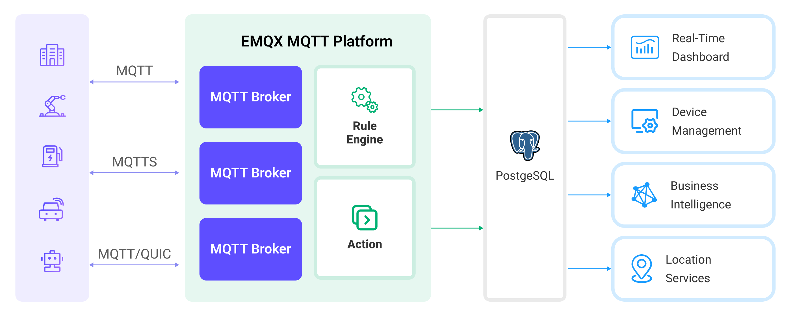

# 将 MQTT 数据写入到 PostgreSQL


:::tip
EMQX 企业版功能。EMQX 企业版可以为您带来更全面的关键业务场景覆盖、更丰富的数据集成支持，更高的生产级可靠性保证以及 24/7 的全球技术支持，欢迎[免费试用](https://www.emqx.com/zh/try?product=enterprise)。
:::


[PostgreSQL](https://www.postgresql.org/) 是世界上最先进的开源关系数据库，拥有强大的数据处理能力，适用于从简单的应用程序到复杂的数据处理任务。EMQX 支持与 PostgreSQL 集成，使其能够高效地处理来自物联网设备的实时数据流，能够在保证数据完整性的同时，支持大规模的数据存储、精准查询和复杂的数据关联分析。通过 EMQX 的高效消息路由和 PostgreSQL 的灵活数据模型，可以轻松实现设备状态的监控、事件的追踪以及操作的审核，为企业提供深入的数据洞见和强大的业务智能支持。

本页面提供了 EMQX 与 PostgreSQL 数据集成的全面介绍，并提供了创建规则和 Sink 的实用指导。

:::tip
本页内容同样适用于 MatrixDB。
:::

## 工作原理

PostgreSQL 数据集成是 EMQX 的开箱即用功能，结合了 EMQX 的设备接入、消息传输能力和 PostgreSQL 强大的数据存储能力。通过内置的[规则引擎](./rules.md)组件，该集成简化了从 EMQX 到 PostgreSQL 的数据摄取过程，用于存储和管理数据，无需复杂编码。通过 PostgreSQL Sink 可以将 MQTT 消息和客户端事件存储到 PostgreSQL 中，也可以通过事件触发对 PostgreSQL 中数据的更新或删除操作，从而实现对诸如设备在线状态、上下线历史等的记录。

下图展示了 EMQX 和 PostgreSQL 之间的数据集成的典型架构:



将 MQTT 数据摄取到 PostgreSQL 的工作流程如下：

- **物联网设备连接到 EMQX**：物联网设备通过 MQTT 协议成功连接后，将触发在线事件。事件包括设备 ID、源 IP 地址和其他属性等信息。
- **消息发布和接收**：设备向特定主题发布遥测和状态数据。当 EMQX 接收到这些消息时，它将在其规则引擎中启动匹配过程。
- **规则引擎处理消息**：借助内置规则引擎，可以根据主题匹配处理来自特定来源的消息和事件。规则引擎匹配相应规则并处理消息和事件，例如转换数据格式、过滤特定信息或使用上下文信息丰富消息。
- **消息写入 PostgreSQL**：规则触发将消息写入 PostgreSQL。借助 SQL 模板，用户可以从规则处理结果中提取数据来构造 SQL 并发送到 PostgreSQL 执行，从而将消息的特定字段写入或更新到数据库的相应表和列中。

在事件和消息数据写入 PostgreSQL 后，您可以连接到 PostgreSQL 读取数据，进行灵活的应用程序开发，例如：

- 连接到可视化工具，如 Grafana，根据数据生成图表并展示数据变化。
- 连接到设备管理系统，查看设备列表和状态，检测异常设备行为，并及时消除潜在问题。

## 特性与优势

PostgreSQL 是一款流行的开源关系型数据库，具备丰富的功能。与 PostgreSQL 的数据集成可以为您的业务带来以下特性和优势：

- **灵活的事件处理**：通过 EMQX 规则引擎，PostgreSQL 可以处理设备生命周期事件，极大地促进了物联网应用实施所需的各种管理和监控任务的开发。通过分析事件数据，您可以及时发现设备故障、异常行为或趋势变化，采取适当措施。
- **消息转换**：消息可以在写入 PostgreSQL 之前通过 EMQX 规则进行广泛的处理和转换，使存储和使用更加方便。
- **灵活的数据操作**：借助 PostgreSQL 数据桥提供的 SQL 模板，可以轻松地将特定字段的数据写入或更新到 PostgreSQL 数据库中相应的表和列中，实现灵活的数据存储和管理。
- **业务流程集成**：PostgreSQL 数据桥使您能够将设备数据与 PostgreSQL 丰富的生态系统应用集成，便于与 ERP、CRM 或其他自定义业务系统集成，实现先进的业务流程和自动化。

- **将物联网与 GIS 技术结合**：PostgreSQL 提供了 GIS 数据存储和查询能力，支持地理空间索引、地理围栏和提醒、实时位置追踪以及地理数据处理等功能，结合 EMQX 可靠的消息传输能力，能够高效处理和分析来自移动设备例如车辆的地理位置信息，实现实时监控、智能决策和业务优化。
- **运行时指标**：支持查看每个数据桥的运行时指标，如总消息数、成功/失败计数、当前速率等。

通过灵活的事件处理、广泛的消息转换、灵活的数据操作以及实时监控和分析能力，您可以构建高效、可靠、可扩展的物联网应用程序，有利于您的业务决策和优化。

## 准备工作

本节介绍了在 EMQX 中创建 PostgreSQL Sink 之前需要做的准备工作，包括如何安装 PostgreSQL 服务器并创建数据表。

### 前置准备

- 了解[规则](./rules.md)。
- 了解[数据集成](./data-bridges.md)。

### 安装 PostgreSQL

通过 Docker 安装并启动 PostgreSQL：

```bash
# 启动一个 PostgreSQL 容器并设置密码为 public
docker run --name PostgreSQL -p 5432:5432 -e POSTGRES_PASSWORD=public -d postgres

# 进入容器
docker exec -it PostgreSQL bash

# 在容器中连接到 PostgreSQL 服务器，需要输入预设的密码
psql -U postgres -W

# 创建并选择数据库

CREATE DATABASE emqx_data;

\c emqx_data;
```

在 PostgreSQL 中创建两张表：

数据表 `t_mqtt_msg` 存储每条消息的发布者客户端 ID、主题、Payload 以及发布时间：

```sql
  CREATE TABLE t_mqtt_msg (
    id SERIAL primary key,
    msgid character varying(64),
    sender character varying(64),
    topic character varying(255),
    qos integer,
    retain integer,
    payload text,
    arrived timestamp without time zone
  );
```

数据表 `emqx_client_events` 存储上下线的客户端 ID、事件类型以及事件发生时间：

```sql
CREATE TABLE emqx_client_events (
  id SERIAL primary key,
  clientid VARCHAR(255),
  event VARCHAR(255),
  created_at TIMESTAMP DEFAULT CURRENT_TIMESTAMP
);
```

## 创建连接器

在添加 PostgreSQL Sink 前，您需要创建 PostgreSQL 连接器。

1. 转到 Dashboard **集成** -> **连接器**页面。
2. 点击页面右上角的**创建**。
3. 在连接器类型中选择  **PostgreSQL**，点击下一步。
4. 输入连接器名称，要求是大小写英文字母和数字的组合，例如  `my-psql`。
5. 输入 PostgreSQL 连接信息，**服务器地址**填写 `127.0.0.1:5432`，**数据库**填写  `emqx_data`，**用户名**为  `postgres`，**密码**为  `public`。
6. 如果您想建立加密连接，请点击 **启用 TLS** 切换开关。有关 TLS 连接的更多信息，请参见[启用 TLS 访问外部资源](../network/overview.md#启用-tls-加密访问外部资源)。
7. 在点击**创建**之前，您可以点击**测试连接**来测试连接器是否能连接到 PostgreSQL 服务器。
8. 点击最下方**创建**按钮完成规则创建。
9. 在弹出的**创建成功**对话框中您可以点击**创建规则**，继续创建规则以指定需要写入 PostgreSQL 的数据和需要记录的客户端事件。您也可以按照[创建消息存储 Sink 规则](#创建消息存储-sink-规则)和[创建事件记录 Sink 规则](#创建事件记录-sink-规则)章节的步骤来创建规则。

## 创建消息存储 Sink 规则

本节演示了如何在 Dashboard 中创建一条规则，用于处理来自源 MQTT 主题 `t/#` 的消息，并通过配置的 Sink 将处理后的数据写入到 PostgreSQL 的数据表 `t_mqtt_msg`。

1. 转到 Dashboard **集成** -> **规则**页面。

2. 点击页面右上角的**创建**。

3. 输入规则 ID `my_rule`，在 SQL 编辑器中输入规则，此处选择将  `t/#`  主题的 MQTT 消息存储至 PostgreSQL，请确保规则选择出来的字段（SELECT 部分）包含所有 SQL 模板中用到的变量，此处规则 SQL 如下：

   ```sql
   SELECT
    *
   FROM
    "t/#"
   ```

4. 添加动作，从**动作类型**下拉列表中选择 PostgreSQL，保持动作下拉框为默认的`创建动作`选项，您也可以从动作下拉框中选择一个之前已经创建好的 PostgreSQL 动作。此处我们创建一个全新的 Sink 并添加到规则中。

5. 在下方的表单中输入 Sink 的名称与描述。

6. 在**连接器**下拉框中选择刚刚创建的 `my-psql`  连接器。您也可以点击下拉框旁边的创建按钮，在弹出框中快捷创建新的连接器，所需的配置参数按照参照[创建连接器](#创建连接器)。

7. 配置 SQL 模板，使用如下 SQL 完成数据插入，此处为[预处理 SQL](./data-bridges.md#sql-预处理)，字段不应当包含引号，SQL 末尾不要带分号 `;`

   ```sql
   INSERT INTO t_mqtt_msg(msgid, sender, topic, qos, payload, arrived) VALUES(
     ${id},
     ${clientid},
     ${topic},
     ${qos},
     ${payload},
     TO_TIMESTAMP((${timestamp} :: bigint)/1000)
   )
   ```

8. 高级配置（可选），根据情况配置同步/异步模式，队列与批量等参数。详细内容请参考[ Sink 的特性](./data-bridges.md#sink-的特性)中的配置参数章节。
9. 其余参数使用默认值即可。点击**创建**按钮完成 Sink 的创建，创建成功后页面将回到创建规则，新的 Sink 将添加到规则动作中。

10. 回到规则创建页面，点击**创建**按钮完成整个规则创建。

现在您已成功创建了规则，你可以点击**集成** -> **规则**页面看到新建的规则，同时在**动作(Sink)**  标签页看到新建的 PostgreSQL Sink。

您也可以点击  **集成** -> **Flow 设计器**查看拓扑，通过拓扑可以直观的看到，主题  `t/#`  下的消息在经过规则  `my_rule`  解析后被写入到 PostgreSQL 中。

## 创建上下线记录 Sink 规则

本节展示如何创建用于记录客户端上/下线状态的规则，并通过配置的 Sink 将事件记录数据写入到 PostgreSQL 的数据表 `emqx_client_events` 中。

注意：除 SQL 模板与规则外，其他操作步骤与[创建消息存储规则](#创建消息存储规则)章节完全相同。

SQL 模板如下，请注意字段不应当包含引号，SQL 末尾不要带分号 `;`:

```sql
INSERT INTO emqx_client_events(clientid, event, created_at) VALUES (
  ${clientid},
  ${event},
  TO_TIMESTAMP((${timestamp} :: bigint)/1000)
)
```

规则 SQL 如下：

```sql
SELECT
  *
FROM
  "$events/client_connected", "$events/client_disconnected"
```

## 测试规则

使用 MQTTX 向 `t/1` 主题发布消息，此操作同时会触发上下线事件：

```bash
mqttx pub -i emqx_c -t t/1 -m '{ "msg": "hello PostgreSQL" }'
```

分别查看两个 Sink 运行统计，消息存储 Sink 的命中、发送成功次数均 +1。触发上下线事件，命中及发送成功次数会 +2。

查看数据是否已经写入表中，`t_mqtt_msg` 表：

```bash
emqx_data=# select * from t_mqtt_msg;
 id |              msgid               | sender | topic | qos | retain |            payload
        |       arrived
----+----------------------------------+--------+-------+-----+--------+-------------------------------+---------------------
  1 | 0005F298A0F0AEE2F443000012DC0002 | emqx_c | t/1   |   0 |        | { "msg": "hello PostgreSQL" } | 2023-01-19 07:10:32
(1 row)
```

`emqx_client_events` 表：

```bash
emqx_data=# select * from emqx_client_events;
 id | clientid |        event        |     created_at
----+----------+---------------------+---------------------
  3 | emqx_c   | client.connected    | 2023-01-19 07:10:32
  4 | emqx_c   | client.disconnected | 2023-01-19 07:10:32
(2 rows)
```
