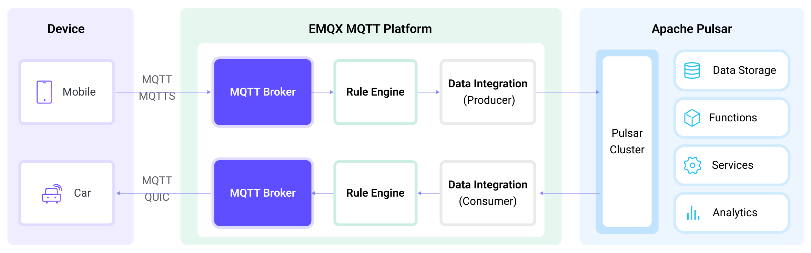

# 将 MQTT 数据传输到 Apache Pulsar


:::tip
EMQX 企业版功能。EMQX 企业版可以为您带来更全面的关键业务场景覆盖、更丰富的数据集成支持，更高的生产级可靠性保证以及 24/7 的全球技术支持，欢迎[免费试用](https://www.emqx.com/zh/try?product=enterprise)。
:::


[Apache Pulsar](https://pulsar.apache.org/) 是一款流行的开源分布式事件流平台，专为处理实时数据流在应用程序和系统之间的传输而设计。Apache Pulsar 具有更高的可伸缩性，并提供了更快的吞吐量和更低的延迟。在物联网应用中，设备生成的数据通常通过轻量级的 MQTT 协议进行传输。通过与 Aphache Pulsar 的数据集成，用户可以轻松地将 MQTT 数据传入 Apache Pulsar，并与其他数据系统连接，实现对物联网设备生成的数据进行实时处理、存储和分析。

本页详细介绍了 EMQX 与 Apache Pulsar 的数据集成并提供了实用的规则和 Sink 创建指导。

## 工作原理

Apache Pulsar 数据集成是 EMQX 的开箱即用功能，结合了 EMQX 的设备接入、消息传输能力与 Pulsar 的强大数据处理能力。借助内置的规则引擎组件，数据流传输和处理过程在两个平台之间更加简化。这意味着您可以轻松地将 MQTT 数据传输到 Pulsar，并利用 Pulsar 的强大功能进行数据处理，而无需额外的开发工作，使得物联网数据的管理和利用变得更加高效和方便。



EMQX 通过规则引擎与 Sink 将 MQTT 数据转发至 Apache Pulsar，其完整流程如下：

1. **设备消息发布与接收**：物联网设备通过 MQTT 协议连接成功后向特定的主题发布遥测和状态数据，EMQX 接收到消息后将在规则引擎中进行比对。
2. **规则引擎处理消息**：通过内置的规则引擎，可以根据主题匹配处理特定来源的 MQTT 消息。规则引擎会匹配对应的规则，并对消息进行处理，例如转换数据格式、过滤掉特定信息或使用上下文信息丰富消息。
3. **桥接到 Apache Pulsar**：规则触发将消息转发到 Pulsar 的动作，允许轻松配置数据到 Pulsar 消息的键（Key）和值（Value），以及 MQTT 主题到 Pulsar 主题的映射关系，以便更好地组织和标识数据，方便后续的数据处理和分析。

MQTT 消息数据写入到 Apache Pulsar 后，您可以进行灵活的应用开发，例如：

- 编写 Pulsar 消费者应用程序来订阅并处理这些消息，根据业务需求，将 MQTT 数据与其他数据源进行关联、聚合或转换，实现实时的数据同步和整合。
- 接收到特定的 MQTT 消息时，可以使用 Pulsar 的规则引擎组件触发相应的操作或事件，实现跨系统和应用的事件驱动功能。
- 在 Pulsar 中实时分析 MQTT 数据流，检测异常或特定的事件模式，并基于这些情况触发警报通知或执行相应的操作。
- 将来自多个 MQTT 主题的分散数据集中到一个统一的数据流中，并利用 Pulsar 的计算功能进行实时的聚合、计算和分析，以获得更全面的数据洞察。

## 特性与优势

在 EMQX 中使用 Pulsar 数据集成能够为您的业务带来以下特性与优势：

- **可靠的物联网数据消息传递**：EMQX 可以将 MQTT 消息可靠地批量发送到 Pulsar，实现物联网设备到 Pulsar 以及应用系统的集成。
- **MQTT 消息转换**：EMQX 通过规则引擎可以对 MQTT 消息进行过滤和转换，消息可以在发送到 Pulsar 之前进行数据提取、过滤、丰富和转换。
- **灵活的主题映射**：Pulsar Sink 支持将 MQTT 主题灵活映射到 Pulsar 主题，允许轻松配置数据到 Pulsar 消息的键（Key）和值（Value）。
- **灵活的分区选择能力**：Pulsar Sink 可以根据 MQTT 主题或客户端，按照不同的策略选择 Pulsar 分区，更灵活的地组织和标识数据。
- **高吞吐量场景下的处理能力**：Pulsar Sink 支持同步和异步的写入模式，可以根据不同场景实现延迟和吞吐量之间的灵活平衡。

## 准备工作

本节介绍了在 EMQX 中创建 Pulsar 数据集成之前需要做的准备工作，包括安装 Pulsar 服务器和创建 Pulsar 主题。

### 前置准备

- 了解[规则](./rules.md)。
- 了解[数据集成](./data-bridges.md)。

### 安装 Pulsar 服务器

在 Docker 中运行 Pulsar。

```bash
docker run --rm -it -p 6650:6650 --name pulsar apachepulsar/pulsar:2.11.0 bin/pulsar standalone -nfw -nss
```

具体的操作步骤可参阅 [Quick Start section in Pulsar Documentation](https://pulsar.apache.org/docs/2.11.x/getting-started-home/)。

### 创建 Pulsar 主题

在 EMQX 中创建 Sink 之前需要先创建相关的 Pulsar 主题。在 Pulsar 的 `public` 租户、`default` 命名空间下创建名为 `my-topic` 的主题，并指定 1 个分区。使用以下命令创建主题 `my-topic`：

```bash
docker exec -it pulsar bin/pulsar-admin topics create-partitioned-topic persistent://public/default/my-topic -p 1
```

## 创建规则

本节演示了如何在 Dashboard 中创建 Pulsar 数据集成的规则来指定需要转发至 Pulsar 的数据并为规则添加触发的动作。以下示例假设您在同一台本地机器上运行 EMQX 和 Pulsar。如果您在远程运行 Pulsar 和 EMQX，请相应调整设置。

1. 转到 Dashboard **集成** -> **规则页面**。

2. 点击页面右上角的创建。

3. 输入规则 ID，例如  `my_rule`。

4. 在 **SQL 编辑器**中输入规则，例如我们希望将 `t/#` 主题的 MQTT 消息存储至 Pulsar，可通过如下规则实现：

   注意：如果要自定义 SQL 语句，请确保 `SELECT` 字段包含 Sink 中所需的所有字段。

   ::: tip

   创建关联的规则可以通过规则进一步处理 Pulsar 消息。有关创建规则的更多信息，请参阅[规则引擎](./rules.md)。

   :::

   ```sql
   SELECT
     *
   FROM
     "t/#"
   ```

   ::: tip

   如果您初次使用 SQL，可以点击 **SQL 示例** 和**启用调试**来学习和测试规则 SQL 的结果。

   :::

5. 点击右侧的**添加动作**按钮，为规则在被触发的情况下指定一个动作。在**动作类型**下拉框中选择 `Pulsar`，保持**动作**下拉框为默认的`创建动作`选项，您也可以选择一个之前已经创建好的 Pulsar Sink。此处我们创建一个全新的 Sink 并添加到规则中。

6. 输入 Sink 名称，名称应为大/小写字母和数字的组合。

7. 配置以下 Sink 选项：

   - **桥接角色**：默认情况下选择 `生产者`。
   - 配置连接到 Pulsar 服务器和消息写入的信息：
     - **服务器地址**：输入 `pulsar://localhost:6650`。如果远程运行 Pulsar 和 EMQX，请根据情况调整设置。
     - **客户端认证**：根据实际情况选择身份认证方式：`none`、`基础认证` 或 `Token`。
     - **Pulsar 主题名称**：输入 `persistent://public/default/my-topic`，即您之前创建的 Pulsar 主题。注意：这里不支持变量。
     - **分区选择策略**：选择生产者将消息分派到 Pulsar 分区的方式：`random`、`roundrobin` 或 `Key_dispatch`。
     - **压缩**：指定是否使用压缩算法以及在 Pulsar 消息中用于压缩/解压缩记录的算法。可选值为：`no_compression`、`snappy` 或 `zlib`。
     - **启用 TLS**: 如果您想建立一个加密连接，单击切换按钮。有关 TLS 连接的更多信息，请参见[启用 TLS 加密访问外部资源](../network/overview.md/#tls-for-external-resource-access)。
   - **消息的 Key**：Pulsar 消息密钥。在此处插入字符串，可以是纯字符串或包含占位符（${var}）的字符串。
   - **消息的 Value**：Pulsar 消息值。在此处插入字符串，可以是纯字符串或包含占位符（${var}）的字符串。

6. 展开**高级设置**，根据需要配置高级设置选项（可选），详细请参考[高级设置](#高级设置)。
7. 点击**创建**前，您可点击**测试连接**按钮确保能连接到 Pulsar 服务器。
8. 点击**添加**按钮完成 Sink 创建，新建的 Sink 将被添加到**动作输出**列表中。
9. 回到创建规则页面，对配置的信息进行确认，点击**创建**。一条规则应该出现在规则列表中，**状态**为**已连接**。

现在您已成功创建了通过 Pulsar Sink 将数据转发到 Pulsar 的规则，同时在**规则**页面的**动作(Sink)** 标签页看到新建的 Pulsar Sink。

您还可以点击 **集成** -> **Flow 设计器**可以查看拓扑，通过拓扑可以直观的看到，主题 `t/#` 下的消息在经过规则 `my_rule` 解析后被发送到 Pulsar 中。

## 测试规则

 使用 MQTTX 向 `t/1` 主题发布消息：

```bash
mqttx pub -i emqx_c -t t/1 -m '{ "msg": "Hello Pulsar" }'
```

查看 Sink 运行统计，命中、发送成功次数应当 +1。

通过 Pulsar 命令查看 `persistent://public/default/my-topic` 主题是否写入消息：

   ```bash
docker exec -it pulsar bin/pulsar-client consume -n 0 -s mysubscriptionid -p Earliest persistent://public/default/my-topic
   ```

## 高级设置

本节将深入介绍可用于 Pulsar 连接器和 Sink 的高级配置选项。在 Dashboard 中配置连接器和 Sink 时，您可以根据您的特定需求展开**高级设置**，调整以下参数。

| 字段名称            | 描述                                                         | 默认值     |
| ------------------- | ------------------------------------------------------------ | ---------- |
| 同步发布超时        | 发布者等待响应或消息成功传递的最长时间，以确保数据可靠性。<br />如果出现传递问题或网络问题，此超时设置非常重要，它可以防止发布者无限期地阻塞。 | `3` 秒     |
| 保留期              | 此选项定义 Pulsar 主题中发布的消息将保留多长时间。此设置允许您控制消息可供订阅者使用的时间段。默认设置为 `infinity`，表示消息不会自动过期，即没有自动消息过期机制。<br />如果指定以秒为单位的数值，超过此时间限制的消息将自动过期并从主题中删除。 | `infinity` |
| Socket 发送缓存大小 | 管理套接字缓冲区的大小，以优化网络传输性能。                 | `1` MB     |
| 批量大小            | 指定在 Pulsar 消息中批处理的最大个别请求数。                 | `100`      |
| 最大批量字节数      | Pulsar 一般情况下会有默认的批处理大小限制为 1 MB。不过，EMQX 的默认值故意设置稍低于 1 MB，以考虑 Pulsar 消息编码开销，特别是当个别消息非常小的情况。如果消息超过此限制，单个消息仍然将作为单独的批处理发送。 | `900` KB   |
| 连接超时            | 等待 TCP 连接建立的最长时间，包括启用认证时的时间。          | `5` 秒     |
| 缓存模式            | 定义消息在发送之前是否存储在缓冲区中。内存缓冲可以增加传输速度。<br />`memory`：消息在内存中缓存。如果 EMQX 节点重新启动，消息将丢失。<br />`disk`：消息在磁盘上缓存，确保它们在 EMQX 节点重新启动时仍然存在。<br />`hybrid`：消息最初在内存中缓存。当它们达到一定限制时（更多详细信息请参考 `segment_bytes` 配置），它们会逐渐转移到磁盘上。与内存模式类似，如果 EMQX 节点重新启动，消息将丢失。 | `Memory`   |
| Pular 分区缓存上限  | 每个 Pulsar 分区的最大允许缓冲区大小，以字节为单位。当达到此限制时，较旧的消息将被丢弃，以腾出缓冲区空间供新消息使用。此选项有助于平衡内存使用和性能。 | `2` GB     |
| 缓存文件大小        | 此设置适用于缓存模式配置为 `disk` 或 `hybrid` 时。它控制用于存储消息的分段文件的大小，影响磁盘存储的优化级别。 | `100` MB   |
| 内存过载保护        | 当缓存模式配置为 `memory` 时，此设置生效。EMQX 在遇到高内存压力时会自动丢弃较旧的缓存消息。它有助于防止由于内存使用过多而导致系统不稳定，确保系统可靠性。<br />**注意**：高内存使用的阈值在配置参数 `sysmon.os.sysmem_high_watermark` 中定义。此配置仅在 Linux 系统上生效。 | `disabled` |
| 启动超时时间        | 确定连接器在自动启动的资源达到健康状态之前等待的最长时间间隔，然后才响应资源创建请求。此设置有助于确保连接器在执行操作之前验证已连接的资源（例如 Polar 中的实例）已完全运行并准备好处理数据事务。 | `5` 秒     |
| 健康检查间隔        | 用于检查 Sink 运行状态的时间间隔。                           | `1` 秒     |
