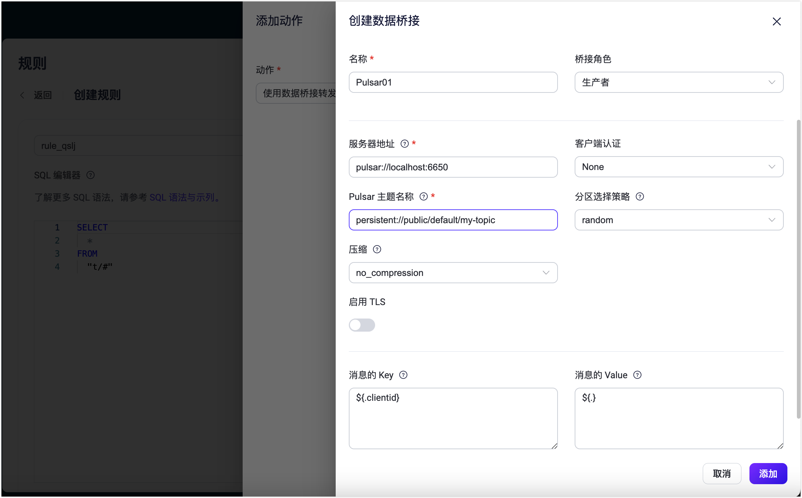

# 将 MQTT 数据传输到 Apache Pulsar


:::tip
EMQX 企业版功能。EMQX 企业版可以为您带来更全面的关键业务场景覆盖、更丰富的数据集成支持，更高的生产级可靠性保证以及 24/7 的全球技术支持，欢迎[免费试用](https://www.emqx.com/zh/try?product=enterprise)。
:::


[Apache Pulsar](https://pulsar.apache.org/) 是一款流行的开源分布式事件流平台。EMQX 与 Apache Pulsar 的集成为用户在高吞吐量环境中提供可靠的数据传输和处理能力。将数据流式传输至 Apache Pulsar 需要以生产者角色创建数据桥接（将消息发送至 Pulsar）。

## 

::: tip 前置准备

- 了解[规则](./rules.md)。
- 了解[数据桥接](./data-bridges.md)。

:::

## 工作原理


## 特性与优势


## 桥接准备

本节介绍了在 EMQX 中创建 Pulsar 数据桥接之前需要做的准备工作，包括安装 Pulsar 服务器和创建 Pulsar 主题。

### 前置准备

- 了解[规则](./rules.md)。
- 了解[数据桥接](./data-bridges.md)。

### 安装 Pulsar 服务器

在 Docker 中运行 Pulsar。

```bash
docker run --rm -it -p 6650:6650 --name pulsar apachepulsar/pulsar:2.11.0 bin/pulsar standalone -nfw -nss
```

具体的操作步骤可参阅 [Quick Start section in Pulsar Documentation](https://pulsar.apache.org/docs/2.11.x/getting-started-home/)。

### 创建 Pulsar 主题

在 EMQX 中创建数据桥接之前需要先创建相关的 Pulsar 主题。在 Pulsar 的 `public` 租户、`default` 命名空间下创建名为 `my-topic` 的主题，并指定 1 个分区。使用以下命令创建主题 `my-topic`：

```bash
docker exec -it pulsar bin/pulsar-admin topics create-partitioned-topic persistent://public/default/my-topic -p 1
```

## 创建 Pulsar 数据桥接

本节将演示如何通过 Dashboard 创建一个 Pulsar 生产者数据桥接。以下步骤假定 EMQX 与 Pulsar 均在本地运行，如您在远程运行 EMQX 及 Pulsar，请根据实际情况调整相应配置。

1. 转到 Dashboard **数据集成** -> **规则页面**。

2. 点击页面右上角的创建。

3. 输入规则 ID，例如  `my_rule`。

4. 在 SQL 编辑器中输入规则，例如我们希望将 `t/#` 主题的 MQTT 消息存储至 Pulsar，可通过如下规则实现：

   注意：如果要自定义 SQL 语句，请确保 `SELECT` 字段包含数据桥接中所需的所有字段。

   ::: tip

   创建关联的规则可以通过规则进一步处理 Pulsar 消息，然后再发送到 MQTT 客户端。有关创建规则的更多信息，请参阅[规则引擎](./rules.md)。

   :::

   ```sql
   SELECT
     *
   FROM
     "t/#"
   ```

   ::: tip

   如果您初次使用 SQL，可以点击 **SQL 示例** 和**启用调试**来学习和测试规则 SQL 的结果。

   :::

5. 点击右侧的**添加动作**按钮，为规则在被触发的情况下指定一个动作。在**动作**下拉框中选择`使用数据桥接转发`，该动作会将经规则处理的数据转发到 Pulsar。

6. 点击**数据桥接**下拉框右侧的**+**按钮创建数据桥接。在**数据桥接类型**下拉框中选择 `Pulsar`。

7. 在**创建数据桥接**页面输入数据桥接名称，要求是大小写英文字母和数字的组合。

8. 配置以下数据桥接选项：

   - **桥接角色**：默认情况下选择 `Producer`。
   - 配置连接到 Pulsar 服务器和消息写入的信息：
     - **服务器地址**：输入 `pulsar://localhost:6650`。如果远程运行 Pulsar 和 EMQX，请根据情况调整设置。
     - **客户端认证**：根据实际情况选择身份认证方式：`none`、`基础认证` 或 `Token`。
     - **Pulsar 主题名称**：输入 `persistent://public/default/my-topic`，即您之前创建的 Pulsar 主题。注意：这里不支持变量。
     - **分区选择策略**：选择生产者将消息分派到 Pulsar 分区的方式：`random`、`roundrobin` 或 `Key_dispatch`。
     - **压缩**：指定是否使用压缩算法以及在 Pulsar 消息中用于压缩/解压缩记录的算法。可选值为：`no_compression`、`snappy` 或 `zlib`。
     - **启用 TLS**: 如果您想建立一个加密连接，单击切换按钮。有关 TLS 连接的更多信息，请参见[启用 TLS 加密访问外部资源](../network/overview.md/#tls-for-external-resource-access)。
   - **消息密钥**：Pulsar 消息密钥。在此处插入字符串，可以是纯字符串或包含占位符（${var}）的字符串。
   - **消息值**：Pulsar 消息值。在此处插入字符串，可以是纯字符串或包含占位符（${var}）的字符串。

9. 展开**高级设置**，根据需要配置高级设置选项（可选），详细请参考[高级设置](#高级设置)。

10. 点击**添加**按钮完成数据桥接创建，此时会自动返回到**添加动作**页面，在**数据桥接**下拉框中选择您创建好的 Pulsar 数据桥接，点击**添加**以完成动作添加。

    

11. 回到创建规则页面，对配置的信息进行确认，点击**创建**。一条规则应该出现在规则列表中，**状态**为**已连接**。


现在您已创建了通过 Pulsar 数据桥接将数据转发到 Pulsar 的规则。您可以单击 **集成** -> **拓扑** 来查看拓扑结构。可以看到，在规则 `my_rule` 解析后，主题 `t/#` 下的消息被发送并保存到 Pulsar。

## 测试桥接和规则

 使用 MQTTX 向 `t/1` 主题发布消息：

```bash
mqttx pub -i emqx_c -t t/1 -m '{ "msg": "Hello Pulsar" }'
```

查看数据桥接运行统计，命中、发送成功次数应当 +1。

通过 Pulsar 命令查看 `persistent://public/default/my-topic` 主题是否写入消息：

   ```bash
docker exec -it pulsar bin/pulsar-client consume -n 0 -s mysubscriptionid -p Earliest persistent://public/default/my-topic
   ```

## 高级设置

本节将深入介绍可用于 Pulsar 数据桥接的高级配置选项。在 Dashboard 中配置数据桥接时，您可以根据您的特定需求展开**高级设置**，调整以下参数。
