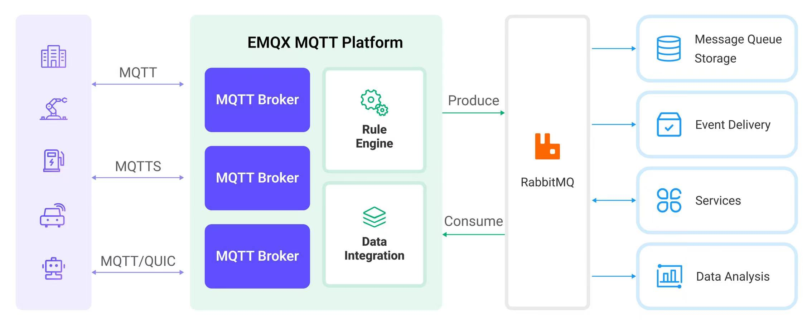
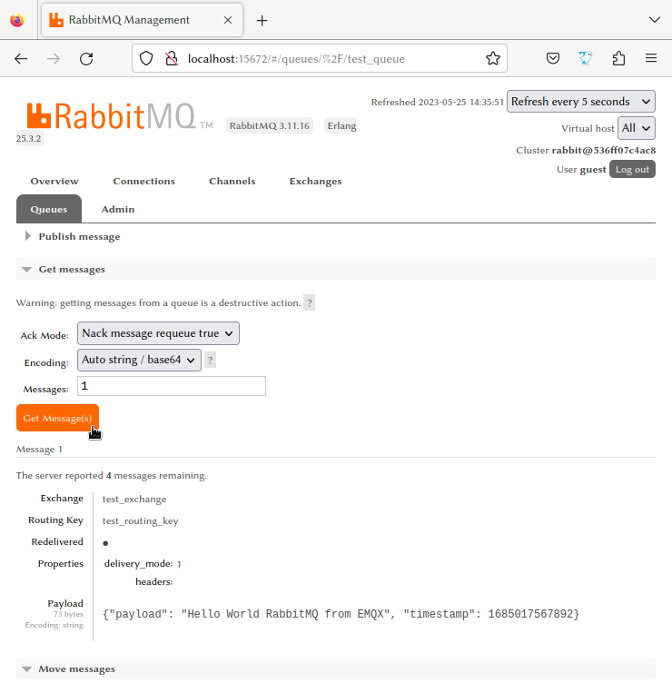

# 将 MQTT 数据传输到 RabbitMQ


:::tip

RabbitMQ 数据桥接是 EMQX 企业版功能。EMQX 企业版可以为您带来更全面的关键业务场景覆盖、更丰富的数据集成支持，更高的生产级可靠性保证以及 24/7 的全球技术支持，欢迎[免费试用](https://www.emqx.com/zh/try?product=enterprise)。

:::


作为一款广泛使用的开源消息代理，[RabbitMQ](https://www.rabbitmq.com/) 应用了高级消息队列协议（AMQP），为分布式系统之间的消息传递提供了一个强大而可扩展的平台。EMQX 支持与 RabbitMQ 的数据集成，能够让您将 MQTT 消息和事件转发至 RabbitMQ。

本页面提供了 EMQX 与 RabbitMQ 数据集成的全面介绍，并提供了创建规则和数据桥接的实用指导。

## 工作原理

RabbitMQ 数据集成是 EMQX 中的开箱即用功能，结合了 EMQX 的设备接入、消息传输能力与 RabbitMQ 强大的消息队列处理能力。通过内置的[规则引擎](./rules.md)组件，该集成简化了从 EMQX 到 RabbitMQ 的数据摄取过程，无需复杂编码。

下图展示了 EMQX 与 RabbitMQ 之间数据集成的典型架构:



MQTT 数据摄取到 RabbitMQ 的工作流程如下：

1. **消息发布和接收**：工业物联网设备通过 MQTT 协议与 EMQX 建立成功连接，并向 EMQX 发布实时 MQTT 数据。EMQX 收到这些消息后，将启动其规则引擎中的匹配过程。
2. **消息数据处理**：消息到达后，它将通过规则引擎进行处理，然后由 EMQX 中定义的规则处理。根据预定义的标准，规则将决定哪些消息需要路由到 RabbitMQ。如果任何规则指定了载荷转换，则将应用这些转换，例如转换数据格式、过滤特定信息或用额外的上下文丰富载荷。
3. **消息传入到 RabbitMQ**：规则处理完消息后，它将触发一个动作，将消息转发到 RabbitMQ。处理过的消息将无缝写入 RabbitMQ。
4. **数据持久化和利用**：RabbitMQ 将消息存储在队列中，并将它们传递给适当的消费者。消息可以被其他应用程序或服务消费以进行进一步处理，如数据分析、可视化和存储。

## 特性与优势

RabbitMQ 数据集成为您的业务带来以下特性和优势：

- **可靠的物联网数据消息传递**：EMQX 确保从设备到云的可靠连接和消息传递，而 RabbitMQ 负责消息的持久化和在不同服务之间的可靠传递，确保了各个流程中数据的可靠性。
- **MQTT 消息转换**：使用规则引擎，EMQX 可以过滤和转换 MQTT 消息。在发送到 RabbitMQ 之前，消息可以经过数据提取、过滤、丰富和转换。
- **灵活的消息映射**：RabbitMQ 数据桥支持灵活的将 MQTT 主题映射到 RabbitMQ Routing Key 和 Exchange，允许 MQTT 和 RabbitMQ 之间的无缝集成。
- **高可用性和集群支持**：EMQX 和 RabbitMQ 都支持构建高可用的消息代理集群，确保即使在节点失败的情况下系统也能继续提供服务。利用集群能力还提供了出色的可扩展性。
- **高吞吐量场景中的处理能力**：RabbitMQ 数据桥支持同步和异步写入模式，允许根据不同场景在延迟和吞吐量之间灵活平衡。

## 桥接准备

本节介绍了在 EMQX 中创建 RabbitMQ 数据桥接之前需要做的准备工作，包括启动 RabbitMQ 服务器并创建 RabbitMQ test exchange 和 queue。

### 前置准备

- 了解 EMQX 数据集成[规则](./rules.md)

- 了解[数据桥接](./data-bridges.md)

- 了解 UNIX 终端及命令

### 启动 RabbitMQ 服务器

本节介绍了如何使用  [Docker](https://www.docker.com/) 启动 RabbitMQ 服务器。

运行以下命令以启动启用管理插件的 RabbitMQ 服务器。管理插件允许您通过 Web 界面管理和监测 RabbitMQ。

```bash
docker run -it --rm --name rabbitmq -p 127.0.0.1:5672:5672 -p 127.0.0.1:15672:15672 rabbitmq:3.11-management
```

关于更多如何在 docker 中运行 RabbitMQ 的信息，可参阅 [RabbitMQ in Docker on Docker Hub](https://hub.docker.com/_/rabbitmq)。


### 创建 RabbitMQ Test Exchange 和 Queue

在启动 RabbitMQ 服务器后，您可以使用 RabbitMQ 管理界面创建一个 test exchange 和一个 queue。如果您已经有一个用于测试的 test exchange 和 queue，您可以跳过此部分。

1. 打开您的网页浏览器并在地址栏输入 http://localhost:15672/ 以访问 RabbitMQ 管理界面。在登录页面上，输入登录信息，然后点击**Login**。
   - **Username**: `guest`
   - **Password**: `guest`
2. 点击顶部菜单栏中的 **Exchanges** 页签，展开 **Add a new exchange** 并输入以下信息：
   * **Name**: 输入 `test_exchange`
   * **Type**: 从下拉列表中选择 `direct` 
   * **Durability**: 选择 `Durable` 使 exchange 持久化
   * **Auto delete**: `No`
   * **Internal**: `No`
   * **Arguments**: 留空

3. 点击 **Add exchange** 按钮完成 test exchange 的创建。
4. 点击顶部菜单栏中的 **Queues** 页签，展开 **Add a new queue** 并输入以下信息：
   * **Type**: `Default for virtual host`
   * **Name**: 输入 `test_queue`
   * **Durability**: 选择 `Durable` 使 exchange 持久化
   * **Arguments**: 留空
5. 点击 **Add queue** 按钮完成 queue 的创建。 新建的 **test_queue** 应出现在 **All queues** 区域。
6. 点击 **Name** 列中的 **test_queue** 以打开详情页。展开 **Bindings**，在 **Add binding to this queue** 区域，输入以下信息：
   * **From exchange**: 输入 `test_exchange` 
   * **Routing key**: 输入 `test_routing_key`
   * **Arguments**: 留空
7. 点击 **Bind** 按钮将 test_queue 通过指定的 routing key 与 test_exchange 绑定。

## 创建 RabbitMQ 数据桥接

本节将通过 Dashboard 演示如何创建到 RabbitMQ 的数据桥接。以下示例假定 EMQX 与 RabbitMQ 均在本地运行，如您在远程运行 EMQX 及 RabbitMQ，请根据实际情况调整相应配置。

1. 登陆 EMQX Dashboard，点击左侧目录菜单中的**数据集成** -> **数据桥接**。

2. 点击页面右上角的**创建**。

3. 在**数据桥接类型**中选择 **RabbitMQ**，点击**下一步**。

4. 输入数据桥接名称，名称应为大/小写字母和数字的组合。

5. 输入以下连接信息：

   * **服务器**: 输入`localhost` ；如果 RabbitMQ 服务器在远程运行，则填写实际服务器地址。

   * **Port**: 输入 `5672` ；如果 RabbitMQ 服务器在远程运行，则填写实际端口号。

   * **用户名**: 输入 `guest`。

   * **密码**: 输入 `guest`。

   * **交换机**: 输入之前创建的 `test_exchange`， 消息将被发送到该交换机。

   * **路由键**: 输入之前创建的 `test_routing_key`，用于将消息路由到 RabbitMQ 交换中的正确队列。

   * **虚拟主机**: 输入RabbitMQ 虚拟主机; 默认值为 `/` 。

   * 在 **消息传递模式**下拉框中选择 `non_persistent` 或 `persistent`：

     * `non_persistent` （默认选项）：消息不会持久化到磁盘，如果 RabbitMQ 重新启动或崩溃，消息可能会丢失。

     * `persistent`：消息被持久化到磁盘，以确保在 RabbitMQ 重新启动或崩溃时的数据持久性。

       ::: tip

       如果需要在 RabbitMQ 重新启动时防止消息丢失，您可能还需要将 queue 和 exchange 设置为 `durable`。有关更多信息，请参阅 RabbitMQ 的[文档](https://www.rabbitmq.com/documentation.html)。

       :::

   * **等待发布确认**: 默认开启以保证消息被成功发送至 RabbitMQ。

     ::: tip

     启用此选项后，消息在被认为成功发送之前，RabbitMQ 代理会确认接收该消息，从而提高了消息传递的可靠性。

     :::

   * **发布确认超时时间**：默认为  `30` 秒。 发布确认超时确定了发布者等待代理确认的持续时间，超过该时间发布操作将被视为失败。

   * **有效载荷模版**： 默认值为空字符串，意味着将被转发至 RabbitMQ 服务器的消息载荷是未经任何修改的 JSON 格式文本。

     您也可以自定义消息载荷格式，在模版中使用占位符来包含来自传入 MQTT 消息的动态数据。例如，如果您想要在 RabbitMQ 消息中包含来自 MQTT 消息的载荷和时间戳，可以使用下面的模版：

     ```json
     {"payload": "${payload}", "timestamp": ${timestamp}}
     ```

     该模板将生成一个包含传入 MQTT 消息的载荷和时间戳的 JSON格式消息。其中，`${data}` 和 `${timestamp}` 为占位符，当消息转发到 RabbitMQ 服务器时，它们将被实际的值替换。

6. 其余选项均使用默认值。

7. 点击**创建**前，您可点击**测试连接**按钮确保能连接到 RabbitMQ 服务器。

8. 点击**创建**按钮完成数据桥接创建。

   在弹出的**创建成功**对话框中您可以点击**创建规则**，继续创建规则以指定需要写入 RabbitMQ 的数据。详细步骤可参照[创建数据转发规则](#创建数据转发规则)。

至此，您已经完成数据桥接的创建，在 Dashboard 的数据桥接页面，可以看到 RabbitMQ 数据桥接的状态为**已连接**。

## 创建数据转发规则

1. 转到 Dashboard **数据集成** -> **规则**页面。

2. 点击页面右上角的**创建**。

3. 输入规则 ID，例如 `my_rule` 。

4. 在 SQL 编辑器中输入规则，例如我们希望将 `t/#` 主题的 MQTT 消息转发至 RabbitMQ，可通过如下规则 SQL 实现：

   ```sql
   SELECT 
     payload as data,
     now_timestamp() as timestamp
   FROM
     "t/#"
   ```

5. 点击**添加动作**按钮，在下拉框中选择**使用数据桥接转发**，选择之前创建好的 RabbitMQ 数据桥接。

6. 点击**添加**按钮确认添加动作。

7. 点击最下方**创建**按钮完成规则创建。

至此您已经完成数据桥接和转发规则的创建，您可前往 **数据集成** -> **Flows** 页面查看拓扑图，可看到 `t/#` 主题的消息被转发至 RabbitMQ。

## 测试桥接和规则

您可通过 EMQX Dashboard 内置的 WebSocket 客户端进行规则和数据桥接的验证。

1. 在 Dashboard 页面，点击左侧导航目录中的**问题分析** -> **WebSocket 客户端**。

2. 填写当前 EMQX 的连接信息。 

   - 如果 EMQX 在本地运行，可直接使用默认配置。
   - 如果您修改过 EMQX 的默认配置，如修改过访问规则的配置，则需要输入用户名和密码。

3. 点击**连接**，建立该 WebSocket 客户端与 EMQX 的连接。

4. 前往**发布**区域，并输入以下信息：

   * **主题**: `t/test`
   * **Payload**: `Hello World RabbitMQ from EMQX`
   * **QoS**: `2`

5. 点击 **发布** 完成消息的发送。

   如果数据桥接和规则创建成功，改消息应已通过指定的路由键被发送到 RabbitMQ 指定的 exchange 中。

6. 访问 RabbitMQ 管理界面 http://localhost:15672 并导航至 Queues 区域。

   ::: tip

   如果您没有修改默认设置，仍使用 `guest` 作为用户名和密码。

   :::

7. 验证消息是否被路由到相应的 queue(s)。点击 queue 查看详情并点击 **Get Message(s)** 按钮查看消息的详细内容。



