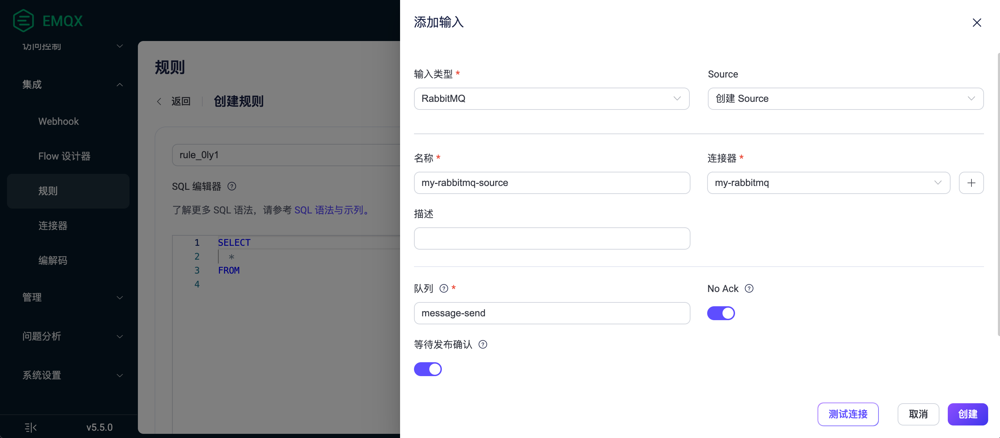
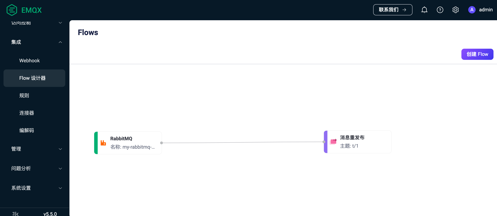

# 将 MQTT 数据传输到 RabbitMQ

::: tip

RabbitMQ 数据集成是 EMQX 企业版功能。

:::

作为一款广泛使用的开源消息代理，[RabbitMQ](https://www.rabbitmq.com/) 应用了高级消息队列协议（AMQP），为分布式系统之间的消息传递提供了一个强大而可扩展的平台。EMQX 支持与 RabbitMQ 的数据集成，能够让您将 MQTT 消息和事件转发至 RabbitMQ，还能够实现从 RabbitMQ Server 中消费数据，并发布到 EMQX 特定主题中，实现 RabbitMQ 到 MQTT 的消息下发。

本页面提供了 EMQX 与 RabbitMQ 数据集成的全面介绍，并提供了创建规则和 Sink/Source 的实用指导。

## 工作原理

RabbitMQ 数据集成是 EMQX 中的开箱即用功能，结合了 EMQX 的设备接入、消息传输能力与 RabbitMQ 强大的消息队列处理能力。通过内置的[规则引擎](./rules.md)组件，该集成简化了 EMQX 与 RabbitMQ 之间的数据摄取过程，无需复杂编码。

以 RabbitMQ Sink 为例，下图展示了 EMQX 与 RabbitMQ Sink 之间数据集成的典型架构:


MQTT 数据摄取到 RabbitMQ 的工作流程如下：

1. **消息发布和接收**：工业物联网设备通过 MQTT 协议与 EMQX 建立成功连接，并向 EMQX 发布实时 MQTT 数据。EMQX 收到这些消息后，将启动其规则引擎中的匹配过程。
2. **消息数据处理**：消息到达后，它将通过规则引擎进行处理，然后由 EMQX 中定义的规则处理。根据预定义的标准，规则将决定哪些消息需要路由到 RabbitMQ。如果任何规则指定了载荷转换，则将应用这些转换，例如转换数据格式、过滤特定信息或用额外的上下文丰富载荷。
3. **消息传入到 RabbitMQ**：规则处理完消息后，它将触发一个动作，将消息转发到 RabbitMQ。处理过的消息将无缝写入 RabbitMQ。
4. **数据持久化和利用**：RabbitMQ 将消息存储在队列中，并将它们传递给适当的消费者。消息可以被其他应用程序或服务消费以进行进一步处理，如数据分析、可视化和存储。

## 特性与优势

RabbitMQ 数据集成为您的业务带来以下特性和优势：

- **可靠的物联网数据消息传递**：EMQX 确保从设备到云的可靠连接和消息传递，而 RabbitMQ 负责消息的持久化和在不同服务之间的可靠传递，确保了各个流程中数据的可靠性。
- **MQTT 消息转换**：使用规则引擎，EMQX 可以过滤和转换 MQTT 消息。在发送到 RabbitMQ 之前，消息可以经过数据提取、过滤、丰富和转换。
- **灵活的消息映射**：RabbitMQ 数据桥支持灵活的将 MQTT 主题映射到 RabbitMQ Routing Key 和 Exchange，允许 MQTT 和 RabbitMQ 之间的无缝集成。
- **高可用性和集群支持**：EMQX 和 RabbitMQ 都支持构建高可用的消息代理集群，确保即使在节点失败的情况下系统也能继续提供服务。利用集群能力还提供了出色的可扩展性。
- **高吞吐量场景中的处理能力**：RabbitMQ 数据集成支持同步和异步写入模式，允许根据不同场景在延迟和吞吐量之间灵活平衡。

## 准备工作

本节介绍了在 EMQX 中创建 RabbitMQ 数据集成之前需要做的准备工作，包括启动 RabbitMQ 服务器并创建 RabbitMQ 交换机和队列。

### 前置准备

- 了解 EMQX 数据集成[规则](./rules.md)
- 了解[数据集成](./data-bridges.md)和[消息重发布动作](./rule-get-started.md#添加消息重发布动作)
- 了解 UNIX 终端及命令

### 启动 RabbitMQ 服务器

本节介绍了如何使用  [Docker](https://www.docker.com/) 启动 RabbitMQ 服务器。

运行以下命令以启动启用管理插件的 RabbitMQ 服务器。管理插件允许您通过 Web 界面管理和监测 RabbitMQ。

```bash
docker run -it --rm --name rabbitmq -p 127.0.0.1:5672:5672 -p 127.0.0.1:15672:15672 rabbitmq:3.11-management
```

关于更多如何在 docker 中运行 RabbitMQ 的信息，可参阅 [RabbitMQ in Docker on Docker Hub](https://hub.docker.com/_/rabbitmq)。


### 创建用于接收消息的交换机和队列

在启动 RabbitMQ 服务器后，您可以使用 RabbitMQ 管理界面创建一个用于测试的交换机（exchange） 和一个队列（queue）用于接收从 EMQX 转发的消息。如果您已经有一个用于测试的交换机和队列，可以跳过此部分。

1. 打开您的网页浏览器并在地址栏输入 http://localhost:15672/ 以访问 RabbitMQ 管理界面。在登录页面上，输入登录信息，然后点击**Login**。
   - **Username**: `guest`
   - **Password**: `guest`
2. 点击顶部菜单栏中的 **Exchanges** 页签，展开 **Add a new exchange** 并输入以下信息：
   * **Name**: 输入 `test_exchange`
   * **Type**: 从下拉列表中选择 `direct` 
   * **Durability**: 选择 `Durable` 使 exchange 持久化
   * **Auto delete**: `No`
   * **Internal**: `No`
   * **Arguments**: 留空

3. 点击 **Add exchange** 按钮完成 test exchange 的创建。
4. 点击顶部菜单栏中的 **Queues** 页签，展开 **Add a new queue** 并输入以下信息：
   * **Type**: `Default for virtual host`
   * **Name**: 输入 `test_queue`
   * **Durability**: 选择 `Durable` 使 queue 持久化，即 queue 会在 RabbitMQ 服务器重启后仍然存在。
   * **Arguments**: 留空
5. 点击 **Add queue** 按钮完成 queue 的创建。 新建的 `test_queue` 应出现在 **All queues** 区域。
6. 点击 **Name** 列中的 **test_queue** 以打开详情页。展开 **Bindings**，在 **Add binding to this queue** 区域，输入以下信息：
   * **From exchange**: 输入 `test_exchange` 
   * **Routing key**: 输入 `test_routing_key`
   * **Arguments**: 留空
7. 点击 **Bind** 按钮将 `test_queue` 通过指定的 routing key 与 `test_exchange` 绑定。

### 创建用于发布消息的队列

您可以使用 RabbitMQ 管理界面创建一个队列（queue）用于发布 RabbitMQ 消息。

1. 登录 RabbitMQ 管理界面。
2. 点击顶部菜单栏中的 **Queues** 页签，展开 **Add a new queue** 并输入以下信息：
   * **Type**: `Default for virtual host`
   * **Name**: 输入 `message-send`
   * **Durability**: 选择 `Durable` 使 queue 持久化，即 queue 会在 RabbitMQ 服务器重启后仍然存在。
   * **Arguments**: 留空
3. 点击 **Add queue** 按钮完成 queue 的创建。 新建的 `message-send` 应出现在 **All queues** 区域。

## 创建连接器

本节演示如何创建一个连接器，将 RabbitMQ Sink 或 Source 连接到 RabbitMQ 服务器。

以下步骤假设您在本地机器上同时运行 EMQX 和 RabbitMQ。如果您的 RabbitMQ 部署在其他地方，请相应调整设置。


1. 进入 Dashboard，点击**集成** -> **连接器**。
2. 点击页面右上角的**创建**。
3. 在**创建连接器**页面中，选择 **RabbitMQ**，然后点击 **下一步**。
4. 为连接器输入一个名称。名称应是大写/小写字母和数字的组合，例如 `my_rabbitmq`。
5. 输入连接信息。
   - **服务器地址**: 输入`localhost` ；如果 RabbitMQ 服务器在远程运行，则填写实际服务器地址。
   - **Port**: 默认为 `5672` ；如果 RabbitMQ 服务器在远程运行，则填写实际端口号。
   - **用户名**: 输入 `guest`。
   - **密码**: 输入 `guest`。
   - **虚拟主机**: 输入RabbitMQ 虚拟主机; 默认值为 `/` 。
   - 如果您想建立加密连接，请点击 **启用 TLS** 切换开关。有关 TLS 连接的更多信息，请参见[启用 TLS 访问外部资源](../network/overview.md#启用-tls-加密访问外部资源)。
6. 在点击**创建**之前，您可以点击**测试连接**来测试连接器是否能连接到 RabbitMQ 服务器。
7. 点击**创建**按钮完成连接器的创建。在弹出的对话框中，您可以点击**返回连接器列表**或点击**创建规则**继续创建规则以指定转发到 RabbitMQ 的数据（作为动作输出）或从 RabbitMQ 消费数据（作为数据输入）。具体步骤请参见[创建 RabbitMQ Sink 规则](#创建-rabbitmq-sink-规则) 和[创建 RabbitMQ Source 规则](#创建-rabbitmq-source-规则)。

## 创建 RabbitMQ Sink 规则

本节将通过 Dashboard 演示如何创建一条规则，用于处理来自源 MQTT 主题 `t/#` 的消息，并通过配置的 Sink 将处理后的结果传输到 RabbitMQ 的队列 `test_queue` 中。

1. 转到 Dashboard **集成** -> **规则**页面。

2. 点击页面右上角的**创建**。

3. 输入规则 ID，例如 `my_rule` 。

4. 在 SQL 编辑器中输入规则，例如我们希望将 `t/#` 主题的 MQTT 消息转发至 RabbitMQ，可通过如下规则 SQL 实现：

   ```sql
   SELECT 
     payload as data,
     now_timestamp() as timestamp
   FROM
     "t/#"
   ```

   ::: tip

   如果您初次使用 SQL，可以点击 **SQL 示例** 和**启用调试**来学习和测试规则 SQL 的结果。

   :::

5. 点击右侧的**添加动作**按钮，为规则在被触发的情况下指定一个动作。

6. 在**动作类型**下拉框中选择 `RabbitMQ`，保持**动作**下拉框为默认的`创建动作`选项，您也可以选择一个之前已经创建好的 RabbitMQ Sink。此示例将创建一个全新的 Sink 并添加到规则中。

7. 输入 Sink 名称，名称应为大/小写字母和数字的组合。

8. 在**连接器**下拉框中选择之前创建的 `my-rabbitmq` 连接器。您也可以点击下拉框旁边的创建按钮，在弹出框中快捷创建新的连接器，所需的配置参数按照参照[创建连接器](#创建连接器)。

9. 配置以下信息：

   * **交换机**: 输入之前创建的 `test_exchange`， 消息将被发送到该交换机。

   * **路由键**: 输入之前创建的 `test_routing_key`，用于将消息路由到 RabbitMQ 交换中的正确队列。

   * 在 **消息传递模式**下拉框中选择 `non_persistent` 或 `persistent`：

     * `non_persistent` （默认选项）：消息不会持久化到磁盘，如果 RabbitMQ 重新启动或崩溃，消息可能会丢失。

     * `persistent`：消息被持久化到磁盘，以确保在 RabbitMQ 重新启动或崩溃时的数据持久性。

       ::: tip

       如果需要在 RabbitMQ 重新启动时防止消息丢失，您可能还需要将 queue 和 exchange 设置为 `durable`。有关更多信息，请参阅 RabbitMQ 的[文档](https://www.rabbitmq.com/documentation.html)。

       :::

   * **有效载荷模版**： 默认值为空字符串，意味着将被转发至 RabbitMQ 服务器的消息载荷是未经任何修改的 JSON 格式文本。

     您也可以自定义消息载荷格式，在模版中使用占位符来包含来自传入 MQTT 消息的动态数据。例如，如果您想要在 RabbitMQ 消息中包含来自 MQTT 消息的载荷和时间戳，可以使用下面的模版：

     ```json
     {"payload": "${payload}", "timestamp": ${timestamp}}
     ```

     该模板将生成一个包含传入 MQTT 消息的载荷和时间戳的 JSON格式消息。其中，`${data}` 和 `${timestamp}` 为占位符，当消息转发到 RabbitMQ 服务器时，它们将被实际的值替换。

   - **等待发布确认**: 默认开启以保证消息被成功发送至 RabbitMQ。

     ::: tip

     启用此选项后，消息在被认为成功发送之前，RabbitMQ 代理会确认接收该消息，从而提高了消息传递的可靠性。

     :::

10. 配置高级设置（可选）：

    - **发布确认超时时间**：默认为  `30` 秒。 发布确认超时确定了发布者等待代理确认的持续时间，超过该时间发布操作将被视为失败。
    - 根据情况配置同步/异步模式，队列与批量等参数，详细请参考 [Sink 的特性](./data-bridges.md#sink-的特性)。

11. 点击**创建**前，您可点击**测试连接**按钮确保 Sink 能连接到 RabbitMQ 服务器。

12. 点击**创建**按钮完成 Sink 创建，新建的 Sink 将被添加到**动作输出**列表中。

13. 回到创建规则页面，对配置的信息进行确认，点击**创建**。一条规则应该出现在规则列表中。

现在您已成功创建了通过 RabbitMQ Sink 将数据转发到 RabbitMQ 的规则，同时在**规则**页面的**动作(Sink)** 标签页看到新建的 RabbitMQ Sink。

您还可以点击 **集成** -> **Flow 设计器**可以查看拓扑，通过拓扑可以直观的看到，主题 `t/#` 下的消息在经过规则 `my_rule` 解析后被发送到 RabbitMQ 中。

## 测试 RabbitMQ Sink 规则

您可通过 EMQX Dashboard 内置的 WebSocket 客户端进行规则和 Sink 的验证。

1. 在 Dashboard 页面，点击左侧导航目录中的**问题分析** -> **WebSocket 客户端**。

2. 填写当前 EMQX 的连接信息。 

   - 如果 EMQX 在本地运行，可直接使用默认配置。
   - 如果您修改过 EMQX 的默认配置，如修改过访问规则的配置，则需要输入用户名和密码。

3. 点击**连接**，建立该 WebSocket 客户端与 EMQX 的连接。

4. 前往**发布**区域，并输入以下信息：

   * **主题**: `t/test`
   * **Payload**: `Hello World RabbitMQ from EMQX`
   * **QoS**: `2`

5. 点击 **发布** 完成消息的发送。

   如果 Sink 和规则创建成功，该消息应已通过指定的路由键被发送到 RabbitMQ 指定的 exchange 中。

6. 访问 RabbitMQ 管理界面 http://localhost:15672 并导航至 Queues 区域。

   ::: tip

   如果您没有修改默认设置，仍使用 `guest` 作为用户名和密码。

   :::

7. 验证消息是否被路由到相应的 queue(s)。点击 queue 查看详情并点击 **Get Message(s)** 按钮查看消息的详细内容。


## 创建 RabbitMQ Source 规则

本节演示了如何创建一条规则将 RabbitMQ 队列中的数据转发至本地。您需要同时创建一个 RabbitMQ Source 和一个消息重发布动作，实现从 RabbitMQ 服务消费消息并转发到 EMQX。

1. 转到 Dashboard **集成** -> **规则**页面。

2. 点击页面右上角的**创建**。

3. 输入规则 ID `my_rule_source`。

4. 配置规则的触发源（数据输入）。点击页面右侧的**数据输入**页签，删除默认的`消息`类型输入，点击**添加输入**按钮进行 RabbitMQ Source 的创建。

5. 在**添加输入**弹出框中，**输入类型**下拉选择 `RabbitMQ`。保持 **Source** 下拉框为默认的`创建 Source`选项，此示例将创建一个全新的 Source 并添加到规则中。

6. 为 Source 输入 **名称** 和 **描述**（可选）。名称应该是大小写字母和数字的组合，例如 `my-rabbitmq-source`。

7. 在**连接器**下拉框中选择之前创建的 `my-rabbitmq` 连接器。您也可以点击下拉框旁边的创建按钮，在弹出框中快捷创建新的连接器，所需的配置参数按照参照[创建连接器](#创建连接器)。

8. 配置 Source 信息，完成消息从 RabbitMQ 消费到 EMQX 的配置：

   - **队列**：填写之前在 RabbitMQ 中创建好的队列名称 `message-send`。
   - **No Ack**：根据情况选择，指定从 RabbitMQ 消费消息时是否使用 `no_ack` 模式。使用 `no_ack` 模式表示消费者接收消息后不需要发送确认，消息会立刻从队列中移除。
   - **等待发布确认**：使用消息发布者确认时，是否要等待 RabbitMQ 确认消息。

9. 高级设置（可选）：使用默认值。

10. 点击**创建**按钮完成 Source 的创建，将 Source 添加到规则数据输入中。同时你可以看到规则 SQL 已经变为：

    ```sql
    SELECT
      *
    FROM
      "$bridges/rabbitmq:my-rabbitmq-source"
    ```

    规则 SQL 可以从 RabbitMQ Source 中获取以下字段，您可以调整 SQL 进行数据处理操作。此处使用默认 SQL 即可。

    | 字段名称  | 描述                                               |
    | :-------- | :------------------------------------------------- |
    | payload   | RabbitMQ 消息内容                                  |
    | event     | 事件主题，格式为 `$bridges/rabbitmq:<source 名称>` |
    | metadata  | 规则 ID 信息                                       |
    | timestamp | 消息到达 EMQX 的时间戳                             |
    | node      | 消息到达 EMQX 的节点名称                           |

至此，您已经完成了 RabbitMQ Source 的创建，但订阅到的数据并不会直接发布到 EMQX 本地。接下来将继续创建一个消息重发布动作，通过它将 Source 的消息转发到 EMQX 本地。



### 创建消息重发布动作

本节演示了如何在创建规则页面为 RabbitMQ Source 规则配置动作输出，将从 RabbitMQ Source 消费的消息发布到本地 MQTT 主题 `t/1`。

1. 点击页面右侧的**动作输出**页签，点击**添加动作**按钮，从**动作类型**下拉列表中选择`消息重发布`动作。

2. 填写消息重发布配置：

   - **主题**：发布到 MQTT 的主题，此处填写 `t/1`。

   - **QoS**：选择 `0`、 `1`、 `2`、或 `${qos}`，也可以输入占位符从其他字段中设置 QoS，此处选择 `${qos}` 表示跟随原始消息的 QoS。

   - **Retain**：选择 `true` 或 `false`。

     确认是否以保留消息方式发布消息，也可以输入占位符从其他字段中设置保留消息标志位，此处我们选择 `false`。

   - **消息模板**：用于生成转发消息 Payload 的模板，默认留空表示转发规则输出结果。此处可以输入 `${payload}` 表示仅转发 Payload。

   - **MQTT 5.0 消息属性**：默认禁用。详细设置，请参见 [添加消息重发布动作](./rule-get-started.md#添加消息重发布动作)。

3. 点击**创建**完成动作创建。创建成功后将回到创建规则页面，重发布动作将被添加到规则动作中。

4. 在规则创建页面，点击**创建**按钮完成整个规则创建。

现在您已成功创建了规则，你可以点击**集成** -> **规则**页面看到新建的规则，同时在 **Source** 标签页看到新建的 MQTT Source。

您也可以点击 **集成** -> **Flow 设计器**查看拓扑，通过拓扑可以直观的看到，来自 MQTT Source 的消息将通过消息重发布发布到 `t/1` 中。



## 测试 RabbitMQ Source 规则

1. 使用 [MQTTX CLI](https://mqttx.app/zh/cli) 订阅 `t/1` 主题：

   ```bash
   mqttx sub -t t/1
   ```

2. 您可以使用以下命令在 RabbitMQ 中生产一条消息：

   ```bash
   rabbitmqadmin --username=guest --password=guest \
   	publish routing_key=message-send \
   	payload="{ \"msg\": \"Hello EMQX\"}"
   ```

   - `publish` 是用来发布一个消息的命令。
   - `routing_key=message-send` 选项用来设置消息的路由键。在这个例子中，使用队列的名称作为路由键。
   - `payload="Hello EMQX"` 选项用来设置消息的内容。

   或者，您也可以在 RabbitMQ 管理界面中发布消息：

   1. 点击顶部菜单栏中的 **Queues** 页签。
   2. 点击 **Name** 列中的 **message-send** 以打开详情页。
   3. 展开 **Publish message**，在 **Payload** 框中填写 `"Hello EMQX"`，然后点击 **Publish message** 按钮。

3. 您将看到 MQTTX 输出结果：

   ```bash
   [2024-2-23] [16:59:28] › payload: {"payload":{"msg":"Hello EMQX"},"event":"$bridges/rabbitmq:my-rabbitmq-source","metadata":{"rule_id":"rule_0ly1"},"timestamp":1708678768449,"node":"emqx@127.0.0.1"}
   ```

