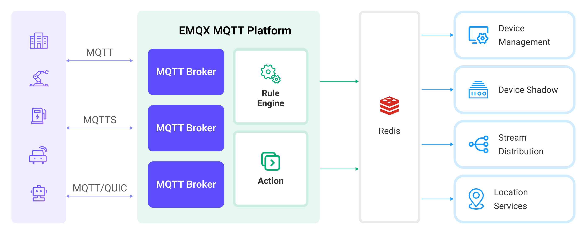

# 将 MQTT 数据写入到 Redis


:::tip
EMQX 企业版功能。EMQX 企业版可以为您带来更全面的关键业务场景覆盖、更丰富的数据集成支持，更高的生产级可靠性保证以及 24/7 的全球技术支持，欢迎[免费试用](https://www.emqx.com/zh/try?product=enterprise)。
:::


通过 [Redis](https://redis.io/) 数据桥接可以通过执行自定义 Redis 数据操作命令的方式，将 MQTT 消息和客户端事件存储到 Redis 中，借助 Redis 高性能与灵活数据结构，实现诸如消息暂存，发布订阅和消息丢弃行为的计数与统计等业务。

本页详细介绍了 EMQX 与 Redis 的数据集成并提供了实用的规则和数据桥接创建指导。

## 工作原理

Redis 数据集成是 EMQX 中的一个开箱即用的功能，结合了 EMQX 的设备接入、消息传输能力与 Redis 丰富的数据结构以及强大的键值读写性能。通过内置的[规则引擎](./rules.md)组件，该集成简化了将数据从 EMQX 写入到 Redis 进行数据缓存和操作的过程，无需复杂编码。

下图展示了 EMQX 与 Redis 之间数据集成的典型架构:



将 MQTT 数据写入 Redis 的过程如下：

1. **消息发布和接收**：工业物联网设备通过 MQTT 协议成功连接到 EMQX，并根据其运行状态、读数或触发的事件，将实时 MQTT 数据从机器、传感器和生产线发布到 EMQX。EMQX 收到这些消息后，将启动其规则引擎中的匹配过程。
2. **消息数据处理**：当消息到达时，它会经过规则引擎，然后由 EMQX 中定义的规则处理。这些规则基于预定义的标准，确定哪些消息需要路由到 Redis。如果任何规则指定了有效载荷转换，那么将应用这些转换，例如转换数据格式、过滤特定信息或用额外的上下文丰富有效载荷。
3. **数据写入到 Redis**：一旦规则引擎处理了数据，它就会触发动作来执行预设的 Redis 命令，用于缓存、计数和对数据执行其他操作。
4. **数据存储和利用**：通过读取存储在 Redis 中的数据，企业可以利用其丰富的数据操作能力实现各种用例。例如物流领域，可以获取设备最新状态，也可以基于数据实现 GPS 地理位置分析，进行实时数据分析和排序等操作。以实现实时跟踪、路线推荐等功能。

## 特性与优势

在 EMQX 中使用 Redis 数据桥接能够为您的业务带来以下特性与优势：

- **高性能和可扩展性**：在 EMQX 的分布式架构和 Redis 的集群模式支持下，应用可随着数据量的增加实现无缝扩展。即使对于大型数据集，也可以确保一致的性能和响应能力。
- **实时数据流**：EMQX 专为处理实时数据流而构建，确保从设备到 Redis 的高效可靠的数据传输。Redis 能够快速执行数据操作，能够满足实时数据暂存，使其成为 EMQX 的理想数据存储组件。
- **实时数据分析**：Redis 可以用于实时数据分析，能够实时计算设备连接、消息发布以及具体的业务指标，而 EMQX 可以用于实时消息传输和处理，可以为数据分析提供实时数据输入。
- **地理位置分析**：Redis 提供了地理位置相关的数据结构和命令，可以用于存储和查询地理位置信息。结合 EMQX 强大的设备接入能力，能够广泛应用在如物流、车联网、智慧城市等各类物联网应用中。

## 桥接准备

本节介绍了在 EMQX 中创建 Redis 数据桥接之前需要做的准备工作，包括安装 Redis。

### 前置准备

- 了解 [规则](./rules.md)。
- 了解[数据集成](./data-bridges.md)。

### 安装 Redis

通过 Docker 安装并启动 Redis：

```bash
# 启动一个 Redis 容器并设置密码为 public
docker run --name redis -p 6379:6379 -d redis --requirepass "public"

# 进入容器
docker exec -it redis bash

# 在容器中连接到 Redis 服务器，需要通过 AUTH 命令认证
redis-cli
127.0.0.1:6379> AUTH public
OK

# 验证安装结果
127.0.0.1:6379> set emqx "Hello World"
OK
127.0.0.1:6379> get emqx
"Hello World"
```

至此，您已经完成 Redis 的安装并使用 `SET` `GET` 命令验证了安装结果，更多 Redis 命令请参考 [Redis Commands](https://redis.io/commands/)。

## 创建 Redis 数据桥接

在本示例中，我们将通过 Redis 实现：

1. 暂存每个客户端最后一条消息；
2. 每个主题消息丢弃计数。

需要创建两个 Redis 数据桥接分别完成预设场景，它们连接配置方式是相同的：

1. 转到 Dashboard **数据集成** -> **数据桥接**页面。
2. 点击页面右上角的**创建**。
3. 在**数据桥接类型**中选择 Redis，点击**下一步**。
4. 输入数据桥接名称，要求是大小写英文字母和数字的组合。
5. **部署模式**根据情况选择，此处选择 **single**。
6. 输入 Redis 连接信息，**服务器地址**填写 **127.0.0.1:6379**，**密码**填写 **public**，**数据库 ID** 填写 **0**。

至此，我们已经完成了到 Redis 的连接设置，Redis Command 模版会根据我们希望实现的功能场景略有不同，具体请看下文。

### 消息暂存

本节我们将演示如何通过 Redis 暂存每个客户端的最后一条消息。

1. 完成上述 **连接到 Redis** 的配置。
2. 配置 **Redis Command 模板**：使用 Redis [HSET](https://redis.io/commands/hset/) 命令与 hash 数据结构存储消息，数据格式以 `clientid` 为 key，存储 `username`、`payload` 和`timestamp` 等字段。为了便于与 Redis 中其他 key 区分，我们使用 `emqx_messages` 前缀作为 key 的命名空间并用 `:` 分割

```bash
# HSET key filed value [field value...]
HSET emqx_messages:${clientid} username ${username} payload ${payload} timestamp ${timestamp}
```

  <!-- TODO 同时执行多个 Redis 命令? -->

3. 高级配置（可选），根据情况配置同步/异步模式，队列与批量等参数，详细请参考[配置参数](#配置参数)。
4. 点击**创建**按钮完成数据桥接创建。

至此我们已经完成了数据桥接创建，接下来将继续创建一条规则来指定需要写入的数据。

### 创建数据转发规则

1. 转到 Dashboard **数据集成** -> **规则**页面。此外在完成数据桥接的创建后，EMQX 会弹窗询问是否创建相应规则，您也可点击弹窗中的**创建规则**按钮前往规则页面。
2. 点击页面右上角的**创建**。
3. 输入规则 ID `cache_to_redis`，在 SQL 编辑器中输入规则，此处选择将 `t/#` 主题的 MQTT 消息暂存至 Redis，请确保规则选择出来的字段（SELECT 部分）包含所有 Redis Command 模板中用到的变量，此处规则 SQL 如下：

```sql
SELECT
  *
FROM
  "t/#"
```

4. 添加动作，在动作下拉框中选择 **使用数据桥接转发**，选择之前创建好的 Redis 数据桥接，并点击**添加**。
5. 点击页面最下方的**创建**按钮完成规则创建。

至此您已经完成消息暂存的创建过程。

### 消息丢弃统计

本节我们将演示如何通过 Redis 统计 EMQX 消息丢弃情况。

注意：除 Redis Command 模板与规则外，其他操作步骤与[消息暂存](#消息暂存)章节完全相同。

**数据桥接的 Redis Command 模板**

使用 [HINCRBY](https://redis.io/commands/hincrby/) 命令，对每个主题消息丢弃数量计数，模板如下：

```bash
# HINCRBY key field increment
HINCRBY emqx_message_dropped_count ${topic} 1
```

该命令每次执行时，对应计数器将 +1。

**规则 SQL**

EMQX 规则提供了 2 个消息丢弃事件，可以通过其触发规则并记录到 Redis 中：

| 事件名称                 | 事件主题                 | 事件参数                                                                                         |
| ------------------------ | ------------------------ | ------------------------------------------------------------------------------------------------ |
| 消息在转发的过程中被丢弃 | $events/message_dropped  | [点击查看](./rule-sql-events-and-fields.md#消息在转发的过程中被丢弃事件-events-message-dropped)  |
| 消息在投递的过程中被丢弃 | $events/delivery_dropped | [点击查看](./rule-sql-events-and-fields.md#消息在投递的过程中被丢弃事件-events-delivery-dropped) |

对应规则 SQL 如下：

```sql
SELECT
  *
FROM
  "$events/message_dropped", "$events/delivery_dropped"
```

## 测试数据桥接与规则

使用 MQTTX 向 `t/1` 主题发布消息，此操作会触发消息暂存规则，如果 `t/1` 主题没有订阅者，消息将被丢弃并触发消息丢弃规则：

```bash
mqttx pub -i emqx_c -u emqx_u -t t/1 -m '{ "msg": "hello Redis" }'
```

分别查看两个数据桥接运行统计，命中、发送成功次数均 +1。

查看消息是否已经暂存：

```bash
127.0.0.1:6379> HGETALL emqx_messages:emqx_c
1) "username"
2) "emqx_u"
3) "payload"
4) "{ \"msg\": \"hello Redis\" }"
5) "timestamp"
6) "1675263885119"
```

再次执行消息发布测试并查看数据，`timestamp` 字段的值将更新。

查看消息丢失是否已经被计数：

```bash
127.0.0.1:6379> HGETALL emqx_message_dropped_count
1) "t/1"
2) "1"
```

多次执行消息发布测试并查看数据，`t/1` 字段的计数器将增长。
