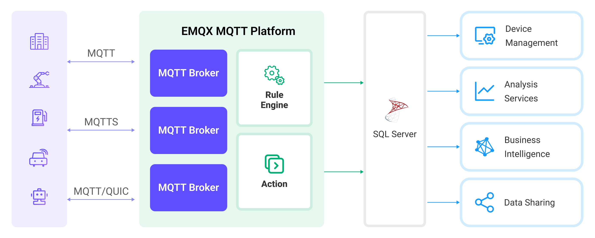

# 将 MQTT 数据写入到 Microsoft SQL Server


:::tip
EMQX 企业版功能。EMQX 企业版可以为您带来更全面的关键业务场景覆盖、更丰富的数据集成支持，更高的生产级可靠性保证以及 24/7 的全球技术支持，欢迎[免费试用](https://www.emqx.com/zh/try?product=enterprise)。
:::


[SQL Server](https://www.microsoft.com/en-us/sql-server/) 是领先的关系型商业数据库解决方案之一，被广泛应用于各种规模和类型的企业和组织中。EMQX 支持与 SQL Server 集成，使您能够将 MQTT 消息和客户端事件保存到 SQL Server 以便于构建复杂的数据管道和分析流程实现数据管理和分析，或进行设备连接管理并与其他 ERP, CRM，BI 企业系统的集成。

本页详细介绍了 EMQX 与 Microsoft SQL Server 的数据集成并提供了实用的规则和 Sink 创建指导。



::: tip

仅 EMQX 5.0.3 及以上版本支持 Microsoft SQL Server Sink 功能。

:::



## 工作原理

Microsoft SQL Server 数据集成是 EMQX 的开箱即用功能，结合了 EMQX 的设备接入、消息传输能力与 Microsoft SQL Server 强大的数据存储能力。通过内置的[规则引擎](./rules.md)组件和 Sink ，您可以将 MQTT 消息和客户端事件存储到 Microsoft SQL Server 中，也可以通过事件触发对 Microsoft SQL Server 中数据的更新或删除操作，从而实现对诸如设备在线状态、上下线历史等的记录。该集成简化了从 EMQX 到 Microsoft SQL Server 的数据摄取过程，无需复杂的编码。

下图展示了 EMQX 和 SQL Server 之间的数据集成的典型架构:



将 MQTT 数据摄取到 Microsoft SQL Server 的工作流程如下：

1. **消息发布和接收**：工业物联网设备通过 MQTT 协议成功连接到 EMQX，并根据其运行状态、读数或触发的事件，从机器、传感器和生产线发布实时 MQTT 数据到 EMQX。当 EMQX 接收到这些消息时，它将在其规则引擎中启动匹配过程。
2. **消息数据处理**：当消息到达时，它会通过规则引擎进行处理，然后由 EMQX 中定义的规则处理。规则根据预定义的标准确定哪些消息需要路由到 Microsoft SQL Server。如果任何规则指定了载荷转换，那么这些转换将被应用，例如转换数据格式、过滤出特定信息，或用额外的上下文丰富载荷。
3. **数据写入到 Microsoft SQL Server**：规则触发将消息写入 Microsoft SQL Server 的操作。借助 SQL 模板，用户可以从规则处理结果中提取数据来构造 SQL 并发送到 Microsoft SQL Server 执行，从而将消息的特定字段写入或更新到数据库的相应表和列中。
4. **数据存储和利用**：数据现存储在 Microsoft SQL Server 中，企业可以利用其查询能力应用于各种用例。

## 特性与优势

与 Microsoft SQL Server 的数据集成提供了一系列特性和优势，确保了数据传输、存储和利用的高效性：

- **实时数据流**：EMQX 专为处理实时数据流而构建，确保了从源系统到 Microsoft SQL Server 的数据传输的高效性和可靠性。它使组织能够实时捕获和分析数据，非常适合需要立即洞察和行动的用例。
- **高性能和可扩展性**：EMQX 和 Microsoft SQL Server 都具有扩展性和可靠性的特点，适用于处理大规模的物联网数据，并在需求增长时进行不停机的水平和垂直扩展，确保物联网应用程序的连续性和可靠性。
- **数据转换的灵活性**：EMQX 提供了强大的基于 SQL 的规则引擎，允许组织在将数据存储到 Microsoft SQL Server 之前进行预处理。它支持各种数据转换机制，如过滤、路由、聚合和丰富，使组织能够根据他们的需求塑造数据。
- **高级分析**：Microsoft SQL Server 提供了强大的分析能力，例如通过 Analysis Services 构建多维数据模型，以支持复杂的数据分析和数据挖掘，通过 Reporting Services 创建和发布报告，向利益相关者展示物联网数据的洞察和分析结果。

## 准备工作

本节介绍了在 EMQX 中创建 Microsoft SQL Server 数据集成之前需要做的准备工作，包括如何设置 Microsoft SQL Server 服务器并创建数据库和数据表、安装并配置 ODBC 驱动程序。

### 前置准备

- 了解 [规则](./rules.md)。
- 了解[数据集成](./data-bridges.md)。

### 安装并连接到 Microsoft SQL Server

本节描述如何使用 Docker 镜像在 Linux/MacOS 安装启动 Microsoft SQL Server 2019 以及如何使用 `sqlcmd` 连接到 Microsoft SQL Server。关于其他 Microsoft SQL Server 的安装方式，请参阅微软提供的 [Microsoft SQL Server 安装指南](https://learn.microsoft.com/zh-cn/sql/database-engine/install-windows/install-sql-server?view=sql-server-ver16)。

1. 通过 Docker 安装并启动 Microsoft SQL Server。

   Microsoft SQL Server 要求使用复杂密码，请参阅[使用复杂密码](https://learn.microsoft.com/zh-cn/sql/relational-databases/security/password-policy?view=sql-server-ver16#password-complexity)。
   使用环境变量 `ACCEPT_EULA=Y` 启动 Docker 容器代表您同意 Microsoft 的 EULA 条款，详情请参阅 [MICROSOFT 软件许可条款 MICROSOFT SQL SERVER 2019 STANDARD(ZH_CN)](https://www.microsoft.com/en-us/Useterms/Retail/SQLServerStandard/2019/Useterms_Retail_SQLServerStandard_2019_ChineseSimplified.htm)。

   ```bash
   # 启动一个 Microsoft SQL Server 容器并设置密码为 `mqtt_public1`
   $ docker run --name sqlserver -p 1433:1433 -e ACCEPT_EULA=Y -e MSSQL_SA_PASSWORD=mqtt_public1 -d mcr.microsoft.com/mssql/server:2019-CU19-ubuntu-20.04
   ```

2. 进入 Docker 容器。

   ```bash
   $ docker exec -it sqlserver bash
   ```

3. 在容器中连接到 Microsoft SQL Server 服务器，需要输入预设的密码。输入密码时字符不会回显。请输入密码后直接键入 `Enter`。

   ```bash
   $ /opt/mssql-tools/bin/sqlcmd -S 127.0.0.1 -U sa
   $ Password:
   1>
   ```

   ::: tip

   Microsoft 提供的 Microsoft SQL Server 容器内已安装 `mssql-tools`，但可执行文件并不在 `$PATH` 中，因此您需要指定可执行文件路径。在上述连接示例中，可执行文件路径为 `opt`。

   关于更多 `mssql-tools` 的使用，请阅读 [sqlcmd 实用工具](https://learn.microsoft.com/zh-cn/sql/tools/sqlcmd/sqlcmd-utility?view=sql-server-ver16)。

   :::

至此 Microsoft SQL Server 2019 实例已经完成部署并可以连接。

### 创建数据库和数据表

本节描述如何在 Microsoft SQL Server 中创建数据库与数据表。

1. 使用已创建的连接在 Microsoft SQL Server 中创建数据库 `mqtt`。

   ```bash
   ...
   Password:
   1> USE master
   2> GO
   Changed database context to 'master'.
   1> IF NOT EXISTS(SELECT name FROM sys.databases WHERE name = 'mqtt') BEGIN CREATE DATABASE mqtt END
   2> GO
   ```


2. 使用 SQL 语句在此数据库中创建数据表。

   - 如需用于 MQTT 消息存储，创建数据表 `t_mqtt_msg`。该表存储每条消息的 MsgID、主题、QoS、Payload 以及发布时间。

     ```sql
     CREATE TABLE mqtt.dbo.t_mqtt_msg (id int PRIMARY KEY IDENTITY(1000000001,1) NOT NULL,
                                       msgid   VARCHAR(64) NULL,
                                       topic   VARCHAR(100) NULL,
                                       qos     tinyint NOT NULL DEFAULT 0,
                                       payload VARCHAR(100) NULL,
                                       arrived DATETIME NOT NULL DEFAULT CURRENT_TIMESTAMP);
     GO
     ```

   - 如需用于设备上下线状态记录，创建数据表 `t_mqtt_events`。

     ```sql
     CREATE TABLE mqtt.dbo.t_mqtt_events (id int PRIMARY KEY IDENTITY(1000000001,1) NOT NULL,
                                          clientid VARCHAR(255) NULL,
                                          event_type VARCHAR(255) NULL,
                                          event_time DATETIME NOT NULL DEFAULT CURRENT_TIMESTAMP);
     GO
     ```


### 安装并配置 ODBC 驱动程序

为了能够访问 Microsoft SQL Server 数据库，您需要安装并配置 ODBC 驱动程序。您可以使用 Microsoft 发布的 msodbcsql17 (msodbcsql18 的连接属性仍未进行适配) 或者 FreeTDS 作为 ODBC 驱动程序。

EMQX 使用 `odbcinst.ini` 配置中的 DSN Name 来确定驱动动态库的路径，有关的详细信息请参考[连接属性](https://learn.microsoft.com/zh-cn/sql/connect/odbc/linux-mac/connection-string-keywords-and-data-source-names-dsns?view=sql-server-ver16#connection-properties)。

::: tip 注意：

您可以根据自己的喜好命名 DSN Name，但建议只使用英文字母。此外 DSN Name 大小写敏感。

:::

#### 安装配置 msodbcsql17 作为 ODBC 驱动程序

<!-- TODO: update tag version in command and dockerfile -->

如需安装配置 msodbcsql17 作为 ODBC 驱动程序，您需要参考微软的安装指导：

- [安装 Microsoft ODBC Driver for SQL Server (Linux)](https://learn.microsoft.com/zh-cn/sql/connect/odbc/linux-mac/installing-the-microsoft-odbc-driver-for-sql-server?view=sql-server-ver16&tabs=alpine18-install%2Calpine17-install%2Cdebian8-install%2Credhat7-13-install%2Crhel7-offline)
- [安装 Microsoft ODBC Driver for SQL Server (macOS)](https://learn.microsoft.com/zh-cn/sql/connect/odbc/linux-mac/install-microsoft-odbc-driver-sql-server-macos?view=sql-server-ver16)

受限于 [Microsoft EULA 条款](https://www.microsoft.com/en-us/Useterms/Retail/SQLServerStandard/2019/Useterms_Retail_SQLServerStandard_2019_ChineseSimplified.htm)，EMQX 提供的 Docker 镜像不带有 msodbcsql17 驱动程序，如需在 Docker 或 Kubernetes 中使用该驱动程序，您需要基于 [EMQX-Enterprise](https://hub.docker.com/r/emqx/emqx-enterprise) 提供的镜像构建带有 ODBC 驱动程序的新镜像以便在连接 Microsoft SQL Server 数据库时使用 msodbcsql17 驱动程序。使用构建的新镜像，代表您同意 Microsoft SQL Server EULA。

1. 在 EMQX 的仓库中找到对应的 [Dockerfile](https://github.com/emqx/emqx/blob/master/deploy/docker/Dockerfile.msodbc)。您可以将该文件保存至本地。

   下面的示例中 Dockerfile 中的镜像版本为 `emqx/emqx-enterprise:5.0.3-alpha.2`，对于 EMQX-Enterprise 5.0.3 以后的版本，可以根据您需要的 EMQX-Enterprise 版本构建镜像，也可以使用 EMQX-Enterprise 最新版本镜像 `emqx/emqx-enterprise:latest` 进行构建。

   ```dockerfile
   # FROM emqx/emqx-enterprise:latest
   FROM emqx/emqx-enterprise:5.0.3-alpha.2

   USER root

   RUN apt-get update \
       && apt-get install -y gnupg2 curl apt-utils \
       && curl https://packages.microsoft.com/keys/microsoft.asc | apt-key add - \
       && curl https://packages.microsoft.com/config/debian/11/prod.list > /etc/apt/sources.list.d/mssql-release.list \
       && apt-get update \
       && ACCEPT_EULA=Y apt-get install -y msodbcsql17 unixodbc-dev \
       && sed -i 's/ODBC Driver 17 for SQL Server/ms-sql/g' /etc/odbcinst.ini \
       && apt-get clean \
       && rm -rf /var/lib/apt/lists/*

   USER emqx
   ```

2. 使用命令 `docker build -f=Dockerfile.msodbc -t emqx-enterprise-with-msodbc:5.0.3-alpha.2 .` 构建镜像。

3. 构建完成后可以使用 `docker image ls` 来获取本地的 image 列表，您也可以将镜像上传或保存备用。

::: tip 注意：

使用上文给出的示例安装 msodbcsql17 驱动后，请确认 `odbcinst.ini` 中的 DSN Name 为 `ms-sql` 。您也可以根据需要修改 DSN Name。

:::

#### 安装配置 FreeTDS 作为 ODBC 驱动程序

本节介绍了在几种主流发行版上安装配置 FreeTDS 作为 ODBC 驱动程序的方式。在此处给出的示例中，DSN Name 均为 `ms-sql`。

在 MacOS 上安装配置 FreeTDS 作为 ODBC 驱动程序:
```bash
$ brew install unixodbc freetds
$ vim /usr/local/etc/odbcinst.ini

[ms-sql]
Description = ODBC for FreeTDS
Driver      = /usr/local/lib/libtdsodbc.so
Setup       = /usr/local/lib/libtdsodbc.so
FileUsage   = 1
```

在 Centos 上安装配置 FreeTDS 作为 ODBC 驱动程序:
```bash
$ yum install unixODBC unixODBC-devel freetds freetds-devel perl-DBD-ODBC perl-local-lib
$ vim /etc/odbcinst.ini
# 加入以下内容
[ms-sql]
Description = ODBC for FreeTDS
Driver      = /usr/lib64/libtdsodbc.so
Setup       = /usr/lib64/libtdsS.so.2
Driver64    = /usr/lib64/libtdsodbc.so
Setup64     = /usr/lib64/libtdsS.so.2
FileUsage   = 1
```

在 Ubuntu 上安装配置 FreeTDS 作为 ODBC 驱动程序（以 Ubuntu20.04 为例，其他版本请参考 ODBC 官方文档）:
```bash
$ apt-get install unixodbc unixodbc-dev tdsodbc freetds-bin freetds-common freetds-dev libdbd-odbc-perl liblocal-lib-perl
$ vim /etc/odbcinst.ini
# 加入以下内容
[ms-sql]
Description = ODBC for FreeTDS
Driver      = /usr/lib/x86_64-linux-gnu/odbc/libtdsodbc.so
Setup       = /usr/lib/x86_64-linux-gnu/odbc/libtdsS.so
FileUsage   = 1
```

## 创建连接器

在创建 Microsoft SQL Server Sink 之前，您需要创建一个连接器，以便 EMQX 与 Microsoft SQL Server 服务建立连接。以下示例假定您在本地机器上同时运行 EMQX 和 Microsoft SQL Server。如果您在远程运行 Microsoft SQL Server 和 EMQX，请相应地调整设置。

1. 转到 Dashboard **集成** -> **连接器** 页面。点击页面右上角的**创建**。
2. 在连接器类型中选择 **Microsoft SQL Server**，点击**下一步**。
3. 在 **配置** 步骤，配置以下信息：

   - **连接器名称**：应为大写和小写字母及数字的组合，例如：`my_sqlserver`。
   - **服务器地址**： `127.0.0.1:1433`，或使用实际的 Microsoft SQL Server 地址和端口
   - **数据库名字**： `mqtt`
   - **用户名**： `sa`
   - **密码**： `mqtt_public1`
   - **SQL Server Driver 名称**： `ms-sql`，即您在 `odbcinst.ini` 中配置的 DSN Name
4. 高级配置（可选）：详细请参考 [Sink 的特性](./data-bridges.md#sink-的特性)。
5. 在点击**创建**之前，您可以点击**测试连接**来测试连接器是否能连接到 Microsoft SQL Server 服务器。
6. 点击**创建**按钮完成连接器创建。
7. 在弹出的**创建成功**对话框中您可以点击**创建规则**，继续创建规则以指定需要写入 RocketMQ 的数据和需要记录的客户端事件。您也可以按照[创建消息存储 Sink 规则](#创建消息存储-sink-规则)和[创建事件记录 Sink 规则](#创建事件记录-sink-规则)章节的步骤来创建规则。

## 创建消息存储 Sink 规则

本节演示了如何在 Dashboard 中创建一条规则，用于处理来自源 MQTT 主题 `t/#` 的消息，并通过配置的 Sink 将处理后的结果写入到 Microsoft SQL Server 的数据表 `mqtt.dbo.t_mqtt_msg` 中。

1. 转到 Dashboard **集成** -> **规则**页面。

2. 点击页面右上角的**创建**。

3. 输入规则 ID `my_rule`。如需实现对指定主题消息的转发，例如将 `t/#` 主题的 MQTT 消息存储至 Microsoft SQL Server，在 **SQL 编辑器**中输入以下 SQL 语句：
   注意：如果您希望制定自己的 SQL 语句，需要确保规则选出的字段（SELECT 部分）包含之后在 Sink 中配置的 SQL 模板中所有用到的变量。

   ```sql
    SELECT
      *
    FROM
      "t/#"
   ```

   ::: tip

   如果您初次使用 SQL，可以点击 **SQL 示例**和**启用调试**来学习和测试规则 SQL 的结果。

   :::

4. 点击右侧的**添加动作**按钮，为规则在被触发的情况下指定一个动作。通过这个动作，EMQX 会将经规则处理的数据发送到 Microsoft SQL Server。

5. 在**动作类型**下拉框中选择 `Microsoft SQL Server`，保持**动作**下拉框为默认的`创建动作`选项，您也可以选择一个之前已经创建好的 Microsoft SQL Server Sink。此示例将创建一个全新的 Sink 并添加到规则中。

6. 输入 Sink 名称，名称应为大/小写字母和数字的组合。

7. 从**连接器**下拉框中选择刚刚创建的 `my_sqlserver`。您也可以通过点击下拉框旁边的按钮创建一个新的连接器。有关配置参数，请参见[创建连接器](#创建连接器)。

9. 配置 SQL 模板。如需实现对指定主题消息的转发，使用如下 SQL 语句完成数据插入。此处为[预处理 SQL](./data-bridges.md#sql-预处理)，字段不应当包含引号，SQL 末尾不要带分号 `;`。

   ```sql
   insert into t_mqtt_msg(msgid, topic, qos, payload) values ( ${id}, ${topic}, ${qos}, ${payload} )
   ```
   
10. 高级配置（可选），根据情况配置同步/异步模式，队列与批量等参数，详细请参考 [Sink 的特性](./data-bridges.md#sink-的特性)。

11. 在点击**创建**按钮完成 Sink 创建之前，您可以使用**测试连接**来测试当前 Sink 到 Microsoft SQL Server 的连接是否成功。

12. 点击**创建**按钮完成 Sink 创建，新建的 Sink 将被添加到**动作输出**列表中。

13. 回到创建规则页面，对配置的信息进行确认，点击**创建**。一条规则应该出现在规则列表中。

现在您已成功创建了通过 Microsoft SQL Server Sink 将数据转发到 Microsoft SQL Server 的规则，同时在**规则**页面的**动作(Sink)** 标签页看到新建的 Microsoft SQL Server Sink。

您还可以点击 **集成** -> **Flow 设计器**可以查看拓扑，通过拓扑可以直观的看到，主题 `t/#` 下的消息在经过规则 `my_rule` 解析后被发送到 Microsoft SQL Server 中。

## 创建事件记录 Sink 规则

本节展示如何创建用于记录客户端上/下线状态的规则，并通过配置的 Sink 将记录写入到 Microsoft SQL Server 的数据表 `mqtt.dbo.t_mqtt_events` 中。

注意：除规则 SQL 和 Sink 的 SQL 模板设置不同外，其他操作步骤与[创建消息存储 Sink 规则](#创建消息存储-sink-规则)章节完全相同。

规则 SQL 如下：

```sql
SELECT
  *,
  floor(timestamp / 1000) as s_shift,
  timestamp div 1000 as ms_shift
FROM
  "$events/client_connected", "$events/client_disconnected"
```

Sink 的 SQL 模板如下:

```sql
insert into t_mqtt_events(clientid, event_type, event_time) values ( ${clientid}, ${event}, DATEADD(MS, ${ms_shift}, DATEADD(S, ${s_shift}, '19700101 00:00:00:000') ) )
```

## 测试规则

使用 MQTTX 向 `t/1` 主题发布消息。

```bash
mqttx pub -i emqx_c -t t/1 -m '{ "msg": "Hello SQL Server" }'
```

查看 Microsoft SQL Server Sink 运行统计。

- 用于消息存储的 Sink ，命中、发送成功次数均 +1。查看数据是否已经写入 `mqtt.dbo.t_mqtt_msg` 表中：

```bash
1> SELECT * from mqtt.dbo.t_mqtt_msg
2> GO
id          msgid                                                            topic                                                                                                qos payload                                                                                              arrived
----------- ---------------------------------------------------------------- ---------------------------------------------------------------------------------------------------- --- ---------------------------------------------------------------------------------------------------- -----------------------
 1000000001 0005F995096D9466F442000010520002                                 t/1                                                                                                    0 { "msg": "Hello SQL Server" }                                                                        2023-04-18 04:49:47.170

(1 rows affected)
1>
```

- 用于存储上下线事件的 Microsoft SQL Server Sink ，命中、发送次数均 +2，即一次上线和一次下线。查看设备状态是否已经写入 `mqtt.dbo.t_mqtt_events` 表中：

```bash
1> SELECT * from mqtt.dbo.t_mqtt_events
2> GO
id          clientid                                                         event_type                                                                                                                                                                                                    event_time
----------- ---------------------------------------------------------------- ------------------------------------------------------------------------------------------------------------------------------------------------------------------------------------------------------------- -----------------------
 1000000001 emqx_c                                                           client.connected                                                                                                                                                                                              2023-04-18 04:49:47.140
 1000000002 emqx_c                                                           client.disconnected                                                                                                                                                                                           2023-04-18 04:49:47.180

(2 rows affected)
1>
```

