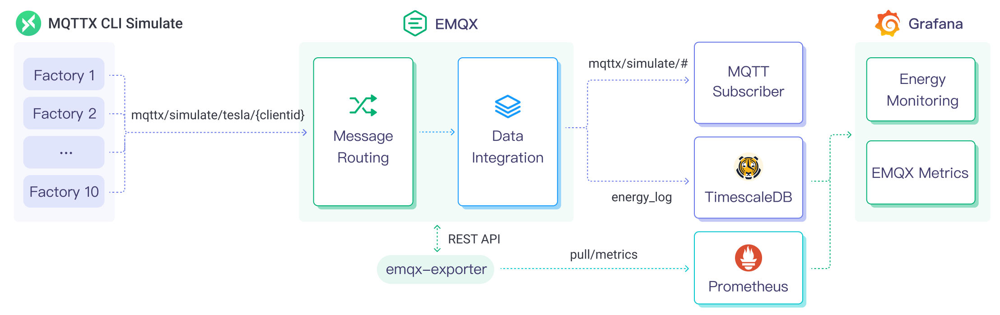
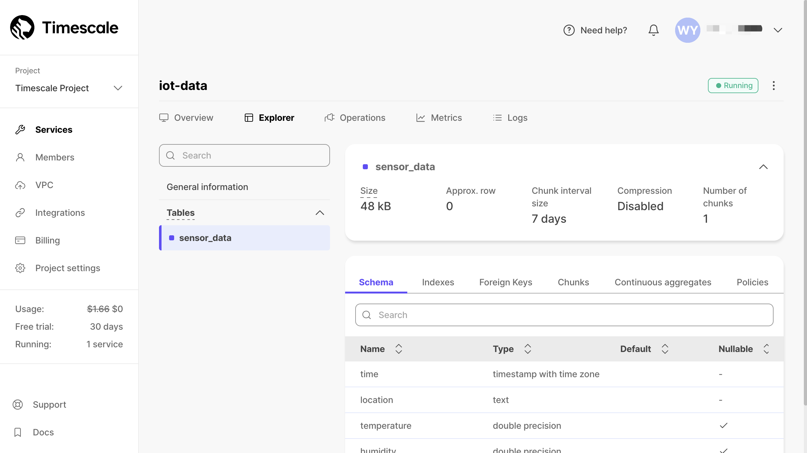

# 将 MQTT 数据写入到 TimescaleDB


:::tip
EMQX 企业版功能。EMQX 企业版可以为您带来更全面的关键业务场景覆盖、更丰富的数据集成支持，更高的生产级可靠性保证以及 24/7 的全球技术支持，欢迎[免费试用](https://www.emqx.com/zh/try?product=enterprise)。
:::


[Timescale](https://www.timescale.com/) (TimescaleDB) 是一个专门用于存储和分析时间序列数据的数据库，它的出色数据吞吐能力和可靠的性能表现使其成为物联网领域的理想选择，EMQX 通过与 TimescaleDB 集成，能够将 MQTT 数据无缝的集成到 TimescaleDB 进行存储，并借助其丰富的数据分析能力，为物联网应用提供了高效、可扩展的数据存储和分析解决方案。

本页详细介绍了 EMQX 与 TimescaleDB 的数据集成并提供了实用的规则和 Sink 创建指导。

## 工作原理

Timscale 数据集成是 EMQX 中开箱即用的功能，它结合了 EMQX 的设备接入、消息传输能力与 TimescaleDB 的数据存储和分析能力，通过简单的配置即可实现 MQTT 数据的无缝集成。

下图展示了工业物联网中 EMQX 和 TimescaleDB 数据集成的典型架构。



EMQX 和 TimescaleDB 提供了一个可扩展的物联网平台，用于高效地实时收集和分析能耗数据。在此架构中，EMQX 作为物联网平台，负责设备接入、消息传输、数据路由等功能，TimescaleDB 作为数据存储和分析平台，负责数据存储、数据分析等功能。

EMQX 通过规则引擎与 Sink 将设备数据转发至 TimescaleDB，TimescaleDB 通过 SQL 语句对数据进行分析，生成报表、图表等数据分析结果，通过 TimescaleDB 的可视化工具展示给用户。其工作流程如下：

1. **物联网设备发布消息**：工业设备使用 MQTT 协议定期发布能耗数据，这些数据包括产线标识、能耗值信息。
2. **消息数据处理**：作为 MQTT 服务器，EMQX 从工业设备接收到消息后将在规则引擎中进行比对。
3. **规则引擎处理消息**：通过内置的规则引擎，可以根据主题匹配处理特定来源的消息。当消息到达时，它会通过规则引擎，规则引擎会匹配对应的规则，并对消息数据进行处理，例如转换数据格式、过滤掉特定信息或使用上下文信息丰富消息。
4. **写入到 TimescaleDB**：规则引擎中定义的规则触发将消息写入到 TimescaleDB 的操作。TimescaleDB Sink 提供了 SQL 模板，能够灵活地定义写入的数据格式，将消息中的特定字段写入到 TimescaleDB 的对应的表和列中。

能耗数据写入到 TimescaleDB 后，您可以灵活的使用 SQL 语句对数据进行分析，例如：

- 连接到可视化工具，例如 Grafana，根据数据生成图表，展示能耗数据。
- 连接到应用系统，例如 ERP，进行生产分析与生产计划调整。
- 连接到业务系统，实时分析能源使用情况，便于数据驱动节能管理。

## 特性与优势

在 EMQX 中使用 TimescaleDB Sink 能够为您的业务带来以下特性与优势：

- **高效的数据处理能力**：EMQX 能够处理海量物联网设备连接与消息吞吐，TimescaleDB 在数据写入、存储和查询方面具有出色的性能表现，能够满足物联网场景下的数据处理需求，不会导致系统不堪重负。
- **消息转换**：消息可以写入 TimescaleDB 之前，通过 EMQX 规则中进行丰富的处理和转换。
- **高效存储和可扩展性**：EMQX 与 TimescaleDB 都具备集群扩展能力，能够随着业务的发展，利用灵活地进行集群水平扩展，满足业务的发展需求。
- **丰富的查询能力**：TimescaleDB 提供包括优化的函数、运算符和索引技术，可实现对时间戳数据的高效查询和分析，准确地从 IoT 时间序列数据中提取有价值的见解。

## 准备工作

本节介绍了在 EMQX 中创建 TimescaleDB 数据集成之前需要做的准备工作，包括安装 TimescaleDB 和创建数据表。

### 前置准备

- 了解[规则](./rules.md)。
- 了解[数据集成](./data-bridges.md)。

### 安装 TimescaleDB 并创建数据表

EMQX 支持与私有部署的 TimescaleDB 或与云上的 Timescale Service 集成。您可以使用 Timescale Service 云服务或者 Docker 部署一个 TimescaleDB 实例。

:::: tabs 
::: tab Timescale Service

1. 如果您没有 Timescale 账户，参考[创建一个 Timescale 账户](https://docs.timescale.com/getting-started/latest/services/#create-your-timescale-account)。

2. 登录到 Timescale portal 并[创建 Timescale service](https://docs.timescale.com/getting-started/latest/services/#create-your-first-service), 注意保存服务的密码。

3. 在 Overview 页面获取连接信息, EMQX 所需的字段包括 **Database name**, **Host**, **Port** and **Username**。

4. 使用 `psql client` [连接到 service](https://docs.timescale.com/getting-started/latest/services/#connect-to-your-service)。

   ```bash
   # 使用 servie URL 连接
   psql "postgres://tsdbadmin@xxxxx.xxxxx.tsdb.cloud.timescale.com:32541/tsdb?sslmode=require"
   # 输入使用步骤 2 中的密码
   Password for user tsdbadmin:
   ```

5. 创建 `sensor_data` 表用于存储客户端发布的消息：

   ```sql
   CREATE TABLE sensor_data (
       time        TIMESTAMPTZ       NOT NULL,
       location    TEXT              NOT NULL,
       temperature DOUBLE PRECISION  NULL,
       humidity    DOUBLE PRECISION  NULL
   );
   
   SELECT create_hypertable('sensor_data', 'time');
   ```

完成后, 您可以在 service 详情中的 **Explorer** 页签中查看  `sensor_data` 表的信息：



:::

::: tab TimescaleDB Docker

1. 如果没有 Docker 环境请[安装 Docker](https://docs.docker.com/install/)。

2. 启动 TimescaleDB 容器，并通过环境变量设置数据库密码。

   ```bash
   docker run -d --name timescaledb \
       -p 5432:5432 \
       -e POSTGRES_PASSWORD=public \
       timescale/timescaledb:latest-pg13
   ```

3. 创建数据库。

   ```bash
   docker exec -it timescaledb psql -U postgres
   
   ## create tsdb database
   > CREATE database tsdb;
   
   > \c tsdb;
   ```

4. 创建 `sensor_data` 表用于存储客户端发布的消息。

   ```sql
   CREATE TABLE sensor_data (
       time        TIMESTAMPTZ       NOT NULL,
       location    TEXT              NOT NULL,
       temperature DOUBLE PRECISION  NULL,
       humidity    DOUBLE PRECISION  NULL
   );
   
   SELECT create_hypertable('sensor_data', 'time');
   ```

:::
::::

## 创建连接器

在添加 TimescaleDB Sink 前，您需要创建 TimescaleDB 连接器。

以下步骤假设您在本地机器上同时运行 EMQX 和 TimescaleDB（若私有部署）。如果您有远程运行的 EMQX 和 TimescaleDB，请相应地调整设置。

1. 转到 Dashboard **集成** -> **连接器**页面。
2. 点击页面右上角的**创建**。
3. 在连接器类型中选择 **TimescaleDB**，点击下一步。
4. 输入连接器名称，要求是大小写英文字母和数字的组合。这里我们输入 `my-timescale`。
5. 输入 TimescaleDB 连接信息，根据你的部署方式输入对应的 TimescaleDB 连接信息，如果使用的是 Docker，**服务器地址**填写 `127.0.0.1:5432`，**数据库**填写 `tsdb`，**用户名**为 `postgres`，**密码**为 `public`。
6. 点击最下方**创建**按钮完成连接器创建。
至此您已经完成连接器创建，接下来将继续创建一条规则和 Sink 来指定需要写入的数据。

## 创建 TimescaleDB Sink 规则

本节演示了如何在 EMQX 中创建一条规则，用于处理来自源 MQTT 主题 `t/#` 的消息，并通过配置的 Sink 将处理后的结果写入到 TimescaleDB 的数据表 `sensor_data` 中。

1. 转到 Dashboard **集成** -> **规则**页面。

2. 点击页面右上角的**创建**。

3. 输入规则 ID `my_rule`，在 SQL 编辑器中输入规则，此处选择将 `t/#` 主题的 MQTT 消息存储至 TimescaleDB，规则 SQL 如下：

   ```sql
   SELECT
     payload.temp as temp,
     payload.humidity as humidity,
     payload.location as location
   FROM
       "t/#"
   ```

   ::: tip

   如果您初次使用 SQL，可以点击 **SQL 示例** 和**启用调试**来学习和测试规则 SQL 的结果。

   :::

4. 添加动作，从**动作类型**下拉列表中选择 TimescaleDB，保持动作下拉框为默认的“创建动作”选项，您也可以从动作下拉框中选择一个之前已经创建好的 TimescaleDB 动作。此处我们创建一个全新的 Sink 并添加到规则中。

5. 在下方的表单中输入 Sink 的名称与描述。

6. 在连接器下拉框中选择刚刚创建的 `my-timescale` 连接器。您也可以点击下拉框旁边的创建按钮，在弹出框中快捷创建新的连接器，所需的配置参数可以参考[创建连接器](#创建连接器)。
7. 配置 SQL 模板，使用如下 SQL 完成数据插入。

   ::: tip

   此处为[预处理 SQL](./data-bridges.md#sql-预处理)，字段不应当包含引号，SQL 末尾不要带分号 `;`。

   :::

   ```sql
    INSERT INTO
    sensor_data (time, location, temperature, humidity)
    VALUES
      (NOW(), ${location}, ${temp}, ${humidity})
   ```

8. 展开**高级设置**，根据需要配置高级设置选项（可选），详细请参考[高级设置](#高级设置)。

9. 其余参数使用默认值即可。点击**创建**按钮完成 Sink 的创建，创建成功后页面将回到创建规则，新的 Sink 将添加到规则动作中。

10. 回到规则创建页面，点击**创建**按钮完成整个规则创建。


现在您已成功创建了规则，你可以在**规则**页面上看到新建的规则，同时在**动作(Sink)** 标签页看到新建的 TimescaleDB Sink。

您也可以点击 **集成** -> **Flow 设计器**查看拓扑，通过拓扑可以直观的看到，主题 `t/#` 下的消息在经过规则 `my_rule` 解析后被写入到 TimescaleDB 中。

## 测试规则

使用 MQTTX 向 `t/1` 主题发布消息，此操作同时会触发上下线事件：

```bash
mqttx pub -i emqx_c -t t/1 -m '{"temp":24,"humidity":30,"location":"hangzhou"}'
```

分别查看 Sink 运行统计，命中、发送成功次数均 +1。

查看数据是否已经写入`sensor_data` 表中：

```bash
tsdb=# select * from sensor_data;
             time              | location | temperature | humidity 
-------------------------------+----------+-------------+----------
 2023-07-10 08:28:48.813988+00 | hangzhou |          24 |       30
 2023-07-10 08:28:57.737768+00 | hangzhou |          24 |       30
 2023-07-10 08:28:58.599537+00 | hangzhou |          24 |       30
(3 rows)
```

## 高级设置

本节将深入介绍可用于 TimescaleDB 连接器与 Sink 的高级配置选项。在 Dashboard 中配置连接器与 Sink 时，您可以根据您的特定需求展开**高级设置**，调整以下参数。

| 字段名称             | 描述                                                         | 默认值 |
| -------------------- | ------------------------------------------------------------ | ------ |
| **连接池大小**       | 指定在与 Timescale 服务进行接口时，可以维护在连接池中的并发连接数。此选项有助于通过限制或增加 EMQX 与 Timescale 之间的活动连接数量来管理应用程序的可扩展性和性能。<br /> 注意：设置适当的连接池大小取决于诸多因素，如系统资源、网络延迟以及应用程序的具体工作负载等。过大的连接池大小可能导致资源耗尽，而过小的大小可能会限制吞吐量。 | `8`    |
| **启动超时时间**     | 确定连接器在回应资源创建请求之前等待自动启动的资源达到健康状态的最长时间间隔（以秒为单位）。此设置有助于确保连接器在验证连接的资源（例如 Timescale 中的数据库实例）完全运行并准备好处理数据事务之前不会执行操作。 | `5`    |
| **缓存池大小**       | 指定缓冲区工作进程数量，这些工作进程将被分配用于管理 EMQX 与 Timescale 的出口 （egress）类型 Sink 中的数据流，它们负责在将数据发送到目标服务之前临时存储和处理数据。此设置对于优化性能并确保出口（egress）场景中的数据传输顺利进行尤为重要。对于仅处理入口 （ingress）数据流的桥接，此选项可设置为 `0`，因为不适用。 | `16`   |
| **请求超期**         | “请求 TTL”（生存时间）配置设置指定了请求在进入缓冲区后被视为有效的最长持续时间（以秒为单位）。此计时器从请求进入缓冲区时开始计时。如果请求在缓冲区内停留的时间超过了此 TTL 设置或者如果请求已发送但未能在 Timescale 中及时收到响应或确认，则将视为请求已过期。 | `45`   |
| **健康检查间隔**     | 指定 Sink 对与 Timescale 的连接执行自动健康检查的时间间隔（以秒为单位）。 | `15`   |
| **缓存队列最大长度** | 指定可以由 Timescale Sink 中的每个缓冲器工作进程缓冲的最大字节数。缓冲器工作进程在将数据发送到 Timescale 之前会临时存储数据，充当处理数据流的中介以更高效地处理数据流。根据系统性能和数据传输要求调整该值。 | `256`  |
| **最大批量请求大小** | 指定可以在单个传输操作中从 EMQX 发送到 Timescale 的数据批处理的最大大小。通过调整此大小，您可以微调 EMQX 与 Timescale 之间数据传输的效率和性能。<br />如果将“最大批处理大小”设置为“1”，则数据记录将单独发送，而不会分组成批处理。 | `1`    |
| **请求模式**         | 允许您选择`同步`或`异步`请求模式，以根据不同要求优化消息传输。在异步模式下，写入到 Timescale 不会阻塞 MQTT 消息发布过程。但是，这可能导致客户在它们到达 Timescale 之前就收到了消息。 | `异步` |
| **请求飞行队列窗口** | “飞行队列请求”是指已启动但尚未收到响应或确认的请求。此设置控制 Sink 与 Timescale 通信时可以同时存在的最大飞行队列请求数。<br/>当 **请求模式** 设置为 `异步` 时，“请求飞行队列窗口”参数变得特别重要。如果对于来自同一 MQTT 客户端的消息严格按顺序处理很重要，则应将此值设置为 `1`。 | `100`  |

## 更多内容

您可以通过以下链接查看更多关于 Timescale 集成的内容：

**博客**：

[MQTT Performance Benchmark Testing: EMQX-TimescaleDB Integration](https://www.emqx.com/en/blog/mqtt-performance-benchmark-series-emqx-timescaledb-integration)

[使用 MQTT 和 Timescale 为工业能耗监控构建物联网时序数据应用](https://www.emqx.com/zh/blog/build-an-iot-time-series-data-application-for-energy-storage-with-mqtt-and-timescale)

