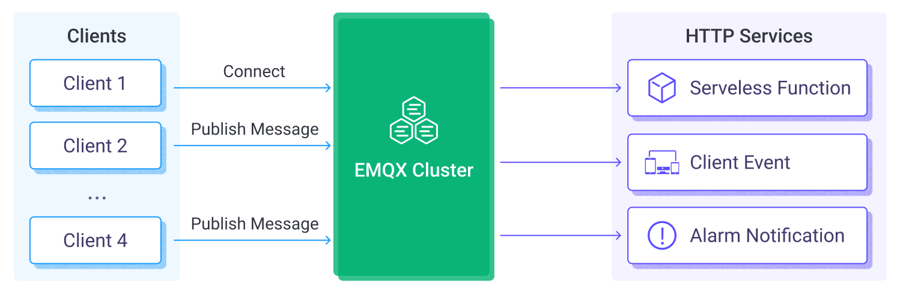

# 将 MQTT 数据发送到 HTTP 服务

HTTP 服务数据集成提供了将 EMQX 与外部服务快速集成的方法。它支持灵活的配置请求方法和请求数据格式，提供了 HTTPS 安全的通信机制以及身份验证机制，能够实时传输客户端的消息和事件数据，高效、灵活地实现物联网设备状态推送、告警通知以及数据集成等场景。

本页详细介绍了 HTTP 服务数据集成的功能特性，并提供了实用的规则和 HTTP 服务 Sink 创建指导。

::: tip
对于那些需要集成 HTTP 服务但无需使用规则进行数据处理的用户，我们推荐使用 [Webhook](./webhook.md)，因为它更加简单易用。
:::

## 工作原理

HTTP 服务数据集成是 EMQX 中开箱即用的功能，通过简单的配置即可实现 EMQX 与外部服务的集成。借助 HTTP 服务，用户可以使用自己熟悉的编程语言和框架编写代码，实现自定义的灵活和复杂的数据处理逻辑。



EMQX 通过规则引擎与 Sink 将设备事件和数据转发至 HTTP 服务，其工作流程如下：

1. **设备连接到 EMQX**：物联网设备连接成功后将触发上线事件，事件包含设备 ID、来源 IP 地址以及其他属性等信息。
2. **设备发布消息**：设备通过特定的主题发布遥测和状态数据，消息将触发规则引擎。
3. **规则引擎处理消息**：通过内置的规则引擎，可以根据主题匹配处理特定来源的消息和事件。规则引擎会匹配对应的规则，并对消息和事件进行处理，例如转换数据格式、过滤掉特定信息或使用上下文信息丰富消息。
4. **发送到 HTTP 服务**：规则触发将消息发送到 HTTP 服务事件的动作。用户可以从规则处理结果中提取数据，动态构造请求头、请求体甚至 URL，实现灵活的将数据与外部服务集成。

事件和消息数据发送到 HTTP 服务后，您可以进行灵活的处理，例如：

- 实现设备状态更新、事件记录，基于数据开发设备管理系统。
- 将消息数据写入到数据库中，实现轻量级数据存储功能。
- 对于规则 SQL 过滤的异常数据，可以直接通过 HTTP 服务调用告警通知系统，进行设备异常监控。

## 特性与优势

使用 EMQX 的 HTTP 服务集成可以为业务带来以下优势：

- **将数据传递到更多的下游系统**：HTTP 服务可以将 MQTT 数据轻松集成到更多的外部系统中，比如分析平台、云服务等，实现多系统的数据分发。

- **实时响应并触发业务流程**：通过 HTTP 服务，外部系统可以实时接收到 MQTT 数据并触发业务流程，实现快速响应。例如接收报警数据并触发业务工作流。

- **自定义处理数据**：外部系统可以根据需要对接收到的数据进行二次处理，实现更复杂的业务逻辑，不受 EMQX 功能限制。

- **松耦合的集成方式**：HTTP 服务使用简单的 HTTP 接口，提供了一种松耦合的系统集成方式。

总之，HTTP 服务为业务提供了实时、灵活、自定义的数据集成能力，可以满足灵活，丰富的应用开发需求。

## 准备工作

本节介绍了在 EMQX 中创建 HTTP 服务 Sink 之前需要做的准备工作，即如何使用 Dashboard 创建一个简单的 HTTP 服务。

### 前置准备

- 了解[规则](./rules.md)。
- 了解[数据集成](./data-bridges.md)。

### 搭建简易 HTTP 服务

首先我们使用 Python 搭建一个简单的 HTTP 服务，用来接收 `POST /` 请求，该服务打印请求内容后返回 200 OK：

```python
from flask import Flask, json, request

api = Flask(__name__)

@api.route('/', methods=['POST'])
def print_messages():
  reply= {"result": "ok", "message": "success"}
  print("got post request: ", request.get_data())
  return json.dumps(reply), 200

if __name__ == '__main__':
  api.run()
```

将上面的代码保存为 `http_server.py` 文件，文件所在目录运行如下命令：

```shell
# 安装 flask 依赖
pip install flask

# 启动服务
python3 http_server.py
```

## 创建连接器

在创建 Sink 之前，我们需要先创建一个 HTTP 服务连接器，用来指定 HTTP 服务的地址、请求方法和请求头等信息。

1. 转到 Dashboard **集成** -> **连接器**页面。
2. 点击页面右上角的**创建**。
3. 在连接器类型中选择 **HTTP 服务**，点击**下一步**。
4. 输入连接器名称，要求是大小写英文字母和数字的组合，这里我们输入 `my_httpserver`。
5. 请求方法选择 POST，URL 为 `http://localhost:5000`，其他使用默认值即可。
6. 点击最下方**创建**按钮完成规则创建。

至此您已经完成连接器创建，接下来将继续创建一条规则和 Sink 来指定需要写入的数据。

## 创建 HTTP 服务 Sink 规则

1. 转到 Dashboard **集成** -> **规则**页面。
2. 点击页面右上角的**创建**。
3. 输入规则 ID `my_rule`，在 SQL 编辑器中输入规则，此处选择将 `t/#` 主题的 MQTT 消息发送到 HTTP 服务，此处规则 SQL 如下：

  ```sql
  SELECT 
    *
  FROM
    "t/#"
  ```

4. 添加动作，从**动作类型**下拉列表中选择 HTTP 服务，保持动作下拉框为默认的“创建动作”选项，您也可以从动作下拉框中选择一个之前已经创建好的 HTTP 服务动作。此处我们创建一个全新的 Sink 并添加到规则中。
5. 在下方的表单中输入 Sink 的名称与描述。
6. 在**连接器**下拉框中选择刚刚创建的 `my-httpserver` 连接器。您也可以点击下拉框旁边的创建按钮，在弹出框中快捷创建新的连接器，所需的配置参数按照参照[创建连接器](#创建连接器)。
7. 其余参数使用默认值即可。点击**创建**按钮完成 Sink 的创建，创建成功后页面将回到创建规则，新的 Sink 将添加到规则动作中。
8. 回到规则创建页面，点击**创建**按钮完成整个规则创建。

现在您已成功创建了规则，你可以点击**集成** -> **规则**页面看到新建的规则，同时在**动作(Sink)** 标签页看到新建的 HTTP 服务 Sink。

您也可以点击 **集成** -> **Flow 设计器**查看拓扑，通过拓扑可以直观的看到，主题 `t/#` 下的消息在经过规则 `my_rule` 解析后被发送到 HTTP 服务。

## 测试规则

使用 MQTTX 向 `t/1` 主题发布消息，此操作同时会触发上下线事件：

```bash
mqttx pub -i emqx_c -t t/1 -m '{ "msg": "hello HTTP Server" }'
```

查看 HTTP 服务运行统计，命中、发送成功次数均 +1。

查看消息是否已经转发到 HTTP 服务：

```shell
python3 http_server.py
 * Serving Flask app 'http_server' (lazy loading)
 * Environment: production
   WARNING: This is a development server. Do not use it in a production deployment.
   Use a production WSGI server instead.
 * Debug mode: off
 * Running on http://127.0.0.1:5000 (Press CTRL+C to quit)

got post request:  b'hello HTTP Server'
```
