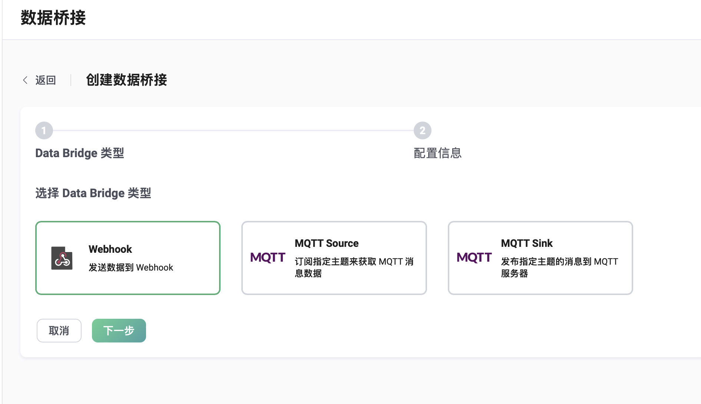

# Webhook

Webhook 是 EMQX 向 HTTP 服务发送消息的通道。通过 Webhook，用户可以选择某个本地主题，将消息
发送到远程 HTTP 服务，也可以将规则的输出发送到 HTTP 服务。

## 示例：使用配置文件创建 Webhook

在 `emqx.conf` 里，添加如下配置：

```js
bridges.webhook.my_webhook {
    enable = true
    direction = egress
    url = "http://localhost:9901/${clientid}"
    local_topic = "a/#"
    method = post
    body = "${payload}"
    headers {
        "content-type": "application/json"
    }
}
```

这个 Webhook 的作用是，将发送到本节点的、主题能匹配到 `a/#` 的消息转发到 `http://localhost:9901/${clientid}`。
其中 `${clientid}` 是表示发送者客户端 ID 的占位符变量，
举例来说，如果客户端 ID 为 `steve`，那么消息将发送到 `http://localhost:9901/steve`。

除了 `url` 参数之外，下面几个参数都可以使用占位符：`method`，`body`，`headers`。
但注意在 `url` 参数里只能在路径部分使用占位符，而 `scheme://host:port` 部分不能使用占位符。

可用的占位符字段，详见：[规则 SQL 中的事件类型和字段](./rule-sql-events-and-fields.md#使用规则-sql-语句处理消息发布)。

## 快速开始

我们用一个示例展示如何使用 Dashboard 创建一个简单的 Webhook，桥接到一个 HTTP 服务器。

### 搭建简易 HTTP 服务

首先我们使用 Python 搭建一个简单的 HTTP 服务。这个 HTTP 服务接收 `POST /` 请求，
简单打印请求内容后返回 200 OK：

```python
from flask import Flask, json, request

api = Flask(__name__)

@api.route('/', methods=['POST'])
def print_messages():
  reply= {"result": "ok", "message": "success"}
  print("got post request: ", request.get_data())
  return json.dumps(reply), 200

if __name__ == '__main__':
  api.run()
```

将上面的代码保存为 `http_server.py` 文件。然后启动服务：

```shell
pip install flask

python3 http_server.py
```

### 创建 Webhook 并关联到规则

现在我们访问 Dashboard，选择左边栏 “数据集成” - “数据桥接”：


然后点击创建，选择 `Webhook`，点击 “下一步”：



我们将 Webhook 命名为 `my_webhook`，URL 为 `http://localhost:5000`：


点击 “创建”，然后在弹出来的对话框里选择创建关联规则：


在规则的创建页面，填入如下 SQL 语句，其余参数保持默认值：

```SQL
SELECT * FROM "t/#"
```


点击页面下方的 “创建” 按钮。

### 发送数据进行测试

接下来我们使用 [MQTTX](https://mqttx.app/) 发送一条数据到 `t/1`：


然后验证消息已经被发送到了 HTTP 服务端：

```shell
python3 http_server.py
 * Serving Flask app 'http_server' (lazy loading)
 * Environment: production
   WARNING: This is a development server. Do not use it in a production deployment.
   Use a production WSGI server instead.
 * Debug mode: off
 * Running on http://127.0.0.1:5000 (Press CTRL+C to quit)

got post request:  b'eee'
```
