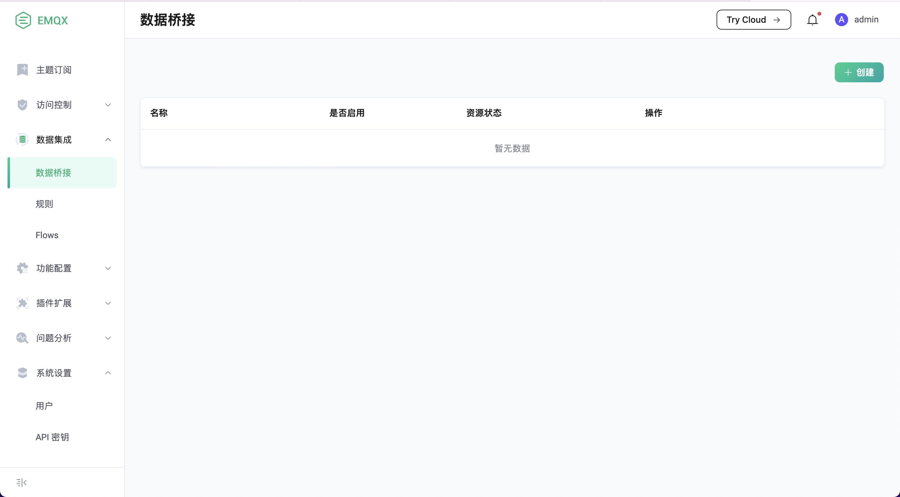
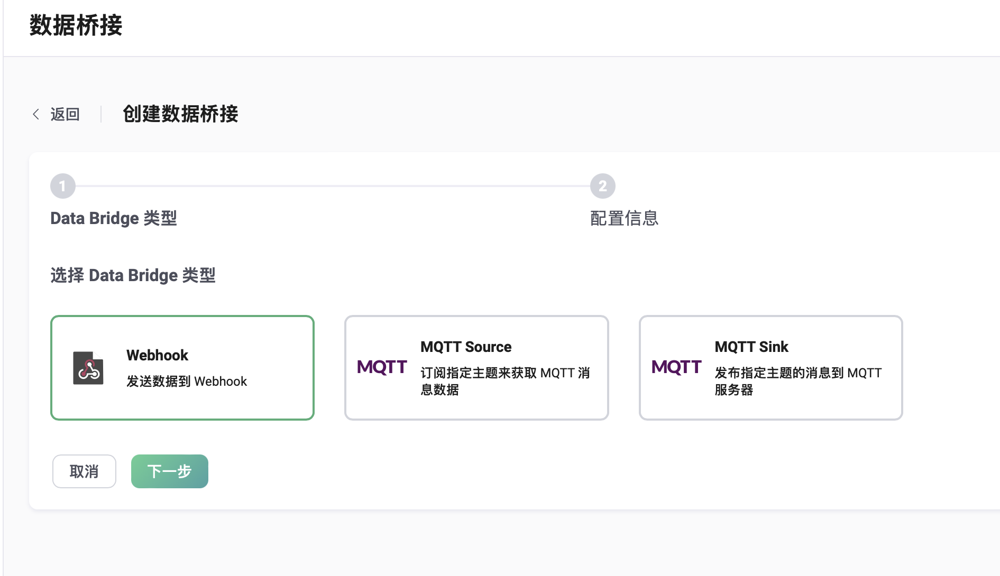
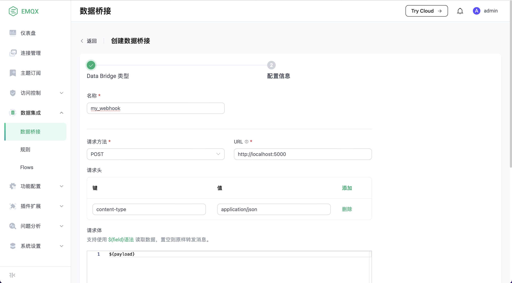
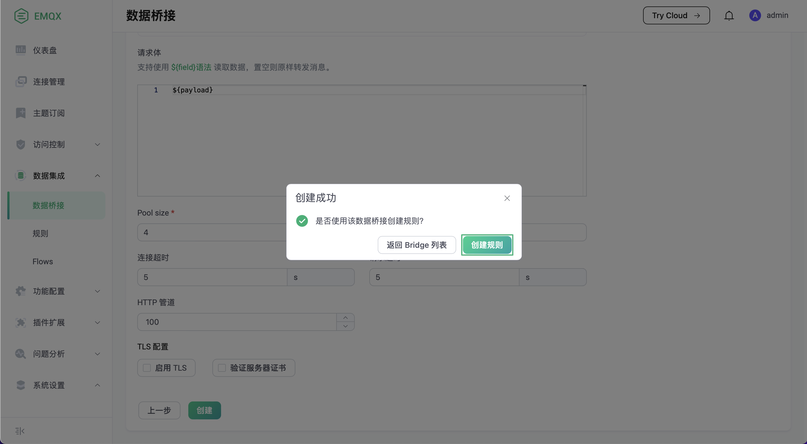
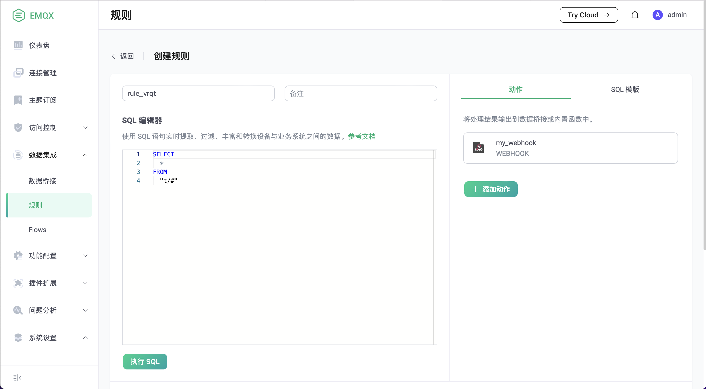
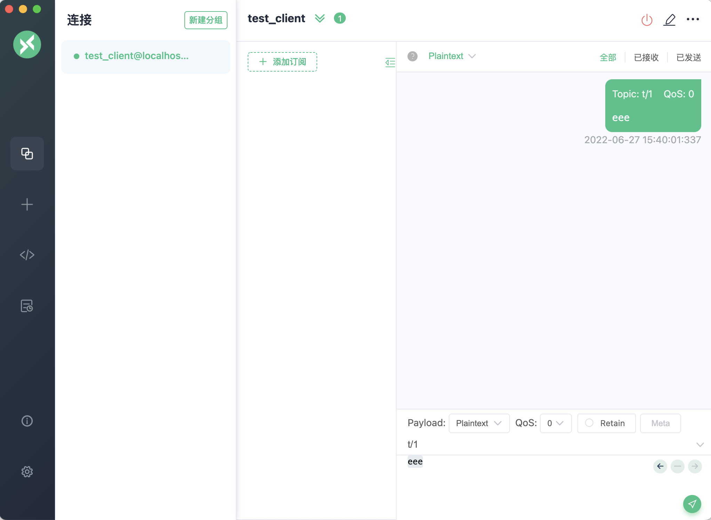

# 数据桥接简介

数据桥接是用来对接 EMQX 和外部数据系统的通道。外部数据系统可以是 MySQL、MongoDB 等数据库，
也可以是 Kafka，RabbitMQ 等消息中间件，或者是 HTTP 服务器等。

通过数据桥接，用户可以实时地将消息从 EMQX 发送到外部数据系统，或者从外部数据系统拉取数据并发送到 EMQX 的某个主题。

::: tip
EMQX 开源版中仅支持 MQTT 桥接 和 Webhook，企业版支持的数据桥接请详见：[企业数据集成](https://www.emqx.com/zh/integrations)
:::

## 数据桥接快速入门

我们用一个示例展示如何使用 Dashboard 创建一个简单的 Webhook，桥接到一个 HTTP 服务器。

### 搭建简易 HTTP 服务

首先我们使用 Python 搭建一个简单的 HTTP 服务。这个 HTTP 服务接收 `POST /` 请求，
简单打印请求内容后返回 200 OK：

```
from flask import Flask, json, request

api = Flask(__name__)

@api.route('/', methods=['POST'])
def print_messages():
  reply= {"result": "ok", "message": "success"}
  print("got post request: ", request.get_data())
  return json.dumps(reply), 200

if __name__ == '__main__':
  api.run()
```

将上面的代码保存为 `http_server.py` 文件。然后启动服务：

```shell
pip install flask

python3 http_server.py
```

### 创建 Webhook 并关联到规则

现在我们访问 Dashboard，选择左边栏 “数据集成” - “数据桥接”：



然后点击创建，选择 `Webhook`，点击 “下一步”：



我们将 Webhook 命名为 `my_webhook`，URL 为 `http://localhost:5000`：



点击 “创建”，然后在弹出来的对话框里选择创建关联规则：



在规则的创建页面，填入如下 SQL 语句，其余参数保持默认值：

```SQL
SELECT * FROM "t/#"
```



点击页面下方的 “创建” 按钮。

### 发送数据进行测试

接下来我们使用 [MQTTX](https://mqttx.app/) 发送一条数据到 `t/1`：



然后验证消息已经被发送到了 HTTP 服务端：

```
python3 http_server.py
 * Serving Flask app 'http_server' (lazy loading)
 * Environment: production
   WARNING: This is a development server. Do not use it in a production deployment.
   Use a production WSGI server instead.
 * Debug mode: off
 * Running on http://127.0.0.1:5000 (Press CTRL+C to quit)

got post request:  b'eee'
```
