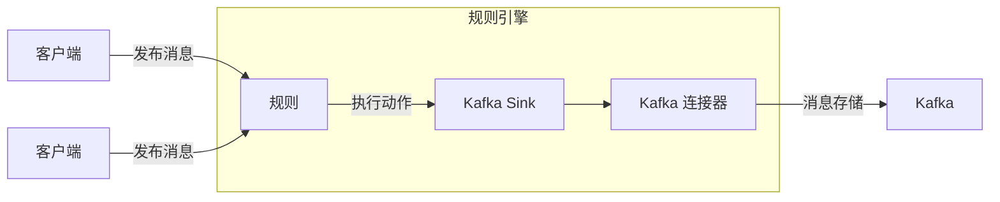
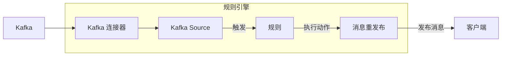

# 数据集成

作为一个 MQTT 消息平台，EMQX 通过 MQTT 协议连接物联网设备并实时传递消息。在此基础上，数据集成为 EMQX 引入了与外部数据系统的连接，从而以实现设备与其他业务系统的无缝集成。

数据集成使用 Sink 与 Source 组件与外部数据系统连接，Sink 用于将消息发送到外部数据系统，例如 MySQL、Kafka 或 HTTP 服务等；而 Source 则用于从外部数据系统接收消息，例如 MQTT、Kafka 或 GCP PubSub。

这一过程允许 EMQX 不仅仅局限于物联网设备之间的消息传递，还能够将设备产生的数据有机地融入到整个业务生态系统中，为物联网应用提供了更广泛的应用场景，使得设备与业务系统之间的交互更为丰富和多样化。

::: tip 提示

- 自 EMQX v5.4.0 版本开始，原数据桥接按照数据流方向拆分并重命名为 Sink 与 Source。

- 目前，EMQX 支持 MQTT 服务、Kafka 和 GCP PubSub 这三种外部数据系统作为 Source，其中，Kafka 和 GCP PubSub Source 仅在企业版中支持。

:::

本页面提供了 Sink 和 Source 总体介绍，包括工作原理、支持的外部数据系统、主要特性以及管理方式。

## 工作原理

EMQX 数据集成是一个开箱即用的功能。作为一个 MQTT 消息平台，EMQX 通过 MQTT 协议从物联网设备接收数据。借助内置的规则引擎，接收到的数据会被规则引擎中配置的规则处理。规则将触发一个动作，通过配置的 Sink/Source 将处理后的数据转发到外部数据系统。您可以在 Dashboard 上使用[规则](./rule-get-started.md)或[流设计器](../flow-designer/introduction.md)轻松创建规则、添加动作并创建 Sink/Source，无需任何编码工作。

### 规则引擎

物联网设备和系统产生的数据类型和格式多种多样。EMQX 配备了一款功能强大的基于 SQL 规则的内置引擎，这是处理和分发数据的核心组件。规则引擎具有广泛的功能，包括条件判断、字符操作、数据类型转换以及压缩/解压功能，能够实现复杂数据的灵活处理。

当客户端触发特定事件，或发布的消息到达 EMQX 时，规则引擎可以根据预定义的规则，对数据进行实时的处理，执行如数据提取、过滤、丰富以及格式转换等操作，然后将处理后的数据发送到指定的 Sink。

您可以在[规则引擎](./rules.md)章节中找到关于规则引擎工作方式的详细信息。

### Sink

Sink 是数据输出组件，被添加到规则的[动作](./rules.md#动作)中，规则引擎处理完成后的数据将被转发到指定的 Sink，你可以在 Sink 中配置数据的操作方式，例如使用 `${var}` 或者 `${.var}` 语法从数据中提取变量，动态生成 SQL 语句或数据模板，再通过[连接器](./connector.md)发送到外部数据系统，实现消息存储、数据更新和事件通知等操作。



在 Sink 中支持的变量提取语法如下：

- `${var}`：这种语法用于从规则的输出结果中提取变量，例如 `${topic}`。如果您想要提取嵌套的变量，可以使用 `.`， 例如 `${payload.temp}`。请注意，如果输出结果中不包含您想要提取的变量，您将得到 `undefined` 字符串。

- `${.}`, `${.var}`：其中 `${.}` 语法用来提取包含所有规则输出结果构成的 JSON 字符， 而 `${.var}` 语法与 `${var}` 语法含义一致。

### Source

Source 是数据输入组件，作为规则的[数据源](./rule-sql-events-and-fields.md)，通过规则 SQL 进行选择。

Source 从外部 MQTT 或 Kafka 等外部数据系统订阅或消费消息，当新的消息通过连接器到达 EMQX 时，规则引擎将匹配并执行相应规则，对数据进行筛选和处理，处理完成后的数据可以发布到指定 EMQX 主题中，实现云端指令下发等操作。



## 支持的集成

目前，EMQX 开源版支持以下两种数据集成：

- [MQTT Services](./data-bridge-mqtt.md)
- [Webhook](./webhook.md)/[HTTP Server](./data-bridge-webhook.md)

EMQX 企业版除了 MQTT Services 和 Webhook/HTTP Server, 还支持与以下这些数据系统的集成：

**云服务**

- [Amazon Kinesis](./data-bridge-kinesis.md)
- [Azure EventHub](./data-bridge-azure-event-hub.md)
- [GCP PubSub](./data-bridge-gcp-pubsub.md)

**时序数据库**

- [Apache IoTDB](./data-bridge-iotdb.md)
- [InfluxDB](./data-bridge-influxdb.md)
- [OpenTSDB](./data-bridge-opents.md)
- [TimescaleDB](./data-bridge-timescale.md)

**SQL**

- [Cassandra](./data-bridge-cassa.md)
- [Microsoft SQL Server](./data-bridge-sqlserver.md)
- [MySQL](./data-bridge-mysql.md)
- [Oracle](./data-bridge-oracle.md)
- [PostgreSQL](./data-bridge-pgsql.md)

**NoSQL**

- [ClickHouse](./data-bridge-clickhouse.md)
- [Couchbase](./data-bridge-couchbase.md)
- [DynamoDB](./data-bridge-dynamo.md)
- [Greptime](./data-bridge-greptimedb.md)
- [MongoDB](./data-bridge-mongodb.md)
- [Redis](./data-bridge-redis.md)
- [TDengine](./data-bridge-tdengine.md)
- [Elasticsearch](./elasticsearch.md)

**消息队列**

- [Apache Kafka/Confluent](./data-bridge-kafka.md)
- [HStreamDB](./data-bridge-hstreamdb.md)
- [Pulsar](./data-bridge-pulsar.md)
- [RabbitMQ](./data-bridge-rabbitmq.md)
- [RocketMQ](./data-bridge-rocketmq.md)

**其他**

- [SysKeeper](./syskeeper.md)
- [Amazon S3](./s3.md)

## Sink 的特性

Sink 借助以下特性以增强易用性、进一步提高数据集成的性能和可靠性，并非所有 Sink 都完全实现了这些特性，具体支持情况请参照各自的说明文档。

### 异步请求模式

异步请求模式可以避免消息的发布订阅流程受到 Sink 执行速度的影响。但开启异步请求模式后，可能会存在订阅端收到消息了，但消息还未写入到外部数据系统的情况。

为了提高数据处理效率，EMQX 默认开启异步请求模式。如果您对消息到达订阅端和外部数据系统的时序有严格要求，请禁用异步请求模式。

异步请求中另一个影响消息顺序的参数是**请求飞行队列窗口** (`max_inflight`)。部分 Sink 有这个参数，当请求模式为异步时，如果需要严格保证来自同一 MQTT 客户端的消息有序，则必须将此值设为 1。

### 批量模式

批量模式可以将多条数据同时写入外部数据集成中，启用批量后 EMQX 将暂存每次请求的数据（单条），达到一定时间或累积一定数据条数（两者均可自行配置）后将暂存的整批数据写入到目标数据系统。

**优点：**

- 提高写入效率：相对于单条消息的写入方式，批量模式下，数据库系统在正式处理消息前，一般会先对其进行缓存或预处理等优化操作，提高写入效率。

- 减少网络延迟：批量写入可以减少网络传输次数，进而减少网络延迟。

**问题：**

- 数据写入时延较长：数据在达到设置的时间或条数之后才会被写入，时延较长。<!--注意：您可以通过下方参数对设置时间或条数进行调整。-->
- 有一定延迟：在达到设置的时间或累积数据条数之前数据不会立即写入，可通过参数进行调整。

### 缓冲队列

缓冲队列为 Sink 提供了一定的容错性，建议启用该选项以提高数据安全性。

每个资源连接（此处并非 MQTT 连接）缓冲队列长度（按容量大小），超出长度按照 FIFO 的原则丢弃数据。

#### 缓冲文件位置

对于 Kafka Sink，磁盘缓存文件位于 `data/kafka` 下，其他 Sink 磁盘缓存文件位于 `data/resource_worker` 下。

实际使用中可以根据情况将 `data` 目录挂载至高性能磁盘以提高吞吐能力。

### SQL 预处理

在诸如 MySQL、PostgreSQL 等 SQL 数据库中，SQL 模板会进行预处理执行，无需显式的指定字段变量。

直接执行 SQL 时，必须通过单引号显式设置 topic 与 payload 为字符类型，qos 为 int 类型：

```sql
INSERT INTO msg(topic, qos, payload) VALUES('${topic}', ${qos}, '${payload}');
```

但在支持 SQL 预处理的 Sink 中，SQL 模板**必须**使用不带引号的预处理语句：

```sql
INSERT INTO msg(topic, qos, payload) VALUES(${topic}, ${qos}, ${payload});
```

除了自动推导字段类型外，SQL 预处理技术还能避免 SQL 注入以提高安全性。

## Sink 的状态与指标

您可以在 Dashboard 上查看 Sink 的运行状态和数据集成统计信息，以了解 Sink 和集成是否正常运行。

### Sink 的状态

Sink 具有以下状态：

<!-- TODO 5.4 -->

- `connecting`：在进行任何健康检查之前的初始状态，仍在尝试连接到外部数据系统。
- `connected`： Sink 成功连接并正常运行。如果健康检查失败， Sink 可能会转换为 `connecting` 或 `disconnected` 状态，具体取决于故障的严重程度。
- `disconnected`： Sink 未通过健康检查，处于不健康状态。根据其配置，它可能会定期尝试自动重新连接。
- `stopped`： Sink 已被手动禁用。
- `inconsistent`：集群节点之间对 Sink 状态存在分歧。

### 数据集成指标

EMQX 提供以下数据集成的运行统计指标：

- 命中（counter）
- 发送成功（counter）
- 发送失败（counter）
- 已丢弃（counter）
- 延迟回复（counter）
- 进行中（gauge）
- 排队中（gauge）


### 命中

`命中` 统计了无论 Sink 的状态如何，都被路由到 Sink 的请求/消息的数量。每条消息最终由其他指标计算，因此 `命中` 的计算公式为：`命中 = 成功发送 + 发送失败 + 进行中 + 排队中 + 延迟回复 + 已丢弃`。

### 发送成功

`发送成功` 统计了成功被外部数据系统接收的消息数量。`重新尝试发送成功` 是 `发送成功` 的子计数，用于跟踪至少重试一次的消息数量。因此，`重新尝试发送成功 ≤ 发送成功`。

### 发送失败

`发送失败` 统计了未能被外部数据系统接收的消息数量。`重新尝试发送失败` 是 `发送失败` 的子计数，用于跟踪至少重试一次的消息数量。因此，`重新尝试发送失败 ≤ 发送失败`。

### 已丢弃

`已丢弃` 统计了未经任何发送尝试而被丢弃的消息数量。它包含了几个更具体的子类别，每个子类别都表示丢弃的不同原因。`已丢弃` 的计算公式为：`已丢弃 = 过期 + 队列已满 + 资源已停止 + 未找到资源`。

- `过期`：在排队等待发送之前，消息的生存时间（TTL）已经到期。
- `队列已满`：达到了最大队列大小，为防止内存溢出而丢弃消息。
- `资源已停止`：在 Sink 已停止的情况下，仍然尝试发送消息。
- `未找到资源`：在 Sink 不再存在时尝试发送消息。这种情况非常罕见，通常是由于在移除 Sink 时出现竞争条件。

### 延迟回复

当尝试发送消息时，在消息的生存时间（TTL）过期后仍然收到底层驱动程序的响应时，`延迟回复` 会递增。

::: tip

请注意，`延迟回复` 不表示消息是否成功发送或发送失败，它是一种未知状态。它既可能成功插入外部数据系统，也可能插入失败，甚至在尝试建立与数据系统的连接时连接超时。 

:::

### 进行中

`进行中` 是度量当前在缓冲层中正在等待来自外部数据系统的响应的消息数。

### 排队中

`排队中` 是度量已经被缓冲层接收但尚未发送到外部数据系统的消息数。
