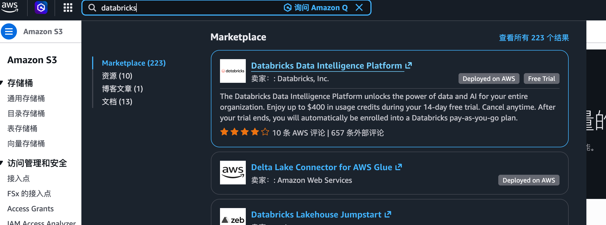
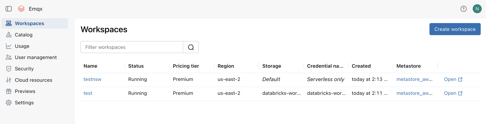
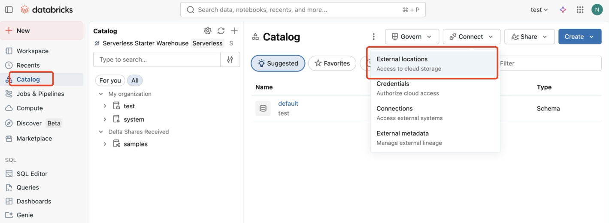
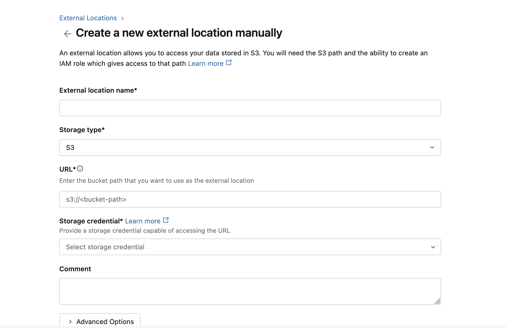
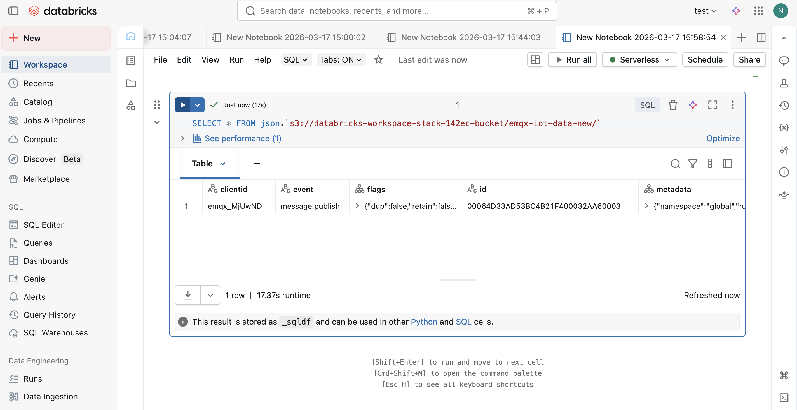

# 将 MQTT 数据导入 Databricks

[Databricks](https://www.databricks.com/) 是一个基于 Apache Spark 构建的统一数据分析平台，专为大规模数据工程、机器学习和协作分析而设计。EMQX 通过将 MQTT 数据写入 Databricks 管理的 Amazon S3 存储桶来实现与 Databricks 的集成，Databricks 可通过外部位置（External Location）直接查询该存储桶中的数据。

本页详细介绍了 EMQX 与 Databricks 的数据集成，并提供了连接器和 Sink 创建的实用指导。

## 工作原理

Databricks 数据集成基于 EMQX 的 Amazon S3 集成实现。EMQX 将 MQTT 数据写入 Databricks 工作区管理的 S3 存储桶，Databricks 通过外部位置访问该存储桶，从而可以直接使用 SQL 查询存储的数据。


具体工作流程如下：

1. **设备连接到 EMQX**：物联网设备通过 MQTT 协议连接成功后将触发上线事件，事件包含设备 ID、来源 IP 地址以及其他属性等信息。
2. **设备消息发布和接收**：设备通过特定的主题发布遥测和状态数据，EMQX 接收到消息后将在规则引擎中进行比对。
3. **规则引擎处理消息**：通过内置的规则引擎，可以根据主题匹配处理特定来源的消息和事件。规则引擎会匹配对应的规则，并对消息和事件进行处理，例如转换数据格式、过滤掉特定信息或使用上下文信息丰富消息。
4. **写入 Amazon S3**：规则触发后，消息通过 Amazon S3 Sink 写入 Databricks 工作区关联的 S3 存储桶中。
5. **Databricks 从 S3 读取数据**：Databricks 通过外部位置直接查询 S3 存储桶中的数据，支持实时分析和机器学习工作流。

## 特性与优势

在 EMQX 中使用 Databricks 数据集成能够为您的业务带来以下特性与优势：

- **消息转换**：消息可以在写入 S3 之前，通过 EMQX 规则进行丰富的处理和转换，方便后续的存储和使用。
- **灵活数据操作**：通过 Amazon S3 Sink，可以方便地将特定字段的数据写入 Databricks 管理的 S3 存储桶，支持动态设置对象键，实现数据的灵活存储。
- **统一分析平台**：将 EMQX 与 Databricks 集成后，物联网数据可立即用于 Databricks 工作区内的 SQL 分析、机器学习和数据工程流水线。
- **低成本长期存储**：以 S3 作为底层存储，提供高可用、高可靠、低成本的对象存储服务，适合大规模物联网数据的长期存储需求。

## 准备工作

本节介绍了在 EMQX 中创建 Amazon S3 连接器和 Sink 之前需要做的准备工作。

### 前置准备

在开始之前，请确保您已了解以下内容：

#### EMQX 相关概念：

- [规则引擎](./rules.md)：了解规则如何定义从 MQTT 消息中提取和转换数据的逻辑。
- [数据集成](./data-bridges.md)：了解 EMQX 数据集成中连接器和 Sink 的概念。

#### Databricks 相关概念：

- **工作区（Workspace）**：Databricks 工作区是访问所有 Databricks 资产的环境。
- **外部位置（External Location）**：Databricks 的一项功能，将外部 S3 路径映射到 Databricks，使该路径下的数据可通过 SQL 直接查询。
- **存储凭证（Storage Credential）**：Databricks 中用于授权读写外部存储位置的访问凭证。

### 在 AWS Marketplace 上订阅 Databricks

本节以在 AWS Marketplace 上订阅 Databricks 作为部署示例。

1. 在 [AWS Marketplace](https://aws.amazon.com/marketplace/) 上订阅 Databricks。订阅后，系统将引导您创建 Databricks 账号和工作区。

   

2. 订阅完成后，创建一个工作区。选择区域和存储选项，点击 **Create**。

   

   工作区创建完成后，将出现在 **Workspaces** 列表中。记录系统为工作区自动创建的 S3 存储桶名称（例如 `databricks-workspace-stack-142ec-bucket`），该存储桶将用于存储来自 EMQX 的 MQTT 数据。

   

3. 打开工作区，进入 **Catalog** -> **External locations**，创建一个指向 EMQX 写入数据的 S3 路径的外部位置。

   

   点击 **Create location**，将 **Storage type** 设为 `S3`，在 **URL** 中填写 `s3://databricks-workspace-stack-142ec-bucket/emqx-iot-data-new`，并选择对应的 **Storage credential**。

   

4. 获取具有该 S3 存储桶读写权限的 IAM 用户或角色的 AWS 访问凭证（访问密钥 ID 和私有访问密钥），用于配置 EMQX 连接器。

至此，您已完成 Databricks 工作区和 S3 存储桶的配置，接下来将在 EMQX 中创建连接器和 Sink。

## 创建连接器

在添加 Amazon S3 Sink 前，您需要创建对应的连接器，创建步骤如下：

1. 转到 Dashboard **集成** -> **连接器**页面。
2. 点击页面右上角的**创建**。
3. 在连接器类型中选择 **Amazon S3**，点击**下一步**。
4. 输入连接器名称。名称必须以字母或数字开头，可以包含字母、数字、连字符或下划线。例如：`my-databricks`。
5. 输入连接信息：
   - **主机**：填写 Databricks 工作区所在 AWS 区域对应的 S3 端点，格式为 `s3.{region}.amazonaws.com`。
   - **端口**：填写 `443`。
   - **访问密钥 ID** 和**私有访问密钥**：填写[在 AWS Marketplace 上订阅 Databricks](#在-aws-marketplace-上订阅-databricks) 中获取的 AWS 访问凭证。
6. 其余配置使用默认值即可。
7. 点击**创建**之前，您可以先点击**测试连接**，验证 EMQX 是否可以连接到 S3 服务。
8. 点击**创建**按钮完成连接器创建。页面将弹出**创建成功**对话框，询问是否立即创建规则。点击**创建规则**可直接进入规则创建页面并预选该连接器，或点击**返回连接器列表**稍后再创建规则。

## 创建 Amazon S3 Sink 规则

本节演示了如何在 EMQX 中创建一条规则，用于处理来自源 MQTT 主题 `t/#` 的消息，并通过配置的 Sink 将处理后的结果写入 Databricks 管理的 S3 存储桶中。

1. 如果您在上一步中点击了**创建规则**，**添加动作**面板将自动打开，且**动作类型**已设置为 `Amazon S3` 并预选了连接器，可直接跳至第 5 步。否则，请前往 Dashboard **集成** -> **规则**页面，点击右上角**创建**。

2. 输入规则 ID，在 SQL 编辑器中输入规则 SQL 如下：

   ```sql
   SELECT
     *
   FROM
       "t/#"
   ```

   ::: tip

   如果您初次使用 SQL，可以点击 **SQL 示例**和**启用测试**来学习和测试规则 SQL 的结果。

   :::

3. 点击 **+ 添加动作**，从**动作类型**下拉列表中选择 `Amazon S3`，保持**动作**下拉框为默认的**创建动作**选项。

4. 在**连接器**下拉框中选择刚刚创建的 `my-databricks` 连接器。您也可以点击下拉框旁边的创建按钮，在弹出框中快捷创建新的连接器，所需的配置参数可以参考[创建连接器](#创建连接器)。

5. 输入 Sink 的名称与描述（可选）。

6. 设置**存储桶**，此处输入 `databricks-workspace-stack-142ec-bucket`。此处也支持 `${var}` 格式的占位符，但要注意需要在 S3 中预先创建好对应名称的存储桶。

7. 根据情况选择 **ACL**，指定上传对象的访问权限。

8. 选择**上传方式**，两种方式区别如下：

   - **直接上传**：每次规则触发时，按照预设的对象键和内容直接上传到 S3，适合存储二进制或体积较大的文本数据。
   - **聚合上传**：将多次规则触发的结果打包为一个文件（如 CSV 文件）并上传到 S3，适合存储结构化数据，可以减少文件数量，提高写入效率。

   两种方式配置的参数不同，请根据所选方式进行配置：

   :::: tabs type:card

   ::: tab 直接上传

   直接上传需要配置以下字段：

   - **对象键**：定义了要上传到存储桶中的对象的位置。它支持 `${var}` 格式的占位符，并可以使用 `/` 来指定存储目录。此处输入 `emqx-iot-data-new/${clientid}_${timestamp}.json`，其中 `${clientid}` 是客户端 ID，`${timestamp}` 是消息的时间戳。
   - **对象内容**：默认情况下，它是包含所有字段的 JSON 文本格式。支持 `${var}` 格式的占位符，此处输入 `${payload}` 表示将消息体作为对象内容。

   :::

   ::: tab 聚合上传

   需要设置以下参数：

   - **对象键**：用于指定对象的存储路径，可以使用以下变量：

     - **`${action}`**：动作名称（必需）。
     - **`${node}`**：执行上传的 EMQX 节点名称（必需）。
     - **`${datetime.{format}}`**：聚合开始的日期和时间（必需）：
       - **`${datetime.rfc3339utc}`**：UTC 格式的 RFC3339 日期和时间。
       - **`${datetime.rfc3339}`**：本地时区格式的 RFC3339 日期和时间。
       - **`${datetime.unix}`**：Unix 时间戳。
     - **`${datetime_until.{format}}`**：聚合结束的日期和时间，格式选项与上述相同。
     - **`${sequence}`**：相同时间间隔内聚合上传的序列号（必需）。

   - **聚合方式**：目前仅支持 CSV 和 JSON Lines。
     - `CSV`：数据将以逗号分隔的 CSV 格式写入到 S3。
     - `JSON Lines`：数据将以 [JSON Lines](https://jsonlines.org/) 格式写入到 S3。

   - **列排序**（仅用于聚合方式为 `CSV` 时）：通过下拉选择调整规则结果列的顺序。

   - **最大记录数**：达到最大记录数时将完成单个文件的聚合进行上传。

   - **时间间隔**：达到时间间隔时，即使未达到最大记录数，也会完成单个文件的聚合进行上传。

   :::
   ::::

9. **备选动作（可选）**：如果您希望在消息投递失败时提升系统的可靠性，可以为 Sink 配置一个或多个备选动作。更多信息请参见：[备选动作](./data-bridges.md#备选动作)。

10. 展开**高级设置**，根据需要配置高级设置选项（可选），详细请参考[高级设置](#高级设置)。

11. 其余参数使用默认值即可。点击**创建**之前，可以先点击**测试连接**验证 Sink 是否可以连接到 S3 服务。

12. 点击**创建**按钮完成 Sink 的创建，创建成功后页面将回到规则创建，新的 Sink 将添加到规则动作中。

13. 回到规则创建页面，点击**保存**按钮完成整个规则创建。

现在您已成功创建了规则，您可以在**规则**页面上看到新建的规则，同时在**动作(Sink)** 标签页看到新建的 Amazon S3 Sink。

## 测试规则

使用 MQTTX 向 `t/1` 主题发布消息：

```bash
mqttx pub -i emqx_c -t t/1 -m '{ "msg": "hello Databricks" }'
```

发送几条消息后，在 Databricks 工作区中，右键点击 **Workspace**，选择 **Create** -> **Notebook** 创建一个新 Notebook。


在 Notebook 中运行以下 SQL 查询，验证数据已成功导入：

```sql
SELECT * FROM json.`s3://databricks-workspace-stack-142ec-bucket/emqx-iot-data-new/`
```



## 高级设置

本节将深入介绍可用于 Amazon S3 Sink 的高级配置选项。在 Dashboard 中配置 Sink 时，您可以根据您的特定需求展开**高级设置**，调整以下参数。

| 字段名称             | 描述                                                         | 默认值   |
| -------------------- | ------------------------------------------------------------ | -------- |
| **缓存池大小**       | 指定缓冲区工作进程数量，用于管理 EMQX 与 S3 之间的数据流。  | `16`     |
| **请求超期**         | 指定请求进入缓冲区后被视为有效的最长持续时间（以秒为单位）。 | `45` 秒  |
| **健康检查间隔**     | 指定 Sink 对与 S3 的连接执行自动健康检查的时间间隔（以秒为单位）。 | `15` 秒  |
| **健康检查间隔抖动** | 在健康检查间隔中添加随机延迟，用于避免多个节点同时触发健康检查请求。 | `0` 毫秒 |
| **健康检查超时**     | 指定对与 S3 服务的连接执行自动健康检查的超时时间。           | `60` 秒  |
| **缓存队列最大长度** | 指定每个缓冲区工作进程可缓冲的最大字节数。                   | `256` MB |
| **请求模式**         | 允许您选择`同步`或`异步`请求模式，以根据不同要求优化消息传输。 | `异步`   |
| **请求飞行队列窗口** | 控制 Sink 与 S3 通信时可以同时存在的最大飞行队列请求数。     | `100`    |
| **最小分片大小**     | 聚合完成后分片上传的最小块大小，上传数据将在内存中累积直到达到此大小。 | `5MB`    |
| **最大分片大小**     | 分块上传的最大块大小，S3 Sink 不会尝试上传超过此大小的分片。 | `5GB`    |
