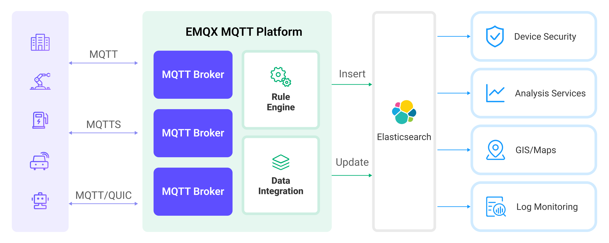

# 将 MQTT 数据写入到 Elasticsearch


:::tip
EMQX 企业版功能。EMQX 企业版可以为您带来更全面的关键业务场景覆盖、更丰富的数据集成支持，更高的生产级可靠性保证以及 24/7 的全球技术支持，欢迎[免费试用](https://www.emqx.com/zh/try?product=enterprise)。
:::


[Elasticsearch](https://www.elastic.co/elasticsearch/) 是一个分布式、RESTful 风格的搜索和数据分析引擎，提供了多样化数据的全文搜索、结构化搜索以及分析等功能。EMQX 通过与 Elasticsearch 集成，能够将 MQTT 数据无缝的集成到 Elasticsearch 进行存储，并借助其强大的可扩展性和分析能力，为物联网应用提供了高效、可扩展的数据存储和分析解决方案。

本页详细介绍了 EMQX 与 Elasticsearch 的数据集成并提供了实用的规则和 Sink 创建指导。

## 工作原理

Elasticsearch 数据集成是 EMQX 中开箱即用的功能，它结合了 EMQX 的设备接入、消息传输能力与 Elasticsearch 的数据存储和分析能力，通过简单的配置即可实现 MQTT 数据的无缝集成。

<!-- 下图展示了工业物联网中 EMQX 和 Elasticsearch 数据集成的典型架构。

 -->

EMQX 和 Elasticsearch 提供了一个可扩展的物联网平台，用于高效地实时收集和分析设备数据。在此架构中，EMQX 作为物联网平台，负责设备接入、消息传输、数据路由等功能，Elasticsearch 作为数据存储和分析平台，负责数据存储、数据搜索和分析等功能。

EMQX 通过规则引擎与 Sink 将设备数据转发至 Elasticsearch，Elasticsearch 通过其强大的搜索和分析能力，生成报表、图表等数据分析结果，通过 Kibana 的可视化工具展示给用户。其工作流程如下：

1. **设备消息发布与接收**：物联网设备通过 MQTT 协议连接成功后向特定的主题发布遥测和状态数据，EMQX 接收到消息后将在规则引擎中进行比对。
2. **规则引擎处理消息**：通过内置的规则引擎，可以根据主题匹配处理特定来源的 MQTT 消息。规则引擎会匹配对应的规则，并对消息进行处理，例如转换数据格式、过滤掉特定信息或使用上下文信息丰富消息。
3. **写入到 Elasticsearch**：规则引擎中定义的规则触发将消息写入到 Elasticsearch 的操作。Elasticsearch Sink 提供了灵活的操作方式以及文档模板，能够构造符合需求的文档格式，将消息中的特定字段写入到 Elasticsearch 的对应的索引中。

设备数据写入到 Elasticsearch 后，您可以灵活的使用 Elasticsearch 的搜索和分析能力对数据进行处理，例如：

- **日志监测**：物联网设备会生成大量的日志数据，这些数据可以被发送到 Elasticsearch 中进行存储和分析。通过连接到可视化工具，例如 Kibana，可以根据这些日志数据生成图表，实时展示设备状态、操作记录以及错误消息等信息。这样可以帮助开发者或运维人员快速定位和解决可能出现的问题。

- **地理位置数据（Maps）**：物联网设备往往会生成地理位置数据，这些数据可以被存储在 Elasticsearch 中。通过 Kibana 的 Maps 功能，可以在地图上可视化设备的位置信息，进行设备位置的追踪和分析。

- **终端安全**：物联网设备的安全日志数据可以被发送到 Elasticsearch，通过连接到 Elastic Security，可以生成安全报告，实时监控设备的安全状态，检测可能的安全威胁，并进行响应。

## 特性与优势

## 准备工作

本节介绍了在 EMQX 中创建 Elasticsearch 数据集成之前需要做的准备工作，包括安装 Elasticsearch 和创建索引。

### 前置准备

- 了解[规则](./rules.md)。
- 了解[数据集成](./data-bridges.md)。

### 安装 Elasticsearch 并创建索引

EMQX 支持与私有部署的 Elasticsearch 或与云上的 Elastic 集成。您可以使用 Elastic Cloud 或者 Docker 部署一个 Elasticsearch 实例。

1. 如果没有 Docker 环境请[安装 Docker](https://docs.docker.com/install/)。

2. 启动 Elasticsearch 容器，设置初始密码为 `public`。

    ```bash
    docker run -d --name elasticsearch \
        -p 9200:9200 \
        -p 9300:9300 \
        -e "discovery.type=single-node" \
        -e "ELASTIC_PASSWORD=public" \
        docker.elastic.co/elasticsearch/elasticsearch:7.10.1
    ```

3. 创建 `device_data` 索引用于存储设备发布的消息。

    ```bash
    curl -X PUT "localhost:9200/device_data?pretty" -H 'Content-Type: application/json' -d'
    {
      "mappings": {
        "properties": {
          "ts": { "type": "date" },
          "clientid": { "type": "keyword" },
          "temperature": { "type": "float" },
          "humidity": { "type": "float" }
        }
      }
    }'
    ```

## 创建连接器

在添加 Elasticsearch Sink 前，您需要创建 Elasticsearch 连接器。

以下步骤假设您在本地机器上同时运行 EMQX 和 Elasticsearch。如果您有远程运行的 EMQX 和 Elasticsearch，请相应地调整设置。

1. 转到 Dashboard **集成** -> **连接器**页面。
2. 点击页面右上角的**创建**。
3. 在连接器类型中选择 **Elasticsearch**，点击下一步。
4. 输入连接器名称，要求是大小写英文字母和数字的组合。这里我们输入 `my-elasticsearch`。
5. 输入 Elasticsearch 连接信息，根据你的部署方式输入对应的 Elasticsearch 连接信息，如果使用的是 Docker，<!-- TODO -->
6. 点击最下方**创建**按钮完成连接器创建。
至此您已经完成连接器创建，接下来将继续创建一条规则和 Sink 来指定需要写入的数据。

## 创建 Elasticsearch Sink 规则

本节演示了如何在 EMQX 中创建一条规则，用于处理来自源 MQTT 主题 `t/#` 的消息，并通过配置的 Sink 将处理后的结果写入到 Elasticsearch 的 `device_data` 索引中。

1. 转到 Dashboard **集成** -> **规则**页面。

2. 点击页面右上角的**创建**。

3. 输入规则 ID `my_rule`，在 SQL 编辑器中输入规则，此处选择将 `t/#` 主题的 MQTT 消息存储至 Elasticsearch，规则 SQL 如下：

   ```sql
   SELECT
     clientid,
     ts,
     payload.temp as temp,
     payload.humidity as humidity
   FROM
       "t/#"
   ```

   ::: tip

   如果您初次使用 SQL，可以点击 **SQL 示例** 和**启用调试**来学习和测试规则 SQL 的结果。

   :::

4. 点击**添加动作**，从**动作类型**下拉列表中选择 Elasticsearch，保持动作下拉框为默认的`创建动作`选项，您也可以从动作下拉框中选择一个之前已经创建好的 Elasticsearch 动作。本示例将创建一个全新的 Sink 并添加到规则中。

5. 在下方的表单中输入 Sink 的名称与描述。

6. 在连接器下拉框中选择刚刚创建的 `my-elasticsearch` 连接器。您也可以点击下拉框旁边的创建按钮，在弹出框中快捷创建新的连接器，所需的配置参数可以参考[创建连接器](#创建连接器)。
7. 配置文档模板，使用如下模板插入 JSON 格式的数据。

  <!-- TODO 等待研发 -->

8. 展开**高级设置**，根据需要配置高级设置选项（可选），详细请参考[高级设置](#高级设置)。

9. 其余参数使用默认值即可。点击**创建**按钮完成 Sink 的创建，创建成功后页面将回到创建规则，新的 Sink 将添加到规则动作中。

10. 回到规则创建页面，点击**创建**按钮完成整个规则创建。

现在您已成功创建了规则，你可以在**规则**页面上看到新建的规则，同时在**动作(Sink)** 标签页看到新建的 Elasticsearch Sink。

您也可以点击 **集成** -> **Flow 设计器**查看拓扑，通过拓扑可以直观的看到，主题 `t/#` 下的消息在经过规则 `my_rule` 解析后被写入到 Elasticsearch 中。

## 测试规则

使用 MQTTX 向 `t/1` 主题发布消息，此操作同时会触发上下线事件：

```bash
mqttx pub -i emqx_c -t t/1 -m '{"temp":24,"humidity":30}'
```

分别查看 Sink 运行统计，命中、发送成功次数均 +1。

使用 `_search` API 来查看索引中的文档内容，查看数据是否已经写入 `device_data` 索引中：

```bash
curl -X GET "localhost:9200/device_data/_search?pretty"
```
<!-- TODO 等待研发 -->

## 高级设置

<!-- TODO -->
