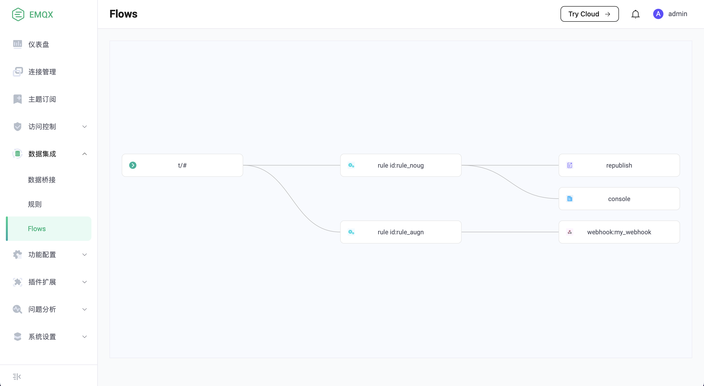

# 数据集成简介

数据集成是 EMQX 在发布订阅模型的基础之上的数据处理与分发组件，通过简单的、可视化的配置，即可将消息流以及设备事件与 Kafka、RabbitMQ 等消息中间件，以及各类 SQL / NoSQL / 时序数据库等数据系统集成。

EMQX 通过结合**规则**与**数据桥接**两个功能，提供了实时、简洁、高效的数据集成方案。
其中规则用于处理消息或事件，而数据桥接用于对接数据系统。

## 规则

EMQX 在发布/订阅模型的基础上提供了规则来处理消息或事件，比如数据格式转换、消息编解码、业务逻辑处理等。
关于规则的详细信息，请参见 [规则](./rules.md)。

## 数据桥接

数据桥接是用来对接 EMQX 和外部数据系统的通道，通过数据桥接，用户可以实时地将消息从 EMQX 发送到外部数据系统，
或者从外部数据系统拉取数据并发送到 EMQX 的某个主题。
关于数据桥接的详细信息，请参见 [数据桥接](./data-bridges.md)。

## 数据集成拓扑图

创建完成数据桥接和规则之后，我们可以从 Dashboard 上看到数据集成的拓扑图：

