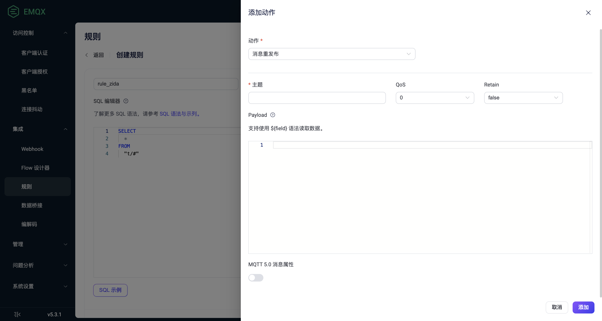

# 创建规则

本指南介绍如何在 EMQX Dashboard 中创建规则。登录 EMQX Dashboard，点击左侧导航目录中的 **集成** -> **规则**。然后点击**+ 创建**按钮，跳转至**规则**页面。在这里，您可以定义规则的数据源，并确定消息过滤的后续操作，例如重新发布、将结果打印到控制台或通过数据桥接进行转发。

以下步骤演示如何创建一个规则，该规则监听主题为 `t/#` 的消息，并将接收到的消息转发到主题 `a/1`。

## 定义数据源

在**规则**页面上，输入规则的名称并添加备注以便未来管理。

在 **SQL 编辑器**中，您可以自定义语句以添加适合您业务需求的数据源。对于本教程，请保持默认设置，即选择并返回符合 `t/#` 模式的所有主题下的消息（例如 `t/a`、`t/a/b`、`t/a/b/c`等）。

::: tip 

本教程假设 payload 是 JSON 格式。<!--如果负载以其他方式格式化，您可以通过Schema Registry TODO来转换数据类型。 -->

EMQX 内置了丰富的 SQL 语句示例，以帮助您入门。您可以在 **SQL 编辑器**下点击 **SQL 示例**按钮进行探索。有关 SQL 语法和用法的更多详细信息，请参阅 [SQL 语法与示例](./rule-sql-syntax.md)。 

:::


## 测试 SQL 语句

这是一个可选步骤，但如果您第一次使用 EMQX 规则，建议进行测试。打开**启用调试**切换开关，启用 SQL 语句测试。

EMQX 为所有字段提供了默认值，例如**数据来源**、**客户端 ID**、**用户名**、**主题**、**QoS**、**Payload** 等。您只需点击**运行测试**按钮即可开始测试。如果一切正常，将显示**测试通过**提示。


SQL 处理结果将以 JSON 形式呈现在**输出结果**部分。SQL 处理结果中的所有字段都可以通过后续操作（内置操作或数据桥接）以 `${key}`的形式进行引用。有关字段的详细说明，请参阅 [SQL 数据源和字段](./rule-sql-events-and-fields.md)。

## 添加消息重发布操作

要将主题为 `t/#` 的消息重新发布到主题 `a/1`，在页面右侧点击 **+ 添加动作**按钮。在**动作**下拉菜单中选择**消息重发布**，然后在点击**添加**按钮之前，配置以下设置：

- **主题**：在本示例中设置为目标主题 `a/1`；
- **QoS**：在本示例中设置为重新发布的消息的 QoS 为`0`；
- **Retain**：设置是否将此消息作为保留消息转发，本教程中保持默认设置 `false`；
- **Payload**：输入 `${payload}`，表示重新发布的消息将与原始消息具有相同的 payload，不进行任何修改。



在**规则**页面，点击底部的**创建**按钮以完成规则创建。此规则将作为新条目添加到**规则**页面。您可以查看规则 ID、数据源、启用或禁用规则以及创建时间。您还可以点击**设置**来修改数据源或添加更多操作，或者点击**更多**按钮来复制或删除规则。

::: tip 

重新发布操作不会阻止原始消息的传递。例如，根据规则，主题 `t/1`下的消息将重新发布到主题 `a/1`，与此同时，`t/1` 的消息仍然会传递到订阅了主题 `t/1`的客户端。 

:::

**添加控制台输出操作**

除了消息重发布操作，您还可以选择将规则的输出打印到控制台以进行调试。

控制台输出操作用于将规则的结果消息打印到控制台或日志文件。

- 如果 EMQX 是通过 `emqx console` 启动的，则结果将打印到 `emqx console` 被调用的终端。
- 如果 EMQX 是通过 `emqx start` 启动的，则结果将打印到 EMQX 的 `log` 目录下的日志文件（`erlang log.*`）。

输出格式如下所示：

```bash
[rule action] rule_id1
    Action Data: #{key1 => val1}
    Envs: #{key1 => val1, key2 => val2}
```

其中：

- `[rule action]` 是重新发布操作被触发的规则 ID。
- `Action Data `是规则的输出结果，表示在执行操作时应传递给操作的数据或参数，即您设置消息重发布操作时的 payload 部分。
- `Envs` 是重新发布时应设置的环境变量，其中可能包含与执行此操作相关的数据源和其他内部信息。

::: tip 

控制台输出操作仅用于调试。如果在生产环境中使用，可能会导致性能问题。

 :::

**使用数据桥接转发**

您还可以添加使用数据桥接转发的操作。您只需从**数据桥接**下拉列表中选择目标数据桥接即可。有关在 EMQX 中创建数据桥接的详细信息，请参阅[数据桥接](./data-bridges.md)。

## 测试规则

现在您可以使用 [MQTTX](https://mqttx.app/) 来测试此规则。创建一个客户端，然后使用此客户端订阅主题 `a/1`并发送一条`t/1` 的消息。您将在对话框中看到此消息也被重新发布到主题 `a/1`。

有关如何在 MQTTX 客户端工具和 EMQX 之间建立连接的详细信息，请参阅 [MQTTX - 开始使用](https://mqttx.app/zh/docs/get-started)。


## 查看规则

EMQX 5.0 引入了 Flows 编辑器，提供了您创建的规则的可视化视图。点击**集成** -> **Flows** 即可访问。该窗口显示您已经为所有遵循 `t/#` 模式的消息创建了两个规则："rule_4xjx" 将消息发布并将数据流转到 Kafka，而 "rule_z97h" 将消息打印到控制台。


您可以在 **Flows** 页面或**规则**页面上点击规则 ID，以查看规则解析的执行和操作统计信息。

注：如果更新规则操作或重新定义数据源，则下面页面中列出的统计信息将重置并重新开始。


