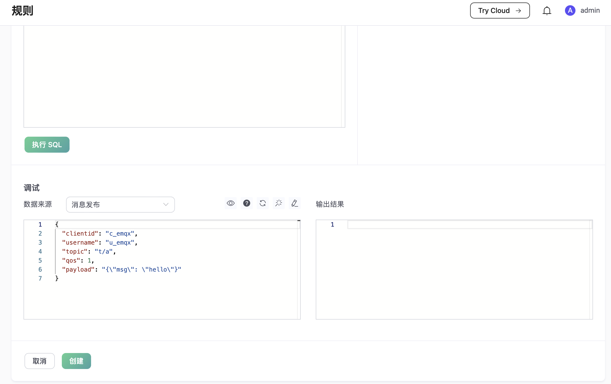

# 规则快速入门

我们用一个示例展示如何使用 Dashboard 创建一条简单的规则。
这条规则监听主题为 "t/#" 的消息，并发送出另一条主题为 "a/1" 的消息：

## 创建规则
在 Dashboard 上，选择数据集成 -> 规则 -> 创建，进入创建规则的界面：

## 添加消息重发布动作
保持默认的规则名和 SQL 语句不变，点击 “添加动作” 按钮，按照如下参数添加一个 `消息重发布` 动作：

- Topic: "a/1"
- QoS: 0
- Payload: ${payload}

最后回到规则创建页面，点击页面下方的创建按钮，规则就创建完成了。

## 发送数据进行测试
现在我们测试一下这个规则，使用 [MQTTX](https://mqttx.app/) 登录一个 MQTT 客户端，订阅 "a/1" 主题，然后发送一条 "t/1" 消息：

我们看到这个客户端会收到一个主题为 "a/1" 的消息，证明规则生效。

## 测试 SQL 语句

Dashboard 提供了测试 SQL 语句的功能。在规则创建页面，点击 “执行 SQL”，通过给定的 SQL 语句和事件参数，即时展示 SQL 的测试结果。

SQL 的处理结果会以 JSON 的形式呈现在 **输出结果** 文本框里。在后续的动作（内置动作或者数据桥接）里面，可以 `${key}` 的形式引用 SQL 处理结果里的字段。
