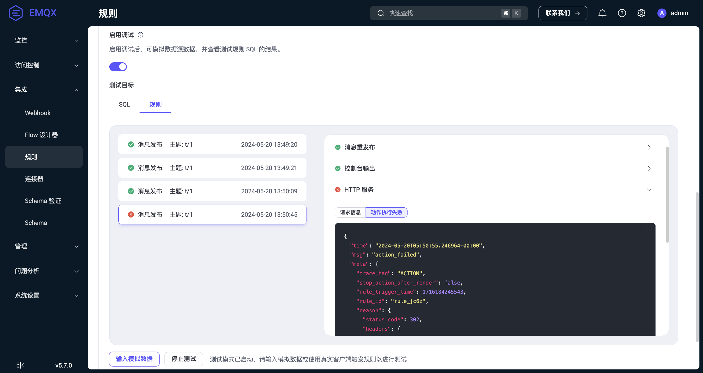

# 创建规则

本页主要介绍如何在 EMQX Dashboard 中创建数据处理的规则并为规则添加动作。登录 EMQX Dashboard，点击左侧导航目录中的 **集成** -> **规则**。然后点击**创建**按钮，跳转至规则创建页面。在这里，您可以定义规则 SQL 处理并筛选来自消息、事件以及外部数据系统的数据，并为规则添加动作，实现将处理结果通过消息发布、打印到控制台或通过 Sink 进行转发等操作。

本页面的演示以消息重发布动作作为示例，描述了如何创建一个规则，处理接收到的主题为 `t/#` 的消息，并将消息重新发布到主题 `a/1`。

## 输入规则 SQL

在**规则**页面上，输入规则的名称并添加备注以便未来管理。

在 **SQL 编辑器**中，您可以自定义语句以添加适合您业务需求的数据源。对于本教程，请保持默认设置，即选择并返回符合 `t/#` 模式的所有主题下的消息（例如 `t/a`、`t/a/b`、`t/a/b/c`等）。

::: tip

EMQX 内置了丰富的 SQL 语句示例，以帮助您入门。您可以在 **SQL 编辑器**下点击 **SQL 示例**按钮进行探索。有关 SQL 语法和用法的更多详细信息，请参阅 [SQL 语法与示例](./rule-sql-syntax.md)。

:::


## 测试 SQL 语句

您可以使用模拟数据执行 SQL 语句，在添加动作和创建规则之前，验证 SQL 执行结果是否符合预期。这是一个可选步骤，但如果您是首次编写 SQL，建议进行测试。如果您想测试整个规则的执行情况，请使用[测试规则](#测试规则)功能。

测试步骤如下：

1. 开启**启用调试**开关，并将测试目标选择为 **SQL**。

2. 选择与 SQL 匹配的**数据来源**，并确保它与规则中指定的来源（FROM 子句）保持一致。

3. 输入模拟数据：选定数据来源后，EMQX 为所有模拟数据字段提供了默认值，例如**客户端 ID**、**用户名**、**主题**、**QoS**、**Payload** 等，按照需求将其修改为适当的值。

4. 点击**运行测试**按钮即可提交测试，如果一切正常，将显示**测试通过**提示。


SQL 处理结果将以 JSON 形式呈现在**输出结果**部分。SQL 处理结果中的所有字段都可以通过后续操作（内置操作或 Sink）以 `${key}` 的形式进行引用。有关字段的详细说明，请参阅 [SQL 数据源和字段](./rule-sql-events-and-fields.md)。



::: tip

本演示假设 Payload 是 JSON 格式。在实际使用中，您也可以使用[编解码](./schema-registry.md)来处理其他格式的消息。

:::



下一步，您可以在**创建规则**页面上，点击页面右侧的**添加动作**按钮，为规则添加多个动作。

## 添加动作

在**创建规则**页面上，点击右侧的**添加动作**按钮，将弹出**添加动作**页面。您可以从**动作**下拉列表中选择三种类型的动作之一：消息重新发布、控制台输出和使用数据桥接进行转发。

### 添加消息重发布动作

消息重发布动作用来发布一条新的 MQTT 消息，适用于需要向设备发送下行消息的场景。

本节演示了如何将主题为 `t/#` 的消息重新发布到主题 `a/1`。在**动作**下拉菜单中选择`消息重发布`，然后在点击**添加**按钮之前，配置以下设置：

- **主题**：在本示例中设置为目标主题 `a/1`；

- **QoS**：在本示例中设置为重新发布的消息的 QoS 为`0`；

- **Retain**：设置是否将此消息作为保留消息转发，本教程中保持默认设置 `false`；

- **Payload**：输入 `${payload}`，表示重新发布的消息将与原始消息具有相同的 payload，不进行任何修改。

- **MQTT 5.0 消息属性**：点击切换开关以根据需要配置消息属性，允许您为重新发布的消息添加丰富的消息元数据描述。

  <!-- - **用户属性**：您可以添加自定义键值对来配置重新发布消息的[用户属性](https://www.emqx.com/zh/blog/mqtt5-user-properties)，表示自定义消息元数据。 -->

  - **有效载荷指示器**：指示消息格式。值设置为 `false` 时，消息是未确定的字节，设置为 `true` 时，意味着消息体中的有效载荷是 UTF-8 编码的字符数据。这将有助于 MQTT 客户端或 MQTT 服务器可以更加有效的解析消息内容，而不用特意去对于消息体进行格式或类型的判断。
  - **消息过期时间**：输入一个值（以秒为单位）以指定消息应在经过一段时间后过期，并且如果未传递给预期的接收方，则被视为无效。
  - **内容类型**：指定重新发布消息中的载荷内容的类型或格式（MIME 类型），例如，`text/plain` 表示文本文件，`audio/aac` 表示音频文件，而 `application/json` 表示是一条 JSON 格式的应用消息。
  - **响应主题**：输入要将响应消息发布到的特定 MQTT 主题。例如，如果您希望将响应发送到名为"response/my_device"的主题，您应输入：`response/my_device`。
  - **对比数据**：输入一个唯一标识符或数据，以将响应消息与原始请求消息相关联。您可以输入唯一的请求标识符、事务 ID 或在您的应用程序上下文中有意义的任何其他信息。


在**创建规则**页面，点击底部的**创建**按钮以完成规则创建。此规则将作为新条目添加到**规则**页面。您可以查看规则 ID、规则输入、是否启用规则以及动作数量等。您还可以点击**设置**来修改数据源或添加更多操作，或者点击**更多**按钮来复制或删除规则。

::: tip 

重新发布操作不会阻止原始消息的传递。例如，根据规则，主题 `t/1`下的消息将重新发布到主题 `a/1`，与此同时，`t/1` 的消息仍然会传递到订阅了主题 `t/1`的客户端。 

:::

### 添加控制台输出动作

::: tip 

控制台输出动作仅用于调试。如果在生产环境中使用，可能会导致性能问题。

:::

控制台输出动作用于查看规则的输出结果，结果将以日志的形式打印到控制台或日志中。

- 当 EMQX 以控制台（`console`）或前台（`foreground`）模式（前台模式是在 Docker 环境中的默认模式）启动时，其输出将被直接发送到控制台。
- 如果通过 systemd 启动 EMQX，输出将被系统日志捕获并存储。这可以通过使用 `journalctl` 命令来查看。

输出格式如下所示：

```bash
[rule action] rule_id1
    Action Data: #{key1 => val1}
    Envs: #{key1 => val1, key2 => val2}
```

其中：

- `[rule action]` 是重新发布操作被触发的规则 ID。
- `Action Data` 是规则的输出结果，表示在执行操作时应传递给动作的数据或参数，即您设置消息重发布动作时的 payload 部分。
- `Envs` 是重新发布时应设置的环境变量，其中可能包含与执行此操作相关的数据源和其他内部信息。

### 添加发送到 Sink 的动作

您可以将规则结果通过 Sink 转发到外部数据系统，如 HTTP 服务器、Kafka 以及各种数据库。有关支持的 Sink 和使用方法，请参阅[数据集成](./data-bridges.md)。

## 测试规则

规则引擎提供了规则测试功能，可以使用模拟数据或真实客户端触发规则，执行规则 SQL 以及规则中添加的所有动作，并获得每个步骤的执行结果。

通过测试规则，可以验证规则是否按预期工作，快速排查并解决存在的问题。这不仅加快了开发速度，还确保了规则在实际运行时能够如期运行，避免在真实环境中出现故障。

### 测试步骤

1. 点击 **启用调试**开关，并将测试目标选择为**规则**。注意，开始测试之前需要先保存规则。
2. 点击**开始测试**按钮开始测试，浏览器将等待当前规则触发以生成测试结果。
3. 触发规则进行测试，支持以下 2 种方式：
    - **模拟数据**
      点击**输入模拟数据**按钮，在弹出的窗口中选择与 SQL 匹配的**数据来源**，并确保它与规则中指定的来源（FROM 子句）保持一致。
      EMQX 为所有字段提供了默认值，例如**客户端 ID**、**用户名**、**主题**、**QoS**、**Payload** 等。可以修改为需要的值，点击**提交测试**按钮即可触发一次规则进行测试。
    - **真实设备**
      保持当前页面打开，使用真实客户端或 MQTT 客户端工具连接到 EMQX，触发对应的事件，进行测试。
4. 查看测试结果：当规则被触发时，会将执行结果输出到 Dashboard 上，详细展示每个步骤的执行结果。

### 测试示例

以 [MQTTX](https://mqttx.app/zh/docs/get-started) 为例，创建一个客户端，然后使用此客户端订阅主题 `a/1` 并发送一条 `t/1` 的消息。

您将在对话框中看到此消息也被重新发布到主题 `a/1`：


相应的，Dashboard 测试界面上将显示整个规则的执行结果，显示内容如下：

- 左侧为规则执行记录，每次规则触发会产生一条记录，点击可以切换到对应的消息或事件详情。
- 右侧为选中规则记录下的动作列表，点击可以展开查看动作执行结果和日志。

当规则 SQL 或任意动作执行失败时，整个规则记录将标记为失败状态，可以选中记录查看对应动作的错误信息进行排查。



从上图可以看到，规则被触发了 4 次，其中 3 次规则执行完全成功，第 4 次由于 **HTTP 服务**动作执行失败，错误原因是响应了 302 状态码。

## 查看规则

EMQX 提供了 [Flow 设计器](../flow-designer/introduction.md)，规则处理流程将通过可视化的方式展示出来。您可以在 **集成** -> **Flow 设计器** 页面中查看所有规则的 Flow 视图。


您可以在**规则**列表页上点击规则 ID，以查看规则与动作的执行统计信息。

注：如果更新规则，则下面页面中列出的统计指标将重置。


