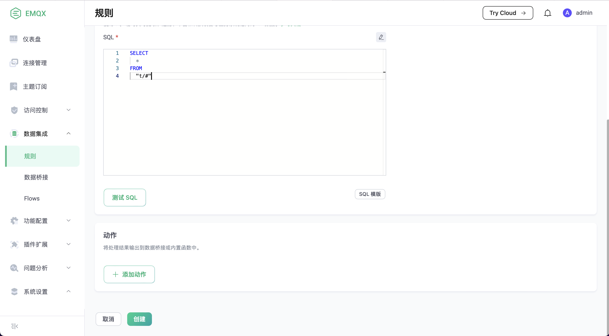
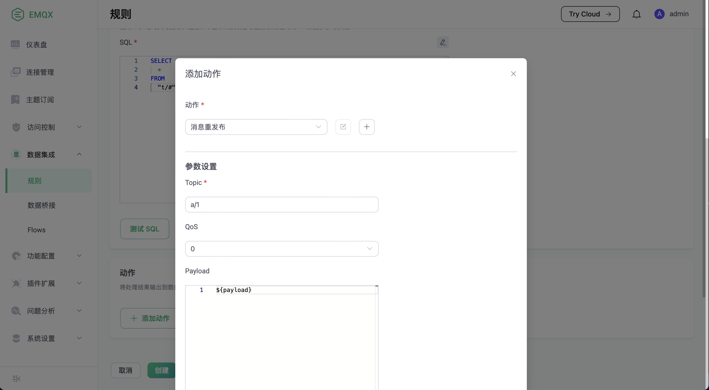
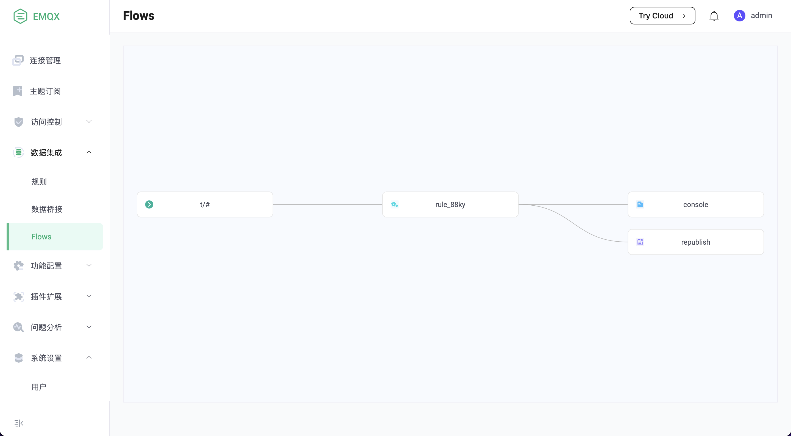
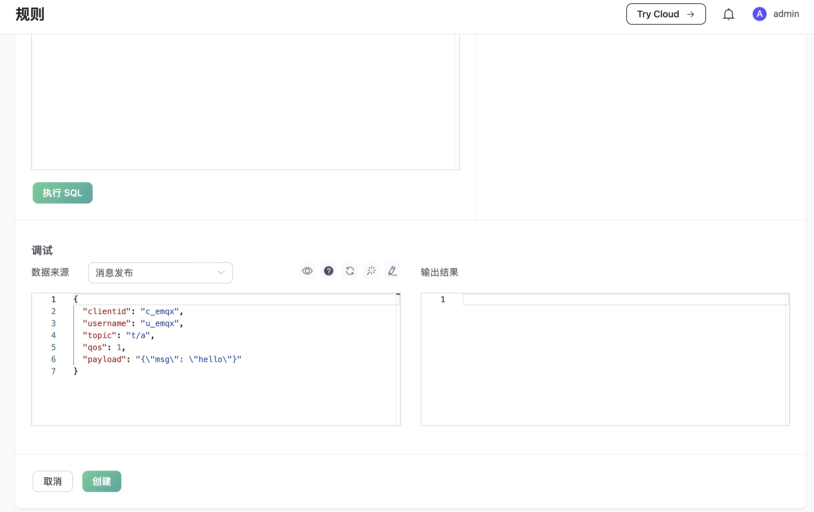

# 规则简介

EMQX 提供了基于 SQL 语法的规则，用于对消息或事件进行处理和转换，比如转换数据类型、编码或解码消息、条件分支判断等。
规则是内置于 EMQX 的，没有消息序列化和网络传输的开销，所以运行非常高效。

## 规则的组成

规则描述了 **数据来源**、**数据处理过程**、**处理结果去向** 三个方面：

- **数据来源**：规则的数据源可以是消息或事件，也可以是外部的数据系统。规则通过 SQL 的 FROM 子句指定数据的来源；
- **数据处理过程**：规则通过 SQL 语句和函数来描述数据的处理过程。SQL 的 WHERE 字句用于过滤数据，SELECT 子句以及 SQL 函数用于提取和转换数据；
- **处理结果去向**：规则可以定义一个或多个动作来处理 SQL 的输出结果。如果 SQL 执行通过，规则将按顺序执行相应的动作，比如将处理结果存储到数据库、或者重新发布到另一个 MQTT 主题等。

```
┌─────────────────┐           ┌────────────────────┐           ┌───────────────────────┐
│                 │           │                    │           │                       │
│   DATA SOURCE   ├──────────►│    DATA PROCESS    ├──────────►│ HANDLE PROCESS RESULT │
│                 │           │       (SQL)        │           │       (Actions)       │
└─────────────────┘           └────────────────────┘           └───────────────────────┘
```

### 规则 SQL 语句简介

SQL 语句用于指定规则的数据来源、定义数据处理过程等。下面给出了一个 SQL 语句的例子：

```SQL
SELECT
    payload.data as d
FROM
    "t/#"
WHERE
    clientid = "foo"
```

在上述 SQL 语句里：

- 数据来源：主题为 `t/#` 的消息；
- 数据处理过程：如果发送消息的客户端 ID 为 `foo`，则从消息内容中选出 `data` 字段并赋值给新的变量 `d`。

::: warning
"." 语法要求数据必须是 JSON 或者 Map 类型，如果是其他数据类型，须要使用 SQL 函数做数据类型转换。
:::

关于规则的 SQL 语句格式和用法，详见 [SQL 手册](./rule-sql-grammar-and-examples.md)。

### 动作简介

规则支持以下两种动作：

- 内置动作：目前仅有两种内置动作: `republish` 和 `console`。关于内置动作的细节，详见 [动作](./rule-actions.md)；
- 数据桥接：数据桥接是通往外部数据系统的通道，规则可以直接使用数据桥接的 ID 作为动作。关于数据桥接的细节，详见 [数据桥接](./data-bridges.md)。

## 规则快速入门

我们用一个示例展示如何使用 Dashboard 创建一条简单的规则。
这条规则监听主题为 "t/#" 的消息，并发送出另一条主题为 "a/1" 的消息：

在 Dashboard 上，选择数据集成 -> 规则 -> 创建，进入创建规则的界面：



保持默认的规则名和 SQL 语句不变，点击“添加规则”按钮，按照如下参数添加一个 `消息重发布` 动作：

```
Topic: "a/1"
QoS: 0
Payload: ${payload}
```



然后用同样的操作，再添加一个 `console 输出` 动作。 

最后点击页面下方的创建按钮。规则就创建完成了。在左侧的 Flows 页面上可以查看规则的拓扑图：



现在我们测试一下这个规则，使用 MQTTX 登录一个 MQTT 客户端，订阅 "a/1" 主题，然后发送一条 "t/1" 消息：


这个客户端会收到规则转发的 "a/1" 消息。

## 在 Dashboard 上测试 SQL 语句

EMQX 提供了在 Dashboard 上测试 SQL 语句的功能。在规则创建页面，点击“测试 SQL”，通过给定的 SQL 语句和事件参数，即时展示 SQL 的测试结果。



SQL 的处理结果会以 JSON 的形式呈现在 **测试输出** 文本框里。在后续的动作（内置动作或者数据桥接）里面，可以 `${key}` 的形式引用 SQL 处理结果里的字段。

## 规则的典型应用场景举例

- 动作监听：智慧家庭智能门锁开发中，门锁会因为网络、电源故障、人为破坏等原因离线导致功能异常，使用规则配置监听离线事件向应用服务推送该故障信息，可以在接入层实现第一时间的故障检测的能力；
- 数据筛选：车辆网的卡车车队管理，车辆传感器采集并上报了大量运行数据，应用平台仅关注车速大于 40 km/h 时的数据，此场景下可以使用规则对消息进行条件过滤，向业务消息队列写入满足条件的数据；
- 消息路由：智能计费应用中，终端设备通过不同主题区分业务类型，可通过配置规则将计费业务的消息接入计费消息队列并在消息抵达设备端后发送确认通知到业务系统，非计费信息接入其他消息队列，实现业务消息路由配置；
- 消息编解码：其他公共协议 / 私有 TCP 协议接入、工控行业等应用场景下，可以通过规则的本地处理函数（可在 EMQX 上定制开发）做二进制 / 特殊格式消息体的编解码工作；亦可通过规则的消息路由将相关消息流向外部计算资源如函数计算进行处理（可由用户自行开发处理逻辑），将消息转为业务易于处理的 JSON 格式，简化项目集成难度、提升应用快速开发交付能力。
