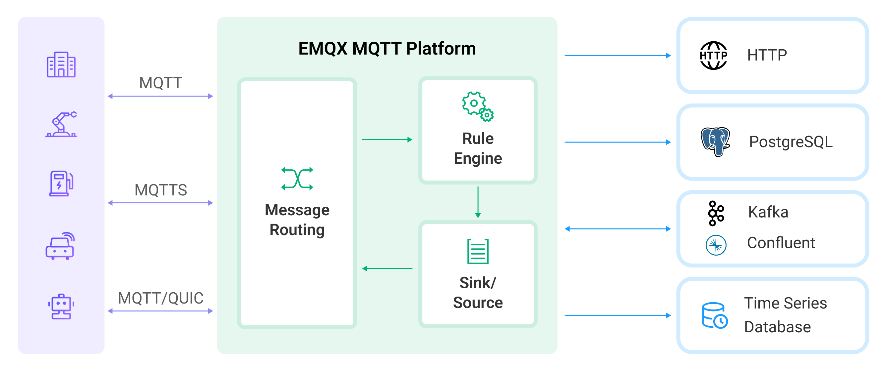
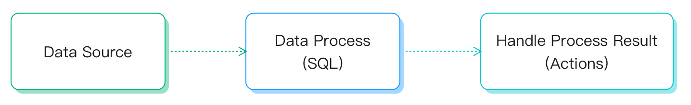

# 规则引擎简介

规则引擎是 EMQX 内置基于 SQL 的数据处理组件，搭配 [数据桥接](./data-bridges.md) 使用无需编写代码即可实现一站式的 IoT 数据提取、过滤、转换、存储与处理，以加速应用集成和业务创新。



## 规则的组成

规则描述了 **数据来源**、**数据处理过程**、**处理结果去向** 三个方面：

- **数据来源**：规则的数据源可以是消息或事件，也可以是外部的数据系统。规则通过 SQL 的 FROM 子句指定数据的来源；
- **数据处理过程**：规则通过 SQL 语句和函数来描述数据的处理过程。SQL 的 WHERE 子句用于过滤数据，SELECT 子句以及 SQL 函数用于提取和转换数据；
- **处理结果去向**：规则可以定义一个或多个动作来处理 SQL 的输出结果。如果 SQL 执行通过，规则将按顺序执行相应的动作，比如将处理结果存储到数据库、或者重新发布到另一个 MQTT 主题等。



### 规则 SQL 语句简介

SQL 语句用于指定规则的数据来源、定义数据处理过程等。下面给出了一个 SQL 语句的例子：

```SQL
SELECT
    payload.data as d
FROM
    "t/#"
WHERE
    clientid = "foo"
```

在上述 SQL 语句里：

- 数据来源：主题为 `t/#` 的消息；
- 数据处理过程：如果发送消息的客户端 ID 为 `foo`，则从消息内容中选出 `data` 字段并赋值给新的变量 `d`。

::: tip
"." 语法要求数据必须是 JSON 或者 Map 类型，如果是其他数据类型，须要使用 SQL 函数做数据类型转换。
:::

关于规则的 SQL 语句格式和用法，详见 [SQL 手册](./rule-sql-syntax.md)。

### 动作

动作是用于处理规则的输出结果的组件，决定了数据的最终去向。

目前规则支持以下两种动作：

- 内置动作：目前仅有两种内置动作：消息重发布(`republish`) 和控制台输出(`console`)。
- 数据桥接：数据桥接是通往外部数据系统的通道，规则可以直接使用数据桥接的 ID 作为动作，
将规则的输出交给数据桥接处理。关于数据桥接的细节，详见 [数据桥接](./data-bridges.md)。

### 消息重发布

消息重发布动作用来发布一条新的 MQTT 消息，适用于需要向设备发送下行消息的场景。

::: tip
“消息重发布”动作不会阻止原来的消息的投递。举例来说，如果一条 "a/1" 消息通过规则触发了重发布动作，
并发出一条新的消息 "a/2"，那么 "a/1" 消息仍然会被投递到订阅了该主题的客户端。
:::

消息重发布动作里面，可以自定义消息的消息内容、主题、QoS 等参数，可以用 `${field-name}` 的形式引用规则输出里的字段作为参数值。

### 控制台输出动作

控制台输出动作用于查看规则的输出结果，结果将以日志的形式打印到控制台里。

如果用是 `emqx console` 启动的 EMQX，结果将打印到前台。
如果用是 `emqx start` 启动的 EMQX，结果将打印到 EMQX 日志路径下的 `erlang.log.*` 文件里。

### 输出格式

输出第一行打印 `[rule action]` 头和规则的 ID。
从第二行开始打印分为两部分：

- `Action Data` 部分为规则的输出结果，`Action Data` 中包含的字段都可以在动作的参数里面以
`${field-name}` 的形式引用。
- `Envs` 为动作可用的环境变量信息。环境变量信息包含该数据源的所有可用字段，以及其他跟本次动作执行相关的内部信息。

输出格式示例：

```bash
[rule action] rule_id1
    Action Data: #{key1 => val1}
    Envs: #{key1 => val1, key2 => val2}
```

::: tip
控制台输出动作仅用于规则测试过程中的调试，用于生产环境将引起性能问题。
:::

## 规则的典型应用场景举例

- 动作监听：智慧家庭智能门锁开发中，门锁会因为网络、电源故障、人为破坏等原因离线导致功能异常，使用规则配置监听离线事件向应用服务推送该故障信息，可以在接入层实现第一时间的故障检测的能力；
- 数据筛选：车联网的卡车车队管理，车辆传感器采集并上报了大量运行数据，应用平台仅关注车速大于 40 km/h 时的数据，此场景下可以使用规则对消息进行条件过滤，向业务消息队列写入满足条件的数据；
- 消息路由：智能计费应用中，终端设备通过不同主题区分业务类型，可通过配置规则将计费业务的消息接入计费消息队列并在消息抵达设备端后发送确认通知到业务系统，非计费信息接入其他消息队列，实现业务消息路由配置；
- 消息编解码：其他公共协议 / 私有 TCP 协议接入、工控行业等应用场景下，可以通过规则的本地处理函数（可在 EMQX 上定制开发）做二进制 / 特殊格式消息体的编解码工作；亦可通过规则的消息路由将相关消息流向外部计算资源如函数计算进行处理（可由用户自行开发处理逻辑），将消息转为业务易于处理的 JSON 格式，简化项目集成难度、提升应用快速开发交付能力。