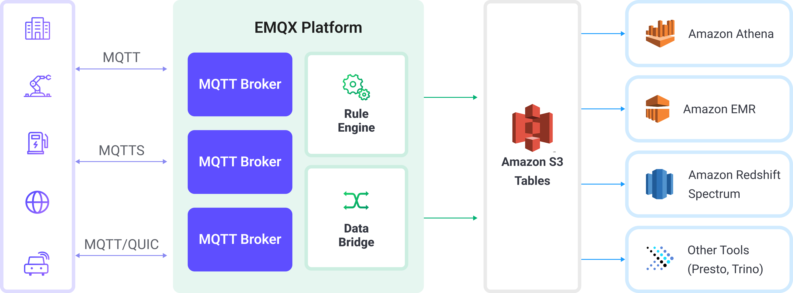

# 将 MQTT 数据写入到 Amazon S3 表类数据存储服务中

[Amazon S3 表类数据存储服务](https://docs.aws.amazon.com/zh_cn/AmazonS3/latest/userguide/s3-tables.html)是专为分析工作负载优化的存储解决方案。它采用 Apache Iceberg 格式，能够高性能、可扩展且安全地存储结构化表格数据，如物联网（IoT）传感器读取数据。

EMQX 现已支持与 Amazon S3 表类数据存储服务的无缝集成，可高效地将 MQTT 消息存储至 S3 表存储桶中。通过该集成，用户可构建灵活且可扩展的 IoT 数据存储方案，并利用 Amazon Athena、Amazon Redshift 和 Amazon EMR 等 AWS 服务开展高级数据分析与处理。

本页详细介绍了 EMQX 与 Amazon S3 Tables 的数据集成并提供了实用的规则和 Sink 创建指导。

## 工作原理

EMQX 与 Amazon S3 表类数据存储服务集成，支持将实时的 MQTT 数据结构化写入 Amazon S3 表数据存储服务中，实现长期存储与数据分析。此集成通过 EMQX 的规则引擎和 S3 Tables Sink，将 MQTT 消息直接流式写入采用 Apache Iceberg 格式的表，并存储于 S3 表存储桶中。

在典型的 IoT 应用场景中：

- **EMQX** 作为 MQTT 消息代理，负责设备接入、消息路由及数据处理。
- **Amazon S3 表类数据存储服务**用作 MQTT 消息的结构化存储终端，具备持久性和可查询性。
- **Amazon Athena** 用于定义 Iceberg 格式的表并对存储的数据执行 SQL 查询。



工作流程如下：

1. **设备连接至 EMQX**：物联网设备通过 MQTT 协议连接至 EMQX，并开始发布遥测数据。
2. **消息路由与规则匹配**：EMQX 使用其内置的规则引擎将接收到的 MQTT 消息与预定义的主题进行匹配，并提取特定的字段或数值。
3. **数据转换**：EMQX 中的规则可以对消息 payload 进行过滤、转换或补充，使其符合目标 Iceberg 表的结构。
4. **写入 Amazon S3 表数据存储服务**：规则会触发 S3 Tables Sink 动作，将转换后的数据进行批量处理，并通过兼容 Iceberg 的写入 API 发送到 Amazon S3 表中。数据将作为 Parquet 文件持久化存储于 Iceberg 表的分区中。
5. **查询与分析**：数据写入后，可通过 Amazon Athena 查询，也可以与其他数据集进行联合分析，或通过 Redshift Spectrum、Amazon EMR 以及第三方分析引擎（如 Presto 和 Trino）进行进一步分析处理。

## 特性与优势

在 EMQX 中集成 Amazon S3 表数据存储服务，可以为你的业务带来以下功能和优势：

- **实时流处理**：EMQX 的规则引擎支持在消息写入 S3 表数据存储服务之前，实时提取、转换和按条件路由 MQTT 消息。
- **基于 Iceberg 的 S3 存储**：消息被写入 Apache Iceberg 表，无需使用传统数据库，同时支持类 SQL 的访问模式。
- **轻松集成分析工具**：数据写入 S3 表后，可通过 Amazon Athena（SQL）、Amazon EMR、Redshift Spectrum，或第三方引擎（如 Presto、Trino、Snowflake）进行查询和分析。
- **灵活且具成本效益的存储**：Amazon S3 提供高度耐久、低成本的对象存储，适用于设备生成数据的归档、合规存储及时序数据分析等场景。

## 准备工作

本节介绍了在 EMQX 中创建 Amazon S3 Tables Sink 之前需要做的准备工作。

### 前置准备

在开始之前，请确保你已了解以下内容：

#### EMQX 相关概念：

- [规则引擎](./rules.md)：了解规则如何定义从 MQTT 消息中提取和转换数据的逻辑。
- [数据集成](./data-bridges.md)：了解 EMQX 数据集成中连接器和 Sink 的概念。

#### AWS 相关概念：

如果你是第一次使用 AWS S3 表数据存储服务，请了解以下关键术语：

- **表存储桶**：一种专用的 S3 存储桶，用于在 S3 表中存储基于 Iceberg 的表格数据及其元数据。
- **Amazon Athena**：一款无服务器的查询引擎，可直接对存储在 Amazon S3 中的数据执行 SQL 查询。Athena 支持标准 SQL 语法，包括如 `CREATE TABLE` 等数据定义语言（DDL）语句，用于定义查询所需的表结构和模式。
- **目录**：Athena 中的元数据容器，用于组织数据库（命名空间）和数据表。
- **数据库（命名空间）**：目录下用于逻辑分组数据表的结构。
- **Iceberg 表**：一种用于数据湖的高性能事务型表格式，支持模式演进、分区裁剪和时间旅行查询等特性。

### 准备 S3 表存储桶

在创建 EMQX Sink 之前，你需要在 Amazon S3 表数据存储服务中准备 MQTT 数据的目标存储，包括以下内容：

- 一个用于存储实际数据文件的**表存储桶**
- 一个用于逻辑管理相关表的**命名空间**
- 一个用于接收结构化 MQTT 数据的 **Iceberg 表**

1. 登录 AWS 管理控制台。

2. 打开 S3 服务。在左侧导航栏中点击**表存储桶**。

3. 点击**创建表存储桶**。输入你的表存储桶名称（例如：`mybucket`），然后点击**创建表存储桶**。

4. 表存储桶创建完成后，点击该表存储桶，进入其**表**列表页面。

5. 点击**使用 Athena 创建表**。此时会弹出一个窗口，提示你选择命名空间。

6. 选择**创建命名空间**，输入一个命名空间名称，并点击**创建命名空间**进行确认。

7. 命名空间创建完成后，继续点击**使用 Athena 创建表**。

8. 定义你的 Iceberg 表结构：

   - 点击**使用 Athena 查询表**，进入**查询编辑器**：

     - 在**目录**选择器中，选择你的目录（例如，如果你的表存储桶名为 `mybucket`，则目录可能为 `s3tablescatalog/mybucket`）。
     - 在**数据库**选择器中，选择刚才创建的命名空间。

   - 执行以下数据定义语言（DDL）来创建数据表，并确保表类型设置为 `ICEBERG`。例如：

     ```sql
     CREATE TABLE testtable (
       c_str string,
       c_long int
     )
     TBLPROPERTIES ('table_type' = 'ICEBERG');
     ```

     此操作会创建一个 Iceberg 表，用于接收来自 EMQX 的结构化 MQTT 数据。

9. 验证表是否创建成功。可运行以下 SQL 语句，确认表已创建并当前为空：

   ```
   SELECT * FROM testtable
   ```

   ::: tip
   在执行查询 SQL 之前，请确保在 Athena 中已选择正确的**目录**和**数据库**，以确保数据表被创建在正确的 S3 表存储桶中。
   :::

## 创建连接器

在添加 S3 Tables Sink 前，您需要创建对应的连接器，创建步骤如下：

1. 转到 Dashboard **集成** -> **连接器**页面。
2. 点击页面右上角的**创建**。
3. 在连接器类型中选择 **S3 Tables**，点击下一步。
4. 输入连接器名称，支持大写字母、小写字母和数字的组合。例如：`my-s3-tables`。
5. 输入连接信息：
   - **表资源名称（ARN）**：输入你在 AWS 控制台中 S3 表存储桶列表中找到的 Amazon Resource Name (ARN)。
   - **访问密钥 ID 和访问密钥**：输入与具有访问 S3 表和 Athena 权限的 IAM 用户或角色关联的 AWS 访问凭证。
   - **启用 TLS**：连接到 S3 表数据存储服务时默认启用 TLS。有关 TLS 连接选项的详细信息，请参阅[外部资源访问的 TLS](../network/overview.md#启用-tls-加密访问外部资源)。
   - **健康检查超时**：指定对与 S3 表数据存储服务的连接执行自动健康检查的超时时间。
6. 其余设置保持默认值。
7. 点击**创建**之前，您可以先点击**测试连接**来测试连接器是否可以连接到 S3 表数据存储服务。
8. 点击最下方**创建**按钮完成连接器创建。

至此您已经完成连接器创建，接下来将继续创建一条规则和 Sink 来指定需要写入的数据。

## 创建 Amazon S3 Tables Sink 规则

本节演示了如何在 EMQX 中创建一条规则，用于处理来自源 MQTT 主题 `t/#` 的消息，并通过配置的 Sink 将处理后的结果写入到 S3 表数据存储服务的 `mybucket` 表存储桶中。

1. 转到 Dashboard **集成** -> **规则**页面。

2. 点击页面右上角的**创建**。

3. 输入规则 ID `my_rule`，在 SQL 编辑器中输入规则 SQL 如下：

   ```sql
   SELECT
     payload.str as c_str,
     payload.int as c_long
   FROM
     "t/#"
   ```

   ::: tip

   如果您初次使用 SQL，可以点击 **SQL 示例** 和**启用调试**来学习和测试规则 SQL 的结果。

   :::

   ::: tip
    请确保规则输出的字段名与 Iceberg 表的列名一致。如果缺少必须的列名，数据写入可能会失败。
    :::

4. 添加动作，从**动作类型**下拉列表中选择 `S3 Tables`，保持动作下拉框为默认的`创建动作`选项，您也可以从动作下拉框中选择一个之前已经创建好的 S3 Tables 动作。此处我们创建一个全新的 Sink 并添加到规则中。

5. 输入 Sink 的名称和描述（可选）。

6. 在连接器下拉框中选择刚刚创建的 `my-s3-tables` 连接器。您也可以点击下拉框旁边的创建按钮，在弹出框中快捷创建新的连接器，所需的配置参数可以参考[创建连接器](#创建连接器)。

7. 配置 Sink 设置：

   - **命名空间**：你的 Iceberg 表所在的命名空间。如果命名空间为多级结构，使用点号分隔（例如 `my.name.space`）。
   - **表**：要写入的 Iceberg 表名称。
   - **最大记录数**：当达到该数量时，当前数据会被聚合成一个文件上传，并重置时间间隔。
   - **时间间隔**：达到设定时间后，无论记录数是否达到上限，当前批次也将被上传并重置计数器。
   - **数据文件格式**：用于定义存储批量 MQTT 消息的数据文件格式。支持的格式包括：
  - `avro`：默认值，使用 Avro 格式存储记录。
     - `parquet`：使用 Apache Parquet 格式存储记录，适用于数据仓库和如 AWS Athena 等分析工具。
     

8. **备选动作（可选）**：如果您希望在消息投递失败时提升系统的可靠性，可以为 Sink 配置一个或多个备选动作。当 Sink 无法成功处理消息时，这些备选动作将被触发。更多信息请参见：[备选动作](./data-bridges.md#备选动作)。

9. 展开**高级设置**，根据需要配置高级设置选项（可选），详细请参考[高级设置](#高级设置)。

10. 其余参数使用默认值即可。点击**创建**按钮完成 Sink 的创建，创建成功后页面将回到创建规则，新的 Sink 将添加到规则动作中。

11. 回到规则创建页面，点击**创建**按钮完成整个规则创建。

现在您已成功创建了规则，你可以在**规则**页面上看到新建的规则，同时在**动作(Sink)** 标签页看到新建的 S3 Tables Sink。

您也可以点击 **集成** -> **Flow 设计器**查看拓扑，通过拓扑可以直观的看到，主题 `t/#` 下的消息在经过规则 `my_rule` 解析后被写入到 S3 Tables 中。

## 测试规则

本节展示如何测试已配置了 S3 Tables Sink 的规则。

1. 使用 MQTTX 向主题 `t/1` 发布一条消息：

   ```bash
   mqttx pub -i emqx_c -t t/1 -m '{ "str": "hello S3 Tables", "int": 123 }'
   ```

   这条消息包含 `payload.str` 和 `payload.int` 字段，与之前定义的规则 SQL 和数据表结构相匹配。

2. 在**规则**页面中监控规则指标和 Sink 状态。你应该会看到一条新的入站消息和一条新的出站消息。

3. 打开 Athena 查询编辑器。确保已选择正确的**目录**（例如：`s3tablescatalog/mybucket`）和**数据库（命名空间）**。

4. 执行以下 SQL 查询：

   ```sql
   SELECT * FROM testtable
   ```

   你应该会看到类似如下的一行记录：

   | c_str           | c_long |
   | --------------- | ------ |
   | hello S3 Tables | 123    |

## 高级设置

本节将深入介绍可用于 S3 Tables Sink 的高级配置选项。在 Dashboard 中配置 Sink 时，您可以根据您的特定需求展开**高级设置**，调整以下参数。

| 字段名称             | 描述                                                         | 默认值 |
| -------------------- | ------------------------------------------------------------ | ------ |
| **缓存池大小**       | 指定缓冲区工作进程数量，这些工作进程将被分配用于管理 EMQX 与 S3 Tables 的数据流，它们负责在将数据发送到目标服务之前临时存储和处理数据。此设置对于优化性能并确保 Sink 数据传输顺利进行尤为重要。 | `16`   |
| **请求超期**         | “请求 TTL”（生存时间）设置指定了请求在进入缓冲区后被视为有效的最长持续时间（以秒为单位）。此计时器从请求进入缓冲区时开始计时。如果请求在缓冲区内停留的时间超过了此 TTL 设置或者如果请求已发送但未能在 S3 Tables 中及时收到响应或确认，则将视为请求已过期。 | `45`   |
| **健康检查间隔**     | 指定 Sink 对与 S3 Tables 的连接执行自动健康检查的时间间隔（以秒为单位）。 | `15`   |
| **缓存队列最大长度** | 指定可以由 S3 Tables Sink 中的每个缓冲器工作进程缓冲的最大字节数。缓冲器工作进程在将数据发送到 S3 Tables 之前会临时存储数据，充当处理数据流的中介以更高效地处理数据流。根据系统性能和数据传输要求调整该值。 | `256`  |
| **请求模式**         | 允许您选择`同步`或`异步`请求模式，以根据不同要求优化消息传输。在异步模式下，写入到 S3 Tables 不会阻塞 MQTT 消息发布过程。但是，这可能导致客户在它们到达 S3 Tables 之前就收到了消息。 | `异步` |
| **请求飞行队列窗口** | “飞行队列请求”是指已启动但尚未收到响应或确认的请求。此设置控制 Sink 与 S3 Tables 通信时可以同时存在的最大飞行队列请求数。<br/>当 **请求模式** 设置为 `异步` 时，“请求飞行队列窗口”参数变得特别重要。如果对于来自同一 MQTT 客户端的消息严格按顺序处理很重要，则应将此值设置为 `1`。 | `100`  |
| **最小分片大小**     | 聚合完成后的分片上传的最小块大小，上传的数据将在内存中累积，直到达到此大小。 | `5MB`  |
| **最大分片大小**     | 分块上传的最大分块大小。S3 Tables Sink 不会尝试上传超过此大小的分片。 | `5GB`  |