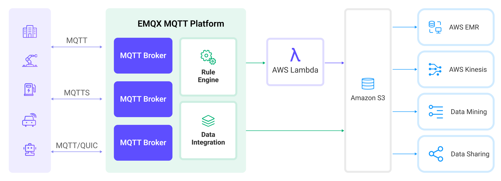
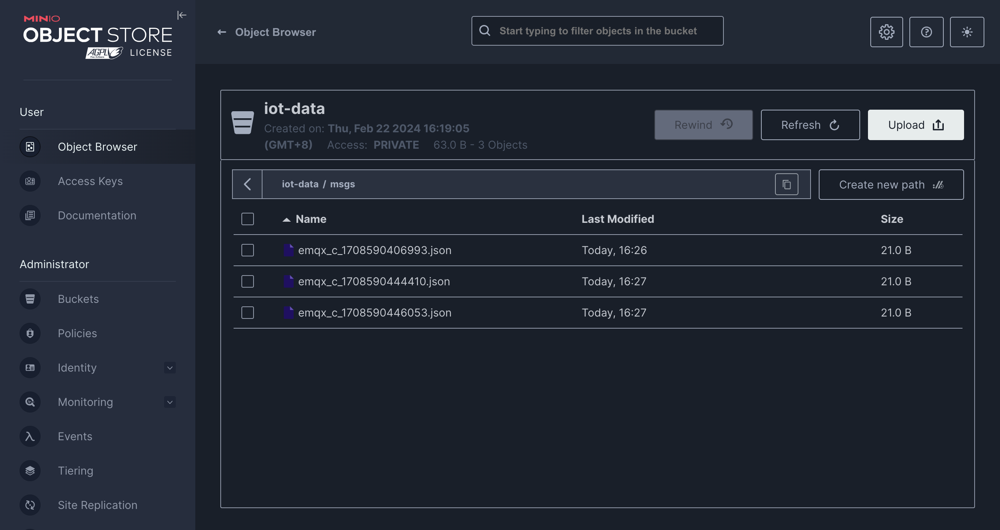

# 将 MQTT 数据写入到 Amazon S3 存储桶中


:::tip
EMQX 企业版功能。EMQX 企业版可以为您带来更全面的关键业务场景覆盖、更丰富的数据集成支持，更高的生产级可靠性保证以及 24/7 的全球技术支持，欢迎[免费试用](https://www.emqx.com/zh/try?product=enterprise)。
:::


[Amazon S3](https://aws.amazon.com/s3/) 是一种面向互联网的存储服务，具有高度的可靠性、稳定性和安全性，能够快速部署和使用。EMQX 能够将 MQTT 消息高效地存储至 Amazon S3 存储桶中，实现灵活的物联网数据存储功能。

本页详细介绍了 EMQX 与 Amazon S3 的数据集成并提供了实用的规则和 Sink 创建指导。

:::tip
EMQX 也兼容其他支持 S3 协议的存储服务，例如：

- [MinIO](https://min.io/): MinIO 是一款高性能、分布式的对象存储系统。它是兼容 Amazon S3 API 的开源对象存储服务器，可以用于构建私有云。
- [Google Cloud Storage](https://cloud.google.com/storage): Google Cloud Storage 是 Google Cloud 的统一对象存储，用于开发者和企业存储大量数据。它提供了与 Amazon S3 兼容的接口。

您可以根据自己的业务需求和场景选择合适的存储服务。
:::

## 工作原理

Amazon S3 数据集成是 EMQX 中开箱即用的功能，通过简单的配置即可实现复杂的业务开发。在一个典型的物联网应用中，EMQX 作为物联网平台，负责接入设备进行消息传输，Amazon S3 作为数据存储平台，负责消息数据的存储。



EMQX 通过规则引擎与 Sink 将设备事件和数据转发至 Amazon S3，应用读取 Amazon S3 中数据即可进行数据的应用。其具体的工作流程如下：

1. **设备连接到 EMQX**：物联网设备通过 MQTT 协议连接成功后将触发上线事件，事件包含设备 ID、来源 IP 地址以及其他属性等信息。
2. **设备消息发布和接收**：设备通过特定的主题发布遥测和状态数据，EMQX 接收到消息后将在规则引擎中进行比对。
3. **规则引擎处理消息**：通过内置的规则引擎，可以根据主题匹配处理特定来源的消息和事件。规则引擎会匹配对应的规则，并对消息和事件进行处理，例如转换数据格式、过滤掉特定信息或使用上下文信息丰富消息。
4. **写入到 Amazon S3**：规则触发将消息写入到 S3 的动作。借助 Amazon S3 Sink，用户可以从规则处理结果中提取数据并发送到 Amazon S3，实现将消息内容的存储。存储的对象可以是文本格式，也可以是二进制格式，取决于消息内容与 Sink 的配置。

事件和消息数据写入到 Amazon S3 后，您可以连接到 Amazon S3 读取数据，进行灵活的应用开发，例如：

- 数据归档：将设备消息作为对象存储，长期保存在 Amazon S3 中，以满足数据保留和合规性要求。
- 数据分析：将 S3 中的数据导入到分析服务例如 Snowflake 中，实现预测性维护、设备效能评估等数据分析业务。

## 特性与优势

在 EMQX 中使用 Amazon S3 数据集成能够为您的业务带来以下特性与优势：

- **消息转换**：消息可以在写入 Amazon S3 之前，通过 EMQX 规则中进行丰富的处理和转换，方便后续的存储和使用。
- **灵活数据操作**：通过 S3 Sink，可以方便地将特定字段的数据写入到 Amazon S3 存储桶中，支持动态设置存储桶与对象键，实现数据的灵活存储。
- **整合业务流程**：通过 S3 Sink 可以将设备数据与 Amazon S3 丰富的生态应用结合，以实现更多的业务场景，例如数据分析、数据归档等。
- **低成本长期存储**：相较于数据库，Amazon S3 提供了高可用、高可靠、低成本的对象存储服务，可以满足长期存储的需求。

通过以上特性，您可以构建高效、可靠和可扩展的物联网应用，并在业务决策和优化方面受益。

## 准备工作

本节介绍了在 EMQX 中创建 Amazon S3 Sink 之前需要做的准备工作。

### 前置准备

- 了解[规则](./rules.md)。
- 了解[数据集成](./data-bridges.md)。

### 准备 S3 存储桶

EMQX 支持 Amazon S3 以及兼容 S3 的存储服务，您可以使用 AWS 云服务或者 Docker 部署一个 MinIO 实例。

:::: tabs

::: tab Amazon S3

1. 在 [AWS S3 控制台](https://console.amazonaws.cn/s3/home)中，点击**创建存储桶**按钮。然后按照向导的指示填写相关信息，如存储桶名称（例如 `iot-data`）、区域等，创建一个 S3 存储桶。详细操作可参考 [AWS 文档](https://docs.amazonaws.cn/AmazonS3/latest/userguide/creating-bucket.html)。
2. 设置存储桶权限：在存储桶创建成功后，选择该存储桶，并点击**权限**选项卡，根据需求可以为存储桶选择公共读写、私有等权限。
3. 获取访问密钥：在 AWS 控制台中，搜索并选择 **IAM** 服务，为 S3 创建一个新的用户，获取 Access Key 和 Secret Key。

至此，您已经完成了 S3 存储桶的创建与配置，接下来我们将在 EMQX 中创建 Amazon S3 Sink。

:::

::: tab MinIO

1. 通过 Docker 安装并启动 MinIO：

   ```bash
   docker run \
      -p 9000:9000 \
      -p 9001:9001 \
      --name minio \
      -e "MINIO_ROOT_USER=admin" \
      -e "MINIO_ROOT_PASSWORD=MyMinIOPassword" \
      minio/minio:RELEASE.2024-02-17T01-15-57Z.fips \
      server /data --console-address ":9001"
   ```

   其中 `9000` 端口为 S3 API 端口，`9001` 端口为 MinIO 管理界面端口。

   在启动 MinIO 之后，你可以通过浏览器访问 `http://localhost:9001` 来打开 MinIO 的控制台, 使用 `admin` 和 `MyMinIOPassword` 登录。

2. 创建存储桶。在 MinIO 的控制台中，点击 **Administrator** -> **Buckets** 菜单进入存储桶管理页面，点击右上角的 **Create Bucket +** 按钮，输入 `iot-data`，然后点击 **Create Bucket** 完成存储桶创建。

3. 创建访问密钥。在 MinIO 的控制台中，点击 **User** -> **Access Keys** 菜单进入 Access Keys 页面，点击右上角的 **Create access key +** 按钮，输入 `Access Key` 和 `Secret Key`，然后点击 **Create** 完成访问密钥创建。

至此，我们已经完成了 MinIO 的安装与配置，接下来我们将在 EMQX 中创建 Amazon S3 Sink。

:::
::::

## 创建连接器

在添加 S3 Sink 前，您需要创建对应的连接器，创建步骤如下：

1. 转到 Dashboard **集成** -> **连接器**页面。
2. 点击页面右上角的**创建**。
3. 在连接器类型中选择 **Amazon S3**，点击下一步。
4. 输入连接器名称，要求是大小写英文字母和数字的组合。这里我们输入 `my-s3`。
5. 输入连接信息：
   - 对于 AWS S3：**主机**根据区域不同，格式为 `s3.{region}.amazonaws.com`，**端口**填写 `443`，**访问密钥 ID** 和**私有访问密钥**填写 AWS 中创建的访问密钥。
   - 对于 MinIO：**主机**填写 `127.0.0.1` （如果 MinIO 在远程运行，填写实际地址），**端口**填写 `9000`，**访问密钥 ID** 和**私有访问密钥**填写 MinIO 中创建的访问密钥。
6. 点击**创建**之前，您可以先点击**测试连接**来测试连接器是否可以连接到 S3 服务。
7. 点击最下方**创建**按钮完成连接器创建。

至此您已经完成连接器创建，接下来将继续创建一条规则和 Sink 来指定需要写入的数据。

## 创建 Amazon S3 Sink 规则

本节演示了如何在 EMQX 中创建一条规则，用于处理来自源 MQTT 主题 `t/#` 的消息，并通过配置的 Sink 将处理后的结果写入到 S3 的 `iot-data` 存储桶中。

1. 转到 Dashboard **集成** -> **规则**页面。

2. 点击页面右上角的**创建**。

3. 输入规则 ID `my_rule`，在 SQL 编辑器中输入规则 SQL 如下：

   ```sql
   SELECT
     *
   FROM
       "t/#"
   ```

   ::: tip

   如果您初次使用 SQL，可以点击 **SQL 示例** 和**启用调试**来学习和测试规则 SQL 的结果。

   :::

4. 添加动作，从**动作类型**下拉列表中选择 Amazon S3，保持动作下拉框为默认的“创建动作”选项，您也可以从动作下拉框中选择一个之前已经创建好的 Amazon S3 动作。此处我们创建一个全新的 Sink 并添加到规则中。

5. 在下方的表单中输入 Sink 的名称与描述。

6. 在连接器下拉框中选择刚刚创建的 `my-s3` 连接器。您也可以点击下拉框旁边的创建按钮，在弹出框中快捷创建新的连接器，所需的配置参数可以参考[创建连接器](#创建连接器)。

7. 设置**存储桶**，此处输入 `iot-data`，此处也支持 `${var}` 格式的占位符，但要注意需要在 S3 中预先创建好对应名称的存储桶。

8. 设置**对象键**。对象键定义了要上传到存储桶中的对象的位置。它支持 `${var}` 格式的占位符，并可以使用 `/` 来指定存储目录。通常还需要设定对象的后缀名，以便于管理和区分。在此，我们输入 `msgs/${clientid}_${timestamp}.json`，其中 `${clientid}` 是客户端 ID，`${timestamp}` 是消息的时间戳。这样做可以确保每个设备的消息都被写入到不同的对象中。

9. 根据情况选择 **ACL**，指定了上传对象的访问权限。

10. 设置**对象内容**。默认情况下，它是包含所有字段的 JSON 文本格式。它支持使用 `${var}` 格式的占位符，此处我们输入 `${payload}` 表示将消息体作为对象内容。这时，对象的存储格式将取决于消息体的格式，支持压缩包、图片或其他二进制格式。

11. 展开**高级设置**，根据需要配置高级设置选项（可选），详细请参考[高级设置](#高级设置)。

12. 其余参数使用默认值即可。点击**创建**按钮完成 Sink 的创建，创建成功后页面将回到创建规则，新的 Sink 将添加到规则动作中。

13. 回到规则创建页面，点击**创建**按钮完成整个规则创建。

现在您已成功创建了规则，你可以在**规则**页面上看到新建的规则，同时在**动作(Sink)** 标签页看到新建的 S3 Sink。

您也可以点击 **集成** -> **Flow 设计器**查看拓扑，通过拓扑可以直观的看到，主题 `t/#` 下的消息在经过规则 `my_rule` 解析后被写入到 S3 中。

## 测试规则

使用 MQTTX 向 `t/1` 主题发布消息：

```bash
mqttx pub -i emqx_c -t t/1 -m '{ "msg": "hello S3" }'
```
<!-- TODO 二进制文件 -->

发送几条消息后，访问 Amazon S3 控制台或 MinIO 控制台查看结果。

:::: tabs

::: tab Amazon S3

登录 AWS 管理控制台并打开 Amazon S3 控制台： https://console.aws.amazon.com/s3/。

在存储桶列表中，选择 `iot-data` 存储桶，进入存储桶。你可以在对象列表看到刚刚发布的消息已成功写入到 `msg` 对象中。选中该对象旁边的复选框，然后选择 **下载**，可将对象下载至本地查看。

:::

::: tab MinIO

访问 MinIO 控制台并打开 `iot-data` 存储桶。可以看到刚刚发布的消息已成功写入到 MinIO 的 `msgs` 目录下：



:::

::::

## 高级设置

本节将深入介绍可用于 S3 Sink 的高级配置选项。在 Dashboard 中配置 Sink 时，您可以根据您的特定需求展开**高级设置**，调整以下参数。

| 字段名称             | 描述                                                         | 默认值 |
| -------------------- | ------------------------------------------------------------ | ------ |
| **缓存池大小**       | 指定缓冲区工作进程数量，这些工作进程将被分配用于管理 EMQX 与 S3 的数据流，它们负责在将数据发送到目标服务之前临时存储和处理数据。此设置对于优化性能并确保 Sink 数据传输顺利进行尤为重要。 | `16`   |
| **请求超期** | “请求 TTL”（生存时间）设置指定了请求在进入缓冲区后被视为有效的最长持续时间（以秒为单位）。此计时器从请求进入缓冲区时开始计时。如果请求在缓冲区内停留的时间超过了此 TTL 设置或者如果请求已发送但未能在 S3 中及时收到响应或确认，则将视为请求已过期。 | `45` |
| **健康检查间隔**     | 指定 Sink 对与 S3 的连接执行自动健康检查的时间间隔（以秒为单位）。 | `15`   |
| **缓存队列最大长度** | 指定可以由 S3 Sink 中的每个缓冲器工作进程缓冲的最大字节数。缓冲器工作进程在将数据发送到 S3 之前会临时存储数据，充当处理数据流的中介以更高效地处理数据流。根据系统性能和数据传输要求调整该值。 | `256`  |
| **请求模式**         | 允许您选择`同步`或`异步`请求模式，以根据不同要求优化消息传输。在异步模式下，写入到 S3 不会阻塞 MQTT 消息发布过程。但是，这可能导致客户在它们到达 S3 之前就收到了消息。 | `异步` |
| **请求飞行队列窗口** | “飞行队列请求”是指已启动但尚未收到响应或确认的请求。此设置控制 Sink 与 S3 通信时可以同时存在的最大飞行队列请求数。<br/>当 **请求模式** 设置为 `异步` 时，“请求飞行队列窗口”参数变得特别重要。如果对于来自同一 MQTT 客户端的消息严格按顺序处理很重要，则应将此值设置为 `1`。 | `100`  |
