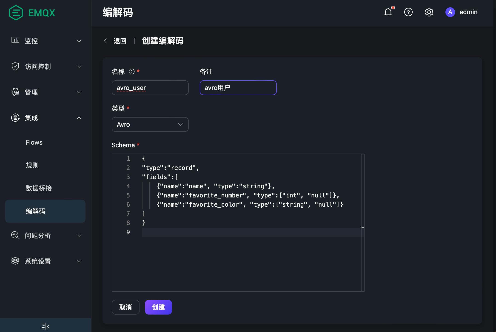

# 编解码举例 - Avro

本页通过两个例子介绍了编解码和规则引擎如何支持 Avro 格式的消息解码和编码。

## 解码场景

设备发布一个使用 Avro 编码的二进制消息，需要通过规则引擎匹配过后，将消息重新发布到与 `name` 字段相关的主题上。主题的格式为 `avro_user/${name}`。

比如，将 `name` 字段为 `Shawn` 的消息重新发布到主题 `avro_user/Shawn`。

### 创建 Schema

1. 在 Dashboard 左侧导航栏中选择**数据集成** -> **Schema**。

2. 使用下面的参数创建一个 Avro Schema：

   - **名称**：`avro_user`

   - **类型**：`Avro`

   - **Schema**:

     ```json
     {
       "type":"record",
       "name": "myrecord1",
       "fields":[
           {"name":"name", "type":"string"},
           {"name":"favorite_number", "type":["int", "null"]},
           {"name":"favorite_color", "type":["string", "null"]}
       ]
     }
     ```

3. 点击**创建**。



### 创建规则

1. 在 Dashboard 左侧导航栏中选择**数据集成** -> **规则**。

2. 在**规则**页面，点击右上角的**创建**。

3. 在 **SQL 编辑器**中，使用刚才创建好的 Schema 编写规则 SQL 语句：

   ```sql
   SELECT
     schema_decode('avro_user', payload) as avro_user, payload
   FROM
     "t/#"
   WHERE
     avro_user.name = 'Shawn'
   ```

   这里的关键点在于 `schema_decode('avro_user', payload)`:

   - `schema_decode` 函数将 payload 字段的内容按照 avro_user 这个 Schema 来做解码;
   - `as avro_user` 将解码后的值保存到变量 `avro_user` 里。

4. 点击**添加动作**，在**动作**下拉框中选择`消息重发布`。
5. 在**主题** 文本框中输入 `avro_user/${avro_user.name}` 作为目标主题。
6. 在 **Payload** 中使用消息内容模板 `${avro_user}`。

这个动作将解码之后的消息以 JSON 的格式发送到 `avro_user/${avro_user.name}` 这个主题。其中`${avro_user.name}` 是个变量占位符，将在运行时被替换为消息内容中 `name` 字段的值。

### 准备设备端代码

规则创建好之后，您可以模拟数据进行测试。

下面的代码使用 Python 语言填充了一个用户消息并编码为二进制数据，然后将其发送到 `t/1` 主题。详见[完整代码](https://gist.github.com/thalesmg/bbda65b400f35f8ab0f719b06cf875f6)。

```python
def publish_msg(client):
    datum_w = avro.io.DatumWriter(SCHEMA)
    buf = io.BytesIO()
    encoder = avro.io.BinaryEncoder(buf)
    datum_w.write({"name": "Shawn", "favorite_number": 666, "favorite_color": "red"}, encoder)
    message = buf.getvalue()
    topic = "t/1"
    print("publish to topic: t/1, payload:", message)
    client.publish(topic, payload=message, qos=0, retain=False)
```

### 检查规则执行结果

1. 在 Dashboard 页面，点击左侧导航目录中的 **问题分析** -> **WebSocket 客户端**。

2. 填写当前 EMQX 的连接信息。

   - 如果 EMQX 在本地运行，可直接使用默认配置。
   - 如果您修改过 EMQX 的默认配置，如修改过访问规则的配置，则需要输入用户名和密码。

3. 点击**连接**，作为 MQTT 客户端连接到 EMQX。

4. 在**订阅**区域，在**主题** 中输入 `avro_user/#`，点击**订阅**。

5. 安装 python 依赖，并执行设备端代码:

   ```shell
   $ pip3 install avro paho-mqtt
   
   $ python3 avro_mqtt.py
   Connected with result code 0
   publish to topic: t/1, payload: b'\nShawn\x00\xb4\n\x00\x06red'
   ```

6. 检查 Websocket 端收到主题为 `avro_user/Shawn` 的消息:

   ```json
   {"favorite_color":"red","favorite_number":666,"name":"Shawn"}
   ```

## 编码场景

设备订阅了主题为 `avro_out` 的消息，希望收到使用 Avro 编码的二进制消息。规则引擎将对消息进行编码并发送到相关主题。 

### 创建 Schema

使用在解码场景中创建的 [Schema](#(#创建-schema))。

### 创建规则

1. 在 Dashboard 左侧导航栏中选择**数据集成** -> **规则**。

2. 在**规则**页面，点击右上角的**创建**。

3. 在 **SQL 编辑器**中，使用刚才创建好的 Schema 编写规则 SQL 语句：

   ```sql
   SELECT
     schema_encode('avro_user', json_decode(payload)) as avro_user
   FROM
     "avro_in"
   ```

   这里的关键点在于 `schema_encode('avro_user', json_decode(payload))`:

   - `schema_encode` 函数将 payload 字段的内容按照 avro_user 这个 Schema 来编码;
   - `as avro_user` 将编码后的值保存到变量 `avro_user` 里。
   - `json_decode(payload)` 用来对 `payload` 进行解码，因为 `schema_encode` 的输入必须是 Map 数据格式，而 `payload` 通常是一个 JSON 编码的二进制消息。

4. 点击**添加动作**，在**动作**下拉框中选择`消息重发布`。

5. 在**主题** 文本框中输入 `avro_out` 作为目标主题。

6. 在 **Payload** 中使用消息内容模板 `${avro_user}`。

这个动作将 Avro 编码的消息发送到 `avro_out` 这个主题。其中`${avro_user}` 是个变量占位符，将在运行时被替换为经 `schema_encode` 编码后的值 (一个二进制的值)。

### 准备设备端代码

规则创建好之后，您可以模拟数据进行测试。

下面的代码使用 Python 语言填充了一个 User 消息并编码为二进制数据，然后将其发送到 `avro_in` 主题。详见[完整代码](https://gist.github.com/thalesmg/02046f89e9ceb70b9806dc98e6ed8b55)。

```python
def on_message(client, userdata, msg):
    datum_r = avro.io.DatumReader(SCHEMA)
    buf = io.BytesIO(msg.payload)
    decoder = avro.io.BinaryDecoder(buf)
    decoded_payload = datum_r.read(decoder)
    print(msg.topic+" "+str(decoded_payload))
```

### 检查规则执行结果

1. 在 Dashboard 页面，点击左侧导航目录中的 **问题分析** -> **WebSocket 客户端**。

2. 填写当前 EMQX 的连接信息。

   - 如果 EMQX 在本地运行，可直接使用默认配置。
   - 如果您修改过 EMQX 的默认配置，如修改过访问规则的配置，则需要输入用户名和密码。

3. 点击**连接**，作为 MQTT 客户端连接到 EMQX。

4. 在**发布**区域，在**主题**中输入 `avro_in`，在 **Payload** 中输入以下消息：

   ```json
   {"favorite_color":"red","favorite_number":666,"name":"Shawn"}
   ```

5. 点击**发布**。

6. 安装 python 依赖，并执行设备端代码:

   ```shell
   $ pip3 install avro paho-mqtt
   
   $ python3 avro_mqtt_sub.py
   Connected with result code 0
   msg payload b'\nShawn\x00\xb4\n\x00\x06red'
   avro_out {'name': 'Shawn', 'favorite_number': 666, 'favorite_color': 'red'}
   ```
