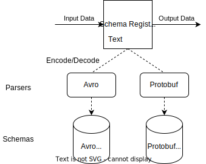

# 编解码

物联网设备终端种类繁杂，各厂商使用的编码格式各异，所以在接入物联网平台的时候就产生了统一数据格式的需求，以便平台之上的应用进行设备管理。

Schema Registry 管理编解码使用的 Schema、处理编码或解码请求并返回结果。Schema Registry 配合规则引擎，可适配各种场景的设备接入和规则设计。

EMQX Schema Registry 目前可支持两种格式的编解码：[Avro](https://avro.apache.org) 和 [Protobuf](https://developers.google.com/protocol-buffers/)。Avro 和 Protobuf 是依赖 Schema 的数据格式，编码后的数据为二进制，解码后为 [Map 格式](#规则引擎内部数据格式-map)。解码后的数据可直接被规则引擎和其他插件使用。Schema Registry 为 Avro 和 Protobuf 等内置编码格式维护 Schema 文本。

下图展示了 Schema Registry 的一个应用案例。多个设备上报不同格式的数据，经过 Schema Registry 解码之后，变为统一的内部格式，然后转发给后台应用。


## 架构设计

Schema Registry 既可以解码，也可以编码。Schema Registry 为 Avro 和 Protobuf 内置编码格式维护 Schema 文本。Schema API 提供了通过 Schema Name 的添加、查询和删除操作，因此编码和解码时需要指定 Schema Name。



常见的使用案例是，使用规则引擎来调用 Schema Registry 提供的编码和解码接口，然后将编码或解码后的数据作为后续动作的输入。

编码调用示例：

```c
schema_encode(SchemaName, Data) -> RawData
```

解码调用示例：

```c
schema_decode(SchemaName, RawData) -> Data
```

当对 JSON 格式的 MQTT 消息进行编码时，在用 schema 编码之前，您也需要用 `json_decode` 先对其进行解码，使它变为规则引擎内部数据格式 (Map)，示例如下：

```erlang
schema_encode(SchemaName, json_decode(Data))
```

## 编解码 + 规则引擎

EMQX 的消息处理层面可分为消息路由(Messaging)、规则引擎(Rule Engine)、数据格式转换(Data Conversion) 三个部分。

EMQX 的 PUB/SUB 系统将消息路由到指定的主题。规则引擎可以灵活地配置数据的业务规则，按规则匹配消息，然后指定相应动作。数据格式转换发生在规则匹配的过程之前，先将数据转换为可参与规则匹配的 Map 格式，然后进行匹配。


### 规则引擎内部数据格式(Map)

规则引擎内部使用的数据格式为 Erlang Map，所以如果原数据内容为二进制或者其他格式，必须使用编解码函数(比如上面提到的 schema_decode 和 json_decode 函数) 将其转换为 Map。

Map 是一个 Key-Value 形式的数据结构，形如 #{key => value}。例如，`user = #{id => 1, name => "Steve"} ` 定义了一个 `id` 为 `1`，`name` 为 `"Steve"` 的 `user` Map。

SQL 语句提供了 "." 操作符嵌套地提取和添加 Map 字段。下面是使用 SQL 语句对这个 Map 操作的示例:

```sql
SELECT user.id AS my_id
```

SQL 语句的筛选结果为 `#{my_id => 1}`。

### JSON 编解码

规则引擎的 SQL 语句提供了对 JSON 格式字符串的编解码支持，将 JSON 字符串和 Map 格式相互转换的 SQL 函数为 json_decode() 和 json_encode():

```sql
SELECT json_decode(payload) AS p FROM "t/#" WHERE p.x = p.y
```

上面这个 SQL 语句将会匹配到 payload 内容为 JSON 字符串： `{"x" = 1, "y" = 1}` , 并且 topic 为 `t/a` 的 MQTT 消息。

`json_decode(payload) as p` 将 JSON 字符串解码为下面的 Map 数据结构，从而可以在 `WHERE` 子句中使用 p.x 和 p.y 使用 Map 中的字段：

```erlang
#{
  p => #{
    x => 1,
    y => 1
  }
}
```

**注意:** `AS` 子句是必须的，将解码之后的数据赋值给某个Key，后面才能对其进行后续操作。
