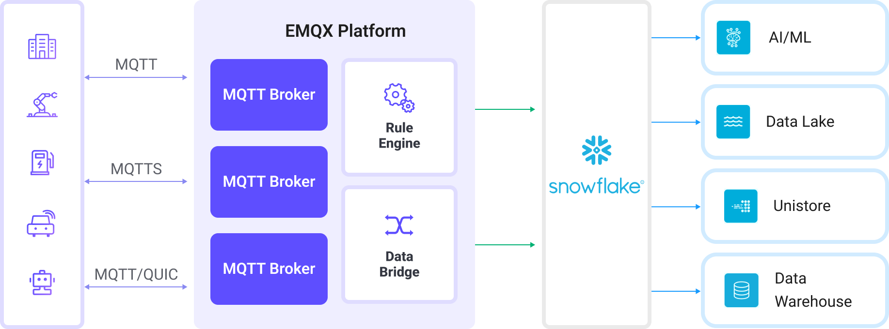

# 将 MQTT 数据导入 Snowflake

::: tip

Snowflake 数据集成是 EMQX 企业版功能。 

:::

[Snowflake](https://www.snowflake.com/en/) 是一个基于云的数据平台，提供高度可扩展且灵活的数据仓库、分析和安全数据共享解决方案。Snowflake 以其处理结构化和半结构化数据的能力而闻名，专为存储海量数据并提供快速查询性能设计，能够无缝集成各种工具和服务。

本页面详细介绍了 EMQX 与 Snowflake 之间的数据集成，并为规则和 Sink 的创建提供了实用指南。

## 工作原理

EMQX 中的 Snowflake 数据集成是一项开箱即用的功能，可以轻松配置以满足复杂的业务开发需求。在典型的物联网应用中，EMQX 作为物联网平台，负责设备连接和消息传输，而 Snowflake 作为数据存储和处理平台，负责消息数据的摄取、存储和分析。



EMQX 利用规则引擎和 Sink 将设备事件和数据转发到 Snowflake。最终用户和应用程序可以访问 Snowflake 表中的数据。具体工作流程如下：

1. **设备连接到 EMQX**：物联网设备通过 MQTT 协议成功连接时，会触发在线事件。该事件包括设备 ID、源 IP 地址以及其他属性信息。
2. **设备消息发布与接收**：设备通过特定主题发布遥测和状态数据。EMQX 接收这些消息，并通过规则引擎进行匹配。
3. **规则引擎处理消息**：内置的规则引擎根据主题匹配处理来自特定来源的消息和事件。它匹配相应的规则并处理消息和事件，如数据格式转换、过滤特定信息或用上下文信息丰富消息。
4. **写入 Snowflake**：规则触发动作，将消息写入 Snowflake Stage，并加载到 Snowflake 表中。

当事件和消息数据写入 Snowflake 后，可用于各种业务和技术用途，包括：

- **数据归档**：将物联网数据安全地存储在 Snowflake 中进行长期归档，确保合规性和历史数据可用性。
- **数据分析**：利用 Snowflake 的数据仓库和分析功能，进行实时或批量分析，实现预测性维护、运营洞察和设备性能评估。

## 功能与优势

在 EMQX 中使用 Snowflake 数据集成可以为您的业务带来以下功能和优势：

- **消息转换**：消息可以在写入 Snowflake 之前，通过 EMQX 规则进行深入的处理和转换，便于后续存储和使用。
- **灵活的数据操作**：Snowflake Sink 提供了灵活的数据处理方式，允许用户选择特定字段写入 Snowflake，实现根据业务需求的高效、动态存储配置。
- **集成的业务流程**：Snowflake Sink 允许将设备数据与 Snowflake 的丰富生态系统应用相结合，支持更多业务场景，如数据分析和归档。
- **低成本的长期存储**：Snowflake 的可扩展存储基础设施针对长期数据保留进行了优化，成本比传统数据库更低，是存储海量物联网数据的理想解决方案。

这些功能使您能够构建高效、可靠且可扩展的物联网应用，并从业务决策和优化中获益。

## 准备工作

本节介绍在 EMQX 中创建 Snowflake Sink 之前所需的准备工作。

### 前置条件

- 了解[规则](./rules.md)。
- 了解[数据集成](./data-bridges.md)。

### 初始化 Snowflake ODBC 驱动程序

为了使 EMQX 能够与 Snowflake 进行通信并高效传输数据，必须安装并配置 Snowflake 的开放数据库连接（ODBC）驱动程序。它充当数据传输的桥梁，确保数据格式化、身份验证及传输的正确性。

请参考官方文档 [ODBC Driver](https://docs.snowflake.com/en/developer-guide/odbc/odbc) 页面及 [Snowflake ODBC Driver License Agreement](https://sfc-repo.snowflakecomputing.com/odbc/Snowflake_ODBC_Driver_License_Agreement.pdf) 获取更多信息。

#### Linux

运行以下脚本来安装 Snowflake ODBC 驱动程序并配置 `odbc.ini` 文件：

```bash
scripts/install-snowflake-driver.sh
```

::: tip 注意

该脚本仅用于测试环境，并非生产环境中 ODBC 驱动设置的推荐方式。请参考官方文档 [Installing for Linux](https://docs.snowflake.com/en/developer-guide/odbc/odbc-linux)。

:::

#### macOS

在 macOS 上安装并配置 Snowflake ODBC 驱动程序，请按照以下步骤操作：

1. 安装 unixODBC，例如：

   ```bash
   brew install unixodbc
   ```

2. [下载并安装 iODBC](https://github.com/openlink/iODBC/releases/download/v3.52.16/iODBC-SDK-3.52.16-macOS11.dmg)。

3. [下载并安装 Snowflake ODBC 驱动](https://sfc-repo.snowflakecomputing.com/odbc/macuniversal/3.3.2/snowflake_odbc_mac_64universal-3.3.2.dmg)。

4. 参考 [macOS 上的 ODBC 驱动安装和配置说明](https://docs.snowflake.com/en/developer-guide/odbc/odbc-mac)进行详细的安装和配置。

5. 安装完成后，更新以下配置文件：

   - 更新 Snowflake ODBC 驱动的权限和配置：

     ```bash
     chown $(id -u):$(id -g) /opt/snowflake/snowflakeodbc/lib/universal/simba.snowflake.ini
     echo 'ODBCInstLib=libiodbcinst.dylib' >> /opt/snowflake/snowflakeodbc/lib/universal/simba.snowflake.ini
     ```

   - 创建或更新 `~/.odbc.ini` 文件以配置 ODBC 连接：

     ```bash
     cat << EOF > ~/.odbc.ini
     [ODBC]
     Trace=no
     TraceFile=
     
     [ODBC Drivers]
     Snowflake = Installed
     
     [ODBC Data Sources]
     snowflake = Snowflake
     
     [Snowflake]
     Driver = /opt/snowflake/snowflakeodbc/lib/universal/libSnowflake.dylib
     EOF
     ```

### 创建用户账户和数据库

安装 Snowflake ODBC 驱动程序后，您需要设置一个用户账户、数据库及相关资源来进行数据摄取。 以下字段将会被用于在 EMQX 中配置连接器和 Sink：

| 字段             | 值                                               |
| ---------------- | ------------------------------------------------ |
| 数据源名称 (DSN) | `snowflake`                                      |
| 用户名           | `snowpipeuser`                                   |
| 密码             | `Snowpipeuser99`                                 |
| 数据库名称       | `testdatabase`                                   |
| 模式             | `public`                                         |
| 存储区           | `emqx`                                           |
| 管道             | `emqx`                                           |
| 管道用户         | `snowpipeuser`                                   |
| 私钥             | `file://<path to snowflake_rsa_key.private.pem>` |

#### 生成 RSA 密钥对

为了安全地连接 Snowflake，使用以下命令生成用于认证的 RSA 密钥对：

```bash
openssl genrsa 2048 | openssl pkcs8 -topk8 -inform PEM -out snowflake_rsa_key.private.pem -nocrypt
openssl rsa -in snowflake_rsa_key.private.pem -pubout -out snowflake_rsa_key.public.pem
```

更多信息请参考 [Key-pair authentication and key-pair rotation](https://docs.snowflake.com/en/user-guide/key-pair-auth)。

#### 使用 SQL 设置 Snowflake 资源

在设置 ODBC 驱动并生成 RSA 密钥对后，可以通过 SQL 命令在 Snowflake 中创建所需的数据库、表、存储区和管道。

1. 在 Snowflake 控制台中，打开 SQL 工作表并执行以下 SQL 命令来创建数据库、表、存储区和管道：

   ```sql
   USE ROLE accountadmin;
   
   CREATE DATABASE IF NOT EXISTS testdatabase;
   
   CREATE OR REPLACE TABLE testdatabase.public.emqx (
       clientid STRING,
       topic STRING,
       payload STRING,
       publish_received_at TIMESTAMP_LTZ
   );
   
   CREATE STAGE IF NOT EXISTS testdatabase.public.emqx
   FILE_FORMAT = (TYPE = CSV PARSE_HEADER = TRUE FIELD_OPTIONALLY_ENCLOSED_BY = '"')
   COPY_OPTIONS = (ON_ERROR = CONTINUE PURGE = TRUE);
   
   CREATE PIPE IF NOT EXISTS testdatabase.public.emqx AS
   COPY INTO testdatabase.public.emqx
   FROM @testdatabase.public.emqx
   MATCH_BY_COLUMN_NAME = CASE_INSENSITIVE;
   ```

2. 创建新用户并为该用户设置 RSA 公钥：

   ```sql
   CREATE USER IF NOT EXISTS snowpipeuser
       PASSWORD = 'Snowpipeuser99'
       MUST_CHANGE_PASSWORD = FALSE;
   
   ALTER USER snowpipeuser SET RSA_PUBLIC_KEY = '
   <YOUR_PUBLIC_KEY_CONTENTS_LINE_1>
   <YOUR_PUBLIC_KEY_CONTENTS_LINE_2>
   <YOUR_PUBLIC_KEY_CONTENTS_LINE_3>
   <YOUR_PUBLIC_KEY_CONTENTS_LINE_4>
   ';
   ```

   ::: tip

   请移除 PEM 文件中的 `-----BEGIN PUBLIC KEY-----` 和 `-----END PUBLIC KEY-----` 行，只保留中间的内容并保持换行。

   :::

3. 创建并分配管理 Snowflake 资源的角色给用户：

   ```sql
   CREATE OR REPLACE ROLE snowpipe;
   
   GRANT USAGE ON DATABASE testdatabase TO ROLE snowpipe;
   GRANT USAGE ON SCHEMA testdatabase.public TO ROLE snowpipe;
   GRANT INSERT, SELECT ON testdatabase.public.emqx TO ROLE snowpipe;
   GRANT READ, WRITE ON STAGE testdatabase.public.emqx TO ROLE snowpipe;
   GRANT OPERATE, MONITOR ON PIPE testdatabase.public.emqx TO ROLE snowpipe;
   GRANT ROLE snowpipe TO USER snowpipeuser;
   ALTER USER snowpipeuser SET DEFAULT_ROLE = snowpipe;
   ```

## 创建连接器

在添加 Snowflake Sink 之前，您需要在 EMQX 中创建相应的连接器，以建立与 Snowflake 的连接。

1. 进入 Dashboard **集成** -> **连接器** 页面。
2. 点击右上角的**创建**按钮。
3. 选择 **Snowflake** 作为连接器类型，然后点击下一步。
4. 输入连接器名称，由大小写字母和数字组成。这里输入 `my-snowflake`。
5. 输入连接信息：
   - **账户**：输入您的 Snowflake 组织 ID 和账户名，用连字符（`-`）分隔，可以在 Snowflake 控制台中找到该信息，通常也是您访问 Snowflake 平台的 URL 中的一部分。
   - **服务器地址**：服务器地址为 Snowflake 的端点 URL，通常格式为 `<你的 Snowflake 组织 ID>-<你的 Snowflake 账户名>.snowflakecomputing.com`。您需要用自己 Snowflake 实例的子域替换 `<你的 Snowflake 组织 ID>-<你的 Snowflake 账户名称>`。
   - **数据源名称**：输入 `snowflake`，与您在 ODBC 驱动设置中配置的 `.odbc.ini` 文件中的 DSN 名称相对应。
   - **用户名**：输入 `snowpipeuser`，这是之前设置过程中定义的用户名。
   - **密码**：输入 `Snowpipeuser99`，这是之前设置过程中定义的密码。
6. 如果您想建立一个加密连接，单击**启用 TLS** 切换按钮。有关 TLS 连接的更多信息，请参见[启用 TLS 加密访问外部资源](../network/overview.md/#tls-for-external-resource-access)。
7. 高级配置（可选），请参考[高级设置](#高级设置)。
8. 在点击**创建**之前，可以点击 **测试连接** 来测试连接器是否能够连接到 Snowflake。
9. 点击页面底部的**创建**按钮，完成连接器创建。

现在，您已经成功创建了连接器，可以继续创建规则和 Sink，以指定如何将数据写入 Snowflake。

## 使用 Snowflake Sink 创建规则

本节演示如何在 EMQX 中创建一个规则，将源 MQTT 主题 `t/#` 中的消息处理后通过配置的 Sink 写入 Snowflake。

1. 进入 Dashboard **集成** -> **规则** 页面。

2. 点击右上角的**创建**按钮。

3. 输入规则 ID `my_rule`，并在 SQL 编辑器中输入以下规则 SQL：

   ```sql
   SELECT
     clientid,
     unix_ts_to_rfc3339(publish_received_at, 'millisecond') as publish_received_at,
     topic,
     payload
   FROM
       "t/#"
   ```

   ::: tip

   如果您不熟悉 SQL，可以通过点击 **SQL 示例**和**启用调试**来学习和测试规则 SQL 的结果。

   :::

   ::: tip

   对于 Snowflake 集成，选择的字段必须与在 Snowflake 中定义的表的列名和数量完全匹配，因此避免 SELECT `*` 或添加额外的字段。

   :::

4. 点击**添加动作**按钮，从**动作类型**下拉列表中选择 `Snowflake`，将动作下拉选项保留为默认的 `创建动作`，或从下拉列表中选择之前创建的 Snowflake 动作。此示例将创建一个新的 Sink 并将其添加到规则中。

5. 输入 Sink 的名称（例如 `snowflake_sink`）和简短描述。

6. 从连接器下拉列表中选择之前创建的 `my-snowflake` 连接器。您也可以点击下拉列表旁的创建按钮，在弹出的对话框中快速创建新的连接器。所需的配置参数请参考[创建连接器](#创建连接器)。

7. 配置以下设置：

   - **数据库名字**：输入 `testdatabase`，这是为存储 EMQX 数据而创建的 Snowflake 数据库。
   - **模式**：输入 `public`，这是 `testdatabase` 中的数据表所在的 schema。
   - **存储区**：输入 `emqx`，这是在 Snowflake 中创建的用于临时存储数据的 stage。
   - **管道**：输入 `emqx`，这是用于将数据从 stage 自动加载到表中的管道。
   - **管道用户**：输入 `snowpipeuser`，这是具有管理该管道权限的 Snowflake 用户。
   - **私钥**：输入私钥的路径，例如 `file://<path to snowflake_rsa_key.private.pem>`，或输入 RSA 私钥文件的内容。这是用于安全身份验证的密钥，必要时确保能够安全访问 Snowflake 管道。请注意，当使用文件路径时，它必须在所有集群节点上保持一致，并且可由 EMQX 应用用户读取。

8. 选择**上传方式**：目前仅支持 `聚合上传`。此方法将多个规则触发的结果分组到单个文件（例如 CSV 文件）中，并上传到 Snowflake，从而减少文件数量并提高写入效率。

9. 选择**增强类型**：目前仅支持 `csv`。数据将以逗号分隔的 CSV 格式存储到 Snowflake。

   - **列排序**：从下拉列表中选择列的顺序，生成的 CSV 文件将首先按选定的列排序，未选定的列将按字母顺序排序。
   - **最大记录数**：设置触发聚合前的最大记录数。例如，您可以设置为 `1000`，在收集 1000 条记录后触发上传。当达到最大记录数时，单个文件的聚合将完成并上传，重置时间间隔。
   - **时间间隔**：设置触发聚合的时间间隔（秒）。例如，如果设置为 `60`，即使未达到最大记录数，也将在 60 秒后上传数据，并重置记录数。

10. 展开**高级设置**，根据需要配置高级设置选项（可选）。更多详细信息请参考[高级设置](#高级设置)。

11. 其余设置保持默认值，点击**创建**按钮完成 Sink 创建。成功创建后，页面将返回到规则创建页面，并将新创建的 Sink 添加到规则动作中。

12. 返回规则创建页面，点击**创建**按钮完成整个规则创建过程。

现在，您已成功创建了规则。您可以在**规则**页面看到新创建的规则，并在 **动作 (Sink)** 标签页中查看新创建的 Snowflake Sink。

您还可以点击 **集成** -> **Flow 设计器** 来查看拓扑图，拓扑图可视化显示了主题 `t/#` 下的消息在经过规则 `my_rule` 解析后如何写入 Snowflake。

## 测试规则

本节介绍如何测试已配置的规则。

### 发布测试消息

使用 MQTTX 向主题 `t/1` 发布一条消息：

```bash
mqttx pub -i emqx_c -t t/1 -m '{ "msg": "Hello Snowflake" }'
```

重复此步骤几次以生成多条测试消息。

### 验证 Snowflake 中的数据

发送测试消息后，您可以通过访问 Snowflake 实例并查询目标表来验证数据是否成功写入 Snowflake。

1. 打开 Snowflake Web 界面，并使用您的凭据登录 Snowflake 控制台。

2. 在 Snowflake 控制台中，执行以下 SQL 查询，查看通过规则写入 `emqx` 表的数据：

   ```sql
   SELECT * FROM testdatabase.public.emqx;
   ```

   此查询将显示上传到 `emqx` 表的所有记录，包括 `clientid`、`topic`、`payload` 和 `publish_received_at` 字段。

3. 您应该能够看到所发送的测试消息，例如消息内容 `{ "msg": "Hello Snowflake" }`，以及其他元数据，如主题和时间戳。

## 高级设置

本节深入介绍 Snowflake Sink 的高级配置选项。在仪表板中配置 Sink 时，可以展开**高级设置**，根据您的具体需求调整以下参数。

| 字段名称             | 描述                                                         | 默认值 |
| -------------------- | ------------------------------------------------------------ | ------ |
| **最大重试次数**     | 设置上传失败时的最大重试次数。例如，输入 `3` 表示允许进行三次重试。 | `3`    |
| **缓存池大小**       | 指定缓冲工作进程的数量，这些进程用于管理 EMQX 与 Snowflake 之间的数据流。缓冲进程在数据发送到目标服务之前临时存储和处理数据，对于优化性能和确保数据传输的顺畅至关重要。 | `16`   |
| **请求超期**         | “请求超期”（生存时间）配置指定请求在进入缓冲区后被视为有效的最长持续时间（以秒为单位）。计时器从请求进入缓冲区时开始，如果请求在超过 TTL 时间后仍未发送或未收到来自 Snowflake 的响应或确认，该请求将被视为已过期。 | 无     |
| **健康检查间隔**     | 指定 Sink 与 Snowflake 之间自动进行健康检查的时间间隔（以秒为单位）。 | `15`   |
| **缓存队列最大长度** | 指定每个缓冲工作进程在 Snowflake Sink 中可以缓冲的最大字节数。缓冲工作进程临时存储数据，以便更有效地处理数据流。在系统性能和数据传输要求下，可以调整此值。 | `256`  |
| **请求模式**         | 允许您在 `同步` 和 `异步` 请求模式之间进行选择，以根据不同需求优化消息传输。在异步模式下，写入 Snowflake 不会阻塞 MQTT 消息的发布过程，但这可能会导致客户端在消息到达 Snowflake 之前就收到消息。 | `异步` |
| **最大批量请求大小** | 指定从 EMQX 向 Snowflake 传输数据时的单次传输最大数据批大小。通过调整批处理大小，您可以微调 EMQX 和 Snowflake 之间数据传输的效率和性能。<br />如果将“批处理大小”设置为 "1"，则数据记录将单独发送，而不会被分组为批处理。 | `1`    |
| **请求飞行队列窗口** | “在途请求队列”指已启动但尚未收到响应或确认的请求。此设置控制 Sink 与 Snowflake 通信期间同时存在的最大在途请求数量。<br/>当 **请求模式** 设置为 `异步` 时，“在途请求队列窗口”参数尤其重要。如果需要严格按顺序处理来自同一 MQTT 客户端的消息，则应将此值设置为 `1`。 | `100`  |
| **连接超时**         | 指定系统等待连接 Snowflake 的超时时间（以秒为单位）。例如，您可以将其设置为 `30` 秒。如果在此时间内无法建立连接，EMQX 将尝试重试（基于**最大重试次数** 设置）或报错。此设置对管理网络延迟或连接可靠性非常有用。 | `15`   |
| **HTTP 流水线**      | 指定在等待响应之前可以发送的最大 HTTP 请求数。               | `100`  |
| **连接池大小**       | 定义 EMQX 可以与 Snowflake 保持的最大同时连接数。较大的连接池允许更多的并发请求，这在高负载场景中尤为重要，但也会消耗更多的系统资源。 | `8`    |