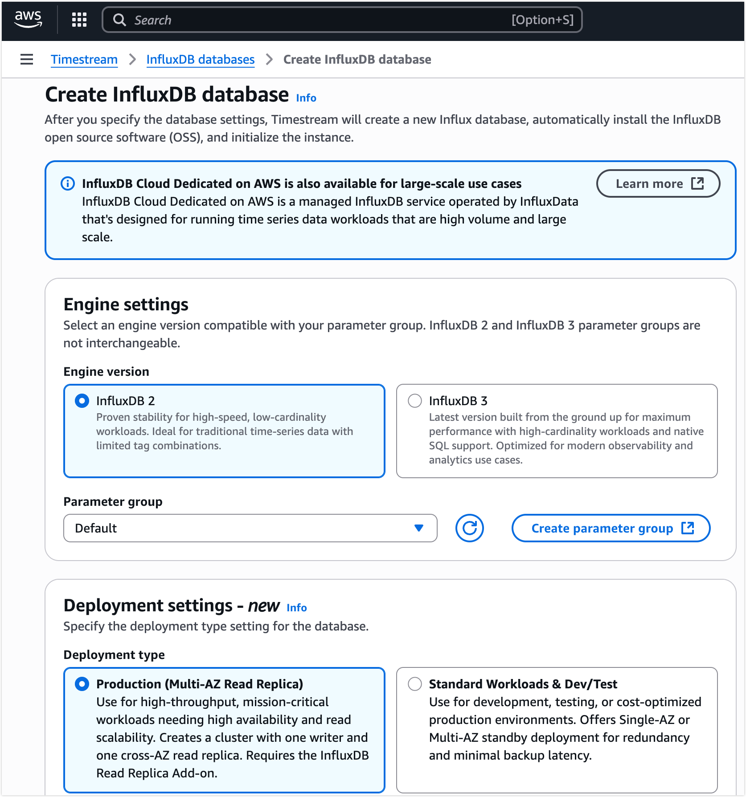
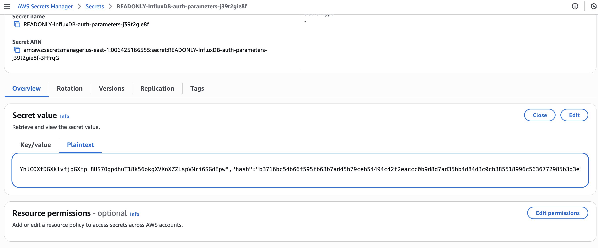

# 将 MQTT 数据写入到 AWS Timestream for InfluxDB

[AWS Timestream for InfluxDB](https://docs.aws.amazon.com/zh_cn/timestream/latest/developerguide/timestream-for-influxdb.html) 是一项完全托管的时间序列数据库服务，可让您在 AWS 上运行 InfluxDB 2.x 工作负载，并简化数据写入与实时分析流程。自 EMQX 6.1 起，EMQX 在原有对 InfluxDB Cloud、InfluxDB OSS 和 InfluxDB Enterprise 的支持基础上，新增了对 Amazon Timestream for InfluxDB 的原生集成支持。

本文将系统介绍 EMQX 与 Amazon Timestream for InfluxDB 的数据集成原理，并提供从环境准备、配置到数据验证的完整实践指南。

## 工作原理

Amazon Timestream for InfluxDB 集成充分利用了 EMQX 的实时数据处理与消息路由能力，并结合 Timestream 提供的高性能、全托管 InfluxDB 引擎，实现稳定、高效的时间序列数据写入与分析。

通过内置的[规则引擎](./rules.md)与 Timestream for InfluxDB Sink，EMQX 可以对 MQTT 消息进行转换，并直接写入 Timestream for InfluxDB 数据库实例，而无需编写任何自定义应用代码。

下图展示了在储能场景下，EMQX 与 Amazon Timestream for InfluxDB 的典型数据集成架构：


该集成为实时能源监控与分析提供了一条可扩展的 IoT 数据管道：

EMQX 作为 IoT 消息层，负责设备连接、消息接收与路由；Timestream for InfluxDB 作为时间序列数据平台，提供托管的数据存储与查询能力。整体流程如下：

1. **消息发布与接收**：设备通过 MQTT 协议连接到 EMQX，并持续发布遥测数据（如用电量、充放电指标）。EMQX 接收到消息后，会在规则引擎中进行匹配处理。
2. **消息处理**：规则引擎根据主题匹配规则，对消息进行过滤、字段提取或数据补充，并将数据整理为可写入 Timestream for InfluxDB 的格式。
3. **写入 InfluxDB**：当规则触发 Amazon Timestream Sink 时，EMQX 使用 InfluxDB Line Protocol 将数据写入数据库。通过模板配置，MQTT 消息字段可映射为测量（measurement）、标签（tag）和字段（field）。

数据写入后，您可以使用 Flux / InfluxQL 查询语言、InfluxDB UI（InfluxUI），或 Grafana 等工具进行可视化分析，也可以将数据集成到业务系统中实现监控与告警。

## 特性与优势

Amazon Timestream for InfluxDB 集成具备以下特性与优势：

- **高效数据处理**：
  
   EMQX 可承载大规模 IoT 设备连接与高吞吐 MQTT 数据流，而 Timestream for InfluxDB 提供高速写入与毫秒级查询性能，满足实时分析需求。
   
- **灵活的消息转换**：
  
   EMQX 规则支持对 MQTT 消息进行灵活的过滤、提取与转换，用户可自由选择结构化 JSON 映射或自定义 InfluxDB Line Protocol 模板，精确控制数据写入格式。
   
- **托管式可扩展**：
  
   EMQX 支持水平集群扩展以应对大规模 IoT 场景；Timestream for InfluxDB 提供托管的实例扩展、自动备份与无缝版本升级。
   
- **丰富的查询能力**：
  
   Timestream for InfluxDB 支持完整的 InfluxDB 2.x 查询生态，包括 Flux 与 InfluxQL，便于时间序列分析及与下游工具集成。
   
- **优化存储性能**：
  
   Timestream for InfluxDB 使用 AWS 托管存储，并预配置 IOPS 与吞吐能力，在保证性能的同时实现成本优化。

## 准备工作

本节介绍在创建数据集成前需要完成的准备工作，包括搭建 Timestream for InfluxDB 环境及获取连接参数。

### 前置准备

在开始配置前，请确保您具备以下基础：

- 了解 [InfluxDB Line Protocol](https://docs.influxdata.com/influxdb/v2.5/reference/syntax/line-protocol/)，EMQX 将使用该协议写入数据。
- 熟悉 EMQX 的[规则引擎](./rules.md)及其对 MQTT 消息的处理方式。
- 了解 EMQX 的[数据集成](./data-bridges.md)机制，包括 Sink 的创建与触发流程。

### 准备 Amazon Timestream for InfluxDB

为使 EMQX 能向 Timestream for InfluxDB 写入数据，请先在 AWS 中完成以下准备步骤。

::: tip 前提条件

请确保您拥有 AWS 账号，并具备创建和管理 Timestream for InfluxDB 资源的权限。

:::

#### 创建 Timestream for InfluxDB 数据库实例

1. 登录 AWS 管理控制台，并打开 [Amazon Timestream for InfluxDB 控制台](https://console.aws.amazon.com/timestream/)。

2. 在右上角选择要创建数据库实例的 AWS 区域。

3. 在左侧导航栏中选择 **InfluxDB 数据库**。

4. 点击**创建 InfluxDB 数据库**。

5. 在**引擎设置**中，选择要使用的 InfluxDB 引擎版本。

   ::: tip 注意

   不同的 InfluxDB 引擎版本会影响后续 EMQX 连接器所需凭据的获取方式，请根据实际使用场景选择合适的版本。

   :::

   

6. 根据需求完成其余配置（部署方式、存储、网络、日志等）。详细说明请参考 AWS 官方文档：[创建 InfluxDB 数据库实例](https://docs.aws.amazon.com/zh_cn/timestream/latest/developerguide/timestream-for-influx-getting-started-creating-db-instance.html)。
7. 数据库创建完成后，进入实例详情页，获取 AWS 自动分配的数据库端点，例如：`c5vasdqn0b-3ksj4dla5nfjhi.timestream-influxdb.us-east-1.on.aws`。该端点将在后续配置 EMQX 连接器时使用。

#### 配置网络与安全组

为允许 EMQX 连接 Timestream for InfluxDB，请在实例所属的 VPC 安全组中配置入站规则，允许来自 EMQX 部署环境的 TCP 8086 端口访问：

- **协议**：TCP
- **端口**：8086（Timestream for InfluxDB 使用的 InfluxDB API 端口）
- **来源**：EMQX 所在网络的 IP 段或安全组

如果 EMQX 与 Timestream for InfluxDB 位于同一 VPC，可通过私有网络直接通信；若 EMQX 部署在 AWS 外部，则需确保安全组允许来自 EMQX 公网地址的访问，同时确认 EMQX 侧不存在阻断 HTTPS/TCP 8086 出站流量的防火墙规则。

更多信息请参考 AWS 官方文档：[连接到 Amazon Timestream for InfluxDB 数据库实例](https://docs.aws.amazon.com/zh_cn/timestream/latest/developerguide/timestream-for-influx-db-connecting.html)。

#### 获取 InfluxDB 令牌、组织与 Bucket

获取令牌（Token）与凭据的方式取决于创建实例时选择的 **InfluxDB 引擎版本**。

##### InfluxDB v2：通过 InfluxDB UI 获取

1. 使用数据库端点访问 **InfluxDB UI**：

   ```
   https://<endpoint>:8086
   ```

   > 如果数据库实例未启用公网访问，请通过同一 VPC 内的主机（如跳板机或 SSM 端口转发）访问 InfluxDB UI。

2. 使用创建实例时设置的管理员用户登录。

3. 创建或获取一个对目标 Bucket 具有写权限的个人访问令牌。该令牌将用于 EMQX 与 Timestream for InfluxDB 的认证。

   ::: tip

   令牌仅在创建时显示一次，请务必妥善保存。
   :::

4. 确认**组织（Organization）**与 **Bucket** 名称，后续配置 EMQX 时需完全一致。

##### InfluxDB v3：从 AWS Secrets Manager 获取

InfluxDB v3 不通过 UI 创建 Token。AWS 会在实例创建时，将认证信息自动存储到 **AWS Secrets Manager** 中。

1. 在 Timestream 控制台的实例详情页，找到**身份验证属性 Secret manager ARN**。

   

2. 打开 **AWS Secrets Manager** -> **密钥**，找到对应的密钥。

3. 查看**明文**内容，获取密钥的值。

   

### 所需连接参数

在 EMQX 中配置 Amazon Timestream for InfluxDB 连接器时，根据所选 InfluxDB 版本提供以下参数：

| 参数           | 说明                                                         |
| -------------- | ------------------------------------------------------------ |
| **端点**       | AWS 分配的 InfluxDB 实例端点                                 |
| **端口**       | 固定为 **8086**                                              |
| **数据库名字** | （InfluxDB v3）创建实例时指定的数据库名称                    |
| **组织**       | （InfluxDB v2）InfluxDB UI 中配置的组织名称                  |
| **Bucket**     | （InfluxDB v2）EMQX 写入数据的 Bucket                        |
| **令牌**       | 认证令牌：<br/>v2 为 UI 创建的个人访问令牌<br/>v3 为 Secrets Manager 中的密钥 |

## 创建连接器

本节介绍如何创建一个连接器，用于将 Sink 连接到 AWS Timestream for InfluxDB 数据库实例。

1. 进入EMQX Dashboard，在左侧导航栏中点击**集成** -> **连接器**。
2. 在页面右上角点击**创建**。
3. 在**创建连接器**页面中，选择 **Amazon Timestream** 作为连接器类型，然后点击**下一步**。
4. 在**配置信息**步骤中，配置以下参数：
   - **连接器名称**：以字母或数字开头，可包含字母、数字、连字符（`-`）或下划线（`_`）。示例：`my_timestream`。
   - **服务器地址**：输入 Timestream for InfluxDB 实例的访问地址和端口，例如：`<实例端点>:8086`。
   - **InfluxDB版本**：选择与 Timestream for InfluxDB 实例配置一致的 InfluxDB 版本：
     - **v2**（默认）：需要配置 **Token**、**组织**和 **Bucket**。请填写在[获取 InfluxDB Token、组织与 Bucket](#获取-influxdb-token-组织与-bucket)中获取的个人访问令牌、组织名称和 Bucket 名称，这些值必须与InfluxDB中的配置完全一致。
     - **v3**：需要配置**数据库名字**和 **Token**。数据库名称为创建 v3 数据库实例时指定的名称，Token 请填写在[获取 InfluxDB v3 实例的 Secret 值](#influxdb-v3-从-aws-secret-manager-获取)中从 AWS Secrets Manager 获取的密钥内容。
   - **启用TLS**（可选）：如果你的 Timestream for InfluxDB 端点使用 HTTPS（推荐），请开启 TLS。有关 TLS 配置的详细说明，请参考[启用 TLS 加密访问外部资源](../network/overview.md#enabling-tls-for-external-resource-access)。
5. 在点击**创建**之前，可以先点击**测试连接**，验证连接器是否能够成功连接到 Timestream for InfluxDB 实例。
6. 点击页面底部的**创建**按钮完成连接器创建。在弹出的对话框中，你可以选择**返回连接器列表**，或点击**创建规则**继续创建规则和Sink，以指定要转发到 Timestreams for InfluxDB 的数据。具体操作请参考[创建 Amazon Timestream Sink 规则](#创建-amazon-timestream-sink-规则)。

## 创建 Amazon Timestream Sink 规则

本节介绍如何在 EMQX 中创建一条规则，用于处理来自 MQTT 主题 `t/#` 的消息，并通过配置的 Sink 将处理后的数据写入 AWS Timestream for InfluxDB。

### 定义规则 SQL

1. 进入 EMQX Dashboard，在左侧导航栏中点击**集成** -> **规则**。

2. 点击页面右上角的**创建**。

3. 在**创建规则**页面中，将规则 ID 设置为 `my_rule`。

4. 在 **SQL 编辑器**中配置 SQL 语句。若需要转发主题 `t/#` 下的所有消息，可使用如下 SQL：

   ```sql
   SELECT
     *
   FROM
     "t/#"
   ```

   ::: tip

   如果你编写自定义 SQL，请确保 `SELECT` 子句中包含后续 Sink 数据格式中所引用的所有变量。

   :::

   > 如果你是初学者，可以点击 **SQL 示例**并启用**启用调试**来学习和测试 SQL 规则。

### 为规则添加动作（Sink）

定义好规则 SQL 后，需要创建一个 Amazon Timestream Sink 作为规则触发的动作。通过该动作，EMQX 会将规则处理后的数据写入 Timestream for InfluxDB。

#### 配置基础信息

1. 在**创建**页面中，点击 + **添加动作**添加规则输出。

2. 在**动作类型**下拉框中选择 `Amazon Timestream`。在**动作**下拉框中，保持默认的**创建动作**。

   > 你也可以直接选择已有的 Sink；本示例中将创建一个新的 Sink。

3. 输入**名称**，并可选填写**描述**。

4. 在**连接器**下拉框中，选择之前创建的 `my_timestream`。如有需要，也可以在此新建连接器，配置说明参见[创建连接器](#创建连接器)。

5. 设置**时间精度**，默认选择`毫秒`。

### 配置数据格式

在**数据格式**中选择 `JSON` 或 `Line Protocol`，用于定义 EMQX 在将消息写入 AWS Timestream for InfluxDB 前，如何对数据进行序列化和转换。

#### JSON

当您希望通过结构化配置来映射数据时，选择 `JSON` 格式。EMQX 会根据配置内容自动生成 InfluxDB Line Protocol 并写入数据库。

需要配置以下字段：

- **Measurement**

  指定写入 InfluxDB 的测量名称（measurement），例如 `sensor_data`。支持使用占位符，例如：

  - `${topic}`
  - `${payload.measurement}`

- **Timestamp**（可选）

  指定时间戳字段，可以是数值或占位符。如果不填写，EMQX 将使用服务器当前时间。

  示例：

  - `${timestamp}`
  - `${payload.ts}`

- **Fields**

  定义要写入的字段键值对。字段值支持常量或占位符，并可按照 InfluxDB Line Protocol 规则指定数据类型。

  示例：

  | 键     | 值                   |
  | ------ | -------------------- |
  | temp   | `${payload.temp}`    |
  | hum    | `${payload.hum}`     |
  | precip | `${payload.precip}i` |

  > 当字段数量较多时，可以点击**批量设置**，通过 CSV 文件一次性导入 Fields 配置，详见下方[批量设置](批量设置)。

- **Tags**

  定义标签键值对。标签值必须为字符串类型，常用于索引和快速查询。

  示例：

  | 键     | 值            |
  | ------ | ------------- |
  | device | `${clientid}` |
  | region | `us-east`     |

##### Line Protocol

当你希望完全控制最终写入 InfluxDB 的内容时，选择 `Line Protocol` 格式。

在**写语句**输入框中，直接填写符合 [InfluxDB Line Protocol](https://docs.influxdata.com/influxdb/v2.3/reference/syntax/line-protocol/) 语法的模板：

```
<measurement>[,<tag-key>=<tag-value>...] <field-key>=<field-value>[,<field-key>=<field-value>...] <timestamp>
```

示例：

```bash
sensor_data,device=${clientid},region=us-east temp=${payload.temp},hum=${payload.hum},precip=${payload.precip}i ${timestamp}
```

该示例中：

- `sensor_data` 为 measurement。
- `device`、`region` 为 tags。
- `temp`、`hum`、`precip` 为 fields。
- `${timestamp}` 为时间戳，占位符会在运行时替换。

::: tip

- 如希望输入带符号的整型值，请在占位符后添加 `i` 作为类型标识，例如 `${payload.int}i`。参见 [InfluxDB 1.8 写入整型值](https://docs.influxdata.com/influxdb/v1.8/write_protocols/line_protocol_reference/#write-the-field-value-1-as-an-integer-to-influxdb)。
- 对于 InfluxDB 2.x 中支持的无符号整型值，请在占位符后添加 `u` 作为类型标识，例如 `${payload.uint}u`。参见 [InfluxDB 2.6 无符号整型](https://docs.influxdata.com/influxdb/v2.6/reference/syntax/line-protocol/#uinteger)。

:::

##### 批量设置

在 InfluxDB 中，一个数据条目通常包含数百个字段（Fields），这使得数据格式的设置变得具有挑战性。为了解决这个问题，EMQX 提供了批量设置字段的功能。

当通过 JSON 设置数据格式时，您可以使用批量设置功能，从 CSV 文件中导入字段的键值对。

1. 点击 **Fields** 表格中的**批量设置**按钮，打开**导入批量设置**弹窗。

2. 根据指引，先下载批量设置模板文件，然后在模板文件中填入 Fields 键值对，默认的模板文件内容如下：

   | Field  | Value              | Remarks (Optional)                                    |
   | ------ | ------------------ | ----------------------------------------------------- |
   | temp   | ${payload.temp}    |                                                       |
   | hum    | ${payload.hum}     |                                                       |
   | precip | ${payload.precip}i | 在字段值后追加 i，InfluxDB 则将该数值存储为整数类型。 |

     - **Field**: 字段键，支持常量或 ${var} 格式的占位符。
     - **Value**: 字段值，支持常量或占位符，可以按照行协议追加类型标识。
     - **Remarks**: 仅用于 CSV 文件内字段的备注，无法导入到 EMQX 中。

     注意，批量设置 CSV 文件中数据不能超过 2048 行。

3. 将填好的模板文件保存并上传到**导入批量设置**弹窗中，点击**导入**完成批量设置。

4. 导入完成后，您可以在 **Fields** 设置表格中进一步调整字段的键值对。

#### 完成动作创建

1. 配置**备选动作**和**高级设置**（可选）：
   - **备选动作**：如果希望在消息投递失败时提高可靠性，可以定义一个或多个备选动作。当主 Sink 无法成功处理消息时，这些备选动作将被触发。更多说明请参见[备选动作](./data-bridges.md#备选动作)。
   - **高级设置**：请参见[高级设置](#高级设置)。
2. 在**添加动作**面板底部，点击**测试连接**，验证 Sink 是否可以成功连接到 Timestream for InfluxDB 实例。
3. 点击**创建**完成动作创建。保存后，该 Sink 将显示在规则页面的**动作输出**中。

### 完成规则创建

在**创建规则**页面，检查并确认所有配置信息无误后，点击**创建**按钮生成规则。

规则创建完成后，您可以在**规则**页面看到新创建的规则。点击**动作(Sink)**标签页，可以看到新创建的 Amazon Timestream Sink。

您还可以点击**集成** -> **Flow 设计器**查看整体拓扑结构。可以看到，主题 `t/#` 下的消息在经过规则 `my_rule` 解析处理后，被发送并写入到 Amazon Timestream 中。

## 测试规则

完成集成配置后，你可以验证 EMQX 是否能够成功将 MQTT 消息转发到 Timestream for InfluxDB 实例。

### 发布测试 MQTT 消息

使用 [MQTTX](https://mqttx.app/)（或任意 MQTT 客户端）向主题 `t/1` 发布一条消息，该主题与规则匹配：

```bash
mqttx pub -i emqx_c -t t/1 -m '{ "temp": "36.5", "hum": "70", "precip": "12" }'
```

该消息将触发规则，并被发送到已配置的 Timestream for InfluxDB Sink。

### 在 EMQX 中验证 Sink 投递状态

在 EMQX Dashboard 中，点击规则名称进入规则详情页面。你应当看到一条入站消息以及一条成功投递的出站消息。

### 在 Timestream for InfluxDB 中验证数据

#### InfluxDB v2 实例

使用 InfluxDB UI 进行验证：

1. 打开 InfluxDB UI：`https://<endpoint>:8086`。
2. 进入**数据浏览器（Data Explorer）**。
3. 选择在 EMQX Sink 中配置的**Bucket**。
4. 查询或浏览最近写入的数据点。

在选定的 measurement 中，你应当可以看到包含以下字段的新数据点：

- `temp`
- `hum`
- `precip`

#### InfluxDB v3 实例

InfluxDB v3 不提供用于数据浏览的 UI，需要使用 InfluxDB v3 SQL 查询 API 来验证数据是否成功写入。

示例请求如下：

```bash
curl -G -k "https://<endpoint>:8181/api/v3/query_sql" \
  --header "Authorization: Bearer <your-token>" \
  --data-urlencode "db=<your-database-name>" \
  --data-urlencode "q=SELECT * FROM sensor_data" \
  --data-urlencode "format=jsonl"
```

预期返回结果示例如下：

```json
{"temp":36.5,"hum":70,"precip":12,"device":"myclient","region":"us-east", ... }
```

成功的请求将以 JSONL 格式返回已写入的数据。

更多查询示例请参考 InfluxDB 官方文档：[API 文档](https://docs.influxdata.com/influxdb3/core/api/v3/#tag/Quick-start)。

## 高级设置

本节介绍 Amazon Timestream 连接器和 Sink 提供的高级配置选项。在 Dashboard 中配置连接器或 Sink 时，可展开**高级设置**，根据实际业务需求调整以下参数。

| **字段**             | **说明**                                                     | **推荐值** |
| -------------------- | ------------------------------------------------------------ | ---------- |
| **启动超时**         | 连接器启动时，等待目标资源（例如 Timestream for InfluxDB 实例）进入健康状态的最长时间（秒）。若在该时间内资源未就绪，则连接器创建失败。 | `5`        |
| **缓存池大小**       | 用于处理写入 Timestream for InfluxDB 前出站数据的缓存工作进程数量。增大该值可在高写入负载下提升吞吐能力。仅入站场景下可设置为 `0`。 | `4`        |
| **请求超时**         | 写入请求在缓存中允许停留的最长时间（秒）。若在该时间内未成功发送或收到确认，请求将被视为过期并丢弃。 | `45`       |
| **健康检查间隔**     | Sink 定期检测与 Timestream for InfluxDB 端点连接状态的时间间隔（秒）。 | `15`       |
| **缓存队列最大长度** | 每个缓存工作进程在等待发送期间可缓存的数据最大容量。若突发写入导致短暂背压，可适当增大该值。 | `1 GB`     |
| **最大批量请求大小** | 单次写入请求中包含的最大记录数。较大的批量可提升吞吐量，但可能增加写入延迟。设置为 `1` 时将禁用批量写入，按单条记录发送。 | `100`      |
| **请求模式**         | 控制写入操作采用**异步**或**同步**模式。在`异步`模式下，写入 Timestream for InfluxDB 不会阻塞 MQTT 消息发布流程，但可能出现客户端先收到消息、数据稍后才写入数据库的情况。 | `异步`     |
| **请求飞行队列窗口** | 同时进行中的写入请求最大数量。当**请求模式**为`异步`时，该参数用于控制并发度。若需要保证同一 MQTT 客户端消息的严格顺序处理，应将该值设置为 `1`。 | `100`      |
