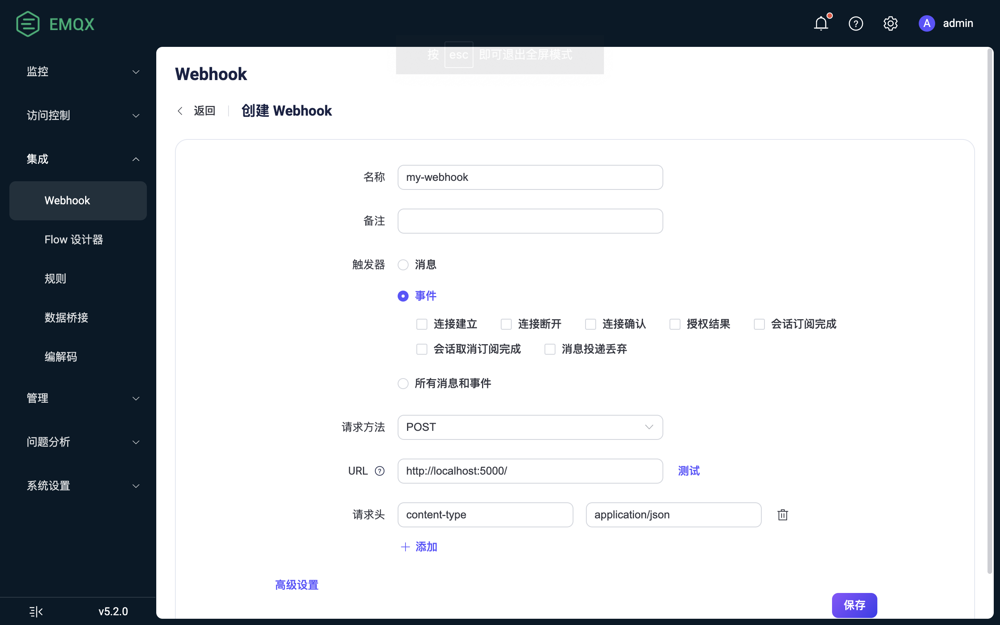

# Webhook

Webhook 提供了一种将 EMQX 客户端消息和事件集成到外部 HTTP 服务器的方法。相比于使用规则引擎与数据桥接，Webhook 提供了一种更简便的方法，大大降低使用门槛，能够快速实现 EMQX 与外部系统的集成。

本页详细介绍了 Webhook 的功能特性，并提供了实用的 Webhook 创建指导。

## 工作原理

Webhook 是 EMQX 中开箱即用的功能。当客户端向特定主题发布消息，或执行特定操作时就会触发 Webhook，将事件数据和消息数据转发到预设的 HTTP 服务器中。

Webhook 支持规则引擎所有的消息与事件，各事件的数据请参考 [SQL 数据源和字段](./rule-sql-events-and-fields.md)。

### 消息

当发布者发布消息，或消息状态发生变化时：

- 消息发布
- 消息已投递
- 消息应答
- 消息转发丢弃
- 消息投递丢弃

支持为消息设置多个主题过滤器，只有匹配的消息才会触发 Webhook。

### 事件

当客户端执行特定操作，或状态发生变化时：

- 连接建立
- 连接断开
- 连接确认
- 授权结果
- 会话订阅完成
- 会话取消订阅完成

## 特性与优势

使用 EMQX 的 Webhook 集成可以为业务带来以下优势：

1. **将数据传递到更多的下游系统**：Webhook 可以将 MQTT 数据轻松集成到更多的外部系统中，比如分析平台、云服务等，实现多系统的数据分发。

2. **实时响应并触发业务流程**：通过 Webhook，外部系统可以实时接收到 MQTT 数据并触发业务流程，实现快速响应。例如接收报警数据并触发业务工作流。

3. **自定义处理数据**：外部系统可以根据需要对接收到的数据进行二次处理，实现更复杂的业务逻辑，不受 EMQX 功能限制。

4. **松耦合的集成方式**：Webhook 使用简单的 HTTP 接口，提供了一种松耦合的系统集成方式。

总之，Webhook 集成为业务提供了实时、灵活、自定义的数据集成能力，可以满足灵活，丰富的应用开发需求。

## 开始使用

本节以 macOS 系统为例，介绍如何配置并使用 Webhook。

### 创建 HTTP 服务

此处使用 Python 来快速创建一个 HTTP 服务器，监听本地 8082 端口，并在收到 Webhook 请求时打印出 URL。实际应用中请将其更换为你的业务服务器：

首先我们使用 Python 搭建一个简单的 HTTP 服务，用来接收 `POST /` 请求，该服务打印请求内容后返回 200 OK：

```python
from flask import Flask, json, request

api = Flask(__name__)

@api.route('/', methods=['POST'])
def print_messages():
  reply= {"result": "ok", "message": "success"}
  print("got post request: ", request.get_data())
  return json.dumps(reply), 200

if __name__ == '__main__':
  api.run()
```

将上面的代码保存为 `http_server.py` 文件，文件所在目录运行如下命令：

```shell
# 安装 flask 依赖
pip install flask

# 启动服务
python3 http_server.py
```

### 创建 Webhook

1. 转到 Dashboard **数据集成** -> **Webhook**页面。
2. 点击页面右上角的**创建**按钮。
4. 输入 Webhook 名称与备注，要求是大小写英文字母和数字的组合，这里我们输入 `my_webhook`。
5. 触发器根据需要选择，此处选择**所有消息和事件**。其他选项说明请参考[工作原理](#工作原理)。
6. 请求方法选择 POST，URL 为 `http://localhost:5000`，点击 URL 输入框旁的 **测试** 按钮可以测试连接是否配置正确，其他使用默认值即可。
7. 点击最下方**保存**按钮完成规则创建。



至此您已经完成 Webhook 创建。

### 测试 Webhook

使用 MQTTX CLI 向 `t/1` 主题发布消息：

```bash
mqttx pub -i emqx_c -t t/1 -m '{ "msg": "Hello Webhook" }'
```

此操作同时会依次触发以下事件：

- 连接建立
- 连接确认
- 授权检查完成
- 消息发布
- 连接断开

如果 `t/1` 主题没有订阅者，还将在消息发布后触发**消息转发丢弃**事件。

查看对应的事件和消息数据是否已经转发到 HTTP 服务，此处应当看到以下数据：

```shell
got post request:  b'{"username":"undefined","timestamp":1694681417717,"sockname":"127.0.0.1:1883","receive_maximum":32,"proto_ver":5,"proto_name":"MQTT","peername":"127.0.0.1:61003","node":"emqx@127.0.0.1","mountpoint":"undefined","metadata":{"rule_id":"my-webhook_WH_D"},"keepalive":30,"is_bridge":false,"expiry_interval":0,"event":"client.connected","connected_at":1694681417714,"conn_props":{"User-Property":{},"Request-Problem-Information":1},"clientid":"emqx_c","clean_start":true}'
127.0.0.1 - - [14/Sep/2023 16:50:17] "POST / HTTP/1.1" 200 -
got post request:  b'{"username":"undefined","timestamp":1694681417719,"sockname":"127.0.0.1:1883","reason_code":"success","proto_ver":5,"proto_name":"MQTT","peername":"127.0.0.1:61003","node":"emqx@127.0.0.1","metadata":{"rule_id":"my-webhook_WH_D"},"keepalive":30,"expiry_interval":0,"event":"client.connack","conn_props":{"User-Property":{},"Request-Problem-Information":1},"clientid":"emqx_c","clean_start":true}'
127.0.0.1 - - [14/Sep/2023 16:50:17] "POST / HTTP/1.1" 200 -
got post request:  b'{"username":"undefined","topic":"t/1","timestamp":1694681417728,"result":"allow","peerhost":"127.0.0.1","node":"emqx@127.0.0.1","metadata":{"rule_id":"my-webhook_WH_D"},"event":"client.check_authz_complete","clientid":"emqx_c","authz_source":"file","action":"publish"}'
127.0.0.1 - - [14/Sep/2023 16:50:17] "POST / HTTP/1.1" 200 -
got post request:  b'{"username":"undefined","topic":"t/1","timestamp":1694681417728,"qos":0,"publish_received_at":1694681417728,"pub_props":{"User-Property":{}},"peerhost":"127.0.0.1","payload":"{ \\"msg\\": \\"Hello Webhook\\" }","node":"emqx@127.0.0.1","metadata":{"rule_id":"my-webhook_WH_D"},"id":"0006054DC3E940F8F445000038A60002","flags":{"retain":false,"dup":false},"event":"message.publish","clientid":"emqx_c"}'
127.0.0.1 - - [14/Sep/2023 16:50:17] "POST / HTTP/1.1" 200 -
got post request:  b'{"username":"undefined","topic":"t/1","timestamp":1694681417729,"reason":"no_subscribers","qos":0,"publish_received_at":1694681417728,"pub_props":{"User-Property":{}},"peerhost":"127.0.0.1","payload":"{ \\"msg\\": \\"Hello Webhook\\" }","node":"emqx@127.0.0.1","metadata":{"rule_id":"my-webhook_WH_D"},"id":"0006054DC3E940F8F445000038A60002","flags":{"retain":false,"dup":false},"event":"message.dropped","clientid":"emqx_c"}'
127.0.0.1 - - [14/Sep/2023 16:50:17] "POST / HTTP/1.1" 200 -
got post request:  b'{"username":"undefined","timestamp":1694681417729,"sockname":"127.0.0.1:1883","reason":"normal","proto_ver":5,"proto_name":"MQTT","peername":"127.0.0.1:61003","node":"emqx@127.0.0.1","metadata":{"rule_id":"my-webhook_WH_D"},"event":"client.disconnected","disconnected_at":1694681417729,"disconn_props":{"User-Property":{}},"clientid":"emqx_c"}'
127.0.0.1 - - [14/Sep/2023 16:50:17] "POST / HTTP/1.1" 200 -
```
