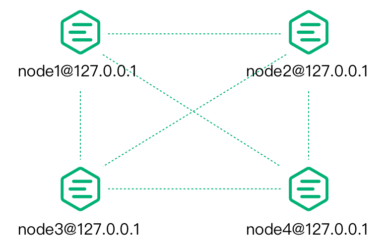
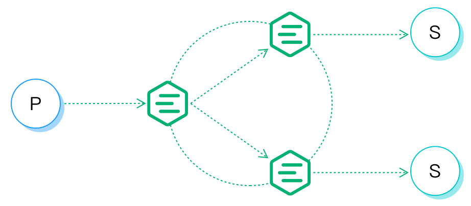
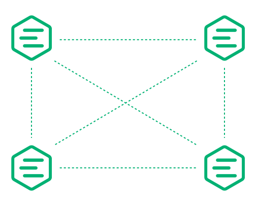

# 介绍

EMQX 由 Erlang/OTP 驱动，是高度可扩展的分布式平台。

在我们开始讨论 EMQX 集群之前，有必要先熟悉一下 Erlang/OTP。

## Erlang/OTP

Erlang/OTP 最初是一个由爱立信为电信设备开发而设计的编程语言平台。

电信设备（路由器、接入网关）通常是一个分布式的系统，通过背板连接主控制板和多个业务板。

## 分布式Erlang

Erlang/OTP 平台的分布式程序是由分布，互联的 Erlang 运行时系统组成。
每个 Erlang 运行时系统被称为一个节点。
节点通过 TCP 相互连接，形成一个网络（或在此背景下的一个集群）。

Erlang 节点由一个唯一的节点名称来识别，该名称由两部分组成
用 "@" 分隔。

```bash
<name>@<ip-address-or-FQDN>
```

节点之间通过节点名通信。
例如，在本地启动四个 shell 终端，然后使用 `-name` 参数
来分别启动四个 Erlang 节点。

```bash
erl -name node1@127.0.0.1 -setcookie my_nodes
erl -name node2@127.0.0.1 -setcookie my_nodes
erl -name node3@127.0.0.1 -setcookie my_nodes
erl -name node4@127.0.0.1 -setcookie my_nodes
```

Erlang 表达式 `node().` 可以用来查看这个节点名。
`nodes().` 可用于查看与当前节点建立连接的其他节点。
与当前节点建立连接的其他节点。

我们现在进入 `node1@127.0.0.1` 的控制台，查看当前节点的名称和
连接的节点。


```bash
(node1@127.0.0.1) 4> node().
'node1@127.0.0.1'

(node1@127.0.0.1) 4> nodes().
[]
```

然后我们让 `node1` 发起与其他节点的连接。

```bash
(node1@127.0.0.1) 1> net_kernel:connect_node('node2@127.0.0.1').
true
(node1@127.0.0.1) 2> net_kernel:connect_node('node3@127.0.0.1').
true
(node1@127.0.0.1) 3> net_kernel:connect_node('node4@127.0.0.1').
true
```

现在我们可以检查已经连接到 node1 的其他节点。

```bash
(node1@127.0.0.1) 4> nodes().
['node2@127.0.0.1','node3@127.0.0.1','node4@127.0.0.1']
```

我们可以看到，`node2`、`node3` 和 `node4` 已经与 `node1` 建立了分布式连接，这四个节点组成一个集群。

请注意，每当一个新的节点加入集群，它将与集群中的所有节点建立一个 TCP
连接到集群中的所有节点。

此时，这四个节点已经完成了下图所示的网状结构。



## EMQX 分布式集群设计

EMQX 分布的基本功能是转发和发布消息到订阅者，如下图所示。



为了实现这一目标，EMQX 维护着与之相关的几个数据表：订阅表、路由表和主题树。

### 订阅表：主题-订阅者

当一个 MQTT 客户端订阅一个主题时，EMQX 会维护一个**订阅表**。
为主题->订阅者的映射。该订阅表记录只存在于订阅者所在的 EMQX 节点上，比如说:


```bash
node1:

    topic1 -> client1, client2
    topic2 -> client3

node2:

    topic1 -> client4
```

### 路由表：Topic-Node

例如，同一集群中的所有节点将**复制** 一个主题到节点的映射表。

```bash
topic1 -> node1, node2
topic2 -> node3
topic3 -> node2, node4
```

### 主题树：主题匹配通配符

除了路由表之外，EMQX 集群中的每个节点还维护一个 **主题树**

下面是一个主题-订阅关系的例子:

| Client  | Node  | Subscribed topic |
|---------|-------|------------------|
| client1 | node1 | t/+/x, t/+/y     |
| client2 | node2 | t/#              |
| client3 | node3 | t/+/x, t/a       |

当所有的订阅完成后，EMQX 会维护以下**主题树**和**路由表**。



### 消息分发流程

当一个 MQTT 客户端发布消息时，它所在的节点会检索路由表。
并根据消息主题将消息转发到相关节点。
然后，相关节点检索本地订阅表，并将消息发送至
相关的订阅者。

例如，当客户端 1 发布一条消息到主题 `t/a` 时。
消息在节点之间的路由和分发如下:

1. 客户端 1 向节点 1 发布一条主题为 `t/a` 的消息
2. 通过查询主题树，节点 1 了解到 `t/a` 与两个现有的主题 `t/a` 相匹配：`t/a` 和 `t/#`。
3. 通过查询路由表，节点 1 得知话题 `t/a` 只有节点 3 的用户，而话题 `t/a` 只有节点 3 的用户。
   在节点 3 上，而话题 `t/#` 只在节点 2 上有用户。所以节点 1 将消息转发给节点 2 和节点 3。
4. 通过查询路由表，节点 1 得知
   a) 只有节点 3 的用户订阅了话题 `t/a`
   b) 只有节点 2 上有用户订阅了话题 `t/#`。
   所以节点1将消息转发给节点 2 和节点 3。
5. 节点 2 收到转发的 `t/a` 消息后。它查询本地订阅表，以获得订阅了 `t/# `的用户，并将消息分发给他们。
6. 节点 3 收到转发的 `t/a` 消息后，查询本地订阅表以获得在本节点上订阅了 `t/a` 的用户，并将消息分发给他们。
7. 消息转发和分发完成。

### 数据分区

EMQX 的订阅表在集群中被分区存放。
而主题树和路由表是集群复制的。

## EMQX 群集节点发现和自动群集

在分布式 Erlang 的基础上，EMQX 增加了一个抽象层:
[Ekka](https://github.com/emqx/ekka)

Ekka 是一个为 Erlang/OTP 应用开发的集群管理库，
支持 Erlang 节点自动发现、自组群集，以及网络分区自动修复和自动清理。

EMQX 支持多种节点发现策略。

| 策略 | 描述                      |
|------|---------------------------|
| 手动 | 通过手动命令创建一个集群  |
| 静态 | 静态节点列表的自动群集    |
| 组播 | 采用 UDP 组播模式的自动群集 |
| dns  | DNS A 记录的自动群集       |
| etcd | 通过 etcd 的自动群集      |
| k8s  | Kubernetes 服务的自动群集  |

### EMQX 集群协议设置

Erlang 集群中的每个节点都可以通过 TCP 或 TLS 连接， 可以在 `etc/emqx.conf` 中配置：

| 配置名称              | 类型     | 默认值              | 说明                                                                                                                |
|-----------------------|----------|---------------------|---------------------------------------------------------------------------------------------------------------------|
| cluster.proto_dist    | 枚举     | `inet_tcp`          | 具有可选值的分布式协议如下：<br /> -inet_tcp：使用 TCP IPv4<br/> -inet6_tcp：使用 TCP IPv6<br/> -inet_tls：使用 TLS |
| node.ssl_dist_optfile | 文件路径 | `etc/ssl_dist.conf` | 当 `cluster.proto_dist` 选择为 inet_tls 时，需要配置 `etc/ssl_dist.conf` 文件，并指定 TLS 证书。                    |

## 网络分区自动修复

*EMQX* 支持网络分区自愈，可以在 `etc/emqx.conf` 中进行配置。

```bash
cluster.autoheal = on
```

网络分区自愈过程。

1. 节点在收到 Mnesia 的 "数据库不一致" 事件 3 秒后执行网络分区确认。
1. 节点确认网络分区发生后，它将消息报告给 Leader 节点（集群中最早开始的节点）。
1. 在 Leader 节点延迟一段时间后，当所有节点都在线时，它创建一个 SplitView。
1. Leader 节点选择多数分区中的自愈协调者节点。
1. 协调者节点重新启动少数派分区的节点以恢复集群

## 群集节点的自动清理

*EMQX* 支持集群自动清理，可以在 `etc/emqx.conf` 中进行配置。

```bash
cluster.autoclean = 5m
```
启用该功能后，断开连接的节点会在配置的时间间隔后自动从集群中移除

## 接下来

经过一段时间的学习，现在是时候学习如果组 EMQX 集群了。

* 了解更多关于 EMQX 集群的[安全](./security.md)方面的信息。
* 经典的[手动集群](./manual.md)
* 更聪明的[自动集群](./auto.md)

