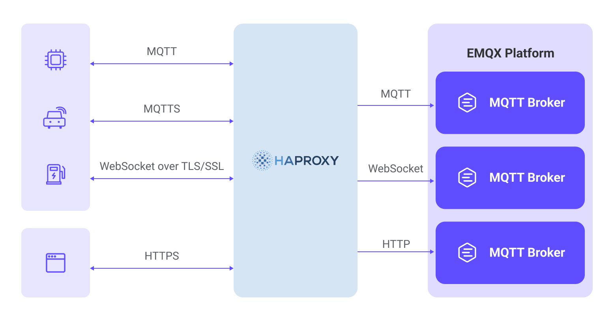
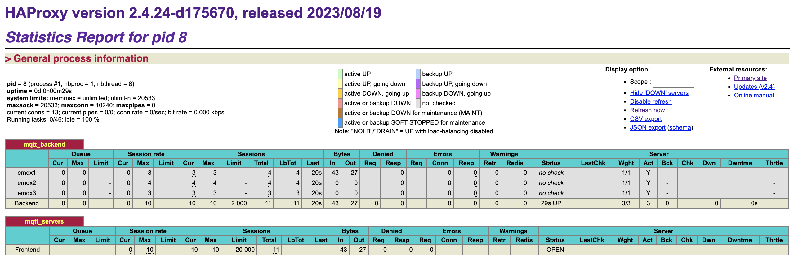
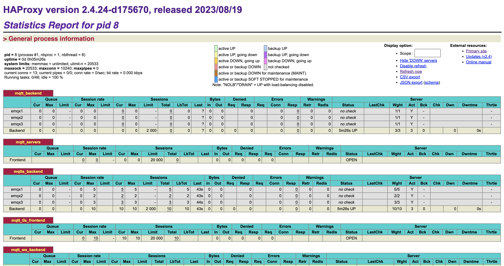

# 用 HAProxy 负载均衡 EMQX 集群

HAProxy 是一款免费、快速并且可靠的负载均衡软件，可以将来自客户端的网络连接请求分发到多个后端服务器。EMQX 原生支持由多个 MQTT 服务器组成的分布式集群架构。通过 HAProxy 部署 EMQX 集群，可以对来自物联网设备的 MQTT 连接进行负载均衡，将大量的设备连接分发到集群中不同的 EMQX 节点。

本页主要介绍了如何安装和配置 HAProxy 来搭建 MQTT 服务器从而为 EMQX 集群实现负载均衡。

## 功能与优势

HAProxy 用于 EMQX MQTT 负载均衡时有以下功能和优势：

- 使用 HAProxy 部署 EMQX 集群，通过反向代理隐藏后端节点信息，对外提供统一的接入地址，提升了系统的可维护性和扩展性。
- 支持终结 MQTT over TLS 连接，减轻了 EMQX 的 SSL 加密计算负载，同时简化了证书部署和管理。
- 内置对 MQTT 协议的支持，可以解析 MQTT 报文实现会话黏性等智能负载均衡机制，以及识别非法连接进行丢弃，增强了安全防护。
- 提供主备高可用机制，配合后端健康检查，可以实现毫秒级故障切换，确保服务的连续可用性。



## 快速体验

此处提供了一个具有实际示例的 Docker Compose 配置，让您能够轻松地进行验证和测试，您可以按照以下步骤来进行操作：

1. 克隆示例仓库并进入 `mqtt-lb-haproxy` 目录：

```bash
git clone https://github.com/emqx/emqx-usage-example
cd emqx-usage-example/mqtt-lb-haproxy
```

2. 通过 Docker Compose 启动示例：

```bash
docker compose up -d
```

3. 使用 [MQTTX](https://mqttx.app/zh) CLI 建立 10 个 TCP 连接，模拟 MQTT 客户端连接：

```bash
mqttx bench conn -c 10
```

4. 您可以查看 HAProxy 连接监控情况以及 EMQX 客户端连接的分布情况。

   - 通过 HAProxy 状态监控页面 [http://localhost:8888/stats](http://localhost:8888/stats) 查看客户端连接情况：

   

   这将显示当前活动连接数以及服务器的请求处理统计情况。

   - 使用以下命令分别查看每个 EMQX 节点的客户端连接情况：

   ```bash
   docker exec -it emqx1 emqx ctl broker stats | grep connections.count
   docker exec -it emqx2 emqx ctl broker stats | grep connections.count
   docker exec -it emqx3 emqx ctl broker stats | grep connections.count
   ```

   这将显示每个节点的连接数以及活动连接数，10 个连接均匀分布在集群节点：

   ```bash
   connections.count             : 4
   live_connections.count        : 4
   connections.count             : 3
   live_connections.count        : 3
   connections.count             : 3
   live_connections.count        : 3
   ```

通过以上步骤，您可以验证示例中的 HAProxy 负载均衡功能，以及 EMQX 集群中客户端连接的分布情况。您也可以更改 `emqx-usage-example/mqtt-lb-haproxy/haproxy.conf` 文件进行自定义的配置验证。

接下来，我们将从头介绍如何安装并配置 HAProxy 实现各类场景下的负载均衡需求。

## 前置准备

在开始使用之前，确保您已经创建了由以下 3 个 EMQX 节点组成的集群。需要了解如何创建 EMQX 集群，详见[创建与管理集群](./create-cluster.md)。

| 节点地址              | MQTT TCP 端口 | MQTT WebSocket 端口 |
| --------------------- | ------------- | ------------------- |
| emqx1-cluster.emqx.io | 1883          | 8083                |
| emqx2-cluster.emqx.io | 1883          | 8083                |
| emqx3-cluster.emqx.io | 1883          | 8083                |

本页中的示例将使用单个 HAProxy 服务器配置为负载均衡器，将请求转发到由这 3 个 EMQX 节点组成的集群。

## 安装 HAProxy

使用 Ubuntu 22.04 LTS 系统安装 HAProxy 的步骤如下：

```bash
# 更新软件包索引
sudo apt update 

# 安装 HAProxy
sudo apt install haproxy

# 检查版本  
haproxy -v
```

## 开始使用

HAProxy 的配置文件默认位于 `/etc/haproxy/haproxy.cfg`，可以参考本页的示例往文件末尾添加配置。HAProxy 运行时会持续记录日志到 `/var/log/haproxy.log`，可以通过查看日志来调试配置。

以下是开始使用 HAProxy 需要了解的一些基本命令：

检查配置文件正确性:

```bash
sudo haproxy -c -f /etc/haproxy/haproxy.cfg
```

启动 HAProxy:

```bash
sudo systemctl start haproxy
```

重新加载 HAProxy 以应用新的配置，建议先检查配置:

```bash
sudo systemctl reload haproxy
```

停止 HAProxy:

```bash
sudo systemctl stop haproxy
```

查看 HAProxy 运行状态:

```bash
sudo systemctl status haproxy
```

## 基础配置

以下是启动 HAProxy 服务器需要的参考配置。需要确保 `haproxy.cfg` 配置文件中包含这两项配置。

```bash
global  
  log 127.0.0.1 local3 info 
  daemon  
  maxconn 1024000

defaults  
  log global 
  mode tcp 
  option tcplog 
  #option dontlognull  
  timeout connect 10000 
  # timeout > mqtt's keepalive * 1.2  
  timeout client 240s  
  timeout server 240s 
  maxconn 20000
```

## 反向代理 MQTT 

您可以在 HAProxy 的配置文件中添加以下配置来反向代理 MQTT 连接，将客户端请求转发至后端 MQTT 服务器。

```bash
backend mqtt_backend
  mode tcp
  stick-table type string len 32 size 100k expire 30m
  stick on req.payload(0，0)，mqtt_field_value(connect，client_identifier)

 # 增加 send-proxy 会把真实带给 EMQX，对应后端监听器需要启用 proxy_protocol
  # server emqx1 emqx1-cluster.emqx.io:1883 check send-proxy-v2
  server emqx1 emqx1-cluster.emqx.io:1883
  server emqx2 emqx2-cluster.emqx.io:1883
  server emqx3 emqx3-cluster.emqx.io:1883

frontend mqtt_servers
  bind *:1883
  mode tcp
  # 等待缓冲区填满，以便解析 MQTT 报文
  tcp-request inspect-delay 10s
  # 拒绝非 MQTT 连接
  tcp-request content reject unless { req.payload(0，0)，mqtt_is_valid }
  default_backend mqtt_backend
```

## 反向代理 MQTT SSL

您可以通过以下配置使 HAProxy 反向代理 MQTT 并解密 TLS 连接，将客户端加密的 MQTT 请求解密后转发至后端 MQTT 服务器，以确保通信安全性。

只需在 TCP 基础配置上添加 SSL 与证书相关参数即可：

:::tip 提示
HAProxy 的证书文件需要包含证书与密钥，可以使用 `cat` 命令将它们合并为一个文件。

```bash
cat server.crt server.key > server.pem
```

:::

```bash
backend mqtt_backend
  mode tcp
  balance roundrobin
 
 # 增加 send-proxy 会把真实 IP 带给 EMQX，对应后端监听器需要启用 proxy_protocol
  server emqx1 emqx1-cluster.emqx.io:1883 check-send-proxy send-proxy-v2
  server emqx2 emqx2-cluster.emqx.io:1883 check-send-proxy send-proxy-v2
  server emqx3 emqx3-cluster.emqx.io:1883 check-send-proxy send-proxy-v2

frontend mqtt_tls_frontend
  bind *:8883 ssl crt /etc/haproxy/certs/server.pem 
  # 双向认证
  # bind *:8883 ssl ca-file /etc/haproxy/certs/cacert.pem crt /etc/haproxy/certs/server.pem verify required
  mode tcp
  default_backend mqtt_backend
```

## 反向代理 MQTT WebSocket

您可以通过以下配置使 HAProxy反向代理 MQTT WebSocket 连接，将客户端请求转发至后端 MQTT 服务器。需要使用  `server_name` 指定 HTTP 域名或 IP 地址。

```bash
backend mqtt_ws_backend
  mode tcp
  balance roundrobin
  server emqx1 emqx1-cluster.emqx.io:8083 check
  server emqx2 emqx2-cluster.emqx.io:8083 check
  server emqx3 emqx3-cluster.emqx.io:8083 check

frontend mqtt_ws_frontend
  bind *:8083 
  mode tcp
  default_backend mqtt_ws_backend
```

## 反向代理 **MQTT WebSocket SSL**

您可以通过以下配置使 HAProxy 反向代理 MQTT WebSocket 并解密 TLS 连接，将客户端加密的 MQTT 请求解密后转发至后端 MQTT 服务器，以确保通信安全性。需要使用  `server_name` 指定 HTTP 域名或 IP 地址。

只需在 WebSocket 基础配置上添加 SSL 与证书相关参数即可：

:::tip 提示
HAProxy 的证书文件需要包含证书与密钥，可以使用 `cat` 命令将它们合并为一个文件。

```bash
cat server.crt server.key > server.pem
```

:::

```bash
backend mqtt_ws_backend
  mode tcp
  balance roundrobin
  server emqx1 emqx1-cluster.emqx.io:8083 check
  server emqx2 emqx2-cluster.emqx.io:8083 check
  server emqx3 emqx3-cluster.emqx.io:8083 check

frontend mqtt_ws_tls_frontend
  bind *:8084 ssl crt /etc/haproxy/certs/server.pem
  mode tcp 
  default_backend mqtt_ws_backend
```

## 负载均衡策略

HAProxy 提供了多种负载均衡策略，用于控制连接的分发方式。在实际使用中，根据您的服务器性能、流量需求等选择适当的负载均衡策略非常重要。

以下是 HAProxy 支持的负载均衡策略与配置方式。

### 轮询（Round Robin）

这是默认的负载均衡策略，它将请求依次分配给每个后端服务器，循环往复。这样可以平均分担负载，适用于后端服务器性能差不多的情况。

```bash
backend mqtt_backend
  mode tcp
  balance roundrobin
  server emqx1 emqx1-cluster.emqx.io:1883 check
  server emqx2 emqx2-cluster.emqx.io:1883 check
  server emqx3 emqx3-cluster.emqx.io:1883 check
```

### 权重轮询（Weighted Round Robin）

在轮询基础上，为每个 EMQX 节点分配不同的权重，从而影响请求分配的比例。权重越高的服务器会获得更多的请求。

```bash
backend mqtt_backend
  mode tcp
  balance roundrobin
  server emqx1 emqx1-cluster.emqx.io:1883 check weight 5
  server emqx2 emqx2-cluster.emqx.io:1883 check weight 2
  server emqx3 emqx3-cluster.emqx.io:1883 check weight 3
```

### IP 哈希（IP Hash）

根据客户端的 IP 地址进行哈希计算，然后将请求分配给一个固定的后端服务器。这确保同一个客户端的请求总是分发到同一个服务器上。

```bash
backend mqtt_backend
  mode tcp
  balance source
  server emqx1 emqx1-cluster.emqx.io:1883
  server emqx2 emqx2-cluster.emqx.io:1883
  server emqx3 emqx3-cluster.emqx.io:1883
```

### 最少连接数（Least Connections）

请求分发到当前连接数最少的服务器，以确保每个服务器的负载尽可能平衡。适用于后端服务器性能差异较大的情况。

```bash
backend mqtt_backend
  mode tcp
  balance leastconn
  server emqx1 emqx1-cluster.emqx.io:1883
  server emqx2 emqx2-cluster.emqx.io:1883
  server emqx3 emqx3-cluster.emqx.io:1883
```

### MQTT 粘性（Sticky）会话

MQTT 粘性会话负载均衡在 HAProxy 2.4 版本中加入。

「粘性」是负载均衡器在重新连接时将客户端路由到之前服务器的能力，在 MQTT 中可以避免会话接管。这对于多客户端频繁重新连接或有问题的客户端断开连接再次连接的情况特别有用，能够提高有效性。

为了实现粘性，服务器需要识别连接请求中的客户端标识符（通常是客户端 ID），这需要负载均衡器检查 MQTT 数据包。一旦获取客户端标识符，对于静态集群，服务器可以将其散列到服务器 ID，或者负载均衡器可以维护客户端标识符到目标节点 ID 的映射表以提供更灵活的路由。

```bash
backend mqtt_backend
  mode tcp
  # 创建粘性会话表
  stick-table type string len 32 size 100k expire 30m

  # 使用客户端 ID 作为键
  stick on req.payload(0，0)，mqtt_field_value(connect，client_identifier)
 
  server emqx1 emqx1-cluster.emqx.io:1883
  server emqx2 emqx2-cluster.emqx.io:1883
  server emqx3 emqx3-cluster.emqx.io:1883
```

## HAProxy 状态监控

HAProxy 配置配置一个特殊的 frontend 即可实现状态监控，能够查看每个 backend 与 frontend 连接情况，以及全局的连接统计信息。参考 [Exploring the HAProxy Stats Page](https://www.haproxy.com/blog/exploring-the-haproxy-stats-page)：

```bash
frontend stats
  mode http
  bind *:8888
  stats enable
  stats uri /stats
  stats refresh 10s
```

打开 [http://localhost:8888/stats](http://localhost:8888/stats) 查看状态数据：

  

### HAProxy 高可用方案介绍

HAProxy 和 Keepalived 是一种常见的高可用性和负载均衡解决方案的组合。Keepalived 是 Linux下⼀个轻量级别的⾼可⽤解决⽅案，它可以管理多个服务器上的虚拟 IP 地址（VIP），并确保在某个服务器不可用时将 VIP 迁移到另一个服务器，从而实现高可用性。Keepalived 还可以监控 HAProxy 进程，并在需要时重新启动它，以确保负载均衡服务的可用性。

通过使用 Keepalived，可以确保 HAProxy 的高可用性。如果主要的 HAProxy 服务器出现故障，Keepalived 将自动将 VIP 迁移到备用服务器上，从而确保服务的连续性。想要了解如何使用该方案，请参考 [HAProxy 文档](https://www.haproxy.com/documentation/hapee/latest/high-availability/active-standby/)。
