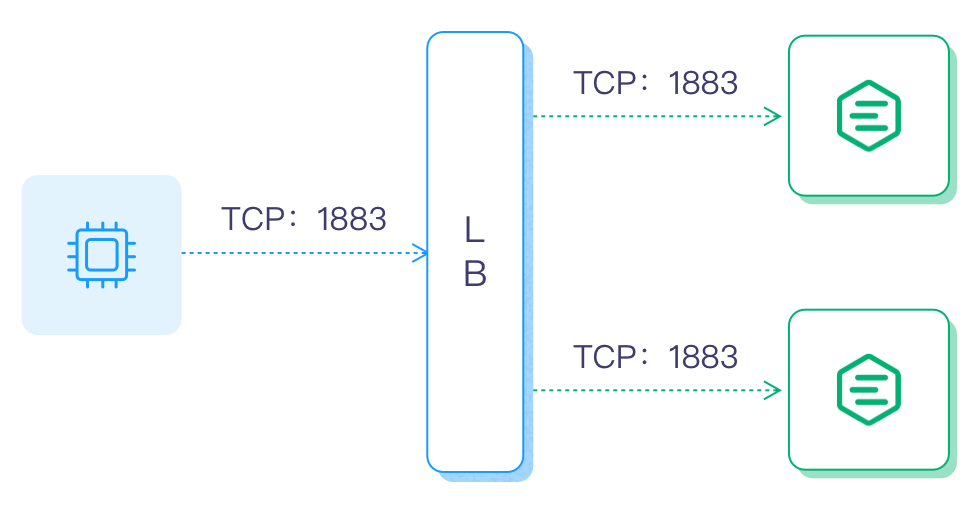
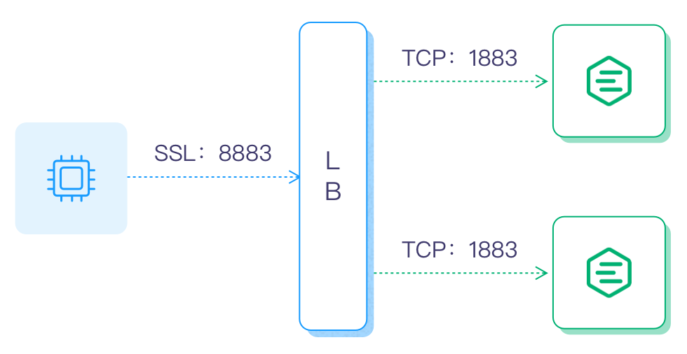

# 集群负载均衡

在创建好集群后，通常需要使用负载均衡器将所有节点封装成一个统一的接入点，同时实现集群中的可用节点之间连接的负载平衡。

本章节将指导您为 EMQX 集群选择并启用负载器。

## 负载均衡能带来什么

负载均衡（Load Balancing）的最基本的功能就是均衡多个网络组件的负载，从而优化资源的使用，避免组件过载而引起的故障。

<!-- The basic function of a Load Balancer (LB) is to balance the load of multiple network components, and optimize resource usage,  and avoid failures caused by overload of single or a few components.-->

负载均衡虽然不是集群中的必备组件，但是能给集群带来一些非常有用的特性，所以它经常会作为集群的一部分部署在系统中。使用负载均衡部署 EMQX 的收益如下：

<!-- In a cluster, a load balancer it not obligatory, but it can bring extra advantages to the entire system, thus is is a common practice to have one in front of the service providing cluster. If we have a load balancer deployed with EMQ X cluster, it brings following benefits: -->

- 均衡 EMQ X 服务器的负载，避免出现单节点过载的情况；
- 简化客户端配置，客户端只需连接到到负载均衡器上，无需关心集群内部伸缩变化；
- TLS/SSL 终结，减轻 EMQX 集群的负担；
- 提高安全性，有了负载均衡在集群前端，能够通过设置阻止不需要的流量，保护 EMQX 集群免受恶意攻击。

## 负载均衡部署架构

使用 LB (负载均衡器) 分发设备的 MQTT 连接与消息到 EMQX 集群，LB 仅处理 TCP 连接：



推荐在 LB 终结 SSL/TLS 连接：设备与 LB 之间采用 SSL/TLS 安全连接，LB 与 EMQX 之间普通 TCP 连接，这种模式能够使 EMQX 集群性能最大化：



除了负载均衡部署集群外，还可以使用 DNS 轮询直连 EMQX 集群，即将所有节点加入 DNS 轮询列表，设备通过域名或者 IP 地址列表访问集群，通常产品部署不推荐这种部署方式。

## 选择负载均衡产品

目前可用的负载均衡产品很多，有开源的也有商业的，各个公有云服务商一般也都会提供各自的负载均衡服务。

**公有云厂商 LB 产品：**

| 云计算厂商                                | 是否支持 TLS 终结 | LB 产品介绍                                                 |
| ----------------------------------------- | ----------------- | ----------------------------------------------------------- |
| [华为云](https://www.huaweicloud.com)     | 否                | <https://www.huaweicloud.com/product/elb.html>              |
| [阿里云](https://www.aliyun.com)          | 是                | <https://www.aliyun.com/product/slb>                        |
| [腾讯云](https://cloud.tencent.com)       | 是                | <https://cloud.tencent.com/product/clb>                     |
| [青云](https://qingcloud.com)             | 是                | <https://docs.qingcloud.com/product/network/loadbalancer/>  |
| [天翼云](https://www.ctyun.cn)            | 是                | <https://www.ctyun.cn/products/elb>                         |
| [UCloud](https://ucloud.cn)               | 否                | <https://ucloud.cn/site/product/ulb.html>                   |
| [AWS](https://aws.amazon.com)             | 是                | <https://aws.amazon.com/cn/elasticloadbalancing/>           |
| [Azure](https://azure.microsoft.com)      | 未知              | <https://azure.microsoft.com/zh-cn/products/load-balancer/> |
| [Google Cloud](https://cloud.google.com/) | 是                | <https://cloud.google.com/load-balancing?hl=zh-cn>          |

**私有部署 LB 服务器**

| 开源 LB                            | 是否支持 TLS 终结 | 方案介绍                                                        |
| ---------------------------------- | ----------------- | --------------------------------------------------------------- |
| [HAProxy](https://www.haproxy.org) | 是                | <https://www.haproxy.com/solutions/load-balancing.html>（推荐） |
| [Nginx](https://www.nginx.com)     | 是                | <https://www.nginx.com/solutions/load-balancing/>               |

下面我们将以私有部署 LB 服务器为例向大家介绍如何配置并负载均衡 EMQX 集群。

## HAProxy/Nginx 负载均衡操作指南

假设 EMQX 集群中有以下 2 个节点：

| 节点  | IP 地址     |
| ----- | ----------- |
| emqx1 | 192.168.0.2 |
| emqx2 | 192.168.0.3 |

对应的配置方式如下。

### 启用 Proxy Protocol

如果 EMQX 集群部署在 HAProxy 或 Nginx 后，且需要拿到客户端真实的源 IP 地址与端口，则需要在对应监听器配置中打开 [Proxy Protocol](https://www.haproxy.com/blog/haproxy/proxy-protocol) 配置，以 1883 监听器为例：

```bash
listeners.tcp.default {
  bind = "0.0.0.0:1883"
  max_connections = 1024000

  proxy_protocol = true
}
```

Nginx 使用 Proxy Prorcol 参考：[https://docs.nginx.com/nginx/admin-guide/load-balancer/using-proxy-protocol/](https://docs.nginx.com/nginx/admin-guide/load-balancer/using-proxy-protocol/)。

### HAProxy 负载均衡

HAProxy 作为 LB 部署 EMQX 集群，并终结 SSL 连接，有关 HAProxy 介绍及安装请参考 [HAProxy 官方网站](http://www.haproxy.org/)。

修改 `/etc/haproxy/haproxy.cfg` 配置，根据版本和安装环境的不同配置文件位置可能会有差异。

```bash
listen mqtt-ssl
  bind *:8883 ssl crt /etc/ssl/emqx/emq.pem no-sslv3
  mode tcp
  maxconn 50000
  timeout client 600s
  default_backend emqx_cluster

backend emqx_cluster
  mode tcp
  balance source
  timeout server 50s
  timeout check 5000
  server emqx1 192.168.0.2:1883 check inter 10000 fall 2 rise 5 weight 1
  server emqx2 192.168.0.3:1883 check inter 10000 fall 2 rise 5 weight 1
```

## Nginx 负载均衡

Nginx 作为 EMQX 集群 LB，并终结 SSL 连接，有关 HAProxy 介绍及安装请参考 [Nginx 官方网站](https://www.nginx.com/)。

修改 `/etc/nginx/nginx.conf` 配置，根据版本和安装环境的不同配置文件位置可能会有差异：

```bash
stream {
  upstream stream_backend {
      zone tcp_servers 64k;
      hash $remote_addr;
      server 192.168.0.2:1883 max_fails=2 fail_timeout=30s;
      server 192.168.0.3:1883 max_fails=2 fail_timeout=30s;
  }

  server {
      listen 8883 ssl;
      proxy_pass stream_backend;
      proxy_buffer_size 4k;
      ssl_handshake_timeout 15s;
      ssl_certificate     /etc/emqx/certs/cert.pem;
      ssl_certificate_key /etc/emqx/certs/key.pem;
  }
}
```
