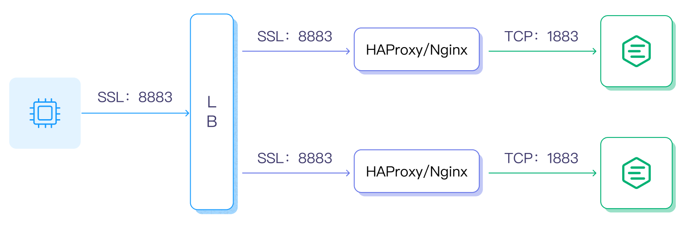

# 集群负载均衡

负载均衡（Load Balancing）用于均衡多个网络组件的负载，从而优化资源的使用，避免由于组件过载造成故障。负载均衡虽然不是集群中的必备组件，但是能给集群带来一些非常有用的特性，例如当配置在 EMQX 集群中时，将能带来如下优势：

- 均衡 EMQX 的负载，避免出现单节点过载的情况；
- 简化客户端配置，客户端只需连接到负载均衡器上，无需关心集群内部伸缩变化；
- TLS/SSL 终结，减轻 EMQX 集群的负担；
- 提高安全性，有了负载均衡在集群前端，能够通过设置阻止不需要的流量，保护 EMQX 集群免受恶意攻击。

本章节将指导您为 EMQX 集群选择并启用负载器。

## 部署架构

本节为您介绍以下三种不同的负载均衡部署架构。

### TCP 负载均衡

在无需启用 SSL/TLS 时，可以使用 LB 作为连接和负载均衡层。LB 将负责处理 TCP 连接，并将接收到的 MQTT 连接和消息分发到不同的 EMQX 集群节点。以下是部署架构的示意图：


### TLS 终结与负载均衡

需要启用 SSL/TLS 时，推荐使用 LB 终结 SSL/TLS 连接：设备与 LB 之间采用 SSL/TLS 安全连接，LB 与 EMQX 之间普通 TCP 连接。这种模式能够使 EMQX 集群性能最大化，部署架构如下所示：


### 混合部署

如果想使用云服务商的 LB 作为连接和负载均衡层，但它不支持 TLS 终结或缺少某些 TLS 特性（如代理协议），可以采用混合部署架构：在 EMQX 前端部署 HAProxy 或 NGINX 来终结 SSL/TLS 连接。

相比直接使用 EMQX 处理 TLS 连接，这种方式可以获得更大的性能收益。部署架构如下所示：



除了负载均衡部署集群外，还可以使用 DNS 轮询直连 EMQX 集群，即将所有节点加入 DNS 轮询列表，设备通过域名或者 IP 地址列表访问集群，通常不建议在生产环境中采用 DNS 轮询直连方式。

## 真实 IP 与 Proxy Protocol

部署 LB 之后 EMQX 通常需要拿到客户端真实的源 IP 或是 TLS 证书信息，您需要 LB 上打开 [Proxy Protocol](https://www.haproxy.com/blog/haproxy/proxy-protocol)（代理协议）配置或启用相关的获取真实 IP 的配置。

如果 LB 上启用了 Proxy Protocol，则 EMQX 对应监听器上也必须启用 `proxy_protocol` 配置项。以 TCP 1883 监听器为例，可以在 `etc/emqx.conf` 中加入以下配置：

```bash
listeners.tcp.default {
  bind = "0.0.0.0:1883"
  max_connections = 1024000

  proxy_protocol = true
}
```

有关在 LB 上启用 Proxy Protocol 的配置请参考各自的操作文档，一些 LB 产品并不支持 Proxy Protocol，但仍然支持后端服务获取客户端真实 IP，请根据具体的 LB 和云服务提供商的要求进行相应的配置。

### 客户端证书信息

EMQX 仅支持从 Proxy Protocol v2 中提取客户端证书信息。例如 CN (common name)，DN (subject)。

## 选择负载均衡产品

目前可用的负载均衡产品很多，有开源的也有商业的，各个公有云服务商一般也都会提供各自的负载均衡服务。

### 公有云厂商 LB 产品

| 云计算厂商                                | 是否支持 TLS 终结 | 是否支持 Proxy Protocol | LB 产品介绍                                                 |
| ----------------------------------------- | ----------------- | ----------------------- | ----------------------------------------------------------- |
| [华为云](https://www.huaweicloud.com)     | 否                | 否                      | <https://www.huaweicloud.com/product/elb.html>              |
| [阿里云](https://www.aliyun.com)          | 是                | 是                      | <https://www.aliyun.com/product/slb>                        |
| [腾讯云](https://cloud.tencent.com)       | 是                | 否                      | <https://cloud.tencent.com/product/clb>                     |
| [青云](https://qingcloud.com)             | 否                | 否                      | <https://docs.qingcloud.com/product/network/loadbalancer/>  |
| [天翼云](https://www.ctyun.cn)            | 否                | 否                      | <https://www.ctyun.cn/products/elb>                         |
| [UCloud](https://ucloud.cn)               | 否                | 否                      | <https://ucloud.cn/site/product/ulb.html>                   |
| [AWS](https://aws.amazon.com)             | 是                | 是                      | <https://aws.amazon.com/cn/elasticloadbalancing/>           |
| [Azure](https://azure.microsoft.com)      | 未知              | 未知                    | <https://azure.microsoft.com/zh-cn/products/load-balancer/> |
| [Google Cloud](https://cloud.google.com/) | 是                | 是                      | <https://cloud.google.com/load-balancing?hl=zh-cn>          |

### 私有部署 LB 服务器

| 开源 LB                            | 是否支持 TLS 终结 | 是否支持 Proxy Protocol | 方案介绍                                                |
| ---------------------------------- | ----------------- | ----------------------- | ------------------------------------------------------- |
| [HAProxy](https://www.haproxy.org) | 是                | 是                      | <https://www.haproxy.com/solutions/load-balancing.html> |
| [NGINX](https://www.nginx.com)     | 是                | 是                      | <https://www.nginx.com/solutions/load-balancing/>       |

下面两个页面将以私有部署 LB 服务器为例向您介绍如何配置并负载均衡 EMQX 集群：

- [用 NGINX 负载均衡 EMQX 集群](./lb-nginx.md)
- [用 HAProxy 负载均衡 EMQX 集群](./lb-haproxy.md)
