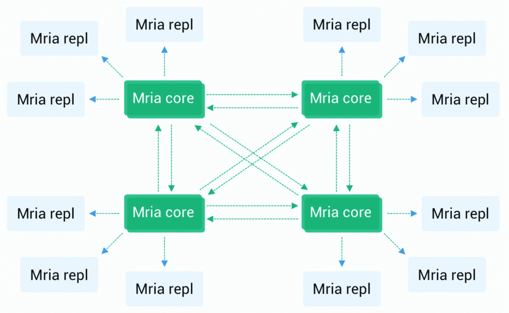

# 部署架构与集群要求

EMQX 5.0 采用 [Mria](https://github.com/emqx/mria) + RLOG 架构，实现了新的集群架构并重构了数据复制逻辑，由此 EMQX 5.0 水平扩展能力得到了指数级提升，这也是 EMQX 5.0 单个集群支持 1 亿 MQTT 连接的关键。

本章节将向您介绍新架构下 EMQX 集群部署架构以及部署时的注意事项，您也可以通过 [EMQX Operator](https://www.emqx.com/zh/emqx-kubernetes-operator) 实现集群自动化部署，请参考 [K8s 部署指南](../install-k8s.md)。

:::tip 前置准备：

- 了解 [分布式集群](./introduction.md)
:::

## Mria + RLOG 架构介绍

<!-- TODO 展开介绍 RLOG -->

Mria 是 Mnesia 的一个开源扩展，它为集群增加了最终的一致性。启用 RLOG 模式后，EMQX 节点之间的连接模式从 Mnesia 的**全网状拓扑**结构转向 Mria 的**网状+星型**状拓扑结构，集群中节点可以按角色分为**核心节点（Core）**或**复制者节点（Replicant）**。

### 节点角色介绍

#### 核心节点

核心节点作为数据库的数据层，节点间以全网状连接，每个节点都包含一个最新的数据副本，这保证了容错性：只要有一个节点存活，数据就不会丢失。核心节点一般是静态和持久的，不建议进行自动伸缩（即经常添加、删除或替换节点）。

#### 复制节点

复制节点会连接到核心节点，并被动地复制来自 核心节点的数据更新。复制节点不允许执行任何的写操作，而是将其转交给核心节点代为执行。同时，由于复制节点有一个完整的本地数据副本，因此数据读取速度非常快，这样有助于降低 EMQX 路由的时延。

### 架构优势

我们可以将这种数据复制模型当做**无主复制和主从复制**的一种混合，这种结构的优势在于：

- 更高的水平可扩展性：EMQX 5.0 已能支持包含 23 个节点的大规模集群。
- 更轻松的集群自动扩展：通过复制节点的自动伸缩简化集群的自动扩展。

相比与 4.x 版本所有节点采用全连接的方式，节点数量越多节点之间完成数据同步的成本就越高，EMQX 5.0 中由于复制节点不参与数据写入，当更多的复制节点加入集群时，表的更新效率不会受到影响，进而允许创建更大的 EMQX 集群。

另外，复制节点被设计成可以按需增删，添加或删除它们不会改变数据冗余，所以它们可以被放在一个自动伸缩组中，从而实现更好的 DevOps 实践。

但随着总数据量的增大，从核心节点初始化复制数据是一个相对繁重的操作，所以复制节点的自动伸缩策略不也能太过于激进。

## 部署架构

在 EMQX 5.0 中，所以如果不做任何调整的话所有节点都默认为核心节点，默认行为和 4.x 版本是一致的，这能够避免增加上手和使用的难度，您可以按照 4.x 版本的使用经验进行集群部署。

<!-- TODO 确认最终的建议值，原文出现 5 个节点，3 个节点两种数值 -->

只有集群规模超过 3 个节点，才建议你使用 Core + Replicant 复制模式。

此时您可以通过设置 `emqx.conf` 中的 `node.db_role` 参数或 `EMQX_NODE__DB_ROLE` 环境变量，将某个节点设置为复制节点，同时设置 `cluster.core_nodes` 指定需要连接到的核心节点。

:::tip

集群中至少要有一个核心节点，我们建议设置 3 个核心节点 + N 个复制节点作为初始集群规格。

:::

根据业务需求，核心节点可以连接 MQTT 客户端，也可以纯粹作为集群的数据库来使用，我们建议：

- 在小型集群中（3个节点或更少），没有必要使用 Core + Replicant 复制模式，而是让核心节点承载所有连接。
- 在超大的集群中（10 个节点或更多），核心节点不承载 MQTT 连接，这样更加稳定性和水平扩展性更好。
- 在中型集群中，核心节点是否承载 MQTT 连接取决于许多因素，需要根据您实际的场景测试才能知道哪个选择更优。

## 网络与硬件配置

### 网络

核心节点之间的网络延迟建议 10ms 以下，实测高于 100ms 将不可用，请将核心节点部署在同一个私有网络下；复制节点和核心节点之间同样建议部署在同一个私有网络下，但网络质量要求可以比核心节点间略低。

### CPU 与内存

核心节点需要较大的内存，在不承接连接的情况下 CPU 消耗较低；复制节点硬件配置与 4.x 一致，可按连接和吞吐配置估算其内存要求。

## 异常处理

核心节点对于复制节点是无感的，当某一核心节点宕机时，复制节点会自动连接到其他核心节点，此过程中客户端不会掉线，但可能导致路由更新延迟。

当复制节点宕机时，所有连接到该节点的客户端会被断开，但由于复制节点是无状态的，所以不会影响到其他节点的稳定性，如果客户端设置了重连机制（大多数客户端库都默认支持），客户端将重新连接至另一个复制节点。

## 监控和故障排查

<!-- TODO 后续补充数值类型 Gauge or Counter -->

对 Mria 的性能监控可以通过 Prometheus 指标或使用 Erlang 控制台来完成。

### Prometheus 系统指标

#### 核心节点

- `emqx_mria_last_intercepted_trans`：自节点启动以来，分区收到的事务数量。注意，这个值在不同的核心节点上可能不同。
- `emqx_mria_weight`：一个用于负载平衡的值，它的变化取决于核心节点的瞬间负载。
- `emqx_mria_replicants`：连接到核心节点的复制节点数量。
- `emqx_mria_server_mql`：等待发送至复制者节点的未处理的事务数量。这个指标越少越好，如果指标有增长的趋势，则可能需要为当前的核心节点增加算力资源，或添加更多的核心节点。

#### 复制节点

- `emqx_mria_lag`：复制者节点滞后情况，表示复制节点滞后上游核心节点的程度，数值越低越好。
- `emqx_mria_bootstrap_time`：复制者节点启动花费时间，这个值在复制者节点的正常运行过程中不会变化。
- `emqx_mria_bootstrap_num_keys`：在初始复制过程中从核心节点复制的数量，这个值在复制者节点的正常运行中不会变化。
- `emqx_mria_message_queue_len`：复制进程的消息队列长度，应该一直保持在 0 左右。
- `emqx_mria_replayq_len`：复制节点内部重放队列长度，越少越好。

### 控制台命令

执行 `emqx_ctl eval 'mria_rlog:status().'` 命令，获得更多关于嵌入式数据库状态的信息。
