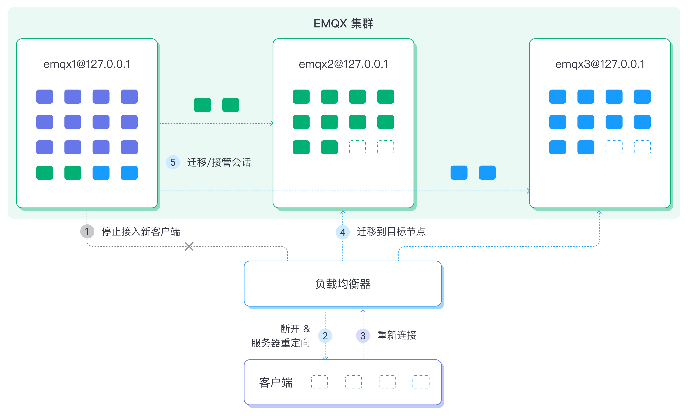

# 节点疏散与集群负载重平衡

::: tip 注意

节点疏散和集群负载重平衡是 EMQX 企业版功能。

:::

MQTT 是有状态的长连接接入协议，连接建立后不会轻易断开，因此集群节点的升级、维护和扩容将变得更有挑战性。为便于用户的集群运维操作，EMQX 提供了节点疏散和集群负载重平衡功能。

## 节点疏散

在需要对集群中的某个节点进行维护或升级操作时，如果直接关闭节点，节点上的连接和会话将会丢失，造成数据丢失；此外此类操作还会造成这段时间内大量设备的下线重连，增加服务器的负载压力并可能影响整体业务。

因此 EMQX 提供了节点疏散功能，以帮助您在关闭节点前将节点所有连接与会话数据迁移到集群其他节点，降低对整体业务的影响。

### 工作原理

EMQX 节点疏散功能的工作原理如下：

1. 待疏散节点停止接收新的连接请求；
2. 待疏散节点按照预设速度（由 `conn-evict-rate` 指定）逐渐断开当前连接的客户端，断开连接的客户端会通过重连机制连接到集群其他节点（目标节点），重连成功后会话将迁移到新节点上。不同协议版本重连机制如下：
   - MQTT v3.1/v3.1.1 客户端：通过负载均衡策略指定，需要客户端开启重连机制；
   - MQTT v5.0 客户端：由 `redirect-to` 参数指定重连节点。

3. 等待目标节点与客户端完成重连并接管会话（由 `wait-takeover` 指定）。
4. 超过重连等待时间后，待疏散节点会将剩余未被接管的会话迁移目标节点：
   - 由 `migrate-to` 指定会话迁移到的节点；
   - 由 `sess-evict-rate` 指定会话迁移的速度。


您可随时停止疏散流程。如果待疏散节点在疏散过程中关闭，重启后将继续以上疏散过程。

### 通过 CLI 命令启停节点疏散

您可以使用 CLI 命令来开启节点疏散、获取节点疏散状态和停止节点疏散。

#### 开启节点疏散

您可以通过如下命令执行节点的疏散任务，其中 `--evacuation` 选项表示该命令为节点疏散操作：

``` bash
./bin/emqx ctl rebalance start --evacuation \
    [--redirect-to "Host1:Port1 Host2:Port2 ..."] \
    [--conn-evict-rate CountPerSec] \
    [--migrate-to "node1@host1 node2@host2 ..."] \
    [--wait-takeover Secs] \
    [--sess-evict-rate CountPerSec]
```

| 配置项       | 类型           | 描述 |
|---------------------|------------------|-------------|
| `--wait-health-check` | 正整数 | 等待负载均衡器（LB）将源节点从活跃的后端节点列表中移除的时间（以秒为单位，默认为60秒）。当指定的等待时间结束后，将开始执行疏散过程，并且源节点将开始拒绝任何新的传入连接。 |
| `--redirect-to` | 字符 | 重连时的重定向服务器地址，针对 MQTT 5.0 客户端；具体可参考 [MQTT 5.0 协议 - 服务器重定向(Server redirection) ](https://docs.oasis-open.org/mqtt/mqtt/v5.0/os/mqtt-v5.0-os.html#_Toc3901255) |
| `--conn-evict-rate` | 正整数 | 客户端每秒断开连接速度；默认为 500 连接/秒。 |
| `--migrate-to` | 字符 | 疏散会话被迁移到的节点列表，多个节点以逗号或空格分隔。 |
| `--wait-takeover` | 正整数 | 所有连接断开后，等待客户端重连以接管会话的时间；单位： 秒，默认为 60 秒。 |
| `--sess-evict-rate` | 正整数 | `wait-takeover` 之后每秒会话疏散速度； 默认为 500 会话/秒。 |

**代码示例**

如希望将 `emqx@127.0.0.1` 节点的客户端迁移到 `emqx2@127.0.0.1` 与 `emqx3@127.0.0.1` 节点，可在 `emqx@127.0.0.1` 节点执行以下命令：

```bash
./bin/emqx ctl rebalance start --evacuation \
	--wait-takeover 200 \
	--conn-evict-rate 30 \
	--sess-evict-rate 30 \
	--migrate-to "emqx2@127.0.0.1 emqx3@127.0.0.1"
Rebalance(evacuation) started
```

该命令会以每秒 `30` 个连接的速度断开现有客户端，所有连接断开后将等待 `200` 秒，期间会将客户端会话迁移到重连节点，之后以每秒 `30` 个会话的速度迁移剩余会话到 `emqx2@127.0.0.1` 与 `emqx3@127.0.0.1` 节点。

#### 获取节点疏散状态

您可通过如下命令获取节点疏散状态：

```bash
./bin/emqx ctl rebalance node-status
```

返回结果如下：

```bash
./bin/emqx ctl rebalance node-status
Rebalance type: evacuation
Rebalance state: evicting_conns
Connection eviction rate: 30 connections/second
Session eviction rate: 30 sessions/second
Connection goal: 0
Session goal: 0
Session recipient nodes: []
Channel statistics:
  current_connected: 10
  current_sessions: 0
  initial_connected: 100
  initial_sessions: 0
```

#### 停止节点疏散

您可通过如下命令终止节点疏散任务：

```bash
./bin/emqx ctl rebalance stop
```

返回结果如下：

```bash
./bin/emqx ctl rebalance stop
Rebalance(evacuation) stopped
```

### 通过 HTTP API 启停节点疏散

您也可通过 API 开启/停止节点疏散任务，此时需要在参数中指定操作节点。具体命令及操作，见 [API 文档](https://docs.emqx.com/zh/enterprise/v5.1/admin/api-docs.html)。

## 集群负载重平衡

同样由于 MQTT 是有状态的长连接接入协议，即使在节点扩容后，现有节点的连接也不会自动切换到新增节点中，因此如果没有大量的新客户端接入，新增节点会长时间处于负载不足的状态。此时，您需要手动将连接从高负载节点迁移到低负载节点，实现集群负载均衡。



### 工作原理

重平衡涉及多个节点，因此比节点疏散要复杂。

您可以在任何节点上启动集群负载重平衡任务。EMQX 会根据每个节点当前的连接负载情况，自动计算得到达成平衡所需的连接迁移方案，然后将对应数量的连接和会话从高负载节点迁移到低负载节点，实现节点间的负载均衡，工作流程如下：

1. 计算迁移方案，并将参与重平衡的节点（由 `--nodes` 指定）分为源节点和目标节点：
   - 源节点：高负载节点
   - 目标节点：低负载节点
2. 源节点停止接收新的连接；
3. 等待一段时间（由 `wait-health-check` 指定），直到 LB 将源节点从活跃后端节点列表中移除；
4. 源节点逐步断开已连接的客户端，直到平均连接数与目标节点相同；
5. 等待目标节点与客户端完成重连并接管会话（由 `wait-takeover` 指定）
6. 超过重连等待时间后，源节点将剩余未被接管的会话迁移至目标节点，并通过 `sess-evict-rate` 指定会话迁移的速度。

至此，重平衡任务结束，源节点切回正常状态。

::: tip

重平衡是一项临时性任务，期间，任一参与重平衡的节点崩溃将结束整个任务。

:::

### 通过 CLI 启停重平衡

您可以使用 CLI 命令来开启重平衡、获取重平衡状态和停止重平衡。

#### 开启重平衡

开启重平衡任务的命令可包含下列配置项：

```bash
./bin/ rebalance start \
    [--nodes "node1@host1 node2@host2"] \
    [--wait-health-check Secs] \
    [--conn-evict-rate ConnPerSec] \
    [--abs-conn-threshold Count] \
    [--rel-conn-threshold Fraction] \
    [--conn-evict-rate ConnPerSec] \
    [--wait-takeover Secs] \
    [--sess-evict-rate CountPerSec] \
    [--abs-sess-threshold Count] \
    [--rel-sess-threshold Fraction]
```

| 配置项                 | 类型             | 描述                                                         |
| ---------------------- | ---------------- | ------------------------------------------------------------ |
| `--nodes` | 字符 | 参与负载重平衡的节点列表，以空格或逗号分隔，调度节点（即运行命令的节点）可以不在列表中。 |
| `--wait-health-check` | 正整数 | 等待负载均衡器将源节点从活跃的后端节点列表中移除的时间（单位为秒，默认 60 秒），超过指定等待时间后，重平衡任务将启动。 |
| `--conn-evict-rate` | 正整数 | 源节点客户端每秒断开连接速度。 默认 500 连接/秒。|
| `--abs-conn-threshold` | 正整数 | 用于检查连接平衡的绝对阈值。默认为 1000。                                 |
| `--rel-conn-threshold` | 数字<br/>> 1.0 | 用于检查连接平衡的相对阈值。默认为 1.1                                 |
| `--wait-takeover` | 正整数 | 所有连接断开后，等待客户端重连以接管会话的时间（单位为 秒，默认 60 秒）。 |
| `--sess-evict-rate` | 正整数 | `wait-takeover` 之后源节点每秒会话疏散速度。默认 500 会话/秒。 |
| `--abs-sess-threshold` | 正整数 | 用于检查会话连接平衡的绝对阈值。默认为 1000。                             |
| `--rel-sess-threshold` | 数字<br/>> 1.0 | 用于检查会话连接平衡的相对阈值。默认为 1.1                             |

<!-- TODO 参数默认值，*conn_threshold 对结果的影响，详细的计算过程-->

**判断连接是否平衡**

当满足以下条件时，我们认为连接是平衡的：

```bash
avg(源节点连接数) < avg(目标节点连接数) + abs_conn_threshold
或 
avg(源节点连接数) < avg(目标节点连接数) * rel_conn_threshold
```

类似的规则也适用于会话的连接断开。

**示例**

如希望在 `emqx@127.0.0.1`、`emqx2@127.0.0.1` 与 `emqx3@127.0.0.1` 三个节点之间实现负载重平衡，可使用如下命令操作：

```bash
./bin/emqx ctl rebalance start \
	--wait-health-check 10 \
	--wait-takeover 60  \
	--conn-evict-rate 5 \
	--sess-evict-rate 5 \
	--abs-conn-threshold 30 \
	--abs-sess-threshold 30 \
	--nodes "emqx1@127.0.0.1 emqx2@127.0.0.1 emqx3@127.0.0.1"
Rebalance started
```

#### 获取重平衡状态

获取重平衡状态的命令如下：

```bash
emqx ctl rebalance node-status
```

**示例**：

```bash
./bin/emqx ctl rebalance node-status
Node 'emqx1@127.0.0.1': rebalance coordinator
Rebalance state: evicting_conns
Coordinator node: 'emqx1@127.0.0.1'
Donor nodes: ['emqx2@127.0.0.1','emqx3@127.0.0.1']
Recipient nodes: ['emqx1@127.0.0.1']
Connection eviction rate: 5 connections/second
Session eviction rate: 5 sessions/second
Connection goal: 0.0
Current average donor node connection count: 300.0
```

#### 停止重平衡

停止重平衡任务的命令如下：

```bash
./bin/emqx ctl rebalance stop
```

返回结果如下：

```bash
./bin/emqx ctl rebalance stop
Rebalance stopped
```

### 通过 HTTP API 启停重平衡

所有关于重平衡的操作也可以通过 API 进行。开启和停止重平衡需要在参数中指定操作节点。具体命令及操作，见 [API 文档](https://docs.emqx.com/zh/enterprise/v5.1/admin/api-docs.html)。

## 集成负载均衡器

用户可以集成负载均衡器执行疏散/重平衡。当断开的客户端尝试重连时，负载均衡器会基于当前后端节点状态将其合理重定向。用户需要为集成负载均衡器配置健康检查参数，否则可能出现多次断开的问题。为了帮助创建配置，EMQX 提供了健康检查 REST API：

`GET /api/v5/load_rebalance/availability_check`

对于正在进行节点转移或者被疏散的节点，健康检查会响应 HTTP 503 状态码；对于正常运行并接收连接的节点，会响应 HTTP 200 状态码。

例如，对于 HAProxy 和一个包含 3 个节点的 EMQX 集群，它们的 MQTT 监听器分别在端口 3001、3002 和 3003 上，REST API 端口分别为 5001、5002 和 5003，健康检查参数配置如下：

```bash
defaults
  timeout connect 5s
  timeout client 60m
  timeout server 60m

listen mqtt
  bind *:1883
  mode tcp
  maxconn 50000
  timeout client 6000s
  default_backend emqx_cluster

backend emqx_cluster
  mode tcp
  balance leastconn
  option httpchk
  http-check send meth GET uri /api/v5/load_rebalance/availability_check hdr Authorization "Basic xxxxxx"
  server emqx1 127.0.0.1:3001 check port 5001 inter 1000 fall 2 rise 5 weight 1 maxconn 1000
  server emqx2 127.0.0.1:3002 check port 5002 inter 1000 fall 2 rise 5 weight 1 maxconn 1000
  server emqx3 127.0.0.1:3003 check port 5003 inter 1000 fall 2 rise 5 weight 1 maxconn 1000
```
