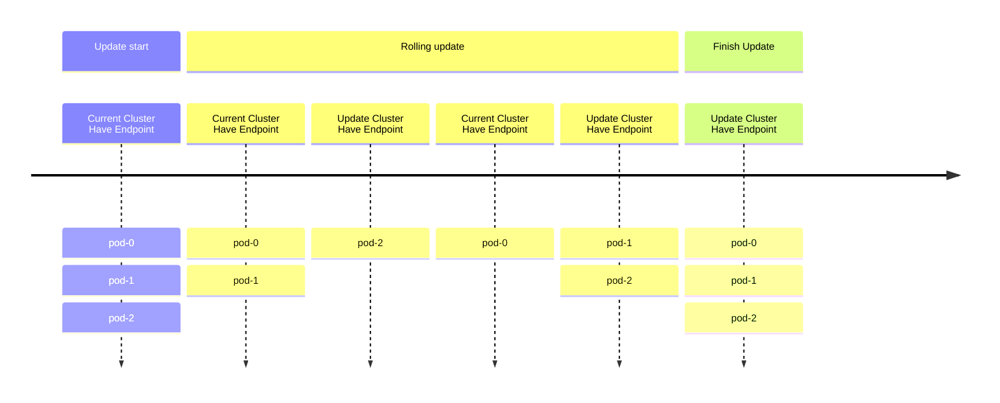
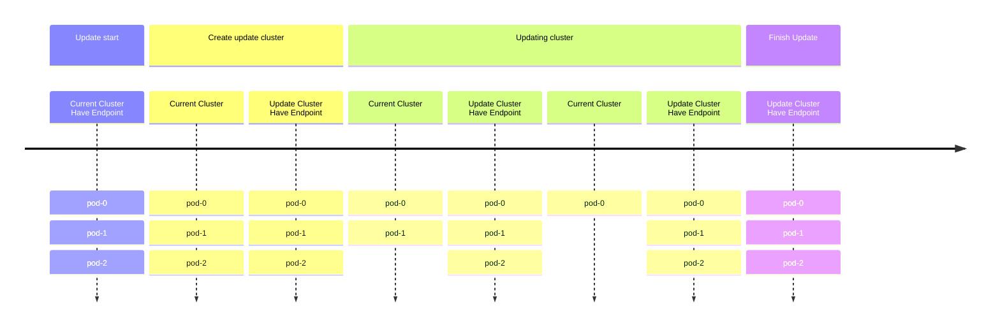
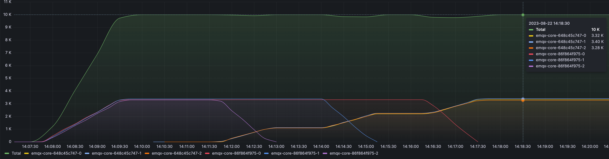

# 执行蓝绿升级

## 目标

通过蓝绿部署执行 EMQX 集群的优雅升级。

## 背景

在传统的 EMQX 集群部署中，通常使用 StatefulSet 的默认滚动升级策略来更新 EMQX Pod。然而，这种方法存在以下两个问题：

- 在滚动更新期间，新 Pod 和旧 Pod 都会被相应的 Service 选中。这可能导致 MQTT 客户端连接到正在终止的旧 Pod，从而导致频繁断开连接和重连。

- 在滚动更新过程中，在任何给定时间只有 _N - 1_ 个 Pod 能够提供服务，因为新 Pod 需要一些时间来启动和就绪。这可能导致服务可用性下降。



## 解决方案

EMQX Operator 默认执行蓝绿部署。当通过相应的 EMQX CR 更新 EMQX 集群时，EMQX Operator 会启动升级。

整个升级过程大致分为以下步骤：

1. 创建一组具有更新规格的新 EMQX 节点。
2. 一旦新节点集就绪，将 Service 资源重定向到新节点集，确保没有新连接路由到旧节点集。
3. 以受控速率安全地将现有 MQTT 连接从旧节点集迁移到新节点集，以避免重连风暴。
4. 逐步缩容旧 EMQX 节点集。
5. 完成升级。



## 步骤

### 配置更新策略

1. 创建 `apps.emqx.io/v2` EMQX CR 并配置更新策略。

  ```yaml
  apiVersion: apps.emqx.io/v2
  kind: EMQX
  metadata:
    name: emqx
  spec:
    image: emqx/emqx:@EE_VERSION@
    config:
      data: |
        license {
          key = "..."
        }
    updateStrategy:
      evacuationStrategy:
        # MQTT 客户端疏散速率，每秒连接数：
        connEvictRate: 1000
        # MQTT Session 疏散速率，每秒会话数：
        sessEvictRate: 1000
        # 删除 Pod 前的等待时间：
        waitTakeover: 10
      # 所有节点就绪后，开始升级前的等待时间：
      initialDelaySeconds: 10
      type: Recreate
  ```

2. 将上述内容保存为 `emqx-update.yaml`，并使用 `kubectl apply` 部署：

  ```bash
  $ kubectl apply -f emqx-update.yaml
  emqx.apps.emqx.io/emqx created
  ```

3. 检查 EMQX 集群的状态。

  确保 `STATUS` 为 `Ready`。这可能需要一些时间。

  ```bash
  $ kubectl get emqx
  NAME      STATUS   AGE
  emqx      Ready    8m33s
  ```

### 连接到 EMQX 集群

[MQTTX](https://mqttx.app/zh/cli) 是一款开源的、支持自动重连的 MQTT 5.0 兼容命令行客户端工具，旨在帮助开发和调试 MQTT 服务和应用。

使用 MQTTX 连接到 EMQX 集群：

```bash
mqttx bench conn -h ${IP} -p ${PORT} -c 3000
[10:05:21 AM] › ℹ  Start the connect benchmarking, connections: 3000, req interval: 10ms
✔  success   [3000/3000] - Connected
[10:06:13 AM] › ℹ  Done, total time: 31.113s
```

### 触发升级

1. 对 Pod 模板的任何修改都会触发 EMQX Operator 的升级策略。

  在此示例中，我们通过修改 Pod 的 `ImagePullPolicy` 来触发升级。

  ```bash
  $ kubectl patch emqx emqx --type=merge -p '{"spec": {"imagePullPolicy": "Never"}}'
  emqx.apps.emqx.io/emqx patched
  ```

2. 检查升级过程的状态。

  ```bash
  $ kubectl get emqx emqx -o json | jq ".status.nodeEvacuationsStatus"
  [
    {
      "nodeName": "emqx@emqx-54fc496fb4-2.emqx-headless.default.svc.cluster.local",
      "initialConnections": 33,
      "initialSessions": 0,
      "connectionEvictionRate": 200,
      "sessionEvictionRate": 200,
      "state": "waiting_takeover",
      "sessionRecipients": [
        "emqx@emqx-5d87d4c6bd-2.emqx-headless.default.svc.cluster.local",
        "emqx@emqx-5d87d4c6bd-1.emqx-headless.default.svc.cluster.local",
        "emqx@emqx-5d87d4c6bd-0.emqx-headless.default.svc.cluster.local"
      ]
    }
  ]
  ```

  | 字段                   | 描述                                                           |
  |-------------------------|-----------------------------------------------------------------------|
  | `node`                  | 当前正在疏散的节点。                                   |
  | `state`                 | 节点疏散阶段。                                                |
  | `session_recipients`    | MQTT 会话接收者。                                              |
  | `session_eviction_rate` | 此节点上的 MQTT 会话疏散速率（每秒会话数）。        |
  | `connection_eviction_rate`| 此节点上的 MQTT 连接疏散速率（每秒连接数）。  |
  | `initial_sessions`       | 此节点上的初始会话数。                              |
  | `initial_connected`      | 此节点上的初始连接数。                           |
  | `current_sessions`       | 此节点上的当前会话数。                              |
  | `current_connected`      | 此节点上的当前连接数。                           |

3. 等待升级完成。

  ```bash
  $ kubectl get emqx
  NAME      STATUS   AGE
  emqx      Ready    8m33s
  ```

  确保 `STATUS` 为 `Ready`。根据 MQTT 客户端和会话的数量，升级过程可能需要一些时间。

  升级完成后，您可以使用 `kubectl get pods` 验证旧的 EMQX 节点已被删除。

## Grafana 监控

以下监控图显示了升级过程中的连接数，以 10,000 个连接为例。



| 标签/前缀            | 描述                                         |
|-------------------------|-----------------------------------------------------|
| Total                   | 连接总数；图中最上面的线。 |
| `emqx-86f864f975`    | 3 个旧 EMQX 节点集的名称前缀。    |
| `emqx-648c45c747`    | 3 个升级后的 EMQX 节点集的名称前缀。 |

此时间线说明了 EMQX Operator 如何执行平滑的蓝绿升级。在整个过程中，连接总数保持稳定（受迁移速率、服务器容量和客户端重连策略等因素影响）。这种方法确保最小中断，防止服务器过载，并提高整体服务稳定性。
