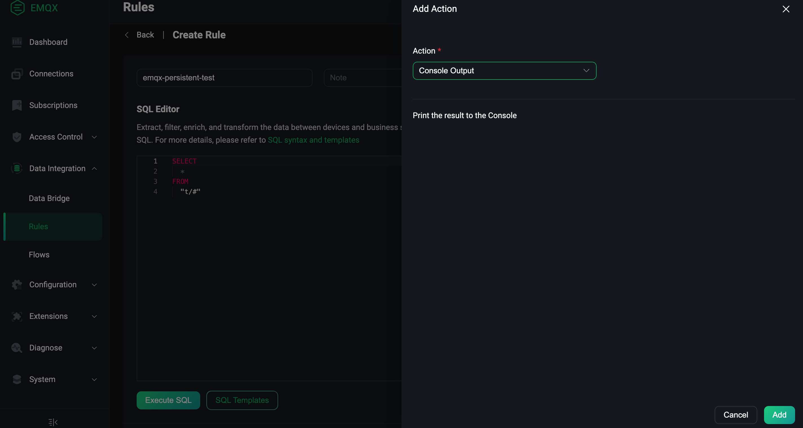
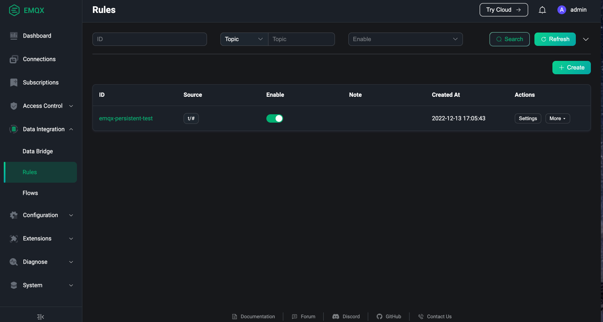
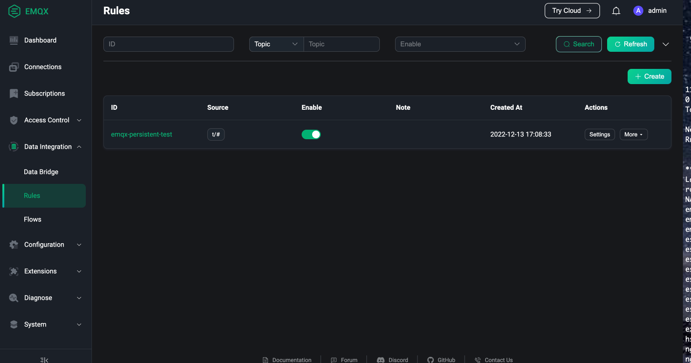

# 在 EMQX 集群中开启持久化

## 任务目标

通过 `volumeClaimTemplates` 字段配置 EMQX 5.x 集群 Core 节点持久化。

## EMQX 集群持久化配置

下面是 EMQX Custom Resource 的相关配置，你可以根据希望部署的 EMQX 的版本来选择对应的 APIVersion，具体的兼容性关系，请参考[EMQX Operator 兼容性](../operator.md):

`apps.emqx.io/v2beta1 EMQX` 支持通过 `.spec.coreTemplate.spec.volumeClaimTemplates` 字段配置 EMQX 集群 Core 节点持久化。`.spec.coreTemplate.spec.volumeClaimTemplates` 字段的语义及配置与 Kubernetes 的 `PersistentVolumeClaimSpec` 一致，其配置可以参考文档：[PersistentVolumeClaimSpec](https://kubernetes.io/docs/reference/generated/kubernetes-api/v1.25/#persistentvolumeclaimspec-v1-core) 。

当用户配置了 `.spec.coreTemplate.spec.volumeClaimTemplates` 字段时，EMQX Operator 会将 PVC（PersistentVolumeClaim） 作为 Volume 挂载到 EMQX Pod 中，PVC 表示用户持久化请求，最终负责存储的是持久化卷（PersistentVolume，PV），PV 和 PVC 是一一对应的。EMQX Operator 使用 [StorageClass](https://kubernetes.io/zh-cn/docs/concepts/storage/storage-classes/) 动态创建 PV，PV 存储了 EMQX 容器中 `/opt/emqx/data` 目录下的数据，当用户不再使用 PV 资源时，可以手动删除 PVC 对象，从而允许该 PV 资源被回收再利用。

+ 将下面的内容保存成 YAML 文件，并通过 `kubectl apply` 命令部署它

  ```yaml
  apiVersion: apps.emqx.io/v2beta1
  kind: EMQX
  metadata:
    name: emqx
  spec:
    image: emqx/emqx-enterprise:@EE_VERSION@
    coreTemplate:
      spec:
        volumeClaimTemplates:
          storageClassName: standard
          resources:
            requests:
              storage: 20Mi
          accessModes:
            - ReadWriteOnce
        replicas: 3
    listenersServiceTemplate:
      spec:
        type: LoadBalancer
    dashboardServiceTemplate:
      spec:
        type: LoadBalancer
  ```

  > `storageClassName` 字段表示 StorageClass 的名称，可以使用命令 `kubectl get storageclass` 获取 Kubernetes 集群已经存在的 StorageClass，也可以根据自己需求自行创建 StorageClass。

+ 等待 EMQX 集群就绪，可以通过 `kubectl get` 命令查看 EMQX 集群的状态，请确保 `STATUS` 为 `Running`，这个可能需要一些时间

  ```bash
  $ kubectl get emqx emqx
  NAME   IMAGE                              STATUS    AGE
  emqx   emqx/emqx-enterprise:@EE_VERSION@  Running   10m
  ```

+ 获取 EMQX 集群的 Dashboard External IP，访问 EMQX 控制台

  EMQX Operator 会创建两个 EMQX Service 资源，一个是 emqx-dashboard，一个是 emqx-listeners，分别对应 EMQX 控制台和 EMQX 监听端口。

  ```bash
  $ kubectl get svc emqx-dashboard -o json | jq '.status.loadBalancer.ingress[0].ip'

  192.168.1.200
  ```

  通过浏览器访问 `http://192.168.1.200:18083` ，使用默认的用户名和密码 `admin/public` 登录 EMQX 控制台。

## 验证 EMQX 集群持久化

验证方案： 1）在旧 EMQX 集群中通过 Dashboard 创建一条测试规则；2）删除旧集群；3）重新创建 EMQX 集群，通过 Dashboard 查看之前创建的规则是否存在。

+ 通过浏览器访问 EMQX Dashboard 创建测试规则

  ```bash
  external_ip=$(kubectl get svc emqx-listeners -o json | jq '.status.loadBalancer.ingress[0].ip')
  ```

  通过访问 `http://${external_ip}:18083` 进入 Dashboard 点击 数据集成 → 规则 进入创建规则的页面，我们先点击添加动作的按钮为这条规则添加响应动作，然后点击创建生成规则，如下图所示：

  

  当我们的规则创建成功之后，在页面会出现一条规则记录，规则 ID 为：emqx-persistent-test，如下图所示：

  

+ 删除旧 EMQX 集群

  执行如下命令删除 EMQX 集群：

  ```bash
  $ kubectl delete -f  emqx.yaml

  emqx.apps.emqx.io "emqx" deleted
  # emqxenterprise.apps.emqx.io "emqx" deleted
  ```

  > emqx-persistent.yaml 是本文中第一次部署 EMQX 集群所使用的 YAML 文件，这个文件不需要做任何的改动。

+ 重新创建 EMQX 集群

  执行如下命令重新创建 EMQX 集群：

  ```bash
  $ kubectl apply -f  emqx.yaml

  emqx.apps.emqx.io/emqx created
  # emqxenterprise.apps.emqx.io/emqx created
  ```

  等待 EMQX 集群就绪，然后通过浏览器访问 EMQX Dashboard 查看之前创建的规则是否存在，如下如图所示：

  

  从图中可以看出：在旧集群中创建的规则 emqx-persistent-test 在新的集群中依旧存在，则说明我们配置的持久化是生效的。
